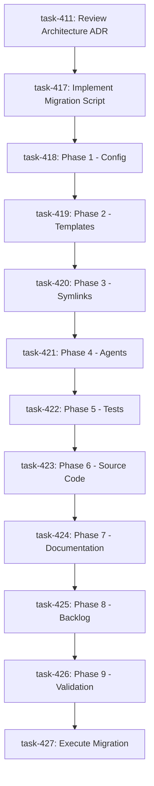

# /jpspec → /specflow Migration Execution Plan

**Date**: 2025-12-09
**Architecture**: Enterprise Software Architect
**Related**: docs/adr/ADR-jpspec-to-specflow-migration-architecture.md

## Executive Summary

This document provides the operational execution plan for migrating 912+ occurrences of `/jpspec` to `/specflow` across 150+ files. It complements the architectural decision record with ordered task dependencies, detailed file lists, and execution scripts.

## Task Dependency Graph



## Backlog Tasks

| Task ID | Title | Priority | Depends On |
|---------|-------|----------|------------|
| task-411 | Review and Approve Migration Architecture ADR | High | None |
| task-417 | Implement Automated Migration Script | High | task-411 |
| task-418 | Phase 1: Migrate Configuration Files | High | task-417 |
| task-419 | Phase 2: Migrate Template Command Files | High | task-418 |
| task-420 | Phase 3: Recreate Local Command Symlinks | High | task-419 |
| task-421 | Phase 4: Migrate GitHub Agent Files | High | task-420 |
| task-422 | Phase 5: Migrate Test Files | High | task-421 |
| task-423 | Phase 6: Migrate Python Source Code | High | task-422 |
| task-424 | Phase 7: Migrate Documentation Files | High | task-423 |
| task-425 | Phase 8: Migrate Backlog and Historical Files | Medium | task-424 |
| task-426 | Phase 9: Final Validation and Cleanup | High | task-425 |
| task-427 | Execute Migration in Feature Branch | High | task-426 |

## Ordered Operations

### Phase 1: Configuration Foundation (task-418)

**Purpose**: Establish schema and config foundation before any dependent files

**Operations:**
```bash
# 1.1 Rename schema
git mv memory/jpspec_workflow.schema.json memory/specflow_workflow.schema.json

# 1.2 Update schema $id
sed -i 's|jpspec_workflow.schema.json|specflow_workflow.schema.json|g' \
  memory/specflow_workflow.schema.json

# 1.3 Update command pattern in schema
sed -i 's|/jpspec:|/specflow:|g' memory/specflow_workflow.schema.json

# 1.4 Rename workflow configs
git mv memory/jpspec_workflow.yml memory/specflow_workflow.yml
git mv jpspec_workflow.yml specflow_workflow.yml

# 1.5 Update command references in configs
sed -i 's|/jpspec:|/specflow:|g' memory/specflow_workflow.yml
sed -i 's|/jpspec:|/specflow:|g' specflow_workflow.yml

# Validation Checkpoint
specify workflow validate
```

**Files Changed**: 4 files
- memory/jpspec_workflow.schema.json → specflow_workflow.schema.json
- memory/jpspec_workflow.yml → specflow_workflow.yml
- jpspec_workflow.yml → specflow_workflow.yml (root)
- Update $id and command patterns

**Critical**: Must complete before templates (Phase 2) to maintain schema validation

---

### Phase 2: Template Infrastructure (task-419)

**Purpose**: Rename template source directory and update all command/include references

**Operations:**
```bash
# 2.1 Rename template directory
git mv templates/commands/jpspec templates/commands/specflow

# 2.2 Update command declarations
find templates/commands/specflow -type f -name "*.md" \
  -exec sed -i 's|/jpspec:|/specflow:|g' {} +

# 2.3 Update include paths (self-references)
find templates/commands/specflow -type f -name "*.md" \
  -exec sed -i 's|commands/jpspec/|commands/specflow/|g' {} +

# 2.4 Update workflow references
find templates/commands/specflow -type f -name "*.md" \
  -exec sed -i 's|jpspec_workflow|specflow_workflow|g' {} +

# Validation Checkpoint
for f in templates/commands/specflow/*.md; do
  grep -o '{{INCLUDE:[^}]*}}' "$f" | while read inc; do
    path=$(echo "$inc" | sed 's/{{INCLUDE:\(.*\)}}/\1/')
    [ -f "$path" ] || echo "BROKEN: $path in $f"
  done
done
```

**Files Changed**: 31 files (entire templates/commands/jpspec/ directory)

**Critical**: Must complete before symlinks (Phase 3) to ensure valid targets

---

### Phase 3: Symlinks Recreation (task-420)

**Purpose**: Recreate symlinks pointing to new template locations

**Operations:**
```bash
# 3.1 Delete old symlink directory
rm -rf .claude/commands/jpspec

# 3.2 Create new directory
mkdir -p .claude/commands/specflow

# 3.3 Recreate all 18 symlinks
cd .claude/commands/specflow

ln -s ../../../templates/commands/specflow/assess.md assess.md
ln -s ../../../templates/commands/specflow/implement.md implement.md
ln -s ../../../templates/commands/specflow/init.md init.md
ln -s ../../../templates/commands/specflow/operate.md operate.md
ln -s ../../../templates/commands/specflow/plan.md plan.md
ln -s ../../../templates/commands/specflow/research.md research.md
ln -s ../../../templates/commands/specflow/reset.md reset.md
ln -s ../../../templates/commands/specflow/specify.md specify.md
ln -s ../../../templates/commands/specflow/validate.md validate.md
ln -s ../../../templates/commands/specflow/prune-branch.md prune-branch.md
ln -s ../../../templates/commands/specflow/security_fix.md security_fix.md
ln -s ../../../templates/commands/specflow/security_report.md security_report.md
ln -s ../../../templates/commands/specflow/security_triage.md security_triage.md
ln -s ../../../templates/commands/specflow/security_web.md security_web.md
ln -s ../../../templates/commands/specflow/security_workflow.md security_workflow.md
ln -s ../../../templates/commands/specflow/_backlog-instructions.md _backlog-instructions.md
ln -s ../../../templates/commands/specflow/_constitution-check.md _constitution-check.md
ln -s ../../../templates/commands/specflow/_workflow-state.md _workflow-state.md

cd ../../..

# Validation Checkpoint
find .claude/commands/specflow -type l -exec test ! -e {} \; -print | wc -l
# Should output: 0 (no broken symlinks)
```

**Files Changed**: 18 symlinks recreated
- All .claude/commands/jpspec/*.md deleted
- All .claude/commands/specflow/*.md created

**Critical**: Must complete before agents (Phase 4) which include these symlinked files

---

### Phase 4: GitHub Agents (task-421)

**Purpose**: Rename agent files and update include paths/command references

**Operations:**
```bash
# 4.1 Rename agent files
cd .github/agents
git mv jpspec-assess.agent.md specflow-assess.agent.md
git mv jpspec-implement.agent.md specflow-implement.agent.md
git mv jpspec-init.agent.md specflow-init.agent.md
git mv jpspec-operate.agent.md specflow-operate.agent.md
git mv jpspec-plan.agent.md specflow-plan.agent.md
git mv jpspec-prune-branch.agent.md specflow-prune-branch.agent.md
git mv jpspec-research.agent.md specflow-research.agent.md
git mv jpspec-reset.agent.md specflow-reset.agent.md
git mv jpspec-security_fix.agent.md specflow-security_fix.agent.md
git mv jpspec-security_report.agent.md specflow-security_report.agent.md
git mv jpspec-security_triage.agent.md specflow-security_triage.agent.md
git mv jpspec-security_web.agent.md specflow-security_web.agent.md
git mv jpspec-security_workflow.agent.md specflow-security_workflow.agent.md
git mv jpspec-specify.agent.md specflow-specify.agent.md
git mv jpspec-validate.agent.md specflow-validate.agent.md
cd ../..

# 4.2 Update include paths in all agents
find .github/agents -name "specflow-*.agent.md" \
  -exec sed -i 's|commands/jpspec/|commands/specflow/|g' {} +

# 4.3 Update command references
find .github/agents -name "specflow-*.agent.md" \
  -exec sed -i 's|/jpspec:|/specflow:|g' {} +

# Validation Checkpoint
for f in .github/agents/specflow-*.agent.md; do
  grep -o '{{INCLUDE:[^}]*}}' "$f" | while read inc; do
    path=$(echo "$inc" | sed 's/{{INCLUDE:\(.*\)}}/\1/')
    [ -f "$path" ] || echo "BROKEN: $path in $f"
  done
done
```

**Files Changed**: 15 files
- All jpspec-*.agent.md renamed to specflow-*.agent.md
- Include paths and command references updated

---

### Phase 5: Test Suite (task-422)

**Purpose**: Rename test files and update test content

**Operations:**
```bash
# 5.1 Rename test files
cd tests
git mv test_jpspec_assess.py test_specflow_assess.py
git mv test_jpspec_backlog_integration.py test_specflow_backlog_integration.py
git mv test_jpspec_e2e.py test_specflow_e2e.py
git mv test_jpspec_implement_backlog.py test_specflow_implement_backlog.py
git mv test_jpspec_operate_backlog.py test_specflow_operate_backlog.py
git mv test_jpspec_plan_backlog.py test_specflow_plan_backlog.py
git mv test_jpspec_research_backlog.py test_specflow_research_backlog.py
git mv test_jpspec_specify_backlog.py test_specflow_specify_backlog.py
git mv test_jpspec_validate_backlog.py test_specflow_validate_backlog.py
git mv test_jpspec_workflow_integration.py test_specflow_workflow_integration.py
cd ..

# 5.2 Update test content
find tests -name "test_specflow_*.py" \
  -exec sed -i 's|jpspec_workflow|specflow_workflow|g' {} +

find tests -name "test_specflow_*.py" \
  -exec sed -i 's|/jpspec:|/specflow:|g' {} +

find tests -name "test_specflow_*.py" \
  -exec sed -i 's|test_jpspec_|test_specflow_|g' {} +

# Validation Checkpoint
pytest tests/ --collect-only  # Verify test discovery
pytest tests/ -v              # Full test suite must pass
```

**Files Changed**: 10 files
- All test_jpspec_*.py renamed to test_specflow_*.py
- Test content updated (config refs, command strings, assertions)

---

### Phase 6: Python Source Code (task-423)

**Purpose**: Update Python source files with new config/command patterns

**Operations:**
```bash
# 6.1 Update config file references
find src/specify_cli -name "*.py" \
  -exec sed -i 's|jpspec_workflow\.yml|specflow_workflow.yml|g' {} +

find src/specify_cli -name "*.py" \
  -exec sed -i 's|jpspec_workflow\.schema\.json|specflow_workflow.schema.json|g' {} +

# 6.2 Update command patterns
find src/specify_cli -name "*.py" \
  -exec sed -i 's|/jpspec:|/specflow:|g' {} +

# 6.3 Update event names
find src/specify_cli -name "*.py" \
  -exec sed -i 's|jpspec\.|specflow.|g' {} +

# Validation Checkpoint
ruff check src/
pytest tests/ -v
```

**Files Changed**: 6+ files
- src/specify_cli/__init__.py
- src/specify_cli/workflow/config.py
- src/specify_cli/workflow/state_guard.py
- src/specify_cli/workflow/assessor.py
- src/specify_cli/hooks/events.py
- src/specify_cli/task_context.py

---

### Phase 7: Documentation (task-424)

**Purpose**: Rename docs and update all references

**Operations:**
```bash
# 7.1 Rename documentation files
git mv docs/guides/jpspec-workflow-guide.md docs/guides/specflow-workflow-guide.md
git mv docs/guides/jpspec-backlog-workflow.md docs/guides/specflow-backlog-workflow.md
git mv docs/reference/jpspec-security-commands.md docs/reference/specflow-security-commands.md
git mv docs/architecture/jpspec-security-architecture.md docs/architecture/specflow-security-architecture.md
git mv docs/platform/jpspec-security-platform.md docs/platform/specflow-security-platform.md
git mv docs/assess/jpspec-security-commands-assessment.md docs/assess/specflow-security-commands-assessment.md
git mv docs/prd/jpspec-security-commands.md docs/prd/specflow-security-commands.md
git mv docs/diagrams/jpspec-workflow.md docs/diagrams/specflow-workflow.md
git mv docs/diagrams/jpspec-workflow.png docs/diagrams/specflow-workflow.png
git mv docs/diagrams/jpspec-workflow.excalidraw docs/diagrams/specflow-workflow.excalidraw

# Additional doc files with jpspec in name (check with find)
# git mv docs/jpspec-workflow-spec.md docs/specflow-workflow-spec.md
# git mv docs/jpspec-workflow-reference.md docs/specflow-workflow-reference.md
# ... (continue for all found files)

# 7.2 Update command references in all docs
find docs -name "*.md" \
  -exec sed -i 's|/jpspec:|/specflow:|g' {} +

# 7.3 Update config references
find docs -name "*.md" \
  -exec sed -i 's|jpspec_workflow|specflow_workflow|g' {} +

# 7.4 Update file path references
find docs -name "*.md" \
  -exec sed -i 's|commands/jpspec/|commands/specflow/|g' {} +

# 7.5 Update cross-references
find docs -name "*.md" \
  -exec sed -i 's|jpspec-workflow-guide\.md|specflow-workflow-guide.md|g' {} +

find docs -name "*.md" \
  -exec sed -i 's|jpspec-backlog-workflow\.md|specflow-backlog-workflow.md|g' {} +

# 7.6 Update root files
sed -i 's|/jpspec:|/specflow:|g' CLAUDE.md
sed -i 's|jpspec_workflow|specflow_workflow|g' CLAUDE.md
sed -i 's|/jpspec:|/specflow:|g' README.md
sed -i 's|/jpspec:|/specflow:|g' CONTRIBUTING.md

# 7.7 Update table of contents
sed -i 's|jpspec|specflow|g' docs/toc.yml

# Validation Checkpoint
# Check for broken links (manual or automated)
# grep -r "\[.*\](.*jpspec.*)" docs/
```

**Files Changed**: 50+ files
- 16 files renamed (with jpspec in filename)
- 40+ files updated (content only)
- CLAUDE.md, README.md, CONTRIBUTING.md updated
- docs/toc.yml updated

---

### Phase 8: Backlog & Historical (task-425)

**Purpose**: Update active tasks and handle archives

**Operations:**
```bash
# 8.1 Update active backlog tasks
find backlog/tasks -name "*.md" -type f \
  -exec sed -i 's|/jpspec:|/specflow:|g' {} +

find backlog/tasks -name "*.md" -type f \
  -exec sed -i 's|jpspec_workflow|specflow_workflow|g' {} +

# 8.2 Handle archived tasks (DECISION REQUIRED)
# Option A: Update archives for consistency
find backlog/archive -name "*.md" -type f \
  -exec sed -i 's|/jpspec:|/specflow:|g' {} +

# Option B: Leave archives as-is (historical preservation)
# (skip archive updates)

# 8.3 Update task templates
find templates -name "*task*.md" \
  -exec sed -i 's|/jpspec:|/specflow:|g' {} +

# Validation Checkpoint
backlog search "specflow" --plain
backlog task list --plain | grep -i specflow
```

**Files Changed**: 20+ files
- Active backlog tasks updated
- Archived tasks (conditional)
- Task templates updated

**Decision Point**: Update archives or preserve as historical?

---

### Phase 9: Validation & Cleanup (task-426)

**Purpose**: Comprehensive validation and release preparation

**Operations:**
```bash
# 9.1 Workflow schema validation
specify workflow validate

# 9.2 Full test suite
pytest tests/ -v --cov=src/specify_cli

# 9.3 Coverage check
pytest tests/ --cov=src/specify_cli --cov-report=term-missing

# 9.4 Verify no remaining /jpspec references
# (Exclude archives if preserved)
grep -r "/jpspec:" --include="*.md" --include="*.py" --include="*.yml" \
  --include="*.json" --exclude-dir=archive . | wc -l
# Should be 0 (or only archives)

# 9.5 CLI verification
specify init --help | grep "/specflow"
specify workflow validate

# 9.6 Update version
# Edit pyproject.toml: version = "0.0.140" (BREAKING CHANGE)

# 9.7 Update CHANGELOG.md
cat >> CHANGELOG.md <<EOF

## [0.0.140] - 2025-12-09

### BREAKING CHANGES

- **Rename all /jpspec commands to /specflow**
  - All slash commands: /jpspec:* → /specflow:*
  - Configuration: jpspec_workflow.yml → specflow_workflow.yml
  - Schema: jpspec_workflow.schema.json → specflow_workflow.schema.json
  - Templates: templates/commands/jpspec/ → specflow/
  - Agents: jpspec-*.agent.md → specflow-*.agent.md
  - Tests: test_jpspec_*.py → test_specflow_*.py
  - Affects 912+ occurrences across 150+ files

### Migration

See docs/guides/jpspec-to-specflow-migration.md for migration guide.

EOF

# 9.8 Create migration guide
cat > docs/guides/jpspec-to-specflow-migration.md <<EOF
# Migrating from /jpspec to /specflow

## For Existing Projects

### 1. Update Workflow Config
\`\`\`bash
mv jpspec_workflow.yml specflow_workflow.yml
\`\`\`

### 2. Update .claude/commands Symlinks
\`\`\`bash
rm -rf .claude/commands/jpspec
mkdir -p .claude/commands/specflow
# Recreate symlinks to templates/commands/specflow/
\`\`\`

### 3. Update Custom Templates
Search and replace in your custom templates:
- \`/jpspec:\` → \`/specflow:\`
- \`commands/jpspec/\` → \`commands/specflow/\`

### 4. Update Project Documentation
Search and replace in your docs:
- \`/jpspec:\` → \`/specflow:\`
- \`jpspec_workflow\` → \`specflow_workflow\`

## Command Mapping

| Old Command | New Command |
|-------------|-------------|
| /jpspec:assess | /specflow:assess |
| /jpspec:specify | /specflow:specify |
| /jpspec:research | /specflow:research |
| /jpspec:plan | /specflow:plan |
| /jpspec:implement | /specflow:implement |
| /jpspec:validate | /specflow:validate |
| /jpspec:operate | /specflow:operate |
| /jpspec:init | /specflow:init |
| /jpspec:reset | /specflow:reset |
| /jpspec:prune-branch | /specflow:prune-branch |
| /jpspec:security_* | /specflow:security_* |

## Verification

\`\`\`bash
# Validate workflow config
specify workflow validate

# Check CLI commands
specify init --help

# Search for old references
grep -r "/jpspec" .
\`\`\`
EOF
```

**Files Changed**: 3 files
- pyproject.toml (version bump)
- CHANGELOG.md (release notes)
- docs/guides/jpspec-to-specflow-migration.md (new file)

**Validation Criteria**:
- ✅ specify workflow validate passes
- ✅ All tests pass (pytest)
- ✅ Coverage maintained
- ✅ No /jpspec references (except archives)
- ✅ CLI shows /specflow commands
- ✅ No broken links

---

## Execution Phase (task-427)

**Purpose**: Execute migration in feature branch and prepare for merge

**Operations:**
```bash
# 1. Create feature branch
git checkout -b migration-jpspec-to-specflow-$(date +%Y%m%d)

# 2. Pre-migration snapshot
git add -A
git commit -m "chore: pre-migration snapshot for rollback reference"

# 3. Run migration script
bash scripts/bash/migrate-jpspec-to-specflow.sh

# 4. Verify checkpoints (script should do this automatically)
# If manual execution:
# - Run each phase validation
# - Fix any issues before proceeding

# 5. Review changes
git status
git diff --stat

# 6. Create atomic commit
git add -A
git commit -m "refactor: rename /jpspec to /specflow across codebase

BREAKING CHANGE: All /jpspec commands renamed to /specflow

- Rename jpspec_workflow.yml → specflow_workflow.yml
- Rename jpspec_workflow.schema.json → specflow_workflow.schema.json
- Rename templates/commands/jpspec/ → templates/commands/specflow/
- Rename .github/agents/jpspec-*.agent.md → specflow-*.agent.md
- Rename tests/test_jpspec_*.py → test_specflow_*.py
- Update 912+ references across 150+ files
- Recreate symlinks in .claude/commands/specflow/
- Update include paths in templates and agents
- Update documentation and guides

Files changed: 150+
Occurrences replaced: 912+

Phases completed:
1. Configuration files migrated
2. Template commands migrated
3. Symlinks recreated
4. GitHub agents migrated
5. Test suite migrated
6. Python source code updated
7. Documentation updated
8. Backlog tasks updated
9. Full validation passed

Validation:
- ✅ specify workflow validate
- ✅ pytest tests/ -v (all pass)
- ✅ No broken links
- ✅ No /jpspec references remaining

Resolves: task-411, task-417, task-418, task-419, task-420, task-421,
         task-422, task-423, task-424, task-425, task-426, task-427
"

# 7. Push to remote
git push origin migration-jpspec-to-specflow-$(date +%Y%m%d)

# 8. Create PR
gh pr create --title "refactor: rename /jpspec to /specflow across codebase" \
  --body "$(cat <<EOF
## Summary

Complete migration of /jpspec branding to /specflow across entire codebase.

## Changes

- **912+ occurrences** replaced across **150+ files**
- Configuration files renamed and updated
- Templates, agents, tests, docs, source code all migrated
- Symlinks recreated with new paths
- Full validation suite passed

## Breaking Changes

All \`/jpspec\` commands are now \`/specflow\`:
- \`/jpspec:assess\` → \`/specflow:assess\`
- \`/jpspec:specify\` → \`/specflow:specify\`
- ... (all commands)

## Migration Guide

See: \`docs/guides/jpspec-to-specflow-migration.md\`

## Validation

- ✅ Schema validation: \`specify workflow validate\`
- ✅ All tests pass: \`pytest tests/ -v\`
- ✅ Coverage maintained
- ✅ No broken links
- ✅ No remaining /jpspec references

## Rollback

Pre-migration snapshot: \`$(git rev-parse HEAD~1)\`

## Tasks Completed

Resolves: task-411, task-417, task-418, task-419, task-420, task-421,
         task-422, task-423, task-424, task-425, task-426, task-427
EOF
)"
```

## File Change Summary

| Category | Renamed | Updated | Created | Deleted |
|----------|---------|---------|---------|---------|
| Configuration | 3 | 3 | 0 | 0 |
| Templates | 31 (dir) | 31 | 0 | 31 (old) |
| Symlinks | 0 | 0 | 18 | 18 (old) |
| Agents | 15 | 15 | 0 | 0 |
| Tests | 10 | 10 | 0 | 0 |
| Source Code | 0 | 6 | 0 | 0 |
| Documentation | 16 | 50+ | 1 | 0 |
| Backlog | 0 | 20+ | 0 | 0 |
| Root Files | 0 | 3 | 0 | 0 |
| **Total** | **75+** | **138+** | **19** | **49** |

## Pattern Replacement Summary

| Pattern | Replacement | Occurrences | Scope |
|---------|-------------|-------------|-------|
| `/jpspec:` | `/specflow:` | 750+ | All files |
| `jpspec_workflow` | `specflow_workflow` | 100+ | Config, code, docs |
| `commands/jpspec/` | `commands/specflow/` | 100+ | Include paths |
| `jpspec-` | `specflow-` | 50+ | Agent filenames, refs |
| `test_jpspec_` | `test_specflow_` | 10 | Test files |
| `jpspec.` (events) | `specflow.` | 10+ | Python code |

**Total Pattern Replacements: 912+**

## Risk Mitigation Checklist

- ✅ Pre-migration snapshot created (rollback point)
- ✅ Feature branch isolates changes
- ✅ Validation checkpoints after each phase
- ✅ Automated script reduces human error
- ✅ Comprehensive test suite validates changes
- ✅ Git mv preserves file history
- ✅ Include path validation prevents broken references
- ✅ Symlink validation prevents broken links
- ✅ Schema validation ensures config integrity
- ✅ Migration guide for users created
- ✅ Atomic commit for clean rollback

## Success Criteria

**Technical Validation**:
- [ ] `specify workflow validate` passes
- [ ] `pytest tests/ -v` all pass
- [ ] Coverage ≥ current baseline
- [ ] `grep -r "/jpspec"` returns 0 (or only archives)
- [ ] No broken symlinks
- [ ] No broken include paths
- [ ] CLI help shows `/specflow` commands

**Business Validation**:
- [ ] Migration guide complete
- [ ] CHANGELOG.md updated
- [ ] Version bumped (BREAKING CHANGE)
- [ ] PR approved and merged
- [ ] Release notes published

## Timeline Estimate

| Phase | Estimated Time | Dependencies |
|-------|----------------|--------------|
| task-411: ADR Review | 1 hour | None |
| task-417: Script Implementation | 3 hours | task-411 |
| task-418: Phase 1 | 15 min | task-417 |
| task-419: Phase 2 | 15 min | task-418 |
| task-420: Phase 3 | 10 min | task-419 |
| task-421: Phase 4 | 15 min | task-420 |
| task-422: Phase 5 | 15 min | task-421 |
| task-423: Phase 6 | 10 min | task-422 |
| task-424: Phase 7 | 30 min | task-423 |
| task-425: Phase 8 | 15 min | task-424 |
| task-426: Phase 9 | 30 min | task-425 |
| task-427: Execution | 1 hour | task-426 |
| **Total** | **~7 hours** | Sequential |

**Note**: Timeline assumes automated script execution. Manual execution would be 2-3x longer.

## Rollback Procedures

### Immediate Rollback (During Execution)
```bash
git reset --hard HEAD~1
git branch -D migration-jpspec-to-specflow-YYYYMMDD
git checkout main
```

### Post-Commit Rollback (After Merge)
```bash
git revert <migration-commit-hash>
# Or
git checkout <pre-migration-commit>
git checkout -b emergency-rollback
```

### Emergency Rollback (Production)
```bash
git tag pre-specflow-migration <commit>
git checkout pre-specflow-migration
```

## Communication Plan

**Before Migration**:
- Share ADR with stakeholders
- Announce migration timeline
- Publish migration guide

**During Migration**:
- Status updates at each phase
- Alert on any issues/delays

**After Migration**:
- Announce completion
- Share release notes
- Provide support for user migrations

---

**Prepared by**: Enterprise Software Architect
**Date**: 2025-12-09
**Version**: 1.0
