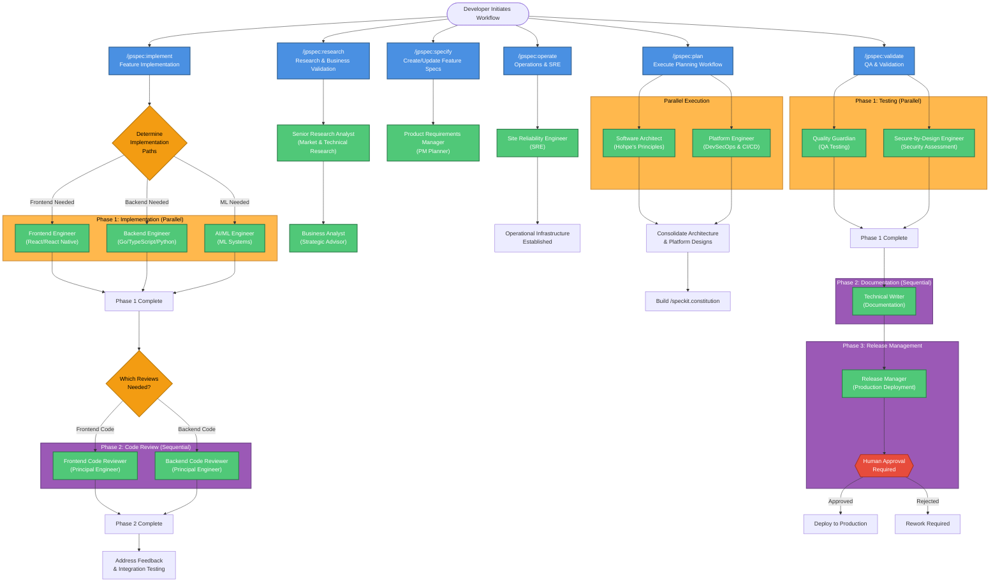

# JP Spec Kit Workflow Diagram

This diagram visualizes the complete `/jpspec` command structure, showing all slash commands and their sub-agent invocations with execution patterns.

## Workflow Overview

## Legend

### Visual Conventions

| Element | Description |
|---------|-------------|
| 🔵 **Blue Rectangles** | `/jpspec` Slash Commands (entry points) |
| 🟢 **Green Rectangles** | Sub-Agents (specialized AI agents) |
| 🟠 **Orange Boxes** | Parallel Execution Phases (agents run simultaneously) |
| 🟣 **Purple Boxes** | Sequential Execution Phases (agents run one after another) |
| 🔶 **Diamond Shapes** | Decision Points (conditional execution paths) |
| 🔴 **Red Box** | Human Approval Gate (manual checkpoint) |

### Execution Patterns

#### Parallel Execution
Agents execute simultaneously for maximum efficiency:
- **/jpspec:plan**: Software Architect + Platform Engineer (2 agents in parallel)
- **/jpspec:implement Phase 1**: Frontend + Backend + AI/ML Engineers (up to 3 agents in parallel)
- **/jpspec:validate Phase 1**: QA + Security (2 agents in parallel)

#### Sequential Execution
Agents execute one after another, with each depending on the previous:
- **/jpspec:research**: Researcher → Business Validator (2 agents sequential)
- **/jpspec:implement Phase 2**: Code reviews after implementation (sequential)
- **/jpspec:validate Phases**: Testing → Documentation → Release Management (sequential)

#### Single Agent
Commands with one specialized agent:
- **/jpspec:specify**: Product Requirements Manager (1 agent)
- **/jpspec:operate**: Site Reliability Engineer (1 agent)

## Command Reference

### /jpspec:specify
**Purpose**: Create or update feature specifications using PM planner agent

**Agents**: 1
- Product Requirements Manager (SVPG Principles Expert)

**Deliverables**:
- Comprehensive Product Requirement Document (PRD)
- User stories with acceptance criteria
- DVF+V risk assessment
- Task breakdown for /speckit.tasks

---

### /jpspec:plan
**Purpose**: Execute planning workflow using architect and platform engineer

**Agents**: 2 (parallel execution)
- Software Architect (Hohpe's Principles Expert)
- Platform Engineer (DevSecOps and CI/CD Excellence)

**Deliverables**:
- System architecture blueprint
- Platform and infrastructure design
- Architecture Decision Records (ADRs)
- Updated /speckit.constitution
- Implementation readiness assessment

---

### /jpspec:research
**Purpose**: Execute research and business validation workflow

**Agents**: 2 (sequential execution)
1. Senior Research Analyst (market, technical, competitive research)
2. Business Analyst & Strategic Advisor (business validation)

**Deliverables**:
- Comprehensive research report
- Market analysis (TAM/SAM/SOM)
- Competitive landscape assessment
- Technical feasibility evaluation
- Business validation with go/no-go recommendation

---

### /jpspec:implement
**Purpose**: Execute implementation using specialized engineering agents

**Agents**: 3-5 (multi-phase execution)

**Phase 1 - Implementation (Parallel)**:
- Frontend Engineer (React/React Native) - conditional
- Backend Engineer (Go/TypeScript/Python) - conditional
- AI/ML Engineer (ML Systems) - conditional

**Phase 2 - Code Review (Sequential)**:
- Frontend Code Reviewer (Principal Engineer) - conditional
- Backend Code Reviewer (Principal Engineer) - conditional

**Deliverables**:
- Production-ready code with tests
- Code review reports
- Integration documentation
- Deployment-ready artifacts

---

### /jpspec:validate
**Purpose**: Execute validation and quality assurance

**Agents**: 4 (3-phase execution)

**Phase 1 - Testing (Parallel)**:
- Quality Guardian (comprehensive QA testing)
- Secure-by-Design Engineer (security assessment)

**Phase 2 - Documentation (Sequential)**:
- Technical Writer (comprehensive documentation)

**Phase 3 - Release Management (Sequential with Human Gate)**:
- Release Manager (production release coordination)
- **Human Approval Required** (manual checkpoint)

**Deliverables**:
- Comprehensive QA test report
- Security assessment report
- Complete documentation package
- Release readiness assessment
- Human approval for production release

---

### /jpspec:operate
**Purpose**: Execute operations workflow using SRE agent

**Agents**: 1
- Site Reliability Engineer (SRE)

**Deliverables**:
- Complete CI/CD pipeline (GitHub Actions workflows)
- Kubernetes deployment manifests
- Observability stack (metrics, logs, traces, dashboards)
- Runbooks and operational procedures
- Incident response plan
- Infrastructure as Code
- SLI/SLO definitions and monitoring

## Agent Summary

### Total Agent Count: 15 specialized agents

| Command | Agents | Execution Pattern |
|---------|--------|-------------------|
| /jpspec:specify | 1 | Single |
| /jpspec:plan | 2 | Parallel |
| /jpspec:research | 2 | Sequential |
| /jpspec:implement | 3-5 | Multi-phase (parallel + sequential) |
| /jpspec:validate | 4 | Multi-phase (parallel + sequential + human gate) |
| /jpspec:operate | 1 | Single |

### Agent Expertise Areas

1. **Product Requirements Manager** - SVPG principles, product discovery, DVF+V framework
2. **Software Architect** - Hohpe's principles, enterprise integration patterns, option theory
3. **Platform Engineer** - DevSecOps, CI/CD, DORA metrics, SLSA compliance
4. **Senior Research Analyst** - Market intelligence, technical assessment, competitive analysis
5. **Business Analyst** - Financial viability, market validation, strategic risk analysis
6. **Frontend Engineer** - React, React Native, TypeScript, accessibility, performance
7. **Backend Engineer** - Go, TypeScript/Node.js, Python, API development, system architecture
8. **AI/ML Engineer** - Machine learning, MLOps, model deployment, monitoring
9. **Frontend Code Reviewer** - Code quality, performance, accessibility, security (frontend)
10. **Backend Code Reviewer** - Code quality, security, performance, API design (backend)
11. **Quality Guardian** - Comprehensive QA, risk analysis, failure modes, testing
12. **Secure-by-Design Engineer** - Security assessment, threat modeling, compliance
13. **Technical Writer** - Documentation, API docs, user guides, release notes
14. **Release Manager** - Production deployment, release coordination, risk management
15. **Site Reliability Engineer** - CI/CD, Kubernetes, observability, incident management

## Workflow Integration

### Typical End-to-End Flow

1. **Specification**: `/jpspec:specify` → Product Requirements Manager creates PRD
2. **Planning**: `/jpspec:plan` → Architect + Platform Engineer design system (parallel)
3. **Research** (optional): `/jpspec:research` → Validate market fit and feasibility
4. **Implementation**: `/jpspec:implement` → Engineers build + reviewers validate
5. **Validation**: `/jpspec:validate` → QA + Security + Docs + Release approval
6. **Operations**: `/jpspec:operate` → SRE establishes operational infrastructure

### Constitutional Development

The `/jpspec:plan` command builds out `/speckit.constitution` with:
- Architectural principles and constraints
- Platform engineering standards
- Infrastructure requirements
- CI/CD and deployment guidelines
- Security and compliance requirements
- Operational standards
- Quality gates and acceptance criteria

This constitution then guides all subsequent implementation and validation phases.

---

**Last Updated**: 2025-11-28

**Related Documentation**:
- [Agent Loop Classification](../reference/agent-loop-classification.md)
- [JP Spec Workflow Reference](../jpspec-workflow-reference.md)
- [Inner Loop Principles](../reference/inner-loop.md)
- [Outer Loop Principles](../reference/outer-loop.md)
