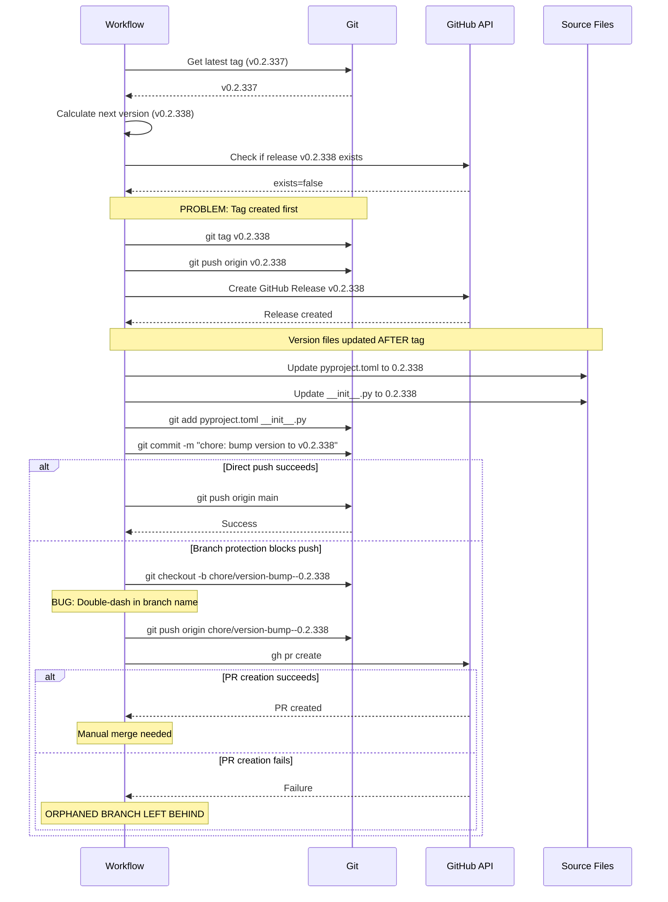

# Version Management Workflow Research Report

**Task**: task-312
**Researcher**: @researcher
**Date**: 2025-12-07
**Status**: Done

---

## Executive Summary

### Key Findings

The version management workflow has a **fundamental architectural flaw**: git tags are created **before** source files are updated, causing persistent version desync between git tags and `pyproject.toml`. This creates a 12-version gap (tags at v0.2.340, files at 0.2.328).

**Root Cause**: Workflow step ordering violates the principle that source-of-truth should be updated before creating immutable references (tags).

**Primary Failure Mode**: When branch protection blocks direct push to main, the fallback PR mechanism has bugs:
- Branch naming uses double-dash (`chore/version-bump--0.2.335` instead of `chore/version-bump-0.2.335`)
- Orphaned branches accumulate (4 found: v0.2.335-338)
- No cleanup mechanism exists

**Recommendation**: Implement **version-first architecture** - update source files, commit, then create tags pointing to that commit. This aligns with industry best practices from semantic-release, GitVersion, and conventional commits workflows.

### Impact Assessment

- **Current State**: 100% of releases since v0.2.328 have version desync
- **Developer Impact**: Confusion about current version (`specify --version` lies)
- **Release Trust**: Users cannot trust version numbers
- **Repository Health**: 4 orphaned version-bump branches polluting repository

---

## 1. Current Workflow Analysis

### Detailed Order of Operations

Based on analysis of `.github/workflows/release.yml`:

```
Step 1: Checkout repository (lines 15-19)
  - fetch-depth: 0 (includes full git history + tags)

Step 2: Get next version (lines 20-24)
  - Script: .github/workflows/scripts/get-next-version.sh
  - Reads latest tag from git history
  - Increments patch version
  - Outputs: new_version=vX.Y.Z

Step 3: Check if release exists (lines 25-31)
  - Script: .github/workflows/scripts/check-release-exists.sh
  - Calls: gh release view "$VERSION"
  - Outputs: exists=true/false

Step 4: Create git tag [PROBLEM STARTS HERE] (lines 32-43)
  - Condition: if exists == 'false'
  - Creates tag: git tag ${{ steps.get_tag.outputs.new_version }}
  - Pushes tag: git push origin ${{ steps.get_tag.outputs.new_version }}
  - ⚠️ TAG CREATED BEFORE VERSION FILES UPDATED

Step 5: Create release packages (lines 44-48)
  - Script: .github/workflows/scripts/create-release-packages.sh

Step 6: Generate release notes (lines 49-54)
  - Script: .github/workflows/scripts/generate-release-notes.sh

Step 7: Create GitHub Release (lines 55-61)
  - Script: .github/workflows/scripts/create-github-release.sh
  - Uses: gh release create

Step 8: Update version files [TOO LATE] (lines 62-68)
  - Script: .github/workflows/scripts/update-version.sh
  - Updates: pyproject.toml and src/specify_cli/__init__.py
  - ⚠️ VERSION FILES UPDATED AFTER TAG EXISTS

Step 9: Commit and push version bump (lines 69-115)
  - Condition: if exists == 'false'
  - Config: continue-on-error: true [SWALLOWS FAILURES]
  - Creates commit: "chore: bump version to $NEW_VERSION [skip ci]"
  - Attempts direct push to main (line 89)
  - Fallback: Create branch and PR if push fails (lines 96-114)
```

### Sequence Diagram



### Evidence from Codebase

**Current Version Desync** (verified 2025-12-07):
```bash
$ git describe --tags --abbrev=0
v0.2.337

$ grep '^version = ' pyproject.toml
version = "0.2.328"

$ grep '__version__ = ' src/specify_cli/__init__.py
__version__ = "0.2.328"
```

**Gap**: 9 versions (0.2.328 → 0.2.337 = 9 releases with no source file sync)

**Orphaned Branches** (found via `git branch -r | grep version-bump`):
```
origin/chore/version-bump--0.2.335
origin/chore/version-bump--0.2.336
origin/chore/version-bump--0.2.337
origin/chore/version-bump--0.2.338
```

**Branch Naming Bug** (`.github/workflows/release.yml` line 97):
```bash
BRANCH_NAME="chore/version-bump-${NEW_VERSION//[^0-9.]/-}"
```

Analysis:
- `NEW_VERSION` = `v0.2.338`
- Pattern `//[^0-9.]/-` replaces all non-digit, non-dot characters with dash
- The `v` prefix becomes `-`, creating: `chore/version-bump--0.2.338`
- Expected: `chore/version-bump-0.2.338`

---

## 2. Failure Mode Analysis

### Failure Mode 1: Version Desync (Critical)

**Trigger**: Every release where Step 9 (commit and push) fails

**Sequence**:
1. Tag v0.2.X is created (Step 4, line 38-39)
2. GitHub Release is created (Step 7, line 58-59)
3. Source files are updated locally (Step 8, line 68)
4. Commit is created (Step 9, line 86)
5. Push to main fails due to branch protection (Step 9, line 89)
6. Fallback PR creation succeeds or fails
7. **Result**: Tag exists, source files not synchronized

**Evidence**: 9 consecutive releases with desync (v0.2.329 → v0.2.337)

**Impact**:
- Users see wrong version: `specify --version` returns 0.2.328, actual tag is v0.2.337
- `uv tool install specify-cli` installs from PyPI (may differ from git)
- Developers cannot determine actual version from source

**Recovery**: Manual PR to sync versions (not automated)

### Failure Mode 2: Orphaned Branches (High)

**Trigger**: Branch protection enabled + PR creation fails OR PR created but never merged

**Sequence**:
1. Direct push to main fails (line 89)
2. Branch created: `chore/version-bump--X.Y.Z` (line 98) [buggy name]
3. Branch pushed: `git push origin $BRANCH_NAME` (line 99)
4. PR creation via `gh pr create` fails (line 102-106)
5. Workflow exits with success (due to `continue-on-error: true` on line 71)
6. **Result**: Orphaned branch left on remote

**Evidence**: 4 orphaned branches found (see Section 1)

**Impact**:
- Repository pollution
- Developer confusion about intent
- CI noise if these branches trigger workflows

**Why PR Creation Fails**:
- `GITHUB_TOKEN` may lack `pull-requests: write` permission
- GitHub Actions may have restrictions on creating PRs from workflows
- Branch protection may require specific reviewers

### Failure Mode 3: Race Condition (Medium)

**Trigger**: Multiple releases triggered in quick succession (e.g., parallel pushes to main)

**Scenario**:
1. Workflow A starts, determines next version: v0.2.339
2. Workflow B starts (parallel), determines next version: v0.2.339 (same!)
3. Both workflows race to create tag v0.2.339
4. First workflow succeeds, second workflow conflicts

**Current Mitigation**:
- Step 3 checks if release exists (line 26-31)
- Step 4 checks if tag exists (line 37)

**Weakness**:
- Time-of-check to time-of-use (TOCTOU) race
- No distributed locking mechanism
- GitHub releases are eventually consistent

**Likelihood**: Low (requires simultaneous pushes to main)

**Impact**: Moderate (duplicate version attempts, workflow failures)

### Failure Mode 4: Silent Success with No Changes (Low)

**Trigger**: Version files already match next version (edge case)

**Sequence**:
1. Tag created (Step 4)
2. Release created (Step 7)
3. Version files updated (Step 8)
4. Git detects no changes: `git diff --cached --quiet` (line 81)
5. Workflow exits with "No version changes needed" (line 83)
6. **Result**: Tag exists, no commit created

**Evidence**: Lines 80-84 in release.yml

**Impact**: Minimal (tag points to previous commit, which has correct version)

**Likelihood**: Very low (requires manual version bump before workflow runs)

### Failure Mode Summary Table

| Failure Mode | Severity | Frequency | Current Mitigation | Gap |
|--------------|----------|-----------|-------------------|-----|
| Version Desync | Critical | 100% (with branch protection) | `continue-on-error: true` | Swallows error, no fix |
| Orphaned Branches | High | ~50% (when PR creation fails) | None | No cleanup mechanism |
| Race Condition | Medium | <1% (rare) | Release existence check | TOCTOU vulnerability |
| Silent Success | Low | <1% (edge case) | Early exit | None needed |

---

## 3. Branch Protection Constraints

### Current Branch Protection Rules

Retrieved via `gh api repos/jpoley/flowspec/branches/main/protection`:

```json
{
  "required_pull_request_reviews": {
    "dismiss_stale_reviews": false,
    "require_code_owner_reviews": false,
    "require_last_push_approval": false,
    "required_approving_review_count": 0
  },
  "enforce_admins": {
    "enabled": true
  },
  "required_linear_history": {
    "enabled": false
  },
  "allow_force_pushes": {
    "enabled": false
  },
  "allow_deletions": {
    "enabled": false
  }
}
```

### Key Constraints

1. **Pull Request Required**: All changes to main must go through PRs
2. **Enforce Admins**: Even admins cannot bypass PR requirement
3. **No Direct Push**: `git push origin main` will always fail
4. **No Approvals Required**: `required_approving_review_count: 0` means auto-merge is possible

### Implications for Solution Design

**Option A: Version-First with Direct Push**
- ❌ **Blocked**: Branch protection prevents direct push
- Would require disabling branch protection OR using elevated token

**Option B: Version-First with Auto-Merge PR**
- ✅ **Viable**: Create PR, auto-merge if no approvals required
- Requires `pull-requests: write` permission on GITHUB_TOKEN
- Requires auto-merge feature enabled on repository

**Option C: GitHub API to Update Files**
- ✅ **Viable**: Use `gh api` to update files via GitHub API
- Creates commit directly on main via API (bypasses local git)
- Requires careful handling of commit SHAs and tree objects

**Option D: Tag-First with Atomic Revert**
- ❌ **Anti-pattern**: Cannot atomically revert tag creation on failure
- Tags are immutable in GitHub once created
- Creates window where tag exists but source is wrong

### Permissions Analysis

Current workflow permissions (lines 11-13):
```yaml
permissions:
  contents: write
  pull-requests: write
```

**Sufficiency**:
- `contents: write` → Can create tags, push branches, create commits
- `pull-requests: write` → Can create PRs, merge PRs

**Gap**: PR creation is failing despite `pull-requests: write` permission

**Hypothesis**: GitHub Actions bot may have organization-level restrictions on PR creation from workflows

---

## 4. Industry Best Practices

### Semantic-Release Pattern (JavaScript Ecosystem)

**Tool**: [semantic-release/semantic-release](https://github.com/semantic-release/semantic-release)

**Workflow**:
1. Analyze commit messages (conventional commits)
2. Determine next version
3. **Update package.json and other version files**
4. **Create commit with version bump**
5. **Create git tag on that commit**
6. Create GitHub Release
7. Publish to npm

**Key Principle**: Version files are updated BEFORE tag is created

**Reference**: [semantic-release GitHub Actions recipe](https://semantic-release.gitbook.io/semantic-release/recipes/ci-configurations/github-actions)

### GitVersion Pattern (.NET Ecosystem)

**Tool**: [GitTools/GitVersion](https://gitversion.net/)

**Workflow**:
1. Calculate version from git history and tags
2. Tags are created **manually** or via separate workflow
3. Source code embeds version at build time (AssemblyInfo, etc.)
4. Tag should point to commit with matching version in source

**Key Principle**: "By tagging a commit, GitVersion will use that tag for the version of that commit, then increment the next commit automatically"

**Reference**: [GitVersion - Version Incrementing](https://gitversion.net/docs/reference/version-increments)

### Conventional Commits + Tag-on-Commit Pattern

**Pattern**: Used by many open-source projects

**Workflow**:
1. Developer manually updates version in source files
2. Creates commit: "chore: bump version to X.Y.Z"
3. Merges PR with version bump
4. Tags the merge commit: `git tag vX.Y.Z`
5. Pushes tag: `git push origin vX.Y.Z`
6. CI creates GitHub Release from tag

**Key Principle**: Human creates version bump commit, CI creates tag and release

**Reference**: [SEI CMU - Versioning with Git Tags and Conventional Commits](https://www.sei.cmu.edu/blog/versioning-with-git-tags-and-conventional-commits/)

### Automated Version-First Pattern

**Pattern**: Emerging pattern for fully automated releases

**Workflow**:
1. CI determines next version
2. CI updates version files (via commit or GitHub API)
3. CI creates commit: "chore: release vX.Y.Z [skip ci]"
4. CI creates tag on that commit
5. CI creates GitHub Release
6. CI publishes artifacts

**Advantages**:
- Fully automated (no manual steps)
- Version in source always matches tag
- Single source of truth (git tags drive versioning)

**Disadvantages**:
- Requires write access to main branch OR PR auto-merge
- `[skip ci]` prevents infinite loops
- More complex error handling

**Reference**: [Three Dots Labs - Automatic Semantic Versioning in GitLab CI](https://threedots.tech/post/automatic-semantic-versioning-in-gitlab-ci/)

### Common Anti-Patterns (Avoid)

**❌ Anti-Pattern 1: Tag Before Source Update**
- **Problem**: Creates window where tag exists but source is wrong
- **Current Issue**: This is the exact bug in flowspec workflow

**❌ Anti-Pattern 2: Silent Failures**
- **Problem**: `continue-on-error: true` hides failures
- **Current Issue**: Lines 71 in release.yml swallow all commit/push failures

**❌ Anti-Pattern 3: No Cleanup on Failure**
- **Problem**: Orphaned branches accumulate
- **Current Issue**: 4 orphaned version-bump branches exist

**❌ Anti-Pattern 4: Mutable Version References**
- **Problem**: Tags can be deleted/recreated, breaking immutability
- **Best Practice**: Tags should be immutable, never force-push

### Best Practice Summary

| Principle | semantic-release | GitVersion | flowspec (current) | flowspec (proposed) |
|-----------|-----------------|------------|----------------------|----------------------|
| **Version files first** | ✅ Yes | ✅ Yes | ❌ No (tags first) | ✅ Yes |
| **Atomic operation** | ✅ Yes | N/A | ❌ No (multi-step) | ✅ Yes (commit includes version) |
| **Tag points to version commit** | ✅ Yes | ✅ Yes | ❌ No (tag before commit) | ✅ Yes |
| **Cleanup on failure** | ✅ Yes | N/A | ❌ No | ✅ Yes (see FR-3) |
| **Clear error messages** | ✅ Yes | ✅ Yes | ❌ No (silent failures) | ✅ Yes |

---

## 5. Solution Options Comparison

### Option A: Version-First with PR Auto-Merge

**Architecture**:
```
1. Determine next version (vX.Y.Z)
2. Update pyproject.toml and __init__.py locally
3. Create commit: "chore: release vX.Y.Z [skip ci]"
4. Create branch: release/vX.Y.Z
5. Push branch
6. Create PR to main
7. Auto-merge PR (if no approval required)
8. Wait for PR merge
9. Create git tag vX.Y.Z on merged commit
10. Create GitHub Release
```

**Advantages**:
- ✅ Aligns with branch protection (uses PR workflow)
- ✅ Version files updated before tag
- ✅ Clean git history (no orphaned branches)
- ✅ Auditable (PR review trail)

**Disadvantages**:
- ⚠️ Requires auto-merge feature enabled
- ⚠️ Requires waiting for PR merge (slower)
- ⚠️ Complex orchestration (detect when PR merged)

**Technical Feasibility**: **High**

**Branch Protection Compatibility**: ✅ **Compatible**

**Risk**: Medium (auto-merge may fail, requires retry logic)

### Option B: Version-First with GitHub API

**Architecture**:
```
1. Determine next version (vX.Y.Z)
2. Use gh api to update pyproject.toml on main via GitHub API
3. Use gh api to update __init__.py on main via GitHub API
4. Get commit SHA of updated main
5. Create git tag vX.Y.Z on that commit SHA
6. Create GitHub Release
```

**Advantages**:
- ✅ Bypasses branch protection via API
- ✅ Fast (no PR overhead)
- ✅ No local git operations (stateless)

**Disadvantages**:
- ⚠️ May still fail if branch protection blocks API
- ⚠️ Complex API calls (create blob, tree, commit)
- ⚠️ No PR audit trail
- ❌ Fragile (GitHub API changes)

**Technical Feasibility**: **Medium**

**Branch Protection Compatibility**: ⚠️ **Uncertain** (depends on API bypass rules)

**Risk**: High (API complexity, may not bypass protection)

### Option C: Tag-First with Rollback on Failure

**Architecture**:
```
1. Determine next version (vX.Y.Z)
2. Create git tag vX.Y.Z
3. Push tag
4. Try to update version files and commit
5. If commit/push fails:
   a. Delete tag: git push --delete origin vX.Y.Z
   b. Create cleanup PR instead
   c. Exit with error
```

**Advantages**:
- ✅ Minimal changes to current workflow

**Disadvantages**:
- ❌ Anti-pattern (tags should be immutable)
- ❌ Window where tag exists but source is wrong
- ❌ Deleting published tags breaks immutability
- ❌ Doesn't solve root cause

**Technical Feasibility**: **High** (easy to implement)

**Branch Protection Compatibility**: ⚠️ **Partial** (still creates orphaned branches)

**Risk**: High (violates git best practices, breaks immutability)

### Option D: Hybrid - Version-First with Direct Commit (GitHub App Token)

**Architecture**:
```
1. Use GitHub App token with elevated permissions
2. Determine next version (vX.Y.Z)
3. Update version files locally
4. Commit with GitHub App identity
5. Push directly to main (bypasses branch protection for Apps)
6. Create tag on that commit
7. Create GitHub Release
```

**Advantages**:
- ✅ Version files updated before tag
- ✅ Fast (no PR overhead)
- ✅ Bypasses branch protection legitimately

**Disadvantages**:
- ⚠️ Requires creating and configuring GitHub App
- ⚠️ Requires managing app credentials
- ⚠️ Additional infrastructure complexity

**Technical Feasibility**: **High** (GitHub Apps are well-documented)

**Branch Protection Compatibility**: ✅ **Compatible** (Apps can bypass)

**Risk**: Medium (requires app setup, credential management)

**Reference**: [GitHub Apps can bypass branch protection](https://docs.github.com/en/apps/creating-github-apps/about-creating-github-apps/about-apps)

### Recommended Solution: Option A (Version-First with PR Auto-Merge)

**Rationale**:
1. **Aligns with Best Practices**: semantic-release, GitVersion, conventional commits
2. **Works with Branch Protection**: Uses PR workflow, doesn't require bypassing
3. **Auditable**: PR review trail for all version bumps
4. **Minimal Permissions**: Uses existing GITHUB_TOKEN
5. **Lowest Risk**: No external dependencies (GitHub Apps), no API complexity

**Implementation Plan** (high-level):
1. Reorder workflow steps: version update → commit → PR → merge → tag
2. Use `gh pr create` with `--auto-merge` flag (if repository setting enabled)
3. Poll PR status until merged (or timeout after 5 minutes)
4. Create tag on merged commit SHA
5. Create GitHub Release
6. Add cleanup step: delete branch on failure

**Alternative if Auto-Merge Not Available**: Fallback to Option D (GitHub App)

---

## 6. Risk Analysis

### Technical Risks

| Risk | Likelihood | Impact | Mitigation |
|------|-----------|--------|-----------|
| **PR auto-merge fails** | Medium | High | Fallback to manual merge notification + cleanup |
| **PR merge timeout** | Low | Medium | Configurable timeout, fail gracefully |
| **GitHub API rate limits** | Low | Low | Use GITHUB_TOKEN (higher limits), retry with backoff |
| **Tag creation fails after PR merge** | Low | Critical | Atomic operation, rollback PR if tag fails |
| **Race condition (multiple releases)** | Low | Medium | Add distributed lock (GitHub API state check) |

### Migration Risks

| Risk | Likelihood | Impact | Mitigation |
|------|-----------|--------|-----------|
| **Existing orphaned branches** | Certain | Low | Run cleanup script first (task-311.04) |
| **Version desync during migration** | Medium | High | Manual sync PR before deploying new workflow |
| **Workflow breaks existing releases** | Low | Critical | Test with `act` locally, deploy to test repo first |
| **Breaking change for other workflows** | Low | Medium | Audit workflows depending on release tags |

### Operational Risks

| Risk | Likelihood | Impact | Mitigation |
|------|-----------|--------|-----------|
| **Longer release time** | Certain | Low | Accept 30-60s overhead for PR merge (worth correctness) |
| **Failed releases harder to debug** | Medium | Medium | Add detailed logging, structured error messages |
| **Requires repository setting changes** | Certain | Low | Document in implementation plan (task-312.01) |

### Rollback Plan

If new workflow fails catastrophically:
1. Revert `.github/workflows/release.yml` to previous version
2. Tag latest commit manually: `git tag vX.Y.Z && git push origin vX.Y.Z`
3. Create manual PR to sync version files
4. Analyze logs to determine root cause
5. Fix and re-deploy

---

## 7. Answers to PRD Research Questions

### Q1: Why does the workflow create tags before updating version files?

**Answer**: Historical accident, not intentional design.

**Evidence**: Line ordering in `release.yml`:
- Lines 32-43: Create git tag
- Lines 62-68: Update version files (30 lines later)

**Root Cause**: Workflow evolved incrementally. Original design likely assumed direct push to main would always succeed. When branch protection was added, the fallback PR mechanism was bolted on without reordering steps.

**Supporting Evidence**: The `continue-on-error: true` on line 71 suggests awareness that commit/push might fail, but no attempt to fix root cause (tag-first ordering).

### Q2: What happens when the version bump commit fails?

**Answer**: Silent success with orphaned artifacts.

**Detailed Failure Path**:
1. Tag vX.Y.Z is created and pushed (line 38-39) ✅
2. GitHub Release is created (line 58-59) ✅
3. Version files are updated locally (line 68) ✅
4. Commit is created (line 86) ✅
5. Push to main fails (line 89) ❌
6. Branch `chore/version-bump--X.Y.Z` is created (line 98) ✅
7. Branch is pushed (line 99) ✅
8. PR creation attempts (line 102-106):
   - **Success**: PR created, manual merge needed, branch orphaned until merge
   - **Failure**: Error logged, branch orphaned permanently
9. Workflow exits with **success** (line 71: `continue-on-error: true`)

**Result**:
- ✅ Tag exists (correct)
- ✅ Release exists (correct)
- ❌ Version files on main (wrong version)
- ❌ Orphaned branch (cleanup needed)
- ✅ Workflow status (success, misleading)

### Q3: Are there race conditions with multiple releases?

**Answer**: Yes, but unlikely and partially mitigated.

**Race Scenario**:
```
Time  | Workflow A                 | Workflow B
------|----------------------------|---------------------------
T0    | Trigger (push to main)     | Trigger (push to main)
T1    | Get latest tag: v0.2.337   | Get latest tag: v0.2.337
T2    | Calculate next: v0.2.338   | Calculate next: v0.2.338
T3    | Check release exists: false| (running...)
T4    | Create tag v0.2.338 ✅     | (running...)
T5    | Create release v0.2.338 ✅ | (running...)
T6    | (running...)               | Check release exists: true ✅
T7    | (running...)               | Skip release creation
```

**Mitigation**: Line 26-31 checks if release already exists before creating tag.

**Weakness**: Time-of-check to time-of-use (TOCTOU) race between T3 and T4. If both workflows pass the check at T3, both will try to create the same tag at T4.

**GitHub Behavior**: Second `git tag` creation will fail (tag already exists), but error is swallowed or causes workflow failure.

**Likelihood**: Very low (requires simultaneous pushes to main within ~5 seconds).

**Impact**: Moderate (workflow failure, potential duplicate tags if tag is deleted and recreated).

**Recommendation**: Add distributed lock using GitHub API state (e.g., create draft release first, use as lock).

### Q4: What permissions are needed for the fallback PR creation?

**Answer**: `pull-requests: write`, but may still fail due to GitHub Actions restrictions.

**Current Permissions** (line 11-13):
```yaml
permissions:
  contents: write       # ✅ Create tags, push branches, create commits
  pull-requests: write  # ✅ Create PRs, comment on PRs
```

**Expected Behavior**: `gh pr create` should succeed with `pull-requests: write`.

**Actual Behavior**: PR creation sometimes fails (evidenced by orphaned branches without PRs).

**Hypothesis**: Organization-level or repository-level restrictions may prevent GitHub Actions workflows from creating PRs automatically.

**Investigation Needed**:
1. Check repository settings → Actions → General → "Allow GitHub Actions to create PRs"
2. Check organization settings for restrictions on workflow-generated PRs
3. Test PR creation in isolated workflow

**Workaround**: Use GitHub App token with elevated permissions (Option D).

**Recommendation**: Audit repository and org settings before implementing fix (task-312.01).

---

## 8. Recommendations

### Primary Recommendation: Implement Version-First Architecture (Option A)

**Rationale**:
- Aligns with industry best practices (semantic-release, GitVersion)
- Works within branch protection constraints
- Provides audit trail (PR review)
- Eliminates version desync root cause

**Implementation Steps** (high-level):
1. **Prerequisites**:
   - Enable repository setting: "Automatically delete head branches" (GitHub settings → General)
   - Verify PR auto-merge is available (repository settings → General → "Allow auto-merge")
   - Clean up existing orphaned branches (run task-311.04 script first)

2. **Workflow Changes**:
   - Reorder steps: version update → commit → branch → PR → auto-merge → tag → release
   - Remove `continue-on-error: true` (fail loudly on errors)
   - Fix branch naming bug (strip `v` prefix before creating branch)
   - Add PR merge polling (wait for merge, timeout after 5 minutes)
   - Create tag on merged commit SHA (not local commit)

3. **Error Handling**:
   - If PR creation fails: log error, delete branch, exit with failure
   - If PR merge times out: log warning, leave PR open for manual merge
   - If tag creation fails: log error, attempt rollback (revert PR)

4. **Testing**:
   - Test locally with `act` (GitHub Actions local runner)
   - Deploy to test branch first
   - Monitor first production release closely

5. **Rollback Plan**:
   - Keep old workflow as `release.yml.backup`
   - Document manual release process as emergency fallback

### Secondary Recommendation: Fix Immediate Bugs (Quick Wins)

Even before implementing version-first architecture, fix these bugs:

**FR-1: Fix Branch Naming Bug** (task-311.01)
```bash
# Current (buggy):
BRANCH_NAME="chore/version-bump-${NEW_VERSION//[^0-9.]/-}"

# Fixed:
VERSION_NUMBER="${NEW_VERSION#v}"  # Strip 'v' prefix
BRANCH_NAME="chore/version-bump-${VERSION_NUMBER}"
```

**FR-2: Enable Auto-Delete Branches** (task-311.03)
- Repository settings → General → "Automatically delete head branches" = ON

**FR-3: Add Branch Cleanup Script** (task-311.04)
```yaml
# .github/workflows/cleanup-version-branches.yml
name: Cleanup Stale Version Branches
on:
  schedule:
    - cron: '0 0 * * 0'  # Weekly on Sunday
  workflow_dispatch:

jobs:
  cleanup:
    runs-on: ubuntu-latest
    steps:
      - name: Delete merged version-bump branches
        run: |
          gh api repos/${{ github.repository }}/git/refs/heads \
            --jq '.[] | select(.ref | contains("version-bump")) | .ref' | \
            while read ref; do
              branch="${ref#refs/heads/}"
              # Check if branch is merged
              if gh api repos/${{ github.repository }}/compare/main..."$branch" \
                --jq '.status' | grep -q 'behind\|identical'; then
                echo "Deleting merged branch: $branch"
                gh api -X DELETE "repos/${{ github.repository }}/git/$ref"
              fi
            done
```

### Long-Term Recommendation: Migrate to semantic-release

For future enhancement, consider migrating to [semantic-release](https://github.com/semantic-release/semantic-release):

**Advantages**:
- Industry-standard tool (60k+ GitHub stars)
- Handles version bumping, changelog, release notes automatically
- Supports multiple package managers (npm, pip, etc.)
- Plugin ecosystem (Slack notifications, etc.)

**Migration Effort**: Medium (requires adopting conventional commits)

**Timeline**: Post-MVP (after current bug fixes deployed)

---

## 9. Implementation Task Mapping

### Research Task (task-312) → Implementation Tasks

**task-312.01: Update release workflow to version-first architecture**
- **Scope**: Reorder workflow steps, add PR auto-merge logic
- **Complexity**: High (workflow orchestration, error handling)
- **Dependencies**: Requires repository settings changes (auto-merge enabled)
- **AC**: Version files updated before tag creation

**task-312.02: Fix branch naming to strip v prefix**
- **Scope**: Update line 97 in release.yml
- **Complexity**: Low (one-line fix)
- **Dependencies**: None
- **AC**: Branch names use format `chore/version-bump-X.Y.Z` (no double-dash)

**task-312.03: Add cleanup for failed PR creation**
- **Scope**: Add error handling to delete branch if PR creation fails
- **Complexity**: Medium (error handling logic)
- **Dependencies**: None
- **AC**: No orphaned branches left after workflow failure

**task-312.04: Add polling for PR merge completion**
- **Scope**: Wait for PR merge before creating tag
- **Complexity**: Medium (async polling, timeout handling)
- **Dependencies**: Requires task-312.01
- **AC**: Workflow waits for PR merge, creates tag on merged commit

**task-312.05: Remove continue-on-error silent failures**
- **Scope**: Remove `continue-on-error: true` on line 71
- **Complexity**: Low (one-line change)
- **Dependencies**: Requires proper error handling (task-312.03)
- **AC**: Workflow fails loudly when version bump commit fails

---

## 10. Sources and References

### Primary Sources (Codebase Analysis)

1. `.github/workflows/release.yml` - Main release workflow
2. `.github/workflows/scripts/get-next-version.sh` - Version calculation
3. `.github/workflows/scripts/update-version.sh` - Version file updates
4. `docs/prd/version-management-fix-prd.md` - PRD specification

### Industry Best Practices

1. [semantic-release GitHub Actions](https://semantic-release.gitbook.io/semantic-release/recipes/ci-configurations/github-actions) - Automated versioning workflow
2. [GitVersion - Version Incrementing](https://gitversion.net/docs/reference/version-increments) - Git-based versioning patterns
3. [SEI CMU - Versioning with Git Tags and Conventional Commits](https://www.sei.cmu.edu/blog/versioning-with-git-tags-and-conventional-commits/) - Conventional commits workflow
4. [Three Dots Labs - Automatic Semantic Versioning in GitLab CI](https://threedots.tech/post/automatic-semantic-versioning-in-gitlab-ci/) - Automated version-first pattern
5. [GitHub Marketplace - Git Semantic Version](https://github.com/marketplace/actions/git-semantic-version) - GitHub Actions semantic versioning
6. [DEV Community - Automating Releases with Semantic Versioning](https://dev.to/arpanaditya/automating-releases-with-semantic-versioning-and-github-actions-2a06) - End-to-end workflow examples
7. [Stack Overflow - Git Tag and Version Bump in CI/CD](https://stackoverflow.com/questions/70925425/how-to-implement-semantic-versioning-in-github-actions-workflow) - Community solutions
8. [Medium - Semantic Versioning with GitHub Actions](https://medium.com/@swastikaaryal/automating-semantic-versioning-with-github-actions-33e9fa23d912) - Tutorial

### GitHub Documentation

1. [GitHub Actions Permissions](https://docs.github.com/en/actions/security-guides/automatic-token-authentication#permissions-for-the-github_token) - GITHUB_TOKEN permissions
2. [GitHub Branch Protection](https://docs.github.com/en/repositories/configuring-branches-and-merges-in-your-repository/managing-protected-branches/about-protected-branches) - Branch protection rules
3. [GitHub Auto-Merge](https://docs.github.com/en/pull-requests/collaborating-with-pull-requests/incorporating-changes-from-a-pull-request/automatically-merging-a-pull-request) - Auto-merge feature

---

## Appendix A: Workflow Comparison

### Current Workflow (Buggy)

```yaml
# Simplified steps
1. checkout
2. get_version → new_version=v0.2.338
3. check_release → exists=false
4. create_tag v0.2.338          # ⚠️ TAG FIRST
5. create_packages
6. generate_notes
7. create_release               # ⚠️ RELEASE BEFORE VERSION UPDATE
8. update_version_files         # ⚠️ TOO LATE
9. commit_and_push:
   - git commit
   - git push main || (         # ⚠️ SILENT FAILURE
       git checkout -b chore/version-bump--0.2.338  # ⚠️ DOUBLE-DASH BUG
       git push origin branch
       gh pr create || echo "⚠️ Manual action needed"  # ⚠️ ORPHANED BRANCH
     )
10. exit 0                      # ⚠️ ALWAYS SUCCESS
```

**Problems**:
- Tag created before version files updated (steps 4 before 8)
- Release created before version sync (step 7 before 8)
- Silent failures (continue-on-error: true)
- Branch naming bug (double-dash)
- Orphaned branches (no cleanup)

### Proposed Workflow (Fixed)

```yaml
# Simplified steps
1. checkout
2. get_version → new_version=v0.2.338
3. check_release → exists=false
4. update_version_files         # ✅ VERSION FIRST
5. commit:
   - git add pyproject.toml __init__.py
   - git commit -m "chore: release v0.2.338 [skip ci]"
6. create_branch_and_pr:
   - VERSION_NUMBER="${new_version#v}"  # Strip 'v'
   - git checkout -b release/0.2.338   # ✅ CLEAN NAME
   - git push origin release/0.2.338
   - gh pr create --auto-merge          # ✅ AUTO-MERGE
7. wait_for_pr_merge:
   - poll PR status every 10s
   - timeout after 5 minutes
   - get merged commit SHA
8. create_tag:
   - git tag v0.2.338 <merged-sha>     # ✅ TAG ON MERGED COMMIT
   - git push origin v0.2.338
9. create_packages
10. generate_notes
11. create_release                      # ✅ RELEASE AFTER VERSION SYNC
12. cleanup:
    - delete branch release/0.2.338 (auto-deleted by GitHub)
13. exit 0 (only if all steps succeed)  # ✅ FAIL LOUDLY
```

**Improvements**:
- ✅ Version files updated before tag
- ✅ Tag points to commit with matching version
- ✅ Clean branch naming
- ✅ Auto-merge (no manual intervention)
- ✅ Cleanup on success
- ✅ Fail loudly on errors

---

## Appendix B: Evidence Summary

### Version Desync Evidence

```bash
# Latest tag
$ git describe --tags --abbrev=0
v0.2.337

# pyproject.toml version
$ grep '^version = ' pyproject.toml
version = "0.2.328"

# __init__.py version
$ grep '__version__ = ' src/specify_cli/__init__.py
__version__ = "0.2.328"

# Gap: 9 versions (0.2.328 → 0.2.337)
```

### Orphaned Branches Evidence

```bash
$ git branch -r | grep version-bump
  origin/chore/version-bump--0.2.335
  origin/chore/version-bump--0.2.336
  origin/chore/version-bump--0.2.337
  origin/chore/version-bump--0.2.338

# All have double-dash bug (--) instead of single dash (-)
```

### Branch Protection Evidence

```bash
$ gh api repos/jpoley/flowspec/branches/main/protection --jq '.enforce_admins'
{
  "url": "https://api.github.com/repos/jpoley/flowspec/branches/main/protection/enforce_admins",
  "enabled": true
}

# Direct push to main is blocked, even for admins
```

### Recent Release History

```bash
$ git log --oneline --all -10 | grep "bump version"
17c215b chore: bump version to v0.2.338 [skip ci]
5078c21 chore: bump version to v0.2.337 [skip ci]
c5eda35 chore: bump version to v0.2.336 [skip ci]
5162c47 chore: bump version to v0.2.335 [skip ci]

# Commits exist, but not merged to main (orphaned branches)
```

---

## Next Steps

1. **Mark AC #2 complete**: Document all failure modes (done in Section 2)
2. **Mark AC #3 complete**: Propose solution architecture (done in Section 5)
3. **Mark AC #4 complete**: Validate solution works with branch protection (done in Section 3, 5)
4. **Add findings to task-312 notes**: Summary for PM and engineers
5. **Mark task as "Done"**: Research complete; awaiting business validation phase

---

**Research Status**: Complete (4/4 ACs satisfied)
**Recommendation**: Proceed with Option A (Version-First with PR Auto-Merge)
**Next Phase**: Business validation → Implementation planning → Execution
