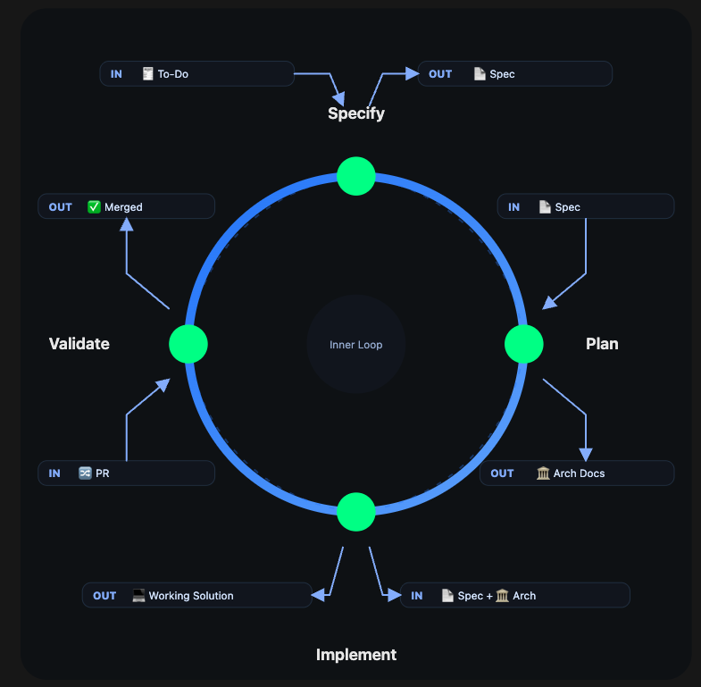
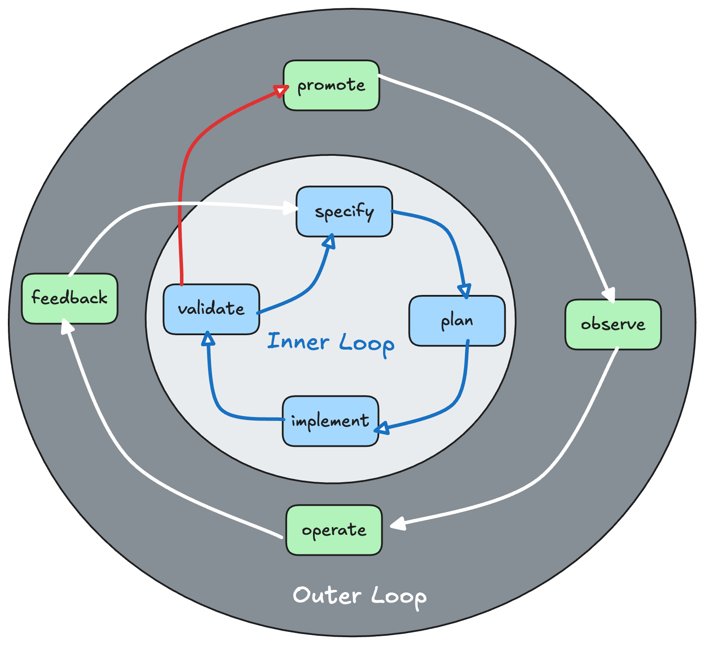

# Inner Loop <-THIS IS FLOWSPEC


Default Flowspec.  THIS IS OUR MISSION!
(the development look) - using specs & artifacts to build quality.  flowspec and falcondev are our inner loop



```
┌──────────────────────────────────────────────────────────────────────────────────┐
│                           FLOWSPEC INNER LOOP COMMAND REFERENCE                  │
├──────────────────┬───────────────┬──────────────────┬────────────────────────────┤
│     COMMAND      │  INPUT        │  OUTPUT Artifact │     PRIMARY AGENTS         │
├──────────────────┼───────────────┼──────────────────┼────────────────────────────┤
│ /flow:specify    │ To Do         │ A Spec           │ PM Planner                 │  
│ /flow:plan       │ Spec          │ Arch Docs        │ Architect, Platform Eng    │
│ /flow:implement  │ Spec & Arch   │ Working solution │ Frontend/Backend Engineers │
│ /flow:validate   │ PR            │ Merged           │ QA, Security Engineers     │
└──────────────────┴───────────────┴──────────────────┴────────────────────────────┘
```


-----

# Outer Loop

not  spec driven commands. (or part of flowspec)
(but part of entire software lifecycle) not part of flowspec at all, falcondev (and other tools will be our outer loop)




```
┌────────────────────────────────────────────────────────────────────────────────────┐
│                           FLOWSPEC OUTER LOOP REFERENCE                            │
├──────────────────┬─────────────────┬──────────────────┬────────────────────────────┤
│     ACTION.      │  INPUT          │  Outcome.        │     NOTES.                 |├──────────────────┼─────────────────┼──────────────────┼────────────────────────────┤
│ /Promote.        │ artifacts*      │ deployed         │ PM Planner                 │  
│ /Observe.        │ telemtry        │ Running          │ Architect, Platform Eng    │
│ /Operate.        │ config.         │ Running          │ Frontend/Backend Engineers │
│ /Feedback.       │ new Requirements│ into inner loo   │ Fixes & Features           │
└──────────────────┴─────────────────┴──────────────────┴────────────────────────────┘
```

### Promote
to Envt: artifacts + metadata  ( sbom, cyber scan output, test results, approvals as needed)
Dev owned environments need less approval.  (approval can be customized per app / team )

### Observe
what are the key things we measure / observe and how do we do it for continuous feedback

### Operate
what is our codified run-book of safe update actions that Humans or AI can take on a running environment (and be approved & monitored, without requiring a new release) restarts, config changes etc.

### Feedback 
when new features of any kind are submitted back into the inner loop with requirements.. to be executed 