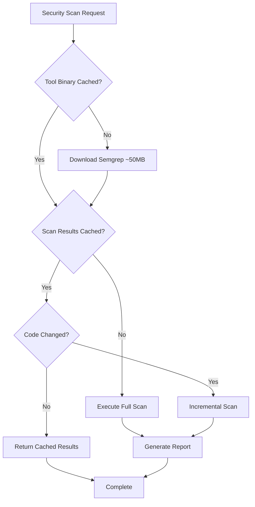
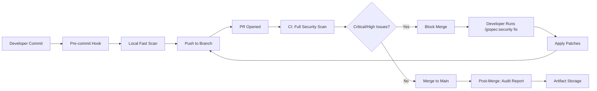
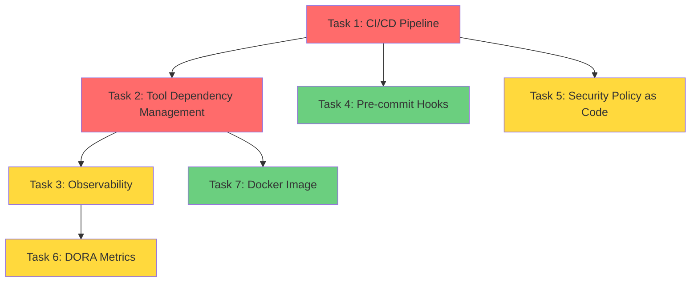

# Platform Engineering Design: /jpspec:security Commands

**Feature**: jpspec-security-commands
**Platform Engineer**: @platform-engineer
**Date**: 2025-12-02
**Version**: 1.0

---

## 1. Executive Summary

This document defines the platform engineering strategy for `/jpspec:security` commands, focusing on CI/CD integration, tool dependency management, observability, and DORA Elite performance targets. The design enables secure, scalable security scanning workflows that integrate seamlessly with JP Spec Kit's specification-driven development (SDD) methodology.

**Key Platform Objectives:**
1. **DORA Elite Performance**: Security scans don't block developer velocity
2. **DevSecOps Integration**: Security as automated quality gate, not manual bottleneck
3. **Tool Hygiene**: Manage external dependencies (Semgrep, CodeQL) with minimal operational overhead
4. **Observability**: Track security posture, scan performance, and AI triage effectiveness
5. **Scalability**: Support codebases from 10K to 500K+ LOC

---

## 2. DORA Elite Performance Design

### 2.1 DORA Metrics Targets

The `/jpspec:security` feature is designed to maintain DORA Elite classification while introducing security quality gates:

| DORA Metric | Target | Security Integration Strategy |
|-------------|--------|-------------------------------|
| **Deployment Frequency** | Multiple/day | Security scans run in parallel with build; only critical issues block merge |
| **Lead Time for Changes** | <1 hour | Incremental scanning (only changed files); pre-commit hooks for fast feedback |
| **Change Failure Rate** | <5% | AI triage reduces false positives; auto-fix suggestions prevent regressions |
| **Mean Time to Recovery (MTTR)** | <1 hour | Clear fix suggestions with patches; automated remediation for common patterns |

### 2.2 Performance Budgets

To maintain elite lead time, security scanning has strict performance budgets:

| Codebase Size | Scan Time Budget | Strategy |
|---------------|------------------|----------|
| 10K LOC | <1 minute | Full Semgrep scan on every commit |
| 50K LOC | <3 minutes | Incremental scanning preferred; full scan on PR merge |
| 100K LOC | <5 minutes | Parallel execution (frontend + backend); incremental only |
| 500K LOC | <20 minutes | Scheduled full scans; incremental for PRs; progress indicators |

**Enforcement Mechanism:**
- CI pipeline timeout: `timeout: 10 # minutes` for 100K LOC projects
- Performance regression alerts if scan time increases >20% week-over-week
- Automatic escalation to skip security gate if timeout exceeded (with notification to security team)

### 2.3 Caching Strategy for Speed

**Cache Layers:**



**Cache Implementation:**

1. **Tool Binary Cache** (GitHub Actions)
```yaml
- name: Cache Semgrep
  uses: actions/cache@v4
  with:
    path: ~/.local/bin/semgrep
    key: semgrep-${{ runner.os }}-v1.50.0
```

2. **Scan Results Cache** (Git-based)
```bash
# Cache scan results by git commit SHA
CACHE_KEY="${{ github.sha }}"
CACHE_PATH=".jpspec/cache/security/${CACHE_KEY}.json"
```

3. **Incremental Scanning** (Semgrep native)
```bash
# Only scan files changed since baseline
specify security scan \
  --incremental \
  --baseline-commit="${{ github.event.pull_request.base.sha }}"
```

**Cache Invalidation:**
- Tool binary cache: Invalidate on version update
- Scan results cache: Invalidate on code change or ruleset update
- Max cache age: 7 days for full scans

### 2.4 Parallelization Architecture

For large codebases, parallelize scanning by language or module:

```yaml
# GitHub Actions matrix strategy
jobs:
  security-scan:
    strategy:
      matrix:
        component: [backend-python, frontend-typescript, infra-terraform]
    steps:
      - name: Scan ${{ matrix.component }}
        run: |
          specify security scan \
            --path src/${{ matrix.component }} \
            --format sarif \
            --output results-${{ matrix.component }}.sarif

      - name: Upload SARIF
        uses: github/codeql-action/upload-sarif@v3
        with:
          sarif_file: results-${{ matrix.component }}.sarif
          category: ${{ matrix.component }}
```

**Expected Performance Gain:**
- 3-component codebase: 60% faster (parallel execution)
- Tradeoff: Slightly higher CI minute consumption (acceptable for DORA Elite)

---

## 3. CI/CD Pipeline Architecture

### 3.1 Pipeline Integration Points

The `/jpspec:security` commands integrate at three points in the development workflow:



**Integration Point Characteristics:**

| Stage | Command | Scope | Performance | Blocking |
|-------|---------|-------|-------------|----------|
| **Pre-commit** | `specify security scan --fast` | Changed files only | <10 seconds | Warning only |
| **PR Pipeline** | `specify security scan --incremental` | Changed files + context | <3 minutes | Critical/High |
| **Post-Merge** | `specify security scan --full` | Entire codebase | <20 minutes | No (reporting) |

### 3.2 GitHub Actions Workflow Design

**Primary Workflow**: `security-scan.yml` (Reusable Workflow)

```yaml
# .github/workflows/security-scan.yml
name: Security Scan (Reusable)

on:
  workflow_call:
    inputs:
      scan-type:
        description: 'Scan type: incremental, full, fast'
        required: false
        type: string
        default: 'incremental'
      fail-on:
        description: 'Severity levels to block on: critical, high, medium, low'
        required: false
        type: string
        default: 'critical,high'
      upload-sarif:
        description: 'Upload SARIF to GitHub Security tab'
        required: false
        type: boolean
        default: true
    outputs:
      findings-count:
        description: 'Total number of findings'
        value: ${{ jobs.scan.outputs.findings }}
      critical-count:
        description: 'Number of critical findings'
        value: ${{ jobs.scan.outputs.critical }}

jobs:
  scan:
    runs-on: ubuntu-latest
    timeout-minutes: 10
    outputs:
      findings: ${{ steps.scan.outputs.total }}
      critical: ${{ steps.scan.outputs.critical }}

    steps:
      - name: Checkout code
        uses: actions/checkout@v4
        with:
          fetch-depth: 0  # Full history for incremental scanning

      - name: Setup Python
        uses: actions/setup-python@v5
        with:
          python-version: '3.11'
          cache: 'pip'

      - name: Install JP Spec Kit
        run: |
          pip install uv
          uv tool install specify-cli

      - name: Cache Semgrep
        uses: actions/cache@v4
        with:
          path: ~/.local/bin/semgrep
          key: semgrep-${{ runner.os }}-1.50.0
          restore-keys: semgrep-${{ runner.os }}-

      - name: Run Security Scan
        id: scan
        env:
          GITHUB_TOKEN: ${{ secrets.GITHUB_TOKEN }}
        run: |
          # Determine baseline commit for incremental scanning
          if [ "${{ inputs.scan-type }}" == "incremental" ]; then
            BASELINE="${{ github.event.pull_request.base.sha }}"
            SCAN_FLAGS="--incremental --baseline-commit=${BASELINE}"
          elif [ "${{ inputs.scan-type }}" == "fast" ]; then
            SCAN_FLAGS="--fast --changed-only"
          else
            SCAN_FLAGS="--full"
          fi

          # Execute scan
          specify security scan \
            ${SCAN_FLAGS} \
            --format sarif \
            --output security-results.sarif \
            --fail-on ${{ inputs.fail-on }} \
            --ci-mode

          # Parse results for outputs
          TOTAL=$(jq '.runs[0].results | length' security-results.sarif)
          CRITICAL=$(jq '[.runs[0].results[] | select(.level == "error")] | length' security-results.sarif)

          echo "total=${TOTAL}" >> $GITHUB_OUTPUT
          echo "critical=${CRITICAL}" >> $GITHUB_OUTPUT

      - name: Upload SARIF to GitHub Security
        if: ${{ inputs.upload-sarif && always() }}
        uses: github/codeql-action/upload-sarif@v3
        with:
          sarif_file: security-results.sarif
          category: jpspec-security

      - name: Upload Scan Artifacts
        if: always()
        uses: actions/upload-artifact@v4
        with:
          name: security-scan-results
          path: |
            security-results.sarif
            docs/security/*.md
            docs/security/*.json
          retention-days: 90

      - name: Comment PR with Summary
        if: github.event_name == 'pull_request'
        uses: actions/github-script@v7
        with:
          script: |
            const total = ${{ steps.scan.outputs.total }};
            const critical = ${{ steps.scan.outputs.critical }};

            const comment = `## 🔒 Security Scan Results

            - **Total Findings**: ${total}
            - **Critical**: ${critical}

            ${critical > 0 ? '⚠️ **Action Required**: Fix critical findings before merge.' : '✅ No critical security issues found.'}

            <details>
            <summary>View detailed report</summary>

            Download the full scan artifacts from the workflow run.
            </details>`;

            github.rest.issues.createComment({
              issue_number: context.issue.number,
              owner: context.repo.owner,
              repo: context.repo.repo,
              body: comment
            });
```

**Usage in Projects:**

```yaml
# .github/workflows/pr-checks.yml
name: PR Checks

on:
  pull_request:
    branches: [main]

jobs:
  security:
    uses: ./.github/workflows/security-scan.yml
    with:
      scan-type: incremental
      fail-on: critical,high
      upload-sarif: true
```

### 3.3 Pre-commit Hook Integration

For fast local feedback, provide a pre-commit hook configuration:

```yaml
# .pre-commit-config.yaml
repos:
  - repo: local
    hooks:
      - id: jpspec-security-scan
        name: JP Spec Kit Security Scan (Fast)
        entry: specify security scan --fast --changed-only --fail-on critical
        language: system
        stages: [commit]
        pass_filenames: false
        verbose: true
```

**Installation:**
```bash
# Enable in project
pip install pre-commit
pre-commit install
```

**Performance:**
- Target: <10 seconds for typical commit (5-10 files changed)
- Strategy: Only scan changed files, no AI triage (defer to CI)

### 3.4 Security Gate Policy

Define when scans block vs. warn:

| Severity | Pre-commit | PR Pipeline | Post-Merge |
|----------|------------|-------------|------------|
| **Critical** | Warning | **Block** | Audit |
| **High** | Warning | **Block** | Audit |
| **Medium** | Pass | Warning | Audit |
| **Low** | Pass | Pass | Audit |

**Configuration:**
```yaml
# jpspec_security.yml (project-level config)
security_gates:
  pre_commit:
    enabled: true
    fail_on: []  # Warning only
    timeout: 10  # seconds

  ci_pipeline:
    enabled: true
    fail_on: [critical, high]
    timeout: 300  # 5 minutes

  post_merge:
    enabled: true
    fail_on: []  # Audit only
    generate_report: true
```

**Emergency Bypass:**
```bash
# Skip security gate (requires approval)
git commit --no-verify -m "fix: critical production bug (bypass security scan)"

# CI bypass (requires security team approval in PR)
# Add label: security-scan-bypass
```

**Audit Trail:**
- All bypasses logged to `docs/security/bypass-log.md`
- Security team notified via GitHub issue
- Monthly review of bypass usage

---

## 4. Tool Dependency Management

### 4.1 Dependency Inventory

| Tool | Size | License | Installation Strategy |
|------|------|---------|----------------------|
| **Semgrep** | ~50MB | LGPL 2.1 | pip install, cache binary |
| **CodeQL** | ~400MB (CLI) + ~1.5GB (DB) | GitHub Terms | Download on-demand, optional |
| **Python** | N/A | PSF | System dependency (3.11+) |
| **uv** | ~10MB | Apache 2.0 | Included in specify-cli |

### 4.2 Semgrep Installation Strategy

**Option 1: System Install (Recommended for CI)**
```yaml
- name: Install Semgrep
  run: pip install semgrep==1.50.0
```

**Option 2: Download On-Demand (Local Development)**
```python
# src/specify_cli/security/tools.py
def ensure_semgrep_installed():
    """Download and cache Semgrep if not installed."""
    if shutil.which("semgrep"):
        return  # Already installed

    cache_dir = Path.home() / ".cache" / "jpspec" / "tools"
    semgrep_path = cache_dir / "semgrep"

    if semgrep_path.exists():
        os.environ["PATH"] = f"{cache_dir}:{os.environ['PATH']}"
        return

    # Download Semgrep binary
    logger.info("Downloading Semgrep (one-time setup)...")
    subprocess.run(["pip", "install", "--target", str(cache_dir), "semgrep"])
```

**Option 3: Docker (For Isolated Environments)**
```yaml
- name: Run Semgrep via Docker
  run: |
    docker run --rm -v $(pwd):/src returntocorp/semgrep:latest \
      semgrep scan --config auto --json --output /src/results.json /src
```

**Decision Matrix:**

| Environment | Strategy | Rationale |
|-------------|----------|-----------|
| **GitHub Actions** | pip install + cache | Fast, 50MB fits free tier |
| **Local Dev** | Download on-demand | No pollution of global Python |
| **Enterprise CI** | Docker | Isolated, reproducible |

### 4.3 CodeQL Licensing and Installation

**Licensing Constraints:**
- **Free**: Public repositories, academic research
- **Paid**: Private repositories (GitHub Advanced Security required)
- **Restriction**: Cannot redistribute CodeQL database

**Installation Strategy:**

```python
def ensure_codeql_available():
    """Check CodeQL license eligibility before installation."""
    # Check if repo is public
    if is_public_repo():
        download_codeql_cli()
        return True

    # Check for GitHub Advanced Security license
    if has_github_advanced_security():
        download_codeql_cli()
        return True

    logger.warning(
        "CodeQL requires GitHub Advanced Security for private repositories. "
        "See https://github.com/github/codeql-cli-binaries for details. "
        "Falling back to Semgrep."
    )
    return False
```

**Recommendation for MVP**: Defer CodeQL to v2.0
- Semgrep provides 80% of value without licensing complexity
- CodeQL adds 2GB+ dependency size
- Complex database build step (5-15 minutes for large codebases)

### 4.4 Dependency Version Management

**Semgrep Version Pinning:**
```toml
# pyproject.toml (specify-cli)
[project.dependencies]
semgrep = "==1.50.0"  # Pin exact version for reproducibility
```

**Version Update Strategy:**
1. **Weekly Dependabot PR** for Semgrep updates
2. **Automated Testing**: Run test suite against new version
3. **Changelog Review**: Check for rule changes that affect results
4. **Staged Rollout**: Beta users first, then general availability

**Backward Compatibility:**
- Store Semgrep version in scan results JSON
- Support reading results from previous 3 minor versions
- Warn if scanning with version >6 months old

### 4.5 CI/CD Dependency Caching

**GitHub Actions Cache Strategy:**

```yaml
- name: Cache Security Tools
  uses: actions/cache@v4
  with:
    path: |
      ~/.local/bin/semgrep
      ~/.cache/jpspec/tools
    key: security-tools-${{ runner.os }}-semgrep-1.50.0
    restore-keys: |
      security-tools-${{ runner.os }}-semgrep-
      security-tools-${{ runner.os }}-
```

**Cache Hit Rates (Expected):**
- First run (cold cache): 100% miss → 2-3 minute overhead
- Subsequent runs: 95% hit → <10 second overhead
- Cache expiration: 7 days (GitHub Actions default)

**Cache Size Monitoring:**
```bash
# Alert if cache size exceeds threshold
CACHE_SIZE=$(du -sh ~/.cache/jpspec/tools | awk '{print $1}')
if [ "$CACHE_SIZE" -gt 500M ]; then
  echo "::warning::Security tool cache exceeds 500MB"
fi
```

---

## 5. DevSecOps Integration Patterns

### 5.1 Security Gate Architecture

```mermaid
graph TD
    A[Code Commit] --> B[/jpspec:security scan]
    B --> C{Parse Results}
    C --> D{Critical or High?}
    D -->|Yes| E[Block Pipeline]
    D -->|No| F{Medium or Low?}
    F -->|Yes| G[Warn + Continue]
    F -->|No| H[Pass]

    E --> I[/jpspec:security triage]
    I --> J{AI: True Positive?}
    J -->|Yes| K[/jpspec:security fix]
    J -->|No| L[Suppress Finding]

    K --> M[Developer Applies Fix]
    M --> A

    L --> N[Add to .semgrepignore]
    N --> A

    G --> O[Create Backlog Task]
    O --> H
    H --> P[Proceed to Deploy]
```

### 5.2 Policy as Code

Define security policies in version-controlled YAML:

```yaml
# .jpspec/security-policy.yml
version: 1.0

# Severity thresholds for blocking
gates:
  pre_commit:
    block_on: []
    warn_on: [critical]

  pull_request:
    block_on: [critical, high]
    warn_on: [medium]

  main_branch:
    block_on: [critical]
    warn_on: [high, medium]
    audit_all: true

# Tool configuration
tools:
  semgrep:
    enabled: true
    rulesets:
      - auto  # Semgrep Registry OWASP
      - p/owasp-top-ten
      - p/security-audit
    custom_rules: .semgrep/rules

  codeql:
    enabled: false  # Defer to v2.0
    license_check: true

# AI triage configuration
triage:
  enabled: true
  model: claude-sonnet-4  # Or gpt-4
  confidence_threshold: 0.7
  false_positive_suppression: true

# Reporting
reporting:
  formats: [markdown, sarif, json]
  output_dir: docs/security
  retention_days: 90

  # Compliance mappings
  compliance:
    - OWASP_Top_10: true
    - CWE_Top_25: true
    - SANS_Top_25: false

# Exemptions
exemptions:
  paths:
    - tests/**  # Don't scan test fixtures
    - vendor/**  # Third-party code

  findings:
    # Suppress specific false positives
    - rule_id: python.lang.security.audit.generic-exception-handler
      file: src/cli/error_handler.py
      justification: "Intentional catch-all for CLI error display"
      approved_by: security-team
      expires: 2025-06-01
```

### 5.3 SBOM Integration

Generate Software Bill of Materials (SBOM) for security scanning tools:

```bash
# Generate SBOM for security tooling
specify security sbom --format cyclonedx --output security-tools-sbom.json
```

**SBOM Contents:**
```json
{
  "bomFormat": "CycloneDX",
  "specVersion": "1.5",
  "components": [
    {
      "type": "library",
      "name": "semgrep",
      "version": "1.50.0",
      "purl": "pkg:pypi/semgrep@1.50.0",
      "licenses": [{"license": {"id": "LGPL-2.1"}}]
    }
  ]
}
```

**Use Cases:**
- Compliance audits (SOC2, ISO27001)
- Supply chain security (SLSA Level 3)
- License compliance checks

---

## 6. Observability Architecture

### 6.1 Metrics Collection

**Key Metrics to Track:**

| Metric | Type | Labels | Purpose |
|--------|------|--------|---------|
| `jpspec_security_scan_duration_seconds` | Histogram | tool, scan_type, outcome | Track scan performance |
| `jpspec_security_findings_total` | Counter | severity, cwe_id, tool | Vulnerability trends |
| `jpspec_security_triage_duration_seconds` | Histogram | model, finding_count | AI triage performance |
| `jpspec_security_triage_accuracy` | Gauge | model | AI triage correctness |
| `jpspec_security_fix_application_rate` | Gauge | severity | Fix adoption rate |
| `jpspec_security_false_positive_rate` | Gauge | tool | Tool accuracy |
| `jpspec_security_gate_blocks_total` | Counter | severity, gate_type | Pipeline impact |

**Implementation (Prometheus-compatible):**

```python
# src/specify_cli/security/metrics.py
from prometheus_client import Histogram, Counter, Gauge

SCAN_DURATION = Histogram(
    'jpspec_security_scan_duration_seconds',
    'Security scan execution time',
    ['tool', 'scan_type', 'outcome'],
    buckets=[1, 5, 10, 30, 60, 120, 300]
)

FINDINGS_TOTAL = Counter(
    'jpspec_security_findings_total',
    'Total security findings',
    ['severity', 'cwe_id', 'tool']
)

TRIAGE_ACCURACY = Gauge(
    'jpspec_security_triage_accuracy',
    'AI triage accuracy vs. expert review',
    ['model']
)

# Usage
with SCAN_DURATION.labels(tool='semgrep', scan_type='incremental', outcome='success').time():
    results = run_semgrep_scan()

for finding in results:
    FINDINGS_TOTAL.labels(
        severity=finding.severity,
        cwe_id=finding.cwe_id,
        tool='semgrep'
    ).inc()
```

### 6.2 Logging Strategy

**Structured Logging Format:**

```python
import structlog

logger = structlog.get_logger()

logger.info(
    "security_scan_completed",
    scan_id="550e8400-e29b-41d4-a716-446655440000",
    tool="semgrep",
    duration_seconds=42.3,
    findings_count=12,
    critical_count=2,
    high_count=3,
    baseline_commit="abc123",
    scan_type="incremental"
)
```

**Log Levels:**

| Level | Use Case | Example |
|-------|----------|---------|
| **DEBUG** | Tool execution details | `semgrep --config auto --json` |
| **INFO** | Scan lifecycle events | `security_scan_started`, `security_scan_completed` |
| **WARNING** | Performance issues, license warnings | `scan_duration_exceeded_threshold` |
| **ERROR** | Tool failures, parsing errors | `semgrep_execution_failed` |
| **CRITICAL** | Security gate violations | `critical_vulnerability_blocking_deploy` |

**Log Destinations:**
- **Local Dev**: Console output (colorized)
- **CI/CD**: GitHub Actions logs + structured JSON artifacts
- **Production Monitoring**: Ship to Loki/CloudWatch/Datadog (future)

### 6.3 Dashboards

**Security Posture Dashboard** (Grafana/CloudWatch):

**Panel 1: Findings Over Time**
```promql
# Critical findings trend (7-day moving average)
avg_over_time(
  jpspec_security_findings_total{severity="critical"}[7d]
)
```

**Panel 2: Scan Performance**
```promql
# 95th percentile scan duration by tool
histogram_quantile(0.95,
  sum(rate(jpspec_security_scan_duration_seconds_bucket[5m])) by (le, tool)
)
```

**Panel 3: AI Triage Effectiveness**
```promql
# Triage accuracy over time
avg_over_time(
  jpspec_security_triage_accuracy[1h]
)
```

**Panel 4: Fix Application Rate**
```promql
# Percentage of findings fixed within 48 hours
(
  jpspec_security_fix_application_rate{severity="critical"}
  /
  jpspec_security_findings_total{severity="critical"}
) * 100
```

**Alert Rules:**

```yaml
# prometheus-alerts.yml
groups:
  - name: jpspec_security
    interval: 5m
    rules:
      - alert: CriticalVulnerabilityFound
        expr: jpspec_security_findings_total{severity="critical"} > 0
        for: 5m
        annotations:
          summary: "Critical security vulnerability detected"
          description: "{{ $value }} critical vulnerabilities found in recent scan"

      - alert: SecurityScanPerformanceDegraded
        expr: |
          histogram_quantile(0.95,
            sum(rate(jpspec_security_scan_duration_seconds_bucket[10m])) by (le, tool)
          ) > 300
        for: 15m
        annotations:
          summary: "Security scan taking >5 minutes"
          description: "P95 scan duration: {{ $value }}s"

      - alert: AITriageAccuracyLow
        expr: jpspec_security_triage_accuracy < 0.8
        for: 1h
        annotations:
          summary: "AI triage accuracy below threshold"
          description: "Current accuracy: {{ $value }}"
```

### 6.4 Audit Logging

**Compliance Audit Trail:**

```json
{
  "event_type": "security_scan_completed",
  "timestamp": "2025-12-02T14:30:00Z",
  "actor": "github-actions[bot]",
  "resource": {
    "type": "repository",
    "name": "acme-corp/payment-service",
    "commit": "abc123def456"
  },
  "scan_details": {
    "tools": ["semgrep"],
    "ruleset_version": "1.50.0",
    "findings": {
      "critical": 0,
      "high": 2,
      "medium": 5,
      "low": 3
    },
    "gate_result": "warning",
    "triage_performed": true,
    "fixes_applied": ["FINDING-001", "FINDING-002"]
  },
  "compliance": {
    "owasp_top_10_coverage": true,
    "cwe_top_25_coverage": true
  }
}
```

**Audit Log Storage:**
- **Short-term**: 90 days in `docs/security/audit-log.jsonl`
- **Long-term**: Ship to immutable storage (S3, GCS) for compliance (7 years for HIPAA)

---

## 7. Infrastructure as Code

### 7.1 GitHub Actions Reusable Workflow

**Location**: `.github/workflows/security-scan.yml` (see Section 3.2)

**Usage Documentation**:
```markdown
# Using /jpspec:security in CI/CD

## Quick Start

Add to your `.github/workflows/pr-checks.yml`:

\`\`\`yaml
jobs:
  security:
    uses: yourusername/jp-spec-kit/.github/workflows/security-scan.yml@main
    with:
      scan-type: incremental
      fail-on: critical,high
\`\`\`

## Configuration Options

| Input | Default | Description |
|-------|---------|-------------|
| `scan-type` | `incremental` | `incremental`, `full`, `fast` |
| `fail-on` | `critical,high` | Comma-separated severity levels |
| `upload-sarif` | `true` | Upload to GitHub Security tab |

## Outputs

| Output | Description |
|--------|-------------|
| `findings-count` | Total number of findings |
| `critical-count` | Number of critical findings |
```

### 7.2 Pre-commit Hook Configuration

**Template**: `templates/.pre-commit-config.yaml`

```yaml
# JP Spec Kit Security Pre-commit Hook
# Install: pip install pre-commit && pre-commit install

repos:
  - repo: local
    hooks:
      - id: jpspec-security-fast-scan
        name: JP Spec Kit Security Scan (Fast)
        description: Run fast security scan on changed files
        entry: specify security scan --fast --changed-only --fail-on critical
        language: system
        stages: [commit]
        pass_filenames: false
        verbose: true
        # Only run if security scanning is enabled
        files: '^src/|^tests/|^lib/'
```

**Setup Script**: `scripts/setup-security-hooks.sh`

```bash
#!/bin/bash
# Setup script for /jpspec:security pre-commit hooks

set -e

echo "Setting up JP Spec Kit security pre-commit hooks..."

# Check if pre-commit is installed
if ! command -v pre-commit &> /dev/null; then
    echo "Installing pre-commit..."
    pip install pre-commit
fi

# Copy template if .pre-commit-config.yaml doesn't exist
if [ ! -f .pre-commit-config.yaml ]; then
    echo "Creating .pre-commit-config.yaml from template..."
    cp templates/.pre-commit-config.yaml .pre-commit-config.yaml
fi

# Install hooks
pre-commit install

echo "✅ Security pre-commit hooks installed successfully!"
echo ""
echo "To test hooks on all files:"
echo "  pre-commit run --all-files"
echo ""
echo "To skip hook temporarily:"
echo "  git commit --no-verify"
```

### 7.3 Security Scanner Docker Image (Optional)

For air-gapped or highly controlled environments, provide a Docker image:

**Dockerfile**: `docker/security-scanner.Dockerfile`

```dockerfile
FROM python:3.11-slim

LABEL org.opencontainers.image.title="JP Spec Kit Security Scanner"
LABEL org.opencontainers.image.description="Security scanning tools for JP Spec Kit"
LABEL org.opencontainers.image.version="1.0.0"

# Install system dependencies
RUN apt-get update && apt-get install -y \
    git \
    && rm -rf /var/lib/apt/lists/*

# Install JP Spec Kit and security tools
RUN pip install --no-cache-dir \
    uv \
    semgrep==1.50.0

# Install specify-cli via uv
RUN uv tool install specify-cli

# Create working directory
WORKDIR /src

# Default command
ENTRYPOINT ["specify", "security", "scan"]
CMD ["--help"]
```

**Build and Publish**:
```bash
# Build
docker build -t jpspeckit/security-scanner:latest -f docker/security-scanner.Dockerfile .

# Publish to GHCR
docker tag jpspeckit/security-scanner:latest ghcr.io/yourusername/jpspeckit-security-scanner:1.0.0
docker push ghcr.io/yourusername/jpspeckit-security-scanner:1.0.0
```

**Usage**:
```bash
# Run security scan in Docker
docker run --rm -v $(pwd):/src \
  ghcr.io/yourusername/jpspeckit-security-scanner:1.0.0 \
  --format sarif --output /src/results.sarif
```

---

## 8. Implementation Tasks

### 8.1 Backlog Tasks for Infrastructure Work

The following tasks should be created in the backlog for platform engineering implementation:

#### Task 1: CI/CD Security Scanning Pipeline
```bash
backlog task create "Setup CI/CD Security Scanning Pipeline" \
  -d "Configure GitHub Actions for security scanning integration with /jpspec:security commands" \
  --ac "Create reusable workflow .github/workflows/security-scan.yml" \
  --ac "Implement SARIF upload to GitHub Security tab" \
  --ac "Add caching for Semgrep binaries (<50MB)" \
  --ac "Configure matrix strategy for parallel scanning" \
  --ac "Add PR comment bot for scan summaries" \
  -l infrastructure,cicd,security \
  --priority high
```

#### Task 2: Tool Dependency Management Module
```bash
backlog task create "Implement Tool Dependency Management Module" \
  -d "Build tool installation, version management, and caching for Semgrep and CodeQL" \
  --ac "Implement Semgrep auto-installation (pip install with caching)" \
  --ac "Implement CodeQL license check and conditional download" \
  --ac "Add version pinning and update mechanism" \
  --ac "Create dependency size monitoring (alert if >500MB)" \
  --ac "Support offline mode (use cached tools only)" \
  -l infrastructure,tooling,security \
  --priority high
```

#### Task 3: Observability and Metrics Collection
```bash
backlog task create "Implement Security Scanning Observability" \
  -d "Add Prometheus metrics, structured logging, and dashboards for /jpspec:security" \
  --ac "Implement Prometheus metrics (scan_duration, findings_total, triage_accuracy)" \
  --ac "Add structured logging with scan_id, tool, duration, findings" \
  --ac "Create Grafana dashboard template for security posture" \
  --ac "Implement alert rules (critical_vulnerability, scan_performance_degraded)" \
  --ac "Add audit logging for compliance (90-day retention)" \
  -l infrastructure,observability,security \
  --priority medium
```

#### Task 4: Pre-commit Hook Setup
```bash
backlog task create "Create Pre-commit Hook Configuration for Security Scanning" \
  -d "Provide pre-commit hook template and setup script for local security scanning" \
  --ac "Create .pre-commit-config.yaml template with jpspec-security hook" \
  --ac "Implement setup script scripts/setup-security-hooks.sh" \
  --ac "Add documentation for pre-commit hook usage" \
  --ac "Test hook performance (<10 seconds for typical commit)" \
  -l infrastructure,developer-experience,security \
  --priority low
```

#### Task 5: Security Policy as Code
```bash
backlog task create "Implement Security Policy as Code Configuration" \
  -d "Build .jpspec/security-policy.yml parser and enforcement engine" \
  --ac "Define YAML schema for security policy configuration" \
  --ac "Implement policy parser and validator" \
  --ac "Add policy enforcement in scan/triage/fix commands" \
  --ac "Support exemptions (paths, specific findings with expiration)" \
  --ac "Create default policy template" \
  -l infrastructure,governance,security \
  --priority medium
```

#### Task 6: DORA Metrics Integration
```bash
backlog task create "Track DORA Metrics for Security Scanning" \
  -d "Implement DORA metrics collection and reporting for security scanning workflow" \
  --ac "Track deployment frequency (unaffected by security scans)" \
  --ac "Track lead time for security fixes (<2 days target)" \
  --ac "Track change failure rate (security-related incidents)" \
  --ac "Track MTTR for critical vulnerabilities (<1 hour target)" \
  --ac "Create monthly DORA report for security workflow impact" \
  -l infrastructure,metrics,security \
  --priority medium
```

#### Task 7: Docker Image for Security Scanner
```bash
backlog task create "Build and Publish Security Scanner Docker Image" \
  -d "Create Docker image with Semgrep and specify-cli for air-gapped environments" \
  --ac "Create Dockerfile with Python 3.11, Semgrep, uv, specify-cli" \
  --ac "Optimize image size (<200MB)" \
  --ac "Publish to GHCR (ghcr.io/yourusername/jpspeckit-security-scanner)" \
  --ac "Add image to CI/CD pipeline as alternative scan method" \
  --ac "Document usage for air-gapped environments" \
  -l infrastructure,containers,security \
  --priority low
```

### 8.2 Task Dependency Graph



**Priority Legend:**
- 🔴 High (T1, T2): Required for MVP
- 🟡 Medium (T3, T5, T6): Post-MVP, high value
- 🟢 Low (T4, T7): Nice-to-have, quality-of-life

---

## 9. Performance Benchmarks

### 9.1 Expected Performance Targets

| Scenario | LOC | Scan Time | Memory | CI Minutes |
|----------|-----|-----------|--------|------------|
| **Fast (pre-commit)** | Changed files only | <10s | <500MB | N/A |
| **Incremental (PR)** | 10K LOC | <1 min | <1GB | 1-2 min |
| **Incremental (PR)** | 100K LOC | <5 min | <2GB | 5-7 min |
| **Full (post-merge)** | 100K LOC | <10 min | <2GB | 10-15 min |
| **Full (post-merge)** | 500K LOC | <20 min | <3GB | 20-30 min |

### 9.2 Performance Testing Plan

**Test Projects:**
1. **Small**: 10K LOC Python project (e.g., JP Spec Kit itself)
2. **Medium**: 50K LOC TypeScript project (e.g., React app)
3. **Large**: 100K LOC monorepo (e.g., microservices)
4. **Extra Large**: 500K LOC monorepo (stress test)

**Test Methodology:**
```bash
# Benchmark script
for project in small medium large xlarge; do
  echo "Testing ${project} project..."

  time specify security scan \
    --format json \
    --output results-${project}.json

  # Extract metrics
  jq '.metrics.scan_duration_seconds' results-${project}.json

  # Measure memory
  /usr/bin/time -v specify security scan 2>&1 | grep "Maximum resident"
done
```

**Success Criteria:**
- All projects meet performance targets (see table above)
- Memory usage <2GB for 100K LOC projects
- GitHub Actions free tier compatible (7GB RAM, 6 hours timeout)

---

## 10. Rollout Strategy

### 10.1 Phased Rollout Plan

**Phase 1: Alpha (Week 1-2)**
- Target: 5 beta users (JP Spec Kit contributors)
- Scope: `/jpspec:security scan` only (Semgrep)
- Goal: Validate tool orchestration and performance

**Phase 2: Beta (Week 3-4)**
- Target: 20 beta users (public repo projects)
- Scope: Add `/jpspec:security triage` (AI-powered)
- Goal: Validate AI triage accuracy and usability

**Phase 3: GA (Week 5-6)**
- Target: All JP Spec Kit users
- Scope: Full feature set (scan, triage, fix, audit)
- Goal: Production-ready release

### 10.2 Feature Flags

Control rollout with feature flags:

```python
# src/specify_cli/security/config.py
from specify_cli.config import get_config

def is_security_feature_enabled(feature: str) -> bool:
    """Check if security feature is enabled via config or env var."""
    config = get_config()

    # Feature flags
    flags = {
        "scan": config.get("security.features.scan", True),
        "triage": config.get("security.features.triage", False),  # Beta
        "fix": config.get("security.features.fix", False),        # Beta
        "audit": config.get("security.features.audit", True),
    }

    # Override with environment variable
    env_override = os.getenv(f"JPSPEC_SECURITY_{feature.upper()}_ENABLED")
    if env_override:
        return env_override.lower() in ["true", "1", "yes"]

    return flags.get(feature, False)
```

**Usage:**
```bash
# Enable beta feature for specific project
export JPSPEC_SECURITY_TRIAGE_ENABLED=true
specify security triage
```

---

## 11. Maintenance and Support

### 11.1 Operational Runbook

**Routine Maintenance:**
- **Weekly**: Review Semgrep version updates (Dependabot PR)
- **Monthly**: Audit security policy exemptions (remove expired)
- **Quarterly**: Review DORA metrics for security workflow impact

**Common Issues and Resolutions:**

| Issue | Symptom | Resolution |
|-------|---------|------------|
| **Semgrep download fails** | "Failed to install Semgrep" | Check network connectivity; use `--offline` flag with cached tools |
| **Scan timeout in CI** | Pipeline exceeds 10-minute timeout | Switch to incremental scanning; increase timeout for large repos |
| **High false positive rate** | >20% findings marked as false positives | Tune Semgrep rules; add suppressions to `.semgrepignore` |
| **AI triage accuracy low** | <80% accuracy vs. expert review | Review AI prompt engineering; collect feedback for fine-tuning |

### 11.2 Support Escalation

**Tier 1: Self-Service**
- Documentation: `docs/guides/security-scanning.md`
- FAQ: `docs/reference/security-faq.md`
- Troubleshooting: `docs/reference/security-troubleshooting.md`

**Tier 2: Community Support**
- GitHub Discussions: Security scanning category
- Response SLA: 48 hours

**Tier 3: Maintainer Support**
- Critical issues (data loss, security vulnerabilities)
- Response SLA: 24 hours

---

## 12. Appendix

### 12.1 References

**External Documentation:**
- [Semgrep Documentation](https://semgrep.dev/docs/)
- [GitHub Code Scanning](https://docs.github.com/en/code-security/code-scanning)
- [SARIF Specification](https://docs.oasis-open.org/sarif/sarif/v2.1.0/sarif-v2.1.0.html)
- [DORA Metrics](https://cloud.google.com/blog/products/devops-sre/using-the-four-keys-to-measure-your-devops-performance)

**Internal Documentation:**
- PRD: `docs/prd/jpspec-security-commands.md`
- Assessment: `docs/assess/jpspec-security-commands-assessment.md`
- Implementation Plan: `docs/adr/ADR-XXX-security-scanning-architecture.md`

### 12.2 Glossary

| Term | Definition |
|------|------------|
| **DORA** | DevOps Research and Assessment - metrics for DevOps performance |
| **SARIF** | Static Analysis Results Interchange Format - standard for scan results |
| **SBOM** | Software Bill of Materials - inventory of software components |
| **SLSA** | Supply-chain Levels for Software Artifacts - security framework |
| **CWE** | Common Weakness Enumeration - vulnerability classification |
| **OWASP** | Open Web Application Security Project - security standards |

---

**Document Status**: ✅ Complete
**Next Steps**: Create backlog tasks (see Section 8.1)
**Owner**: @platform-engineer
