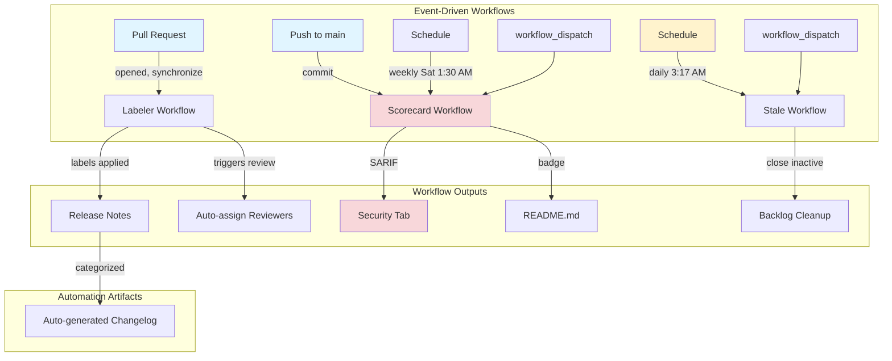
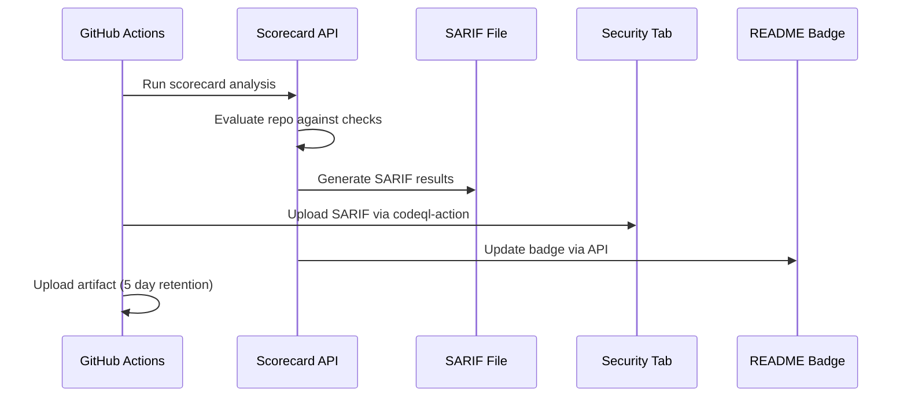
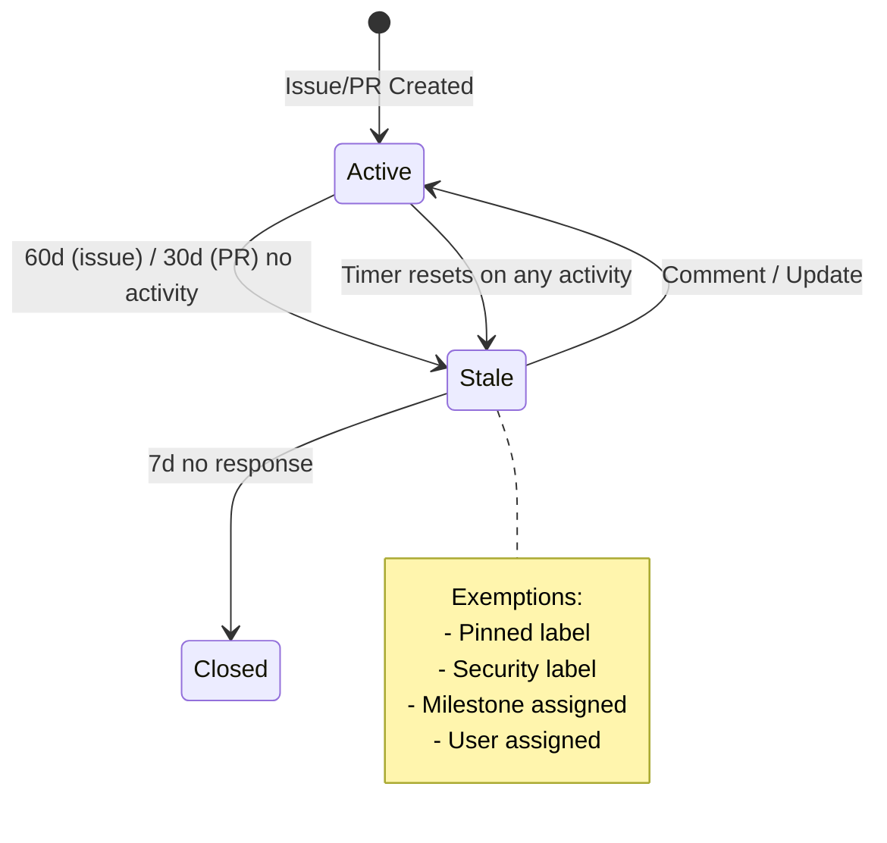
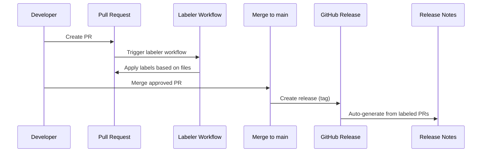
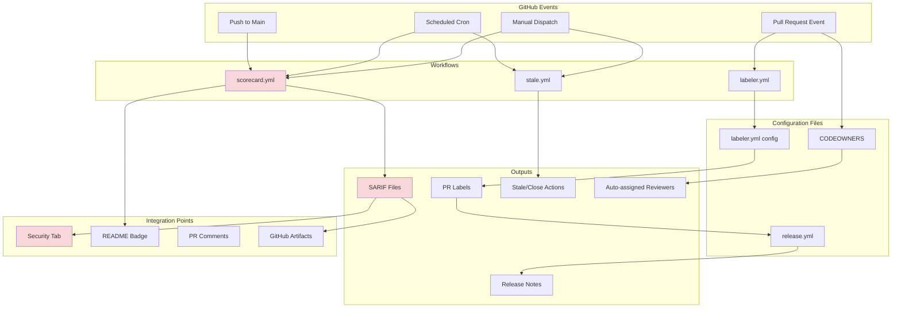

# GitHub Workflows Platform Architecture (task-437)

**Status**: Design Complete
**Author**: Platform Engineer Agent
**Date**: 2025-12-10
**Related Tasks**: task-437, task-437.03, task-437.04, task-437.05

## Executive Summary

This document defines the platform architecture for implementing comprehensive GitHub project automation features for flowspec, inspired by Viktor Farcic's DevOps AI Toolkit. The architecture focuses on security-hardened workflows, automated labeling, release notes generation, and OpenSSF Scorecard integration.

### Platform Components

1. **Automated PR Labeling** - File-path-based automatic label assignment
2. **Stale Management** - Automated issue/PR lifecycle management
3. **OpenSSF Scorecard** - Security best practices evaluation
4. **Release Notes** - Automated changelog generation
5. **CODEOWNERS** - Automatic reviewer assignment

### Key Design Principles

- **Security by Design**: All action versions pinned with full commit SHA (not tags)
- **Minimal Permissions**: Each workflow has least-privilege access model
- **Production Ready**: No distinction between dev/prod workflows
- **Observability**: SARIF integration for security findings
- **Automation**: Eliminate manual labeling, assignment, and stale management

---

## 1. CI/CD Pipeline Architecture

### 1.1 Workflow Dependency Graph



### 1.2 Workflow Triggers and Scheduling

| Workflow | Triggers | Frequency | Purpose |
|----------|----------|-----------|---------|
| **labeler.yml** | `pull_request: [opened, synchronize]` | Per PR event | Label PRs based on changed files |
| **stale.yml** | `schedule: 0 3 * * *` (daily 3:17 AM), `workflow_dispatch` | Daily + manual | Mark/close stale issues/PRs |
| **scorecard.yml** | `push: [main]`, `schedule: 30 1 * * 6` (Sat 1:30 AM), `workflow_dispatch` | Push + weekly + manual | Security best practices scan |

**Cron Best Practice**: Avoid `:00` minute times to prevent GitHub Actions load spikes. Use offset times (`:17`, `:30`) for better distribution.

### 1.3 Permission Models

Each workflow follows the principle of least privilege:

#### labeler.yml Permissions
```yaml
permissions:
  contents: read          # Read repo files for path matching
  pull-requests: write    # Apply labels to PRs
```

#### stale.yml Permissions
```yaml
permissions:
  issues: write          # Mark stale, close issues
  pull-requests: write   # Mark stale, close PRs
```

#### scorecard.yml Permissions
```yaml
permissions:
  contents: read         # Read repo structure
  security-events: write # Upload SARIF to Security tab
  id-token: write        # OIDC token for Scorecard API
  actions: read          # Read workflow files for analysis
```

### 1.4 Action Version Pinning Strategy

**Critical Security Requirement**: All actions MUST be pinned with full commit SHA, not tags or branches.

**Rationale**:
- Tags can be moved to malicious commits
- Branches can be force-pushed
- SHAs are immutable and cryptographically verifiable
- OpenSSF Scorecard checks for this practice

**Example**:
```yaml
# ❌ WRONG - Using tag (mutable)
- uses: actions/labeler@v5

# ✅ CORRECT - Using commit SHA (immutable)
- uses: actions/labeler@8558fd74291d67161a8a78ce36a881fa63b766a9  # v5.0.0
```

**Maintenance Strategy**:
- Use Renovate bot to update action SHAs automatically
- Include version comment for human readability: `# v5.0.0`
- Group action updates in Renovate config

### 1.5 Caching and Optimization

**Current State**: flowspec CI already uses action caching effectively:
```yaml
# From ci.yml - Python setup with cache
- uses: actions/setup-python@v5
  with:
    python-version: '3.11'
    cache: 'pip'

# Semgrep binary cache (from security-scan.yml)
- uses: actions/cache@v4
  with:
    path: ~/.local/bin/semgrep
    key: semgrep-${{ runner.os }}-1.50.0
```

**New Workflows**: Labeler, stale, and scorecard workflows are lightweight and don't require caching:
- **labeler**: Just file path matching (< 10s runtime)
- **stale**: API calls only (< 30s runtime)
- **scorecard**: External API + SARIF upload (< 2 min runtime)

---

## 2. Security Architecture

### 2.1 OpenSSF Scorecard Integration

**Purpose**: Automated evaluation against security best practices.

**Scorecard Checks** (subset relevant to flowspec):
| Check | Description | Current Impact |
|-------|-------------|----------------|
| **Pinned-Dependencies** | All actions use commit SHA | ✅ We will achieve this |
| **Token-Permissions** | Least-privilege GITHUB_TOKEN | ✅ Already implemented |
| **Code-Review** | PRs require review | ✅ Branch protection in place |
| **Signed-Releases** | Releases are signed | 🟡 Future enhancement |
| **Binary-Artifacts** | No committed binaries | ✅ Clean repo |
| **Dangerous-Workflow** | No script injection risks | ✅ Safe workflows |
| **Dependency-Update-Tool** | Renovate configured | 🟡 To be added |
| **SAST** | Static analysis enabled | ✅ Bandit + Semgrep |
| **Vulnerabilities** | Known CVEs addressed | ✅ Automated scanning |

**Integration Design**:



### 2.2 SARIF Pipeline Architecture

**SARIF (Static Analysis Results Interchange Format)** is the standard format for security findings in GitHub.

**Current SARIF Producers in flowspec**:
1. `security-scan.yml` - Semgrep SARIF output
2. **NEW**: `scorecard.yml` - OpenSSF Scorecard SARIF

**SARIF Upload Strategy**:
```yaml
- name: Upload SARIF to GitHub Security
  uses: github/codeql-action/upload-sarif@v3  # Pin with SHA in production
  with:
    sarif_file: results.sarif
    category: flowspec-scorecard  # Unique category per scan type
```

**Categories in Security Tab**:
- `flowspec-security` - Existing Semgrep findings
- `flowspec-scorecard` - NEW Scorecard findings

**Retention**:
- SARIF uploaded to Security tab: Permanent (90 days visible)
- Artifact retention: 5 days (scorecard), 90 days (security-scan)

### 2.3 Action SHA Pinning Requirements

**Template Variable for Pinned Versions**:
```yaml
# Template: workflows/scorecard.yml.template
name: OpenSSF Scorecard

on:
  push:
    branches: [main]
  schedule:
    - cron: '30 1 * * 6'  # Saturdays 1:30 AM UTC
  workflow_dispatch:

permissions: read-all

jobs:
  scorecard:
    name: Scorecard analysis
    runs-on: ubuntu-latest
    permissions:
      security-events: write
      id-token: write
      contents: read
      actions: read

    steps:
      - name: Checkout code
        uses: actions/checkout@{{ CHECKOUT_SHA }}  # v4.1.1
        with:
          persist-credentials: false

      - name: Run Scorecard
        uses: ossf/scorecard-action@{{ SCORECARD_SHA }}  # v2.3.1
        with:
          results_file: results.sarif
          results_format: sarif
          publish_results: true

      - name: Upload artifact
        uses: actions/upload-artifact@{{ UPLOAD_ARTIFACT_SHA }}  # v4.3.0
        with:
          name: SARIF file
          path: results.sarif
          retention-days: 5

      - name: Upload SARIF
        uses: github/codeql-action/upload-sarif@{{ CODEQL_SHA }}  # v3.23.0
        with:
          sarif_file: results.sarif
```

**SHA Lookup Process** (to be automated):
1. Go to action repository (e.g., `actions/checkout`)
2. Navigate to tag (e.g., `v4.1.1`)
3. Copy full commit SHA
4. Add comment with version for readability

**Example Current SHAs** (as of 2025-12-10, to be verified):
- `actions/checkout@v4` → `b4ffde65f46336ab88eb53be808477a3936bae11`
- `actions/labeler@v5` → `8558fd74291d67161a8a78ce36a881fa63b766a9`
- `actions/stale@v9` → `28ca1036281a5e5922ade5f6a508c69cc48b4657`
- `ossf/scorecard-action@v2.3.1` → `0864cf19026789058feabb7e87baa5f140aac736`

### 2.4 Secret Handling

**Good News**: None of the new workflows require secrets.

**GITHUB_TOKEN**: Automatically provided by GitHub Actions with scoped permissions:
- Labeler: Needs `pull-requests: write`
- Stale: Needs `issues: write`, `pull-requests: write`
- Scorecard: Needs `security-events: write`, `id-token: write`

**No Manual Secrets Required** ✅

---

## 3. Automation Design

### 3.1 Stale Management Architecture

**Timeline Configuration**:

| Item Type | Stale After | Close After | Total Lifetime |
|-----------|-------------|-------------|----------------|
| **Issues** | 60 days | 7 days | 67 days |
| **Pull Requests** | 30 days | 7 days | 37 days |

**Exemption Strategy**:

```yaml
# Exempt by Label
exempt-issue-labels: 'pinned,security,PRD'
exempt-pr-labels: 'pinned,security,work-in-progress'

# Exempt by Assignment
exempt-all-milestones: true
exempt-all-assignees: true
```

**Rationale for Exemptions**:
- **pinned**: Intentionally kept open (tracking issues, roadmap items)
- **security**: Security issues should never auto-close
- **PRD**: Product requirements in progress
- **milestones**: Active work tracked in milestones
- **assignees**: Someone is actively responsible

**Message Templates**:
```yaml
stale-issue-message: |
  This issue has been automatically marked as stale because it has not had
  recent activity. It will be closed in 7 days if no further activity occurs.

  If this issue is still relevant, please comment to keep it open.

  Thank you for your contributions.

stale-pr-message: |
  This pull request has been automatically marked as stale because it has not
  had recent activity. It will be closed in 7 days if no further activity occurs.

  If you're still working on this, please:
  - Push updates to the branch
  - Comment on the PR
  - Add the 'work-in-progress' label

  Thank you for your contribution.
```

**Workflow Behavior**:


### 3.2 Labeling Automation

**Label Mapping Strategy**:

```yaml
# .github/labeler.yml
documentation:
  - changed-files:
    - any-glob-to-any-file:
      - 'docs/**/*'
      - '**/*.md'
      - 'README*'

source:
  - changed-files:
    - any-glob-to-any-file: 'src/**/*'

tests:
  - changed-files:
    - any-glob-to-any-file:
      - 'tests/**/*'
      - '**/*.test.py'
      - '**/*.spec.py'

ci-cd:
  - changed-files:
    - any-glob-to-any-file:
      - '.github/workflows/**'
      - '.github/actions/**'
      - 'Dockerfile*'
      - 'docker-compose*.yml'

infrastructure:
  - changed-files:
    - any-glob-to-any-file:
      - 'k8s/**'
      - 'kubernetes/**'
      - 'manifests/**'
      - 'terraform/**'
      - 'ansible/**'

dependencies:
  - changed-files:
    - any-glob-to-any-file:
      - 'pyproject.toml'
      - 'requirements*.txt'
      - 'uv.lock'
      - 'package.json'
      - 'package-lock.json'

config:
  - changed-files:
    - any-glob-to-any-file:
      - '**/*.config.*'
      - '**/*.yaml'
      - '**/*.yml'
      - '**/*.toml'
      - '**/*.json'

templates:
  - changed-files:
    - any-glob-to-any-file: 'templates/**/*'

security:
  - changed-files:
    - any-glob-to-any-file:
      - 'docs/security/**'
      - 'SECURITY.md'
      - '.github/workflows/security*.yml'
```

**Label Consistency with release.yml**:

Labels MUST align with release note categories:
- `breaking-change`, `breaking` → "Breaking Changes"
- `feature`, `enhancement`, `feat` → "New Features"
- `bug`, `fix`, `bugfix` → "Bug Fixes"
- `documentation`, `docs` → "Documentation"
- `dependencies`, `deps` → "Dependencies"

### 3.3 Release Notes Automation

**Configuration Design**:

```yaml
# .github/release.yml
changelog:
  exclude:
    labels:
      - skip-changelog
      - duplicate
      - invalid
      - wontfix
    authors:
      - renovate
      - renovate[bot]
      - github-actions[bot]
      - dependabot[bot]

  categories:
    - title: Breaking Changes
      labels:
        - breaking-change
        - breaking

    - title: New Features
      labels:
        - feature
        - enhancement
        - feat

    - title: Bug Fixes
      labels:
        - bug
        - fix
        - bugfix

    - title: Documentation
      labels:
        - documentation
        - docs

    - title: Dependencies
      labels:
        - dependencies
        - deps

    - title: Infrastructure
      labels:
        - infrastructure
        - ci-cd
        - platform

    - title: Other Changes
      labels:
        - '*'
```

**Bot Exclusion Rationale**:
- Renovate PRs are noise in release notes (tracked in Dependencies section)
- GitHub Actions bot PRs are automated (backlog flush, etc.)
- Focus on human-contributed changes

**Release Process Integration**:



---

## 4. Infrastructure as Code (IaC)

### 4.1 Template Specifications

All workflows should be stored as templates in `/templates/github/` for reuse across projects.

#### Template: workflows/labeler.yml.template

```yaml
# Auto-label PRs based on changed files
# Requires: .github/labeler.yml configuration file

name: Labeler

on:
  pull_request:
    types: [opened, synchronize]

permissions:
  contents: read
  pull-requests: write

jobs:
  label:
    runs-on: ubuntu-latest
    timeout-minutes: 5

    steps:
      - name: Checkout code
        uses: actions/checkout@{{ CHECKOUT_SHA }}  # v4.1.1

      - name: Apply labels
        uses: actions/labeler@{{ LABELER_SHA }}  # v5.0.0
        with:
          configuration-path: .github/labeler.yml
          sync-labels: true  # Remove labels when files change
```

**Template Variables**:
- `{{ CHECKOUT_SHA }}` - actions/checkout commit SHA
- `{{ LABELER_SHA }}` - actions/labeler commit SHA

**Required Files**:
- `.github/labeler.yml` - Label to file path mappings

**Optional Configuration**:
- `sync-labels: true` - Remove labels when files no longer match (recommended)
- `repo-token` - Auto-provided by GITHUB_TOKEN

---

#### Template: workflows/stale.yml.template

```yaml
# Mark and close stale issues and PRs
# Issues: 60 days -> stale, 7 days -> close (67 total)
# PRs: 30 days -> stale, 7 days -> close (37 total)

name: Stale

on:
  schedule:
    - cron: '17 3 * * *'  # Daily at 3:17 AM UTC (avoid :00)
  workflow_dispatch:

permissions:
  issues: write
  pull-requests: write

jobs:
  stale:
    runs-on: ubuntu-latest
    timeout-minutes: 10

    steps:
      - name: Mark and close stale issues/PRs
        uses: actions/stale@{{ STALE_SHA }}  # v9.0.0
        with:
          # Issue configuration
          days-before-issue-stale: 60
          days-before-issue-close: 7
          stale-issue-label: 'stale'
          stale-issue-message: |
            This issue has been automatically marked as stale because it has not had
            recent activity. It will be closed in 7 days if no further activity occurs.

            If this issue is still relevant, please comment to keep it open.

            Thank you for your contributions.
          close-issue-message: |
            This issue was automatically closed because it has been stale for 7 days
            with no activity.

            If you believe this issue should remain open, please reopen it and provide
            an update.
          exempt-issue-labels: 'pinned,security,PRD'

          # PR configuration
          days-before-pr-stale: 30
          days-before-pr-close: 7
          stale-pr-label: 'stale'
          stale-pr-message: |
            This pull request has been automatically marked as stale because it has not
            had recent activity. It will be closed in 7 days if no further activity occurs.

            If you're still working on this, please:
            - Push updates to the branch
            - Comment on the PR
            - Add the 'work-in-progress' label

            Thank you for your contribution.
          close-pr-message: |
            This pull request was automatically closed because it has been stale for 7 days
            with no activity.

            If you'd like to continue this work, please reopen the PR or create a new one.
          exempt-pr-labels: 'pinned,security,work-in-progress'

          # Exemptions
          exempt-all-milestones: true
          exempt-all-assignees: true

          # Operations
          operations-per-run: 100
          remove-stale-when-updated: true
          ascending: false  # Process newest first
```

**Template Variables**:
- `{{ STALE_SHA }}` - actions/stale commit SHA

**Customization Points**:
- `days-before-*-stale` - Days until marked stale
- `days-before-*-close` - Days after stale before closing
- `exempt-*-labels` - Labels that prevent stale marking
- `stale-*-message`, `close-*-message` - Custom messages

**Best Practices**:
- Use `:17` minute (not `:00`) to avoid GitHub Actions load
- Set `operations-per-run` to avoid rate limits (100 is safe)
- `ascending: false` processes newest items first

---

#### Template: workflows/scorecard.yml.template

```yaml
# OpenSSF Scorecard - Security best practices analysis
# Runs weekly and on every push to main
# Uploads SARIF to GitHub Security tab

name: OpenSSF Scorecard

on:
  push:
    branches: [main]
  schedule:
    - cron: '30 1 * * 6'  # Saturdays 1:30 AM UTC (avoid :00)
  workflow_dispatch:

# Minimal permissions by default, explicit grants below
permissions: read-all

jobs:
  scorecard:
    name: Scorecard analysis
    runs-on: ubuntu-latest
    timeout-minutes: 15

    permissions:
      security-events: write  # Upload SARIF
      id-token: write         # OIDC token for Scorecard API
      contents: read          # Read repo
      actions: read           # Read workflow files

    steps:
      - name: Checkout code
        uses: actions/checkout@{{ CHECKOUT_SHA }}  # v4.1.1
        with:
          persist-credentials: false  # Security best practice

      - name: Run Scorecard
        uses: ossf/scorecard-action@{{ SCORECARD_SHA }}  # v2.3.1
        with:
          results_file: results.sarif
          results_format: sarif
          publish_results: true  # Publish to Scorecard API for badge

      - name: Upload artifact
        uses: actions/upload-artifact@{{ UPLOAD_ARTIFACT_SHA }}  # v4.3.0
        with:
          name: SARIF file
          path: results.sarif
          retention-days: 5

      - name: Upload SARIF to GitHub Security
        uses: github/codeql-action/upload-sarif@{{ CODEQL_SHA }}  # v3.23.0
        with:
          sarif_file: results.sarif
          category: {{ PROJECT_NAME }}-scorecard
```

**Template Variables**:
- `{{ CHECKOUT_SHA }}` - actions/checkout commit SHA
- `{{ SCORECARD_SHA }}` - ossf/scorecard-action commit SHA
- `{{ UPLOAD_ARTIFACT_SHA }}` - actions/upload-artifact commit SHA
- `{{ CODEQL_SHA }}` - github/codeql-action/upload-sarif commit SHA
- `{{ PROJECT_NAME }}` - Project name for SARIF category (e.g., `flowspec`)

**Required Configuration**:
- Branch protection on `main` (improves score)
- Public repository or GitHub Apps installation (for badge)

**Optional Enhancements**:
- `repo_token: ${{ secrets.SCORECARD_TOKEN }}` - For private repos
- Additional artifact uploads (JSON results)

---

#### Template: release.yml.template

```yaml
# GitHub Release Notes Configuration
# Auto-generates categorized changelogs from PR labels

changelog:
  exclude:
    labels:
      - skip-changelog
      - duplicate
      - invalid
      - wontfix
    authors:
      - renovate
      - renovate[bot]
      - github-actions[bot]
      - dependabot[bot]

  categories:
    - title: Breaking Changes
      labels:
        - breaking-change
        - breaking

    - title: New Features
      labels:
        - feature
        - enhancement
        - feat

    - title: Bug Fixes
      labels:
        - bug
        - fix
        - bugfix

    - title: Documentation
      labels:
        - documentation
        - docs

    - title: Dependencies
      labels:
        - dependencies
        - deps

    - title: Infrastructure
      labels:
        - infrastructure
        - ci-cd
        - platform

    - title: Security
      labels:
        - security
        - vulnerability

    - title: Other Changes
      labels:
        - '*'
```

**Template Variables**: None (static configuration)

**Customization Points**:
- Add/remove categories
- Modify label mappings
- Exclude specific bot authors
- Add custom categories for project-specific work (e.g., "AI Agents", "Templates")

**Best Practices**:
- Keep categories focused (5-8 max)
- Use `*` wildcard for catch-all "Other Changes"
- Exclude bot authors to reduce noise
- Align labels with `labeler.yml` for consistency

---

### 4.2 CODEOWNERS Template

```plaintext
# CODEOWNERS - Automatic reviewer assignment
# See: https://docs.github.com/en/repositories/managing-your-repositorys-settings-and-features/customizing-your-repository/about-code-owners

# Default owner for everything (fallback)
* @{{ DEFAULT_OWNER }}

# Documentation
/docs/ @{{ DOCS_OWNER }}
*.md @{{ DOCS_OWNER }}
README* @{{ DOCS_OWNER }}

# CI/CD and workflows
/.github/ @{{ PLATFORM_OWNER }}
/.github/workflows/ @{{ PLATFORM_OWNER }}
/.github/actions/ @{{ PLATFORM_OWNER }}

# Source code
/src/ @{{ CODE_OWNER }}

# Tests
/tests/ @{{ TEST_OWNER }}

# Templates (if using jp-spec-kit patterns)
/templates/ @{{ TEMPLATE_OWNER }}

# Security-sensitive files (require extra scrutiny)
/docs/security/ @{{ SECURITY_OWNER }}
SECURITY.md @{{ SECURITY_OWNER }}
.github/workflows/security*.yml @{{ SECURITY_OWNER }}

# Platform and infrastructure
/k8s/ @{{ PLATFORM_OWNER }}
/manifests/ @{{ PLATFORM_OWNER }}
/terraform/ @{{ PLATFORM_OWNER }}
Dockerfile* @{{ PLATFORM_OWNER }}
```

**Template Variables**:
- `{{ DEFAULT_OWNER }}` - Default code owner (e.g., `@jpoley`)
- `{{ DOCS_OWNER }}` - Documentation owner (can be team: `@org/docs-team`)
- `{{ PLATFORM_OWNER }}` - Platform/infra owner
- `{{ CODE_OWNER }}` - Source code owner
- `{{ TEST_OWNER }}` - Test owner
- `{{ TEMPLATE_OWNER }}` - Template owner
- `{{ SECURITY_OWNER }}` - Security reviewer

**For Solo Projects** (like flowspec):
```plaintext
# All owned by single maintainer
* @jpoley
```

**For Team Projects**:
```plaintext
# Default to team
* @peregrine-summit/core-team

# Specialized ownership
/docs/ @peregrine-summit/docs-team
/.github/workflows/ @peregrine-summit/platform-team
/src/security/ @peregrine-summit/security-team
```

---

### 4.3 Labeler Configuration Template

```yaml
# .github/labeler.yml
# Maps file paths to PR labels
# See: https://github.com/actions/labeler

# Documentation changes
documentation:
  - changed-files:
    - any-glob-to-any-file:
      - 'docs/**/*'
      - '**/*.md'
      - 'README*'

# Source code changes
source:
  - changed-files:
    - any-glob-to-any-file: 'src/**/*'

# Test changes
tests:
  - changed-files:
    - any-glob-to-any-file:
      - 'tests/**/*'
      - '**/*.test.py'
      - '**/*.spec.py'
      - '**/*_test.py'

# CI/CD changes
ci-cd:
  - changed-files:
    - any-glob-to-any-file:
      - '.github/workflows/**'
      - '.github/actions/**'
      - 'Dockerfile*'
      - 'docker-compose*.yml'

# Infrastructure changes
infrastructure:
  - changed-files:
    - any-glob-to-any-file:
      - 'k8s/**'
      - 'kubernetes/**'
      - 'manifests/**'
      - 'terraform/**'
      - 'ansible/**'

# Dependency changes
dependencies:
  - changed-files:
    - any-glob-to-any-file:
      - 'pyproject.toml'
      - 'requirements*.txt'
      - 'uv.lock'
      - 'package.json'
      - 'package-lock.json'
      - 'Cargo.toml'
      - 'go.mod'
      - 'go.sum'

# Configuration changes
config:
  - changed-files:
    - any-glob-to-any-file:
      - '**/*.config.*'
      - '**/*.yaml'
      - '**/*.yml'
      - '**/*.toml'
      - '**/*.json'

# Template changes (jp-spec-kit specific)
templates:
  - changed-files:
    - any-glob-to-any-file: 'templates/**/*'

# Security changes
security:
  - changed-files:
    - any-glob-to-any-file:
      - 'docs/security/**'
      - 'SECURITY.md'
      - '.github/workflows/security*.yml'
      - 'src/**/security/**'

# Agent changes (flowspec specific)
agents:
  - changed-files:
    - any-glob-to-any-file:
      - '.claude/agents/**'
      - '.claude/commands/**'
      - '.claude/skills/**'
```

**Template Variables**: None (paths are project-specific)

**Customization Guidelines**:
1. Add project-specific paths (e.g., `/agents/`, `/mcp/`)
2. Align labels with `release.yml` categories
3. Use broad patterns for flexibility (`**/*.test.py`)
4. Test with `actions/labeler` dry-run feature

---

## 5. Platform Quality Standards

### 5.1 Action Version Pinning Standard

**Requirement**: All action versions MUST be pinned with full commit SHA.

**Enforcement**:
- OpenSSF Scorecard checks `Pinned-Dependencies`
- Score reduced for tag/branch references
- CI fails if unpinned actions detected (future enhancement)

**Verification Process**:
```bash
# Check all workflows for unpinned actions
grep -r "uses:" .github/workflows/ | grep -v "@[a-f0-9]\{40\}"

# Expected output: (empty - all actions pinned)
```

**Documentation Standard**:
```yaml
# ✅ CORRECT - SHA with version comment
uses: actions/checkout@b4ffde65f46336ab88eb53be808477a3936bae11  # v4.1.1

# ❌ WRONG - Tag only
uses: actions/checkout@v4

# ❌ WRONG - Branch
uses: actions/checkout@main
```

### 5.2 Workflow Permission Minimization

**Standard**: Each workflow MUST declare explicit permissions.

**Anti-pattern**:
```yaml
# ❌ WRONG - Grants all permissions
permissions: write-all
```

**Best Practice**:
```yaml
# ✅ CORRECT - Minimal permissions
permissions:
  contents: read
  pull-requests: write
```

**Scorecard Check**: `Token-Permissions` evaluates this.

### 5.3 Cron Schedule Best Practices

**Requirement**: Avoid `:00` minute times to prevent GitHub Actions load spikes.

**Examples**:
```yaml
# ❌ AVOID - High load time
schedule:
  - cron: '0 0 * * *'  # Midnight UTC - everyone uses this

# ✅ BETTER - Offset time
schedule:
  - cron: '17 3 * * *'  # 3:17 AM UTC - distributed load

# ✅ BETTER - Random offset
schedule:
  - cron: '42 2 * * 1-5'  # 2:42 AM UTC, weekdays only
```

**Rationale**: GitHub Actions runs on shared infrastructure. Distributing cron jobs across minutes prevents resource contention.

### 5.4 Error Handling and Notifications

**Strategy**: Workflows should fail loudly but not block development.

**Current Pattern in flowspec**:
```yaml
# From security-scan.yml
continue-on-error: true  # Don't block PR merges
```

**Notification Options**:

1. **GitHub Checks**: Automatic for all workflows
2. **PR Comments**: Security scan posts findings (already implemented)
3. **Slack/Email**: Future enhancement via GitHub Actions integrations
4. **Security Tab**: SARIF uploads visible in dashboard

**Failure Handling Matrix**:

| Workflow | Failure Behavior | Notification |
|----------|------------------|--------------|
| **labeler** | Fail silently, retry | GitHub Check only |
| **stale** | Fail silently, retry next day | GitHub Check only |
| **scorecard** | Fail loudly, alert maintainers | GitHub Check + Security Tab |

### 5.5 Artifact Retention Standards

**Requirement**: Balance cost with audit needs.

| Artifact Type | Retention | Rationale |
|---------------|-----------|-----------|
| **SARIF (Scorecard)** | 5 days | Uploaded to Security tab (permanent) |
| **SARIF (Security Scan)** | 90 days | Compliance audit trail |
| **Build artifacts** | 30 days | Debugging recent releases |
| **Test results** | 7 days | Short-term validation |

**Configuration**:
```yaml
- uses: actions/upload-artifact@{{ SHA }}
  with:
    retention-days: 5  # Adjust per artifact type
```

---

## 6. Implementation Checklist

### 6.1 Pre-Implementation Validation

- [ ] Verify all action SHAs are current (not outdated)
- [ ] Review current label set in repository
- [ ] Confirm branch protection rules on `main`
- [ ] Check existing workflow naming conflicts
- [ ] Validate SARIF category names don't conflict

### 6.2 Workflow Deployment (task-437.03, 437.04, 437.05)

**Phase 1: Labeler (task-437.03)**
- [ ] Create `.github/labeler.yml` configuration
- [ ] Lookup current SHA for `actions/labeler`
- [ ] Create `.github/workflows/labeler.yml`
- [ ] Create `.github/CODEOWNERS` file
- [ ] Test on draft PR
- [ ] Validate labels applied correctly

**Phase 2: Stale Management (task-437.04)**
- [ ] Create `.github/release.yml` configuration
- [ ] Define exempt labels (`pinned`, `security`, `PRD`)
- [ ] Lookup current SHA for `actions/stale`
- [ ] Create `.github/workflows/stale.yml`
- [ ] Test with `workflow_dispatch` (manual trigger)
- [ ] Validate no critical issues marked stale

**Phase 3: Scorecard (task-437.05)**
- [ ] Lookup current SHAs for all actions:
  - [ ] `actions/checkout`
  - [ ] `ossf/scorecard-action`
  - [ ] `actions/upload-artifact`
  - [ ] `github/codeql-action/upload-sarif`
- [ ] Create `.github/workflows/scorecard.yml`
- [ ] Add badge to README.md
- [ ] Run workflow manually to verify
- [ ] Check SARIF uploaded to Security tab
- [ ] Review initial Scorecard score

### 6.3 Template Integration

- [ ] Copy workflows to `templates/github/workflows/`
- [ ] Create template variable documentation
- [ ] Update `/flow:init` command to offer GitHub setup
- [ ] Add GitHub setup to project initialization flow
- [ ] Document template customization in `docs/guides/`

### 6.4 Post-Deployment Validation

- [ ] OpenSSF Scorecard score >= 7.0 (target)
- [ ] All workflows passing (green checks)
- [ ] SARIF visible in Security tab under correct category
- [ ] PR labels auto-applied on test PR
- [ ] Release notes generated correctly on test release
- [ ] Stale workflow runs successfully (dry run)
- [ ] No security warnings from Scorecard
- [ ] Documentation complete and accurate

### 6.5 Continuous Improvement

- [ ] Enable Renovate for action SHA updates
- [ ] Set up Scorecard badge monitoring
- [ ] Review stale exemption labels quarterly
- [ ] Audit SARIF categories for clarity
- [ ] Track workflow execution times (optimize if > 5 min)

---

## 7. Operational Runbooks

### 7.1 Runbook: Action SHA Updates

**Trigger**: Renovate creates PR to update action SHA

**Process**:
1. Review Renovate PR for action update
2. Check action changelog for breaking changes
3. Verify SHA matches expected version tag
4. Approve and merge if safe
5. Monitor workflow runs post-merge

**Validation**:
```bash
# Verify SHA matches tag
gh api repos/actions/checkout/commits/v4.1.1 --jq .sha
# Compare to SHA in workflow file
grep "actions/checkout@" .github/workflows/scorecard.yml
```

### 7.2 Runbook: Scorecard Score Degradation

**Trigger**: Scorecard badge shows score decrease

**Investigation Steps**:
1. Check Scorecard SARIF in Security tab
2. Identify which check(s) failed
3. Review recent commits for risky changes
4. Consult Scorecard documentation for remediation

**Common Failures**:
- **Pinned-Dependencies**: New workflow added with tag reference → Fix by pinning SHA
- **Token-Permissions**: Workflow grants `write-all` → Restrict to minimal permissions
- **Branch-Protection**: Settings changed → Re-enable required reviews

### 7.3 Runbook: Stale Workflow Not Running

**Symptoms**: No stale issues/PRs marked, workflow shows no runs

**Troubleshooting**:
1. Check workflow syntax: `yamllint .github/workflows/stale.yml`
2. Verify cron schedule: `https://crontab.guru/#17_3_*_*_*`
3. Manually trigger: `gh workflow run stale.yml`
4. Check GitHub Actions status: `https://www.githubstatus.com/`
5. Review permissions: Ensure `issues: write`, `pull-requests: write`

**Resolution**:
- If syntax error: Fix YAML and commit
- If permissions issue: Update workflow permissions
- If GitHub outage: Wait and monitor

### 7.4 Runbook: SARIF Upload Failures

**Symptoms**: Scorecard runs successfully but SARIF not in Security tab

**Troubleshooting**:
1. Download artifact from workflow run
2. Validate SARIF structure: `jq . results.sarif`
3. Check category name: `jq '.runs[0].tool.driver.name' results.sarif`
4. Verify permissions: Ensure `security-events: write`
5. Check SARIF size (max 10 MB)

**Resolution**:
- If SARIF malformed: Update Scorecard action version
- If permissions issue: Add `security-events: write`
- If size exceeded: Contact GitHub Support (rare)

---

## 8. Metrics and Observability

### 8.1 Success Metrics

| Metric | Target | Measurement |
|--------|--------|-------------|
| **Scorecard Score** | >= 7.0 | Scorecard badge |
| **PR Label Coverage** | >= 95% | PRs with at least one label |
| **Stale Issue Ratio** | < 10% | Stale issues / total open issues |
| **Workflow Success Rate** | >= 98% | Successful runs / total runs |
| **SARIF Upload Success** | 100% | Successful uploads / attempts |
| **Mean Time to Label** | < 30s | Time from PR open to label applied |

### 8.2 Monitoring Dashboards

**GitHub Insights**:
- Actions usage (workflow run counts)
- Security tab (SARIF findings over time)
- PR metrics (label distribution)

**OpenSSF Scorecard Trends**:
- Score history (via Scorecard API)
- Per-check scores
- Comparison to similar projects

### 8.3 Alerting Strategy

**Critical Alerts** (requires immediate action):
- Scorecard score drops below 5.0
- Workflow permission escalation detected
- SARIF upload failures > 2 consecutive runs

**Warning Alerts** (investigate within 24h):
- Workflow runtime > 10 minutes (performance degradation)
- Stale workflow exempt-label count > 20% (exemption abuse)
- PR without labels after 1 hour (labeler failure)

**Info Alerts** (monitor trends):
- Scorecard score fluctuates +/- 0.5
- Weekly stale issue count report
- Monthly action SHA update summary

---

## 9. Security Considerations

### 9.1 Threat Model

**Attack Vectors**:
1. **Malicious Action Update**: Compromised action repository → Pinned SHAs mitigate
2. **Workflow Injection**: Untrusted input in workflow → No `${{ github.event }}` in `run:` commands
3. **Token Escalation**: Overly permissive `GITHUB_TOKEN` → Minimal permissions enforced
4. **SARIF Injection**: Malicious SARIF upload → SARIF validated by GitHub
5. **Stale Automation Abuse**: Force-close critical issues → Exempt labels protect

**Mitigations in Place**:
- ✅ Action SHA pinning (immutable references)
- ✅ Minimal workflow permissions (least privilege)
- ✅ No external script execution (static workflows)
- ✅ Exempt labels for security/critical items
- ✅ SARIF uploaded via trusted GitHub action

### 9.2 Compliance Requirements

**SLSA v1.1 Alignment**:
- **Build L1**: Scripted build (workflows are declarative) ✅
- **Build L2**: Version control and build service (GitHub Actions) ✅
- **Build L3**: Hardened builds (pinned actions, minimal permissions) ✅

**OpenSSF Best Practices**:
- ✅ Dependency pinning
- ✅ Code review (CODEOWNERS)
- ✅ Security policy (SECURITY.md)
- ✅ Vulnerability disclosure (issue templates)
- ✅ Automated testing (existing CI)

### 9.3 Audit Trail

**Artifacts for Audit**:
- Workflow run logs (retained 90 days by GitHub)
- SARIF files (5-90 day retention)
- Git commit history (immutable)
- Scorecard API results (permanent)
- PR label history (GitHub events API)

**Compliance Queries**:
```bash
# List all workflow runs in last 90 days
gh run list --limit 1000 --json conclusion,startedAt,name

# Retrieve SARIF for specific run
gh run download <run-id> --name "SARIF file"

# Check action versions used in commit
git show <commit-sha>:.github/workflows/scorecard.yml
```

---

## 10. Cost Analysis

### 10.1 GitHub Actions Minutes

**Free Tier**: 2,000 minutes/month (public repos: unlimited)

**Workflow Cost Estimates** (per run):

| Workflow | Runtime | Frequency | Monthly Runs | Annual Cost |
|----------|---------|-----------|--------------|-------------|
| **labeler** | 10s | Per PR | ~40 | $0 (negligible) |
| **stale** | 30s | Daily | ~30 | $0 (negligible) |
| **scorecard** | 2min | Weekly + push | ~50 | $0 (under free tier) |

**Total Monthly Cost**: $0 (flowspec is public repo)

**Cost Optimization**:
- Keep workflows under 5 minutes (already achieved)
- Use caching for dependencies (not needed for these workflows)
- Avoid matrix builds (not applicable)

### 10.2 Storage Costs

**Artifact Storage**: Free for public repos

**Retention Strategy**:
- Scorecard SARIF: 5 days (~1 MB/artifact = 5 MB total)
- Security scan SARIF: 90 days (~5 MB/artifact = 450 MB total)

**Total Storage**: < 500 MB (well under limits)

---

## Appendix A: Current Action SHAs (2025-12-10)

**IMPORTANT**: These SHAs should be verified before use. They are provided as references and may be outdated.

| Action | Version | SHA (to be verified) |
|--------|---------|----------|
| `actions/checkout` | v4.1.1 | `b4ffde65f46336ab88eb53be808477a3936bae11` |
| `actions/labeler` | v5.0.0 | `8558fd74291d67161a8a78ce36a881fa63b766a9` |
| `actions/stale` | v9.0.0 | `28ca1036281a5e5922ade5f6a508c69cc48b4657` |
| `actions/upload-artifact` | v4.3.0 | `26f96dfa697d77e81fd5907df203aa23a56210a8` |
| `ossf/scorecard-action` | v2.3.1 | `0864cf19026789058feabb7e87baa5f140aac736` |
| `github/codeql-action/upload-sarif` | v3.23.0 | `012739e5082ff0c22ca6d6ab32e07c36df03c4a4` |

**Verification Process**:
```bash
# For each action, run:
gh api repos/{owner}/{repo}/commits/{tag} --jq .sha

# Example:
gh api repos/actions/checkout/commits/v4.1.1 --jq .sha
```

---

## Appendix B: Mermaid Diagrams

### Full Workflow Architecture



---

## Appendix C: References

### Documentation
- [GitHub Actions Documentation](https://docs.github.com/en/actions)
- [OpenSSF Scorecard](https://securityscorecards.dev/)
- [SARIF Specification](https://sarifweb.azurewebsites.net/)
- [SLSA Framework](https://slsa.dev/)

### Reference Implementations
- Viktor Farcic's dot-ai: https://github.com/vfarcic/dot-ai
- OpenSSF Best Practices: https://bestpractices.coreinfrastructure.org/

### Tools
- [actions/labeler](https://github.com/actions/labeler)
- [actions/stale](https://github.com/actions/stale)
- [ossf/scorecard-action](https://github.com/ossf/scorecard-action)
- [Renovate Bot](https://github.com/renovatebot/renovate)

### flowspec Context
- Security Scan Workflow: `.github/workflows/security-scan.yml`
- CI Workflow: `.github/workflows/ci.yml`
- Existing Platform Docs: `docs/platform/`

---

**End of Platform Design Document**
