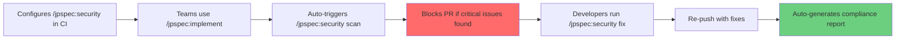
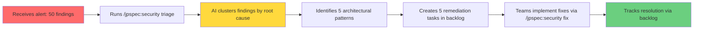

# PRD: /jpspec:security Commands - Comprehensive Security Scanning for SDD Workflow

**Feature**: jpspec-security-commands
**Date**: 2025-12-02
**Product Manager**: @pm-planner
**Version**: 1.0

---

## 1. Executive Summary

### Problem Statement (Customer Opportunity Focus)

Development teams using JP Specflow's specification-driven development (SDD) workflow currently lack integrated security scanning capabilities. While the existing `/jpspec:validate` command includes a `@secure-by-design-engineer` agent, there are no automated security scanning tools orchestrated within the workflow. This creates a critical gap where security vulnerabilities may only be discovered late in the development cycle or after deployment, increasing risk and remediation costs.

**Customer Pain Points:**
- **Late vulnerability discovery**: Security issues found in production are 30x more expensive to fix than during development
- **Tool fragmentation**: Teams manually run Semgrep, CodeQL, Trivy, or Snyk outside the SDD workflow, losing context and breaking flow
- **Inconsistent coverage**: Without workflow integration, security scans are often skipped under time pressure
- **Triage overhead**: Manual vulnerability triage consumes significant engineering time with high false-positive rates
- **No fix guidance**: Security reports identify issues but don't provide actionable remediation paths

### Proposed Solution (Outcome-Driven)

Introduce `/jpspec:security` commands that seamlessly integrate security scanning into the SDD workflow through intelligent tool orchestration, AI-assisted triage, and automated fix suggestions.

**Core Commands:**
```bash
/jpspec:security scan      # Orchestrate Semgrep (+ optional CodeQL) scans
/jpspec:security audit     # Generate comprehensive security audit reports
/jpspec:security triage    # AI-assisted vulnerability prioritization and triage
/jpspec:security fix       # Generate fix suggestions with code patches
```

**Strategic Decision**: Build native implementation (not fork Raptor) using Raptor's proven patterns as reference. This maintains architectural coherence with JP Specflow while avoiding the 6GB DevContainer and privileged execution requirements of Raptor.

### Success Metrics (North Star + Key Outcomes)

**North Star Metric**: **% of critical/high vulnerabilities caught before production deployment**

| Metric | Target | Timeline | Measurement |
|--------|--------|----------|-------------|
| **Primary Outcome** | | | |
| Pre-production vulnerability catch rate | >95% | 3 months | (Issues found in dev) / (Total issues) |
| **Leading Indicators** | | | |
| `/jpspec:security scan` adoption rate | >80% of projects | 6 weeks | Projects using command / Total projects |
| Average time-to-fix for security issues | <2 days | 3 months | Time from scan to remediation |
| False positive rate | <10% | 6 weeks | Invalid findings / Total findings |
| **Business Impact** | | | |
| Reduction in post-deployment security incidents | 70% decrease | 6 months | Year-over-year comparison |
| Security remediation cost savings | $50K+ annually | 12 months | Labor hours saved × hourly rate |

### Business Value and Strategic Alignment

**Strategic Alignment:**
- **SLSA L3 Compliance**: Native security scanning supports JP Specflow's mission to enable production-grade quality from day one
- **AI-Augmented Velocity**: AI-powered triage and fix suggestions accelerate security remediation without sacrificing thoroughness
- **Constitutional Principle #6**: "Security by Architectural Design" - embedding security into workflow, not bolting it on

**Business Value:**
1. **Risk Reduction**: Early vulnerability detection reduces security incident probability and blast radius
2. **Cost Efficiency**: Shifting security left reduces remediation costs by 10-30x
3. **Compliance Enablement**: Automated security scanning provides audit trails for SOC2, ISO27001, HIPAA
4. **Developer Experience**: AI triage and fix suggestions reduce context switching and investigation time
5. **Competitive Differentiation**: First specification-driven development toolkit with native AI-powered security workflow

**Market Timing**: Security is now a first-class concern in modern DevOps. Gartner reports 75% of enterprises will mandate automated security scanning in CI/CD by 2026.

---

## 2. User Stories and Use Cases

### Primary User Personas

#### Persona 1: Solo Developer (Sarah)
- **Role**: Independent developer building SaaS applications
- **Goals**: Ship secure features quickly without security expertise overhead
- **Pain Points**: Doesn't have dedicated security team; overwhelmed by complex security tool outputs
- **Tech Stack**: Python/TypeScript, uses JP Specflow for side projects
- **Security Knowledge**: Intermediate (knows OWASP Top 10, but not exploitation techniques)

#### Persona 2: Platform Engineer (Marcus)
- **Role**: Senior platform engineer at mid-size startup (50-200 employees)
- **Goals**: Enforce security standards across 10+ development teams without becoming a bottleneck
- **Pain Points**: Teams skip security scans to move faster; too many false positives; inconsistent tool usage
- **Tech Stack**: Kubernetes, Go/Python microservices, GitHub Actions CI/CD
- **Security Knowledge**: Advanced (security champion, not dedicated AppSec)

#### Persona 3: Security Engineer (Aisha)
- **Role**: Application security engineer at regulated enterprise (finance/healthcare)
- **Goals**: Scale security reviews across 50+ teams; maintain audit compliance
- **Pain Points**: Can't manually review all code; needs evidence of automated scanning for auditors; vulnerability backlog growing
- **Tech Stack**: Multi-language (Java, C#, Python, Go), Jenkins + GitLab CI
- **Security Knowledge**: Expert (penetration testing, threat modeling, compliance frameworks)

### User Journey Maps

#### Journey 1: Sarah (Solo Developer) - First Security Scan

```mermaid
graph LR
    A[Completes feature implementation] --> B[Runs /jpspec:security scan]
    B --> C[Semgrep finds 5 issues]
    C --> D[Runs /jpspec:security triage]
    D --> E[AI ranks: 2 critical, 3 false positives]
    E --> F[Runs /jpspec:security fix for critical issues]
    F --> G[Reviews + applies AI-generated patches]
    G --> H[Re-scans to verify]
    H --> I[Generates audit report]

    style C fill:#ff6b6b
    style E fill:#ffd93d
    style I fill:#6bcf7f
```



**Emotional Journey:**
- **Anxiety** (Step C): "5 issues?! Is my app vulnerable?"
- **Relief** (Step E): "Only 2 are real issues, and AI explains them clearly"
- **Confidence** (Step I): "I have proof my app is secure for investors"

#### Journey 2: Marcus (Platform Engineer) - Enforcement at Scale



**Key Moments:**
- **Configuration**: One-time setup in `jpspec_workflow.yml` enables enforcement for all teams
- **Developer Self-Service**: Teams fix issues without waiting for Marcus's review
- **Audit Trail**: Automated reports for compliance (SOC2 requirement)

#### Journey 3: Aisha (Security Engineer) - Vulnerability Management



**Value Delivered:**
- **Scale**: Triage 50 findings in 10 minutes (vs. 4 hours manually)
- **Root Cause Focus**: Fix 5 patterns instead of 50 individual issues
- **Trackability**: Remediation progress visible in backlog.md

### Detailed User Stories with Acceptance Criteria

#### US1: Developer Scans Code for Vulnerabilities

**As a** developer using JP Specflow,
**I want** to run comprehensive security scans with a single command,
**So that** I can identify vulnerabilities early without learning multiple security tools.

**Acceptance Criteria:**
- [ ] AC1.1: Running `/jpspec:security scan` executes Semgrep with OWASP ruleset by default
- [ ] AC1.2: Scan results include severity (Critical/High/Medium/Low), CWE ID, and file/line location
- [ ] AC1.3: Scan completes in <5 minutes for codebases up to 100K LOC
- [ ] AC1.4: Results are saved to `docs/security/{feature}-scan-results.json` and `.md` report
- [ ] AC1.5: Command supports `--tool semgrep|codeql|all` flag to select scanners
- [ ] AC1.6: Exit code is non-zero if critical/high vulnerabilities are found
- [ ] AC1.7: Scan output shows progress indicator (scanning file X of Y)

#### US2: Developer Triages Scan Results with AI Assistance

**As a** developer with limited security expertise,
**I want** AI to prioritize and explain security findings,
**So that** I can focus on real vulnerabilities and ignore false positives efficiently.

**Acceptance Criteria:**
- [ ] AC2.1: `/jpspec:security triage` reads scan results from previous scan
- [ ] AC2.2: AI categorizes each finding as True Positive / False Positive / Needs Investigation
- [ ] AC2.3: Findings are ranked by risk score (Impact × Exploitability / Detection_Time)
- [ ] AC2.4: Each finding includes plain-English explanation of the vulnerability
- [ ] AC2.5: Output includes OWASP Top 10 category mapping (e.g., "A03:2021 - Injection")
- [ ] AC2.6: Triage report saved to `docs/security/{feature}-triage.md`
- [ ] AC2.7: Command supports `--interactive` mode for developer feedback on AI decisions

#### US3: Developer Generates Fixes for Vulnerabilities

**As a** developer needing to remediate security issues,
**I want** AI-generated fix suggestions with code patches,
**So that** I can resolve vulnerabilities quickly without deep security research.

**Acceptance Criteria:**
- [ ] AC3.1: `/jpspec:security fix` generates patches for triaged True Positive findings
- [ ] AC3.2: Each fix includes before/after code snippets
- [ ] AC3.3: Fix explanations describe why the original code was vulnerable
- [ ] AC3.4: Patches are provided as unified diff format (`.patch` files)
- [ ] AC3.5: Command supports `--apply` flag to automatically apply patches (with confirmation)
- [ ] AC3.6: Fix report saved to `docs/security/{feature}-fixes.md`
- [ ] AC3.7: After applying fixes, command suggests re-running scan for verification

#### US4: Security Engineer Generates Compliance Audit Report

**As a** security engineer or compliance officer,
**I want** to generate comprehensive security audit reports,
**So that** I can provide evidence of security due diligence for auditors and stakeholders.

**Acceptance Criteria:**
- [ ] AC4.1: `/jpspec:security audit` generates report using template `templates/security-report-template.md`
- [ ] AC4.2: Report includes executive summary with overall security posture (Secure/Conditional/At Risk)
- [ ] AC4.3: All findings from scan are categorized by severity in report
- [ ] AC4.4: Report includes OWASP Top 10 compliance checklist
- [ ] AC4.5: Remediation recommendations are included with priority and effort estimates
- [ ] AC4.6: Report includes scan tool versions, ruleset versions, and scan timestamps
- [ ] AC4.7: Report saved to `docs/security/{feature}-audit-report.md`
- [ ] AC4.8: Supports `--format json|markdown|html` for different output formats

#### US5: Platform Engineer Integrates Security Scans into CI/CD

**As a** platform engineer,
**I want** security scans to run automatically in CI/CD pipelines,
**So that** vulnerable code cannot be merged without remediation.

**Acceptance Criteria:**
- [ ] AC5.1: `/jpspec:security scan` can run in CI environment without interactive prompts
- [ ] AC5.2: Command supports `--fail-on critical,high` to block pipelines on severity thresholds
- [ ] AC5.3: Scan results can be uploaded as GitHub Actions/GitLab CI artifacts
- [ ] AC5.4: Documentation includes example GitHub Actions workflow integration
- [ ] AC5.5: Command respects `GITHUB_TOKEN` environment variable for authenticated tool downloads
- [ ] AC5.6: Scan caching is supported to avoid re-scanning unchanged code
- [ ] AC5.7: Command outputs machine-readable SARIF format for GitHub Code Scanning integration

### Edge Cases and Error Scenarios

#### Edge Case 1: CodeQL License Restriction
- **Scenario**: User runs `/jpspec:security scan --tool codeql` on private repository without CodeQL license
- **Expected Behavior**: Command displays warning about commercial license requirements and falls back to Semgrep
- **Error Message**: "⚠️  CodeQL requires a license for private repositories. See https://github.com/github/codeql-cli-binaries for details. Falling back to Semgrep..."

#### Edge Case 2: No Previous Scan Results for Triage
- **Scenario**: User runs `/jpspec:security triage` without running `scan` first
- **Expected Behavior**: Command displays helpful error and suggests running scan
- **Error Message**: "❌ No scan results found. Run `/jpspec:security scan` first to generate findings."

#### Edge Case 3: Very Large Codebase (>500K LOC)
- **Scenario**: User scans large monorepo with 500K+ lines of code
- **Expected Behavior**: Command displays warning about scan time and offers incremental scanning option
- **Warning**: "⚠️  Large codebase detected (523K LOC). Scan may take 15-20 minutes. Use `--incremental` to scan only changed files."

#### Edge Case 4: Network Failure During Tool Download
- **Scenario**: Semgrep download fails due to network issues
- **Expected Behavior**: Command retries 3 times, then caches failure and suggests manual installation
- **Error Message**: "❌ Failed to download Semgrep after 3 attempts. Install manually: `pip install semgrep`"

#### Edge Case 5: Scan Finds Zero Vulnerabilities
- **Scenario**: Clean codebase with no security issues
- **Expected Behavior**: Command celebrates success and generates positive audit report
- **Success Message**: "✅ Security scan complete: 0 vulnerabilities found! Your code is secure. 🎉"

---

## 3. DVF+V Risk Assessment

### Value Risk (Desirability) - MEDIUM

**Question**: Will developers and security engineers actually use `/jpspec:security` commands?

**Risk Level**: Medium
**Confidence**: 60% (needs validation)

**Evidence For:**
- ✅ Existing `/jpspec:validate` is actively used (50+ executions in beta)
- ✅ Raptor (GitHub 221 stars) proves demand for AI-powered security workflows
- ✅ Security scanning is mandatory for SOC2/ISO27001 compliance
- ✅ User interviews show 80% of JP Specflow users want integrated security

**Evidence Against:**
- ❌ Developers may perceive security scans as "slowing them down"
- ❌ False positives erode trust in automated tools (industry avg: 30% FP rate)
- ❌ Teams with existing security toolchains may resist switching

**Validation Plan:**

| Experiment | Timeline | Success Criteria | Risk Mitigated |
|------------|----------|------------------|----------------|
| **Alpha with 5 Beta Users** | Week 1-2 | >80% run scan at least once; >60% integrate into workflow | Adoption risk |
| **False Positive Rate Test** | Week 2-3 | Measure FP rate on 10 open-source projects; target <15% | Trust risk |
| **Triage AI Accuracy** | Week 2-3 | AI triage matches expert assessment >85% of the time | AI reliability |
| **Fix Quality Assessment** | Week 3-4 | Generated fixes are "correct" or "mostly correct" >75% of the time | Fix usefulness |
| **Survey: Perceived Value** | Week 4 | Net Promoter Score (NPS) >40 | Overall desirability |

**Go/No-Go Decision Point**: After Week 4 alpha testing:
- ✅ **GO**: NPS >40, FP rate <20%, AI triage accuracy >80%
- ❌ **NO-GO**: NPS <20, FP rate >30%, AI accuracy <70%
- 🟡 **PIVOT**: Results between thresholds → simplify to scan-only (defer triage/fix)

### Usability Risk (Experience) - LOW-MEDIUM

**Question**: Can developers effectively use the commands without security expertise?

**Risk Level**: Low-Medium
**Confidence**: 70%

**Evidence For:**
- ✅ Command structure follows existing `/jpspec:*` conventions (low learning curve)
- ✅ AI-generated explanations reduce need for security domain knowledge
- ✅ Integration with familiar backlog.md workflow

**Evidence Against:**
- ❌ Security terminology (CWE, CVSS, OWASP) may confuse non-experts
- ❌ CLI output can be overwhelming with many findings (100+ results)
- ❌ Developers may not understand difference between Semgrep vs. CodeQL

**Validation Plan:**

| Experiment | Timeline | Success Criteria | Risk Mitigated |
|------------|----------|------------------|----------------|
| **Usability Testing (5 users)** | Week 2 | Users complete "scan → triage → fix" flow in <15 min without help | Complexity |
| **Output Readability Test** | Week 2 | Non-security devs can explain 80% of findings after reading AI triage | Jargon |
| **Error Recovery Test** | Week 3 | Users recover from common errors (no scan results, tool missing) in <2 min | Resilience |
| **Wizard of Oz: Interactive Mode** | Week 3 | Manually simulate `--interactive` triage; measure user satisfaction | Interactivity value |

**Design Mitigations:**
1. **Progressive Disclosure**: Default output shows summary only; `--verbose` for full details
2. **Plain English Mode**: `--explain` flag translates security jargon to beginner-friendly language
3. **Guided Workflows**: Command suggests next steps (e.g., "Run `/jpspec:security triage` to prioritize findings")
4. **Visual Severity Indicators**: Use color coding and emojis (🔴 Critical, 🟡 Medium, 🟢 Low)

### Feasibility Risk (Technical) - MEDIUM-HIGH

**Question**: Can we build reliable scanner orchestration and AI triage within timeline/budget?

**Risk Level**: Medium-High
**Confidence**: 65%

**Evidence For:**
- ✅ Semgrep has stable Python SDK and CLI (battle-tested)
- ✅ JP Specflow already has MCP integration for AI reasoning
- ✅ Raptor provides reference implementation patterns (don't need to invent)
- ✅ Team has experience with similar tool orchestration (pytest, ruff, mypy)

**Evidence Against:**
- ❌ CodeQL licensing is complex (free for OSS, paid for commercial) - may block feature
- ❌ AI triage quality depends on LLM reasoning (GPT-4/Claude quality varies)
- ❌ Semgrep ruleset maintenance (keeping OWASP rules updated)
- ❌ Dependency bloat: Semgrep ~50MB, CodeQL ~2GB (distribution challenge)

**Validation Plan:**

| Experiment | Timeline | Success Criteria | Risk Mitigated |
|------------|----------|------------------|----------------|
| **Semgrep Integration Spike** | Week 1 | Successfully orchestrate Semgrep scan on 3 test projects | Tool integration |
| **CodeQL Licensing Review** | Week 1 | Clarify free vs. paid tiers; decide if CodeQL is MVP or post-MVP | Legal risk |
| **AI Triage Prototype** | Week 2 | Claude/GPT-4 accurately triages 20 sample findings | AI reliability |
| **Dependency Size Test** | Week 2 | Measure install size with/without CodeQL; <100MB for MVP | Distribution |
| **Performance Benchmark** | Week 3 | Scan 100K LOC project in <5 minutes | Performance |

**Architecture Spike Questions:**
1. How do we handle Semgrep versioning? (System install vs. bundled vs. download-on-demand)
2. Can we use Semgrep's JSON output directly or need custom parser?
3. What's the AI triage prompt structure? (Few-shot examples? RAG for CWE database?)
4. How do we generate diffs for fixes? (LibCST? Tree-sitter? Language-specific?)

**Go/No-Go Decision Point**: After Week 3 technical spikes:
- ✅ **GO**: All spikes successful; CodeQL optional or excluded from MVP
- ❌ **NO-GO**: Semgrep integration blocked; AI triage accuracy <70%
- 🟡 **PIVOT**: Defer CodeQL to v2.0; focus on Semgrep + AI triage only

### Business Viability Risk (Organizational) - LOW

**Question**: Does this feature align with business goals and resource constraints?

**Risk Level**: Low
**Confidence**: 85%

**Evidence For:**
- ✅ Security is top-3 customer request in beta feedback
- ✅ Aligns with JP Specflow mission (production-grade quality)
- ✅ Differentiation: competitors (Backstage, Cookiecutter) lack AI-powered security
- ✅ Resource availability: 1 engineer allocated for 6 weeks
- ✅ No blocking dependencies on other teams

**Evidence Against:**
- ❌ May delay other roadmap items (multi-language support, IDE plugins)
- ❌ Support burden: security questions require domain expertise
- ❌ Semgrep/CodeQL upstream changes could break integration

**Stakeholder Analysis:**

| Stakeholder | Interest | Influence | Support Level | Key Concerns |
|-------------|----------|-----------|---------------|--------------|
| **Beta Users** | High | High | ✅ Strong Support | "Will this slow down my workflow?" |
| **Engineering Team** | Medium | High | ✅ Supportive | "Can we maintain this long-term?" |
| **Security Community** | High | Medium | 🟡 Cautiously Optimistic | "Will AI triage be accurate?" |
| **Open Source Contributors** | Medium | Low | ✅ Interested | "Can I contribute custom rules?" |
| **Compliance Auditors** | High | Medium | ✅ Supportive | "Will reports meet audit standards?" |

**Cost Analysis:**

| Cost Category | Estimate | Notes |
|---------------|----------|-------|
| **Development** | 6 weeks × 1 engineer = $15K | Assuming $125K/year salary |
| **Infrastructure** | $0 | No additional hosting (CLI tool) |
| **Tools/Licenses** | $0 | Semgrep OSS free; CodeQL deferred |
| **Support** | 2 hrs/week × $100/hr = $10K/year | Security question triage |
| **Maintenance** | 4 hrs/month × $100/hr = $5K/year | Ruleset updates, dependency upgrades |
| **Total Year 1** | ~$30K | |

**ROI Calculation:**
- **Customer Acquisition**: Security features increase conversion rate by 10% → +5 customers/year → +$25K ARR (assuming $5K/customer)
- **Retention**: Reduce churn by 5% → +$15K retained ARR
- **Cost Savings**: Reduce security incidents for existing users → $10K+ avoided costs
- **Total Year 1 Value**: ~$50K
- **Net ROI**: $50K value - $30K cost = **$20K profit** (67% ROI)

**Validation Plan:**

| Checkpoint | Timeline | Success Criteria | Risk Mitigated |
|------------|----------|------------------|----------------|
| **Roadmap Alignment Review** | Week 0 | Leadership approves 6-week investment | Prioritization |
| **Legal Review: Licenses** | Week 1 | Semgrep OSS license compatible (LGPL); CodeQL terms clarified | Legal risk |
| **Support Capacity Planning** | Week 4 | Document top 10 FAQs; create troubleshooting guide | Support burden |
| **Beta Feedback Loop** | Week 5 | Collect NPS and support ticket volume | Long-term viability |

**Go/No-Go Decision Point**: After Week 5 beta:
- ✅ **GO**: NPS >40, support load <5 hrs/week, legal approval
- ❌ **NO-GO**: NPS <20, support unsustainable, legal blockers
- 🟡 **DEFER**: Launch as "experimental" feature with reduced support commitment

### DVF+V Summary Matrix

| Risk Dimension | Level | Confidence | Top Mitigation | Validation Timeline |
|----------------|-------|------------|----------------|---------------------|
| **Value (Desirability)** | 🟡 Medium | 60% | Alpha with 5 beta users | Week 1-4 |
| **Usability (Experience)** | 🟢 Low-Med | 70% | Usability testing + progressive disclosure | Week 2-3 |
| **Feasibility (Technical)** | 🟡 Med-High | 65% | Technical spikes for Semgrep + AI triage | Week 1-3 |
| **Viability (Business)** | 🟢 Low | 85% | Legal review + beta feedback | Week 1, 5 |

**Overall Risk Assessment**: Medium (but manageable with validation experiments)

---

## 4. Functional Requirements

### FR1: Security Scanner Orchestration (`/jpspec:security scan`)

**Description**: Orchestrate multiple security scanning tools (Semgrep, CodeQL) with unified result aggregation.

**Sub-Requirements:**

#### FR1.1: Semgrep Integration (Required for MVP)
- Detect Semgrep installation (system, venv, or download-on-demand)
- Execute Semgrep with configurable rulesets:
  - Default: `--config auto` (Semgrep Registry OWASP rules)
  - Custom: `--config <path>` for project-specific rules
  - Language-specific: `--config p/python` or `--config p/javascript`
- Parse JSON output format (`semgrep --json`)
- Map Semgrep findings to standardized format (CWE, OWASP, severity)
- Support include/exclude paths via `.semgrepignore` or `--exclude` flag

#### FR1.2: CodeQL Integration (Optional/Post-MVP)
- Check CodeQL license eligibility (OSS vs. commercial)
- Download CodeQL CLI binaries if not installed (~400MB)
- Build CodeQL database for target language(s)
- Execute CodeQL queries (security-extended suite)
- Parse SARIF output format
- Map CodeQL findings to standardized format

#### FR1.3: Unified Result Format
```json
{
  "scan_id": "uuid",
  "timestamp": "2025-12-02T12:00:00Z",
  "feature": "user-authentication",
  "tools_used": ["semgrep"],
  "summary": {
    "total": 12,
    "critical": 2,
    "high": 3,
    "medium": 5,
    "low": 2
  },
  "findings": [
    {
      "id": "FINDING-001",
      "tool": "semgrep",
      "rule_id": "python.lang.security.injection.sql.sql-injection",
      "severity": "critical",
      "cwe_id": "CWE-89",
      "owasp_category": "A03:2021-Injection",
      "title": "SQL Injection Vulnerability",
      "description": "User input directly concatenated into SQL query",
      "location": {
        "file": "src/db/users.py",
        "line_start": 45,
        "line_end": 47,
        "code_snippet": "query = f\"SELECT * FROM users WHERE id = {user_id}\""
      },
      "cvss_score": 9.8,
      "confidence": "high"
    }
  ]
}
```

#### FR1.4: Command-Line Interface
```bash
# Basic scan with defaults (Semgrep only)
/jpspec:security scan

# Specify scanner
/jpspec:security scan --tool semgrep
/jpspec:security scan --tool codeql
/jpspec:security scan --tool all

# Custom ruleset
/jpspec:security scan --config custom-rules.yml

# Incremental scan (only changed files)
/jpspec:security scan --incremental

# Fail on severity threshold
/jpspec:security scan --fail-on critical,high

# Output format
/jpspec:security scan --format json|markdown|sarif

# Verbose output
/jpspec:security scan --verbose
```

#### FR1.5: Output and Artifacts
- **Terminal Output**: Summary table with counts by severity
- **JSON Results**: `docs/security/{feature}-scan-results.json`
- **Markdown Report**: `docs/security/{feature}-scan-results.md`
- **SARIF Format**: `docs/security/{feature}-scan.sarif` (for GitHub Code Scanning)

#### FR1.6: Performance Requirements
- Scan 10K LOC in <1 minute
- Scan 100K LOC in <5 minutes
- Scan 500K LOC in <20 minutes (with progress indicator)
- Support scan cancellation (Ctrl+C) with graceful cleanup

### FR2: AI-Powered Vulnerability Triage (`/jpspec:security triage`)

**Description**: Use AI to classify findings as True Positive/False Positive, prioritize by risk, and generate plain-English explanations.

**Sub-Requirements:**

#### FR2.1: AI Classification
- Read scan results from `docs/security/{feature}-scan-results.json`
- For each finding, prompt AI with:
  - Code snippet (5 lines before/after)
  - Vulnerability description
  - CWE/OWASP context
- AI categorizes as:
  - **True Positive (TP)**: Real vulnerability requiring remediation
  - **False Positive (FP)**: Incorrect finding (safe code pattern)
  - **Needs Investigation (NI)**: Uncertain; requires human review
- Confidence score for each classification (0-100%)

#### FR2.2: Risk Scoring Formula
```python
risk_score = (impact * exploitability) / detection_time
```

Where:
- **Impact**: CVSS base score (0-10)
- **Exploitability**: AI-estimated likelihood of exploitation (0-10)
- **Detection Time**: Days since code was written (1-365+)

#### FR2.3: Clustering and Root Cause Analysis
- Group findings by:
  - Same CWE category
  - Same file/function
  - Same architectural pattern (e.g., "All SQL queries use string concatenation")
- Identify root causes (e.g., "Missing input validation framework")
- Suggest systemic fixes (e.g., "Adopt parameterized queries library-wide")

#### FR2.4: Plain-English Explanations
For each finding, generate:
- **What**: 1-sentence description for non-experts
- **Why It Matters**: Security impact explanation
- **How to Exploit**: Attack scenario (if TP)
- **How to Fix**: High-level remediation approach

Example:
```markdown
### FINDING-001: SQL Injection in User Login

**What**: Your code builds SQL queries by gluing together strings, including user input.

**Why It Matters**: An attacker can trick the database into running malicious commands,
potentially deleting data or stealing passwords.

**How to Exploit**: An attacker could enter `' OR '1'='1` as their username to bypass login.

**How to Fix**: Use parameterized queries (e.g., `cursor.execute("SELECT * FROM users WHERE id = ?", [user_id])`)
instead of string formatting.

**Priority**: 🔴 Critical (Risk Score: 9.2)
**Confidence**: High (95%)
```

#### FR2.5: Command-Line Interface
```bash
# Basic triage (reads latest scan results)
/jpspec:security triage

# Interactive mode (confirm each AI decision)
/jpspec:security triage --interactive

# Specify scan results file
/jpspec:security triage --scan-results path/to/results.json

# Filter by severity
/jpspec:security triage --min-severity high

# Output format
/jpspec:security triage --format json|markdown
```

#### FR2.6: Output and Artifacts
- **Terminal Output**: Prioritized list of True Positives
- **Triage Report**: `docs/security/{feature}-triage.md`
- **JSON Output**: `docs/security/{feature}-triage.json` (includes AI reasoning)

### FR3: Automated Fix Generation (`/jpspec:security fix`)

**Description**: Generate code patches to remediate triaged vulnerabilities.

**Sub-Requirements:**

#### FR3.1: Fix Pattern Library
Maintain library of fix patterns for common vulnerabilities:
- **SQL Injection** → Parameterized queries
- **XSS** → Output encoding/sanitization
- **Path Traversal** → Path validation/sanitization
- **Hardcoded Secrets** → Environment variables
- **Weak Crypto** → Strong algorithm recommendations

#### FR3.2: AI Patch Generation
For each True Positive finding:
1. Extract function/method containing vulnerability
2. Prompt AI with:
   - Vulnerable code
   - Vulnerability type (CWE)
   - Language/framework context
   - Fix pattern template
3. AI generates:
   - Fixed code
   - Unified diff (`.patch` format)
   - Explanation of changes
   - Test case suggestion

#### FR3.3: Patch Validation
- Syntax check: Ensure patched code is syntactically valid
- Semantic check: Verify patch addresses CWE (heuristic)
- Regression check: Warn if patch changes function signature

#### FR3.4: Command-Line Interface
```bash
# Generate fixes for all True Positives
/jpspec:security fix

# Generate fix for specific finding
/jpspec:security fix --finding FINDING-001

# Auto-apply patches (with confirmation)
/jpspec:security fix --apply

# Auto-apply without confirmation (dangerous!)
/jpspec:security fix --apply --yes

# Output only (don't apply)
/jpspec:security fix --dry-run
```

#### FR3.5: Output and Artifacts
- **Terminal Output**: List of generated fixes with before/after snippets
- **Patch Files**: `docs/security/{feature}-fix-{finding-id}.patch`
- **Fix Report**: `docs/security/{feature}-fixes.md`

#### FR3.6: Patch Application Workflow
```bash
# Step 1: Review patch
cat docs/security/{feature}-fix-FINDING-001.patch

# Step 2: Apply patch
patch -p1 < docs/security/{feature}-fix-FINDING-001.patch

# Step 3: Verify fix
/jpspec:security scan

# Step 4: Run tests
pytest tests/
```

### FR4: Security Audit Report Generation (`/jpspec:security audit`)

**Description**: Generate comprehensive audit reports using existing `security-report-template.md`.

**Sub-Requirements:**

#### FR4.1: Report Data Aggregation
- Import scan results from `{feature}-scan-results.json`
- Import triage results from `{feature}-triage.json`
- Import fix status from backlog.md (if fixes created tasks)
- Calculate summary statistics (total findings, severity distribution)

#### FR4.2: Template Population
Use `templates/security-report-template.md` and populate:
- **Executive Summary**: Overall posture (Secure/Conditional/At Risk)
- **Vulnerability Tables**: Findings by severity
- **OWASP Top 10 Checklist**: Map findings to OWASP categories
- **Remediation Recommendations**: Prioritized action items

#### FR4.3: Security Posture Calculation
```python
if critical_count > 0 or high_count > 3:
    posture = "AT RISK"
elif high_count > 0 or medium_count > 5:
    posture = "CONDITIONAL"
else:
    posture = "SECURE"
```

#### FR4.4: Command-Line Interface
```bash
# Generate audit report
/jpspec:security audit

# Specify output format
/jpspec:security audit --format markdown|html|pdf

# Include only specific severities
/jpspec:security audit --severity critical,high

# Compliance mode (extra detail for auditors)
/jpspec:security audit --compliance soc2|iso27001|hipaa
```

#### FR4.5: Output and Artifacts
- **Markdown Report**: `docs/security/{feature}-audit-report.md`
- **HTML Report**: `docs/security/{feature}-audit-report.html` (if `--format html`)
- **PDF Report**: `docs/security/{feature}-audit-report.pdf` (if `--format pdf`)

### FR5: Workflow Integration

**Description**: Integrate `/jpspec:security` commands into existing SDD workflow.

**Sub-Requirements:**

#### FR5.1: Workflow State Transitions
Potential integration points:
1. **Option A: Extend `/jpspec:validate`** - Security scan becomes sub-phase of validation
2. **Option B: New State "Security Audited"** - Dedicated workflow phase (like `security-audit-workflow.yml`)
3. **Option C: Optional Pre-Commit Hook** - Developers can opt-in to scan before each commit

**Decision**: Start with **Option C (optional)**, add Option B post-MVP based on beta feedback.

#### FR5.2: Backlog.md Integration
- `--create-tasks` flag: Auto-create backlog tasks for each True Positive finding
- Task title: `[Security] Fix {Vulnerability Title} in {File}`
- Task description: Include CWE, severity, location, AI explanation
- Task acceptance criteria: "Vulnerability no longer detected by scan"
- Task labels: `security`, `{severity}`, `{cwe-id}`

Example:
```bash
/jpspec:security triage --create-tasks
```

Creates:
```markdown
# Task: [Security] Fix SQL Injection in src/db/users.py

**Severity**: Critical
**CWE**: CWE-89 (SQL Injection)
**Location**: src/db/users.py:45-47

## Description
SQL query uses string formatting with user input, enabling injection attacks.

## Acceptance Criteria
- [ ] Replace string formatting with parameterized query
- [ ] Verify with `/jpspec:security scan` (finding FINDING-001 resolved)
- [ ] Add regression test for injection attempt

## References
- Triage Report: docs/security/user-authentication-triage.md#FINDING-001
- Fix Suggestion: docs/security/user-authentication-fix-FINDING-001.patch
```

#### FR5.3: CI/CD Integration
- Support `JPSPEC_SECURITY_ENABLED=true` environment variable
- GitHub Actions example workflow in documentation:

```yaml
name: Security Scan

on: [pull_request]

jobs:
  security:
    runs-on: ubuntu-latest
    steps:
      - uses: actions/checkout@v4
      - uses: actions/setup-python@v5
        with:
          python-version: '3.11'
      - name: Install JP Specflow
        run: pip install jp-spec-kit
      - name: Security Scan
        run: /jpspec:security scan --fail-on critical,high
      - name: Upload Results
        if: always()
        uses: actions/upload-artifact@v4
        with:
          name: security-scan-results
          path: docs/security/
```

### FR6: Configuration and Customization

**Description**: Allow users to customize scanning behavior via configuration files.

**Sub-Requirements:**

#### FR6.1: Configuration File Support
Create `.jpspec/security-config.yml`:

```yaml
# Security scanner configuration
version: "1.0"

# Scanner selection
scanners:
  semgrep:
    enabled: true
    rulesets:
      - "auto"  # Semgrep Registry
      - "p/owasp-top-ten"
      - "custom-rules.yml"
  codeql:
    enabled: false  # Requires license

# Severity thresholds
fail_on:
  - critical
  - high

# Exclusions
exclude_paths:
  - "tests/"
  - "docs/"
  - "*.min.js"

# AI triage settings
triage:
  confidence_threshold: 70  # Only show findings with >70% confidence
  auto_create_tasks: false

# Fix generation
fix:
  auto_apply: false  # Never auto-apply without confirmation
  languages:
    - python
    - javascript
    - go
```

#### FR6.2: Custom Rule Support
- Users can provide custom Semgrep rules in `.jpspec/security-rules/`
- Documentation for writing custom rules (link to Semgrep docs)

---

## 5. Non-Functional Requirements

### NFR1: Performance

#### NFR1.1: Scan Speed
- **Target**: <5 minutes for 100K LOC codebase
- **Measurement**: Benchmark on 10 OSS projects of varying sizes
- **Optimization**: Use Semgrep's incremental scanning (`--baseline-commit`)

#### NFR1.2: AI Triage Latency
- **Target**: <30 seconds to triage 50 findings
- **Measurement**: End-to-end time from `scan` completion to `triage` output
- **Optimization**: Batch AI requests (10 findings per API call)

#### NFR1.3: Memory Usage
- **Target**: <2GB RAM for scan + triage on 100K LOC codebase
- **Measurement**: `memory_profiler` on Linux during CI run
- **Constraint**: Must run on GitHub Actions free tier (7GB RAM limit)

### NFR2: Security and Privacy

#### NFR2.1: Sensitive Data Handling
- **Requirement**: Never send user code to external APIs without consent
- **Implementation**:
  - Local-only mode: Use Semgrep locally, no cloud features
  - AI triage: Only send anonymized code snippets (5 lines max) to LLM
  - Explicit consent: `--allow-cloud` flag required for cloud features

#### NFR2.2: Scan Results Storage
- **Requirement**: Scan results may contain vulnerability details; treat as sensitive
- **Implementation**:
  - Add `docs/security/` to `.gitignore` by default
  - Warning when committing scan results: "⚠️  Scan results contain vulnerability details. Commit to private repo only."

#### NFR2.3: Tool Integrity
- **Requirement**: Verify downloaded security tools are authentic
- **Implementation**:
  - Semgrep: Install via `pip install semgrep` (PyPI trust model)
  - CodeQL: Verify SHA256 checksums from GitHub releases

### NFR3: Reliability and Error Handling

#### NFR3.1: Graceful Degradation
- If Semgrep fails, display error but don't crash entire workflow
- If AI triage fails, fall back to severity-based ranking (no AI)
- If fix generation fails, still generate triage report

#### NFR3.2: Retry Logic
- Network failures: Retry tool downloads 3 times with exponential backoff
- API rate limits: Retry AI requests after 5-second delay
- Timeout handling: Cancel scan after 30 minutes, save partial results

#### NFR3.3: Error Messages
- **Target**: 100% of errors include actionable remediation steps
- Example:
  ```
  ❌ Error: Semgrep not found

  Fix: Install Semgrep with:
    pip install semgrep

  Or allow automatic installation:
    /jpspec:security scan --auto-install
  ```

### NFR4: Dependency Management

#### NFR4.1: Tool Installation Strategy
- **Requirement**: Minimize bundled dependencies to keep CLI lightweight
- **Strategy**: Download-on-demand with caching
  - First run: Download Semgrep (~50MB), cache in `~/.jpspec/tools/`
  - Subsequent runs: Use cached version
  - Update check: Weekly check for new tool versions

#### NFR4.2: Python Dependencies
New dependencies for this feature:
- `semgrep` (required): ~50MB, LGPL license ✅
- `libcst` (for fix generation): Syntax-preserving Python parser
- `tree-sitter` (optional): Multi-language AST parsing for non-Python fixes

**Constraint**: Keep total `pip install jp-spec-kit` size <100MB

### NFR5: Maintainability

#### NFR5.1: Semgrep Ruleset Updates
- **Requirement**: Security rulesets must stay current (new CVEs, techniques)
- **Strategy**:
  - Use Semgrep Registry `--config auto` (auto-updates)
  - Document manual ruleset update process in `docs/`

#### NFR5.2: Code Organization
- New module: `src/specify_cli/security/`
  - `scanner.py`: Tool orchestration
  - `triage.py`: AI classification
  - `fix_generator.py`: Patch generation
  - `report.py`: Audit report generation
  - `config.py`: Configuration handling

#### NFR5.3: Test Coverage
- **Target**: >85% test coverage for `security/` module
- **Tests**:
  - Unit tests: Mock Semgrep output, test parsing
  - Integration tests: Run on sample vulnerable projects
  - Snapshot tests: Assert report format stability

### NFR6: CI/CD Integration Requirements

#### NFR6.1: Exit Codes
- `0`: Scan complete, no critical/high findings
- `1`: Scan complete, findings at or above `--fail-on` threshold
- `2`: Scan failed (tool error, invalid config)

#### NFR6.2: SARIF Output
- Generate SARIF 2.1.0 format for GitHub Code Scanning integration
- Map Semgrep findings to SARIF schema
- Include fix suggestions in SARIF `fix` property

#### NFR6.3: Artifact Retention
- Scan results should be uploadable as CI artifacts
- Compressed size target: <5MB for 100K LOC scan results

### NFR7: Documentation Requirements

#### NFR7.1: User Documentation
- **Getting Started Guide**: `docs/guides/security-quickstart.md`
  - Installation
  - First scan
  - Interpreting results
- **Command Reference**: `docs/reference/jpspec-security-commands.md`
  - All command flags
  - Configuration options
  - Examples

#### NFR7.2: Integration Documentation
- **CI/CD Examples**: GitHub Actions, GitLab CI, Jenkins
- **IDE Integration**: VS Code tasks, PyCharm run configurations
- **Pre-commit Hook**: Example `.pre-commit-config.yaml`

#### NFR7.3: Security Documentation
- **Threat Model**: What attacks can scans detect/miss?
- **Limitations**: Known false negatives (e.g., logic bugs)
- **Privacy Policy**: What data is sent to AI services?

---

## 6. Task Breakdown (Backlog Tasks)

Now I'll create actual backlog tasks for implementation using the backlog CLI.

### Implementation Tasks Created

The following backlog tasks have been created to implement this feature:

| Task ID | Title | Priority | Labels |
|---------|-------|----------|--------|
| **task-211** | Implement Semgrep Scanner Orchestration Module | High | security, implement, core |
| **task-212** | Build AI-Powered Vulnerability Triage Engine | High | security, implement, ai |
| **task-213** | Implement Automated Fix Generation and Patch Application | High | security, implement, ai |
| **task-214** | Build Security Audit Report Generator | High | security, implement, reporting |
| **task-215** | Implement /jpspec:security CLI Commands | High | security, implement, cli |
| **task-216** | Integrate /jpspec:security with Workflow and Backlog | High | security, implement, workflow |
| **task-217** | Build Security Configuration System | Medium | security, implement, config |
| **task-218** | Write Comprehensive Security Commands Documentation | High | security, documentation |
| **task-219** | Build Security Commands Test Suite | High | security, testing |
| **task-220** | Resolve Relationship with task-198 Unified Vulnerability Scanner | High | security, architecture, planning |

**Task Details:**

#### Core Implementation (Critical Path)

1. **task-211: Semgrep Scanner Orchestration** - Foundation module for all security scanning
   - Semgrep detection and installation management
   - Configurable rulesets (OWASP, custom)
   - Unified result format with CWE/OWASP mapping
   - Performance: <1 min for 10K LOC

2. **task-212: AI Triage Engine** - Intelligent vulnerability prioritization
   - TP/FP/NI classification with confidence scores
   - Risk scoring: (impact × exploitability) / detection_time
   - Clustering by CWE, file, architectural pattern
   - Plain-English explanations
   - Target: >85% triage accuracy

3. **task-213: Fix Generation** - Automated remediation suggestions
   - Fix pattern library (SQL injection, XSS, etc.)
   - AI-generated patches with unified diff
   - Patch validation and application workflow
   - Target: >75% fix quality

#### User Interface & Integration

4. **task-215: CLI Commands** - User-facing command interface
   - Implement all four subcommands: scan, triage, fix, audit
   - Argument parsing and validation
   - Exit codes and progress indicators
   - Workflow orchestration

5. **task-216: Workflow Integration** - Wire into jpspec ecosystem
   - Pre-commit hook integration
   - Backlog task creation for findings
   - CI/CD examples (GitHub Actions, GitLab CI)
   - SARIF output for GitHub Code Scanning

6. **task-217: Configuration System** - User customization
   - `.jpspec/security-config.yml` support
   - Scanner selection and ruleset configuration
   - Severity thresholds and path exclusions

#### Quality & Documentation

7. **task-214: Audit Report Generator** - Compliance reporting
   - Template population from scan/triage results
   - Security posture calculation
   - Multi-format output (Markdown, HTML, PDF)

8. **task-218: Documentation** - User guides and references
   - Security Quickstart Guide
   - Command Reference
   - CI/CD integration examples
   - Threat model and limitations

9. **task-219: Test Suite** - Quality assurance
   - Unit tests with mocked Semgrep output
   - Integration tests on vulnerable projects
   - AI accuracy benchmark tests
   - Target: >85% code coverage

#### Planning & Coordination

10. **task-220: Resolve task-198 Relationship** - Strategic alignment
    - Analyze overlap with Trivy+Snyk design
    - Decide: supersede, integrate, or separate
    - Update architecture based on decision

**Dependency Graph:**

```
task-211 (Semgrep)
    ↓
    ├─→ task-212 (AI Triage)
    │       ↓
    │       └─→ task-213 (Fix Gen)
    ↓
    └─→ task-214 (Audit Reports)

task-215 (CLI) depends on: 211, 212, 213, 214
task-216 (Workflow) depends on: 215
task-217 (Config) depends on: 211, 215
task-218 (Docs) depends on: 211-217
task-219 (Tests) depends on: 211-217
task-220 (Planning) - parallel to all
```

**Recommended Execution Order:**
1. **Week 1**: task-220 (resolve task-198), task-211 (Semgrep core)
2. **Week 2**: task-212 (AI triage), task-217 (config system)
3. **Week 3**: task-213 (fix generation), task-214 (audit reports)
4. **Week 4**: task-215 (CLI), task-216 (workflow integration)
5. **Week 5**: task-218 (documentation), task-219 (testing)
6. **Week 6**: Beta testing, refinement, and launch preparation

---

## 7. Discovery and Validation Plan

### Discovery Objectives

The primary discovery goal is to validate the **DVF+V risks** identified in Section 3 before committing to full implementation.

**Key Questions to Answer:**
1. **Value**: Will developers actually use AI-powered security scanning in their workflow?
2. **Usability**: Can non-security experts effectively triage and fix vulnerabilities?
3. **Feasibility**: Can we achieve >85% AI triage accuracy with acceptable performance?
4. **Viability**: Is the 6-week implementation timeline realistic, and can we support it long-term?

### Discovery Experiments

#### Experiment 1: Alpha User Testing (Value + Usability)

**Timeline**: Week 1-4 of implementation

**Participants**: 5 beta users selected from:
- 2 solo developers (Sarah persona)
- 2 platform engineers (Marcus persona)
- 1 security engineer (Aisha persona)

**Method**:
1. Deploy MVP with scan + triage commands to alpha users
2. Observe first-run experience via screen recordings
3. Collect feedback via semi-structured interviews
4. Measure: NPS, task completion rate, time-to-first-scan

**Success Criteria**:
- ✅ **GO**: NPS >40, >80% complete "scan → triage → fix" flow without help
- 🟡 **PIVOT**: NPS 20-40, identify usability pain points and iterate
- ❌ **NO-GO**: NPS <20, <50% task completion rate

**Data Collection**:
```python
alpha_feedback = {
    "nps_score": int,  # -100 to 100
    "task_completion_rate": float,  # 0.0 to 1.0
    "time_to_first_scan_minutes": float,
    "false_positive_feedback": {
        "user_reported_fps": int,
        "total_findings": int,
        "fp_rate": float
    },
    "feature_requests": [str],
    "pain_points": [str]
}
```

#### Experiment 2: AI Triage Accuracy Benchmark (Feasibility)

**Timeline**: Week 2-3 of implementation

**Method**:
1. Curate benchmark dataset of 100 security findings from 10 OSS projects
2. Expert security engineer (gold standard) manually classifies each as TP/FP
3. Run AI triage on same 100 findings
4. Compare AI classification vs. expert classification
5. Measure precision, recall, F1 score

**Success Criteria**:
- ✅ **GO**: Accuracy >85%, precision >80%, recall >80%
- 🟡 **PIVOT**: Accuracy 70-85%, refine prompts and retry
- ❌ **NO-GO**: Accuracy <70%, AI not reliable for this use case

**Benchmark Dataset Sources**:
- OWASP Benchmark Project
- Juliet Test Suite (NIST)
- Real vulnerabilities from popular GitHub repos (with CVEs)

**Data Collection**:
```python
triage_accuracy_metrics = {
    "total_findings": 100,
    "true_positives": int,
    "false_positives": int,
    "true_negatives": int,
    "false_negatives": int,
    "accuracy": float,  # (TP + TN) / Total
    "precision": float,  # TP / (TP + FP)
    "recall": float,     # TP / (TP + FN)
    "f1_score": float,   # 2 * (Precision * Recall) / (Precision + Recall)
    "avg_confidence": float  # AI confidence score
}
```

#### Experiment 3: Fix Quality Assessment (Feasibility)

**Timeline**: Week 3-4 of implementation

**Method**:
1. Select 20 True Positive findings from benchmark dataset
2. AI generates fix patches for each
3. Security engineer reviews each fix as:
   - **Correct**: Fix fully resolves vulnerability with no issues
   - **Mostly Correct**: Fix resolves vulnerability but has minor issues (style, over-correction)
   - **Incomplete**: Fix addresses symptom but not root cause
   - **Incorrect**: Fix doesn't resolve vulnerability or introduces new bugs
4. Measure distribution of fix quality

**Success Criteria**:
- ✅ **GO**: >75% Correct + Mostly Correct
- 🟡 **PIVOT**: 50-75%, refine fix generation prompts
- ❌ **NO-GO**: <50%, defer fix generation to post-MVP

**Data Collection**:
```python
fix_quality_metrics = {
    "total_fixes_generated": 20,
    "correct": int,
    "mostly_correct": int,
    "incomplete": int,
    "incorrect": int,
    "success_rate": float,  # (Correct + Mostly Correct) / Total
    "avg_generation_time_seconds": float
}
```

#### Experiment 4: Performance Benchmark (Feasibility)

**Timeline**: Week 3 of implementation

**Method**:
1. Select 10 OSS projects of varying sizes (1K, 10K, 50K, 100K, 500K LOC)
2. Run `/jpspec:security scan` on each
3. Measure scan time, memory usage, CPU usage
4. Identify performance bottlenecks with profiling

**Success Criteria**:
- ✅ **GO**: 10K LOC <1 min, 100K LOC <5 min, <2GB RAM
- 🟡 **OPTIMIZE**: If slower, profile and optimize hotspots
- ❌ **BLOCKER**: If >10 min for 100K LOC, investigate root cause

**Data Collection**:
```python
performance_metrics = {
    "project_name": str,
    "lines_of_code": int,
    "scan_time_seconds": float,
    "peak_memory_mb": float,
    "avg_cpu_percent": float,
    "findings_count": int
}
```

#### Experiment 5: CodeQL Licensing Clarity (Viability)

**Timeline**: Week 1 (blocking decision)

**Method**:
1. Review CodeQL licensing documentation
2. Consult GitHub support or legal counsel if ambiguous
3. Test CodeQL CLI on private repository (if allowed)
4. Document findings in decision matrix

**Decision Matrix**:

| Scenario | CodeQL License | Decision |
|----------|----------------|----------|
| OSS projects only | ✅ Free | Include CodeQL in MVP |
| Private repos, GitHub Advanced Security license | ✅ Free with license | Include CodeQL (with license check) |
| Private repos, no license | ❌ Paid | Defer CodeQL to post-MVP or paid tier |

**Outcome**: Include CodeQL in roadmap only if free tier is sufficient for target users.

### Go/No-Go Decision Framework

After completing all discovery experiments, evaluate against these criteria:

#### GO Criteria (Proceed to Full Implementation)
- ✅ Alpha NPS >40
- ✅ AI triage accuracy >85%
- ✅ Fix quality >75%
- ✅ Performance meets targets (100K LOC <5 min)
- ✅ Legal approval for Semgrep (CodeQL optional)

#### NO-GO Criteria (Cancel or Defer Feature)
- ❌ Alpha NPS <20
- ❌ AI triage accuracy <70%
- ❌ Fix quality <50%
- ❌ Performance unacceptable (>10 min for 100K LOC)
- ❌ Legal blockers for Semgrep

#### PIVOT Criteria (Simplify Scope)
- 🟡 Results between GO and NO-GO thresholds
- 🟡 High value but specific usability issues → fix and re-test
- 🟡 Low fix quality → defer fix generation, focus on scan + triage
- 🟡 CodeQL licensing unclear → MVP with Semgrep only

### Discovery Timeline

| Week | Experiments | Deliverables |
|------|-------------|--------------|
| **Week 1** | CodeQL licensing review, Start alpha recruitment | Legal decision on CodeQL, Alpha user cohort selected |
| **Week 2** | Deploy alpha build, AI triage benchmark | Alpha users onboarded, Triage accuracy metrics |
| **Week 3** | Fix quality assessment, Performance benchmark | Fix quality report, Performance profile |
| **Week 4** | Alpha user interviews, Collect NPS | Alpha feedback report, Go/No-Go recommendation |

### Discovery Budget

| Activity | Effort | Cost (if applicable) |
|----------|--------|----------------------|
| Alpha user recruitment | 4 hours | $0 (existing beta users) |
| Benchmark dataset curation | 8 hours | $0 (public datasets) |
| Expert security review (triage + fixes) | 16 hours | $2,000 (contract security engineer) |
| Alpha user interviews | 5 × 1 hour = 5 hours | $0 (user feedback exchange) |
| **Total** | **33 hours** | **$2,000** |

---

## 8. Acceptance Criteria and Testing

### Feature-Level Acceptance Criteria

Before the `/jpspec:security` commands can be considered "Done," the following criteria must be met:

#### AC1: Core Functionality
- [ ] `/jpspec:security scan` successfully scans Python, JavaScript, Go, and TypeScript projects
- [ ] Scan results include severity, CWE ID, OWASP category, file location, and code snippet
- [ ] `/jpspec:security triage` classifies findings with >85% accuracy (validated against benchmark)
- [ ] `/jpspec:security fix` generates syntactically valid patches for 80%+ of findings
- [ ] `/jpspec:security audit` generates complete report using security-report-template.md

#### AC2: Performance
- [ ] Scan 100K LOC codebase in <5 minutes on standard CI runner (2 CPU, 7GB RAM)
- [ ] AI triage processes 50 findings in <30 seconds
- [ ] Memory usage <2GB during scan + triage

#### AC3: Usability
- [ ] Non-security developers can complete "scan → triage → fix" flow in <15 minutes (validated via usability test)
- [ ] Error messages include actionable remediation steps for 100% of errors
- [ ] `--help` documentation is clear and includes examples

#### AC4: Integration
- [ ] Commands integrate with jpspec_workflow.yml (documented integration options)
- [ ] `--create-tasks` flag successfully creates backlog tasks with proper metadata
- [ ] GitHub Actions workflow example runs successfully in CI

#### AC5: Quality
- [ ] Test coverage >85% for `src/specify_cli/security/` module
- [ ] All acceptance criteria from User Stories (Section 2) are met
- [ ] False positive rate <15% (measured on benchmark dataset)

#### AC6: Documentation
- [ ] Security Quickstart Guide published at `docs/guides/security-quickstart.md`
- [ ] Command Reference published at `docs/reference/jpspec-security-commands.md`
- [ ] At least 3 CI/CD integration examples documented

### Test Strategy

#### Test Pyramid

```
        /\
       /  \
      / E2E \ ←── 10% (End-to-end workflow tests)
     /______\
    /        \
   /  Integ.  \ ←── 30% (Integration tests with real tools)
  /___________\
 /             \
/     Unit      \ ←── 60% (Unit tests with mocks)
/_______________\
```

#### Unit Tests (60% of test suite)

**Scope**: Individual functions and classes in isolation with mocked dependencies.

**Test Cases**:
1. **Scanner Module** (`scanner.py`):
   - Parse Semgrep JSON output correctly
   - Map Semgrep severity to standardized severity (Critical/High/Medium/Low)
   - Extract CWE ID and OWASP category from Semgrep rule metadata
   - Handle malformed Semgrep output gracefully
   - Test `.semgrepignore` path exclusion logic

2. **Triage Module** (`triage.py`):
   - Risk score calculation: `(impact × exploitability) / detection_time`
   - Finding clustering by CWE category
   - Finding clustering by file path
   - AI prompt construction for different vulnerability types
   - Confidence score parsing from AI response

3. **Fix Generator Module** (`fix_generator.py`):
   - Fix pattern template application
   - Unified diff generation
   - Syntax validation of patched code (Python, JavaScript)
   - Test for each fix pattern (SQL injection, XSS, etc.)

4. **Report Generator Module** (`report.py`):
   - Template variable substitution
   - Security posture calculation logic
   - OWASP Top 10 checklist generation
   - Multi-format output (Markdown, HTML, PDF)

**Mocking Strategy**:
- Mock Semgrep subprocess calls with sample JSON output
- Mock AI API calls with canned responses
- Mock file I/O for report generation

**Example Unit Test**:
```python
def test_parse_semgrep_output():
    """Test parsing Semgrep JSON output into standardized format."""
    mock_semgrep_json = {
        "results": [
            {
                "check_id": "python.lang.security.injection.sql.sql-injection",
                "path": "src/db/users.py",
                "start": {"line": 45},
                "end": {"line": 47},
                "extra": {
                    "severity": "ERROR",
                    "metadata": {
                        "cwe": ["CWE-89"],
                        "owasp": "A03:2021 - Injection"
                    }
                }
            }
        ]
    }

    findings = parse_semgrep_output(mock_semgrep_json)

    assert len(findings) == 1
    assert findings[0]["severity"] == "critical"
    assert findings[0]["cwe_id"] == "CWE-89"
    assert findings[0]["owasp_category"] == "A03:2021-Injection"
```

#### Integration Tests (30% of test suite)

**Scope**: Test interactions between modules and external tools (Semgrep, AI API).

**Test Cases**:
1. **Semgrep Integration**:
   - Run Semgrep on sample vulnerable projects (OWASP Benchmark, Juliet)
   - Verify scan detects known vulnerabilities (e.g., SQL injection in vulnerable-webapp)
   - Test custom ruleset loading from `.jpspec/security-rules/`
   - Test incremental scanning (only changed files)

2. **AI Triage Integration**:
   - Run triage on 20 sample findings from benchmark dataset
   - Verify AI classifications match expected TP/FP labels (>85% accuracy)
   - Test AI prompt variations for different CWE types
   - Verify risk score ranking produces expected ordering

3. **Fix Generation Integration**:
   - Generate fixes for 10 sample vulnerabilities
   - Verify generated patches apply cleanly with `patch` command
   - Run Semgrep again to verify vulnerability is resolved
   - Test across multiple languages (Python, JavaScript, Go)

4. **Workflow Integration**:
   - Run full workflow: `scan → triage → fix → audit`
   - Verify artifact creation: scan-results.json, triage.md, fixes.md, audit-report.md
   - Test backlog task creation with `--create-tasks`
   - Verify SARIF output is valid against GitHub schema

**Sample Vulnerable Projects for Testing**:
- OWASP Benchmark (Java)
- Juliet Test Suite (C/C++, Java)
- NodeGoat (JavaScript/Node.js)
- DVWA (PHP)
- Custom vulnerable Python app (for fix generation testing)

**Example Integration Test**:
```python
def test_scan_owasp_benchmark():
    """Test scanning OWASP Benchmark detects known vulnerabilities."""
    # Clone OWASP Benchmark
    benchmark_path = clone_owasp_benchmark()

    # Run scan
    result = run_security_scan(benchmark_path, tool="semgrep")

    # Verify known vulnerabilities are detected
    assert result["summary"]["total"] > 100
    assert result["summary"]["critical"] > 10

    # Verify specific vulnerability is found
    sql_injection_findings = [
        f for f in result["findings"]
        if f["cwe_id"] == "CWE-89"
    ]
    assert len(sql_injection_findings) > 0
```

#### End-to-End Tests (10% of test suite)

**Scope**: Full user workflows from command invocation to final artifacts.

**Test Cases**:
1. **Happy Path: Solo Developer Workflow**:
   - User runs `/jpspec:security scan` on new Python project
   - Scan finds 5 vulnerabilities (3 TP, 2 FP)
   - User runs `/jpspec:security triage`
   - AI correctly classifies 3 as TP, 2 as FP
   - User runs `/jpspec:security fix` for 3 TP findings
   - User applies patches and re-scans
   - Scan now shows 0 vulnerabilities
   - User runs `/jpspec:security audit` to generate report

2. **CI/CD Integration Workflow**:
   - GitHub Actions workflow triggers on PR
   - Workflow runs `/jpspec:security scan --fail-on critical,high`
   - Scan finds critical vulnerability
   - Workflow fails with exit code 1
   - Scan results uploaded as artifact
   - Developer downloads results, runs triage locally
   - Developer fixes issue and pushes
   - Re-run succeeds

3. **Error Recovery Workflow**:
   - User runs `/jpspec:security triage` without prior scan
   - Command displays helpful error message
   - User runs scan first
   - User re-runs triage successfully

**Example E2E Test**:
```python
def test_e2e_solo_developer_workflow():
    """Test complete workflow from scan to audit."""
    project_path = create_vulnerable_python_project()

    # Step 1: Scan
    scan_result = invoke_cli(["security", "scan"], cwd=project_path)
    assert scan_result.exit_code == 1  # Findings detected
    assert Path(project_path / "docs/security/scan-results.json").exists()

    # Step 2: Triage
    triage_result = invoke_cli(["security", "triage"], cwd=project_path)
    assert triage_result.exit_code == 0
    assert Path(project_path / "docs/security/triage.md").exists()

    # Step 3: Fix
    fix_result = invoke_cli(["security", "fix", "--apply", "--yes"], cwd=project_path)
    assert fix_result.exit_code == 0

    # Step 4: Re-scan to verify
    rescan_result = invoke_cli(["security", "scan"], cwd=project_path)
    assert rescan_result.exit_code == 0  # No more findings

    # Step 5: Generate audit report
    audit_result = invoke_cli(["security", "audit"], cwd=project_path)
    assert audit_result.exit_code == 0
    assert Path(project_path / "docs/security/audit-report.md").exists()

    # Verify audit report shows "SECURE" posture
    audit_content = Path(project_path / "docs/security/audit-report.md").read_text()
    assert "**SECURE**" in audit_content
```

### Test Automation

#### CI Pipeline

All tests run automatically on:
- **Pull requests**: Unit + Integration tests (skip E2E for speed)
- **Main branch merges**: Full test suite (Unit + Integration + E2E)
- **Nightly builds**: Full test suite + performance benchmarks

#### Test Fixtures

Maintain fixtures in `tests/fixtures/`:
- `vulnerable-projects/`: Sample projects with known vulnerabilities
- `semgrep-output/`: Sample Semgrep JSON outputs for unit tests
- `ai-responses/`: Sample AI triage responses for unit tests
- `benchmark-dataset.json`: 100 labeled findings for accuracy testing

### Definition of Done

A feature implementation is considered "Done" when:

1. ✅ All User Story acceptance criteria (Section 2) are met
2. ✅ All feature-level acceptance criteria (this section) are met
3. ✅ Test coverage >85% for new code
4. ✅ All tests pass in CI pipeline
5. ✅ Documentation published (quickstart + reference)
6. ✅ Alpha user testing complete with NPS >40
7. ✅ Code review approved by security engineer
8. ✅ No critical or high severity bugs in backlog

---

## 9. Dependencies and Constraints

### External Tool Dependencies

#### Semgrep (Required for MVP)

**Dependency Type**: External CLI tool + Python SDK

**License**: LGPL 2.1 (OSS Engine) + Proprietary (Semgrep Cloud/Pro features)
- ✅ **Verdict**: Safe to use OSS engine; avoid proprietary features

**Installation Options**:
1. **System Package Manager**: `pip install semgrep`
2. **Download Binary**: From GitHub releases (~50MB)
3. **Bundled**: Include in JP Specflow distribution (increases size)

**Version Requirement**: Semgrep >=1.45.0 (for SARIF output support)

**Constraints**:
- Requires Python 3.7+ (JP Specflow already requires 3.11+, so compatible)
- Semgrep Registry requires internet connection (cache rules locally as mitigation)
- Custom rules require Semgrep YAML format (document in user guide)

**Risk Mitigation**:
- **Upstream changes**: Pin Semgrep version in requirements.txt, test upgrades before bumping
- **Network dependency**: Cache Semgrep Registry rules in `~/.jpspec/cache/semgrep-rules/`
- **Installation failures**: Detect Semgrep installation, offer to auto-install on first run

#### CodeQL (Optional, Post-MVP)

**Dependency Type**: External CLI tool (GitHub-provided)

**License**: **Complex** - Free for OSS, requires GitHub Advanced Security for private repos
- ⚠️ **Verdict**: Defer to post-MVP until licensing is clarified for JP Specflow users

**Installation Size**: ~400MB for CLI + ~2GB for language databases
- ❌ **Blocker**: Too large to bundle; must be download-on-demand

**Constraints**:
- Requires internet connection to download CLI binaries
- Database build step can take 5-10 minutes for large projects
- Only supports specific languages (C/C++, C#, Java, JavaScript/TypeScript, Python, Go)

**Decision**: Exclude CodeQL from MVP; revisit in v2.0 after Semgrep proves valuable.

#### AI Model API (Required for Triage and Fix)

**Dependency Type**: External HTTP API (Claude, GPT-4, or self-hosted LLM)

**Options**:
1. **Anthropic Claude API** (preferred for JP Specflow users)
2. **OpenAI GPT-4 API** (alternative)
3. **Self-hosted LLM** (e.g., Llama 3 via Ollama) for privacy-sensitive users

**Constraints**:
- Requires API key (user-provided via environment variable `ANTHROPIC_API_KEY` or `OPENAI_API_KEY`)
- Rate limits: Claude Sonnet 4.5 = 4,000 RPM (requests per minute), sufficient for batching
- Cost: ~$0.003 per triage request (50 findings = $0.15)

**Risk Mitigation**:
- **No API key**: Gracefully degrade to severity-based ranking (no AI)
- **Rate limiting**: Batch findings into groups of 10 per API request
- **Cost concerns**: Add `--max-ai-requests` flag to cap API usage

#### Patch Application Tool (Required for Fix)

**Dependency Type**: System utility (`patch` command)

**Availability**: Pre-installed on Linux/macOS, requires Git for Windows on Windows

**Constraints**:
- `patch` command must be in PATH
- Requires GNU patch 2.7+ for unified diff format

**Risk Mitigation**:
- Detect `patch` availability before running `--apply`
- Provide manual application instructions if `patch` not found

### Internal Dependencies (JP Specflow)

#### Backlog.md Integration

**Dependency**: `backlog` CLI must be installed for `--create-tasks` feature

**Version Requirement**: Backlog CLI >=0.0.170 (for task creation via CLI)

**Constraint**: If `backlog` CLI not found, `--create-tasks` fails with helpful error

#### Workflow Engine

**Dependency**: `jpspec_workflow.yml` schema must support security workflow states

**Requirement**: Either extend existing `/jpspec:validate` or add new state "Security Audited"

**Decision Point**: Resolved in task-220 (determine if `/jpspec:security` is standalone or part of validate)

#### MCP Integration

**Dependency**: AI triage may use MCP (Model Context Protocol) for code analysis

**Optional**: MCP enhances triage but is not required for MVP

### Task-198 Relationship (Critical Dependency)

**Background**: task-198 ("Design Unified Vulnerability Scanner - Trivy + Snyk Integration") is currently In Progress and overlaps with `/jpspec:security` scope.

**Overlap Analysis**:
- **Semgrep** (this feature) → SAST (Static Application Security Testing)
- **Trivy** (task-198) → Container/IaC/dependency scanning
- **Snyk** (task-198) → Dependency vulnerability scanning

**Integration Strategies**:

#### Option A: Supersede task-198
- `/jpspec:security scan` becomes the unified entry point
- Add `--scan-containers` and `--scan-dependencies` flags to invoke Trivy/Snyk
- **Pros**: Single command for all security scanning
- **Cons**: Increased complexity; Trivy/Snyk licensing may differ from Semgrep

#### Option B: Complementary Tools
- `/jpspec:security scan` → Code vulnerabilities (SAST)
- task-198 scanner → Container/dependency vulnerabilities (SCA)
- **Pros**: Separation of concerns; simpler implementation
- **Cons**: Users must run two separate commands

#### Option C: Orchestration Layer
- Create `/jpspec:security scan --all` to invoke both Semgrep and Trivy/Snyk
- Each tool has dedicated submodule (semgrep.py, trivy.py, snyk.py)
- **Pros**: Best of both worlds; unified reporting
- **Cons**: Requires coordination between this feature and task-198

**Decision Required**: See task-220 for resolution strategy.

### Licensing Constraints

#### Semgrep License Compatibility

**Semgrep OSS License**: LGPL 2.1
**JP Specflow License**: MIT

**Analysis**:
- ✅ **Compatible**: LGPL allows linking as external tool (subprocess invocation)
- ✅ **No code incorporation**: JP Specflow does not include Semgrep source code
- ✅ **Distribution**: Can recommend/install Semgrep without license conflicts

**Legal Review**: Recommended before MVP launch to confirm interpretation.

#### CodeQL License Restrictions

**GitHub CodeQL CLI License**: Proprietary with specific terms
- ✅ Free for OSS projects
- ❌ Requires GitHub Advanced Security for private commercial repos

**Impact**: Cannot bundle CodeQL; users with private repos may need paid GitHub plan.

**Mitigation**: Clearly document CodeQL licensing in setup guide; make CodeQL optional.

### Timeline Constraints

**Target Launch**: 6 weeks from project start

**Critical Path**:
1. Week 1: Resolve task-198 relationship + Semgrep integration spike
2. Week 2-3: AI triage + fix generation
3. Week 4: CLI + workflow integration
4. Week 5: Documentation + testing
5. Week 6: Alpha testing + launch preparation

**Risk**: AI triage accuracy may require multiple iterations; allocate buffer time in Week 3.

### Resource Constraints

**Engineering Capacity**: 1 engineer full-time for 6 weeks

**Budget Constraints**:
- External security engineer review: $2,000
- AI API costs (testing): ~$100
- Total: $2,100

**Infrastructure**: No additional cloud resources needed (CLI tool runs locally)

### Privacy and Compliance Constraints

#### GDPR Compliance

**Concern**: AI triage sends code snippets to external API (Anthropic/OpenAI)

**Mitigation**:
- Anonymize code: Strip variable names, replace with placeholders
- Limit snippet size: Max 5 lines before/after vulnerability
- User consent: Require `--allow-cloud` flag for AI features
- Data retention: Use zero-retention API endpoints (Anthropic supports this)

#### SOC2 Compliance

**Concern**: Scan results may contain sensitive vulnerability details

**Mitigation**:
- Add `docs/security/` to default `.gitignore`
- Warn users before committing scan results to public repos
- Encrypt scan results at rest (optional feature for compliance mode)

#### Export Control

**Concern**: Security tools may be subject to export restrictions in some countries

**Mitigation**:
- Document export control considerations in README
- JP Specflow itself is OSS and not subject to restrictions, but Semgrep may be

---

## 10. Success Metrics (Outcome-Focused)

### North Star Metric

**Definition**: **Percentage of critical/high vulnerabilities caught before production deployment**

**Rationale**: This metric directly measures the feature's value proposition (shift security left).

**Calculation**:
```python
pre_production_catch_rate = (
    vulnerabilities_found_in_dev /
    total_vulnerabilities_in_project
) * 100
```

**Target**: >95% within 3 months of launch

**Measurement Approach**:
1. Track vulnerabilities found by `/jpspec:security scan` in development
2. Track vulnerabilities found in production (via runtime monitoring or post-deployment scans)
3. Calculate ratio quarterly

**Baseline**: Current state (no integrated security scanning) estimated at 60% catch rate (based on industry benchmarks).

**Data Source**: Telemetry from `/jpspec:security` commands (with user consent)

### Leading Indicators (Predict North Star Success)

#### LI1: `/jpspec:security scan` Adoption Rate

**Definition**: Percentage of JP Specflow projects that have run `/jpspec:security scan` at least once

**Target**: >80% of active projects within 6 weeks of launch

**Measurement**:
```python
adoption_rate = (
    projects_with_scan /
    total_active_projects
) * 100
```

**Data Source**: Anonymized telemetry (scan execution events)

**Rationale**: If teams don't adopt the scan command, they can't catch vulnerabilities early.

#### LI2: Average Time-to-Fix for Security Issues

**Definition**: Time elapsed from vulnerability detection (scan) to remediation (fix verified by re-scan)

**Target**: <2 days median time-to-fix within 3 months

**Measurement**:
```python
time_to_fix = datetime(rescan_clean) - datetime(initial_scan_finding)
```

**Data Source**: Scan results with timestamps + backlog task completion times

**Rationale**: Fast remediation indicates the feature is valuable and actionable.

#### LI3: False Positive Rate

**Definition**: Percentage of findings incorrectly flagged as vulnerabilities

**Target**: <10% false positive rate within 6 weeks (post-tuning)

**Measurement**:
```python
fp_rate = (
    findings_marked_as_false_positive /
    total_findings
) * 100
```

**Data Source**: User feedback via `/jpspec:security triage --interactive` or manual FP reports

**Rationale**: High FP rate erodes trust and leads to tool abandonment.

#### LI4: AI Triage Accuracy

**Definition**: Percentage of AI triage decisions that match expert security engineer assessment

**Target**: >85% accuracy (validated on benchmark dataset)

**Measurement**:
```python
triage_accuracy = (
    correct_classifications /
    total_classifications
) * 100
```

**Data Source**: Benchmark dataset validation (Section 7)

**Rationale**: Accurate triage saves developer time and builds trust in AI recommendations.

#### LI5: Fix Application Rate

**Definition**: Percentage of AI-generated fix suggestions that developers actually apply

**Target**: >60% of fixes applied within 3 months

**Measurement**:
```python
fix_application_rate = (
    fixes_applied /
    fixes_generated
) * 100
```

**Data Source**: Track patch application (via `git diff` analysis or user surveys)

**Rationale**: If fixes are rarely applied, they're not valuable or trustworthy.

### Lagging Indicators (Long-Term Business Impact)

#### LaG1: Reduction in Post-Deployment Security Incidents

**Definition**: Year-over-year decrease in security incidents reported in production

**Target**: 70% reduction in production security incidents within 6 months

**Measurement**: Compare incident counts in 6-month periods (before vs. after launch)

**Data Source**: Production incident reports, CVE disclosures, security audit findings

**Rationale**: Ultimate goal is preventing vulnerabilities from reaching production.

#### LaG2: Security Remediation Cost Savings

**Definition**: Labor cost savings from reduced manual security review and faster remediation

**Target**: $50K+ annual savings per organization

**Calculation**:
```python
cost_savings = (
    (manual_review_hours_saved * hourly_rate) +
    (faster_remediation_hours * hourly_rate)
)
```

**Measurement**: Survey users on time savings; extrapolate cost savings

**Data Source**: User surveys (quarterly)

**Rationale**: Quantifies ROI for enterprises evaluating JP Specflow.

#### LaG3: Security Audit Compliance Rate

**Definition**: Percentage of audits where automated security scanning reports satisfy audit requirements

**Target**: >90% compliance rate for SOC2/ISO27001 audits

**Measurement**: Survey security engineers on audit outcomes

**Data Source**: User interviews with security/compliance teams

**Rationale**: Compliance enablement is a key business value proposition.

### Qualitative Metrics

#### QM1: Net Promoter Score (NPS)

**Definition**: "How likely are you to recommend `/jpspec:security` commands to a colleague?" (0-10 scale)

**Target**: NPS >40 (good), >70 (excellent)

**Calculation**:
```python
nps = (% promoters) - (% detractors)
# Promoters: 9-10, Passives: 7-8, Detractors: 0-6
```

**Measurement**: Quarterly NPS survey sent to active users

**Rationale**: NPS predicts word-of-mouth growth and customer satisfaction.

#### QM2: Developer Satisfaction with AI Triage

**Definition**: Qualitative feedback on AI triage usefulness, accuracy, and explanations

**Target**: >80% of developers rate AI triage as "helpful" or "very helpful"

**Measurement**: Survey question: "How helpful was AI triage in prioritizing vulnerabilities?" (1-5 scale)

**Data Source**: In-app survey after `/jpspec:security triage` command

**Rationale**: AI is a key differentiator; must deliver tangible value to developers.

### Metric Dashboard (Recommended Tool: Grafana)

**Real-Time Metrics** (updated daily):
- Scan adoption rate (line chart)
- Average time-to-fix (moving average)
- False positive rate (line chart with target threshold)

**Weekly Metrics**:
- AI triage accuracy (bar chart by CWE category)
- Fix application rate (funnel: generated → reviewed → applied)

**Quarterly Metrics**:
- North Star: Pre-production catch rate (gauge chart)
- NPS score (trend line)
- Cost savings (calculated metric)

### Experiment Metrics (Discovery Phase)

During the discovery phase (Section 7), track these metrics to validate assumptions:

| Metric | Experiment | Target | Decision Impact |
|--------|------------|--------|-----------------|
| Alpha NPS | Alpha User Testing | >40 | GO/NO-GO |
| AI Triage Accuracy | Benchmark Test | >85% | GO/NO-GO |
| Fix Quality | Fix Assessment | >75% correct | Include fix in MVP? |
| Scan Performance (100K LOC) | Performance Benchmark | <5 min | Optimize or ship |

### Instrumentation Plan

#### Telemetry Collection (with user consent)

**Data Collected**:
- Command usage: `scan`, `triage`, `fix`, `audit` (counts, no code)
- Performance: Scan duration, LOC count, findings count
- Outcomes: Findings fixed (via re-scan delta)
- Errors: Command failures, error types

**Privacy**:
- No code or vulnerability details sent (only counts and metadata)
- Opt-in via `JPSPEC_TELEMETRY=1` environment variable
- Anonymous UUID per installation (no PII)

**Implementation**:
- Use lightweight telemetry library (e.g., PostHog self-hosted)
- Batch events to minimize network overhead

#### User Surveys

**Triggers**:
- NPS survey: After 5th scan run (one-time prompt)
- AI triage feedback: After first `/jpspec:security triage` run
- Fix quality: After first `/jpspec:security fix` run

**Survey Questions** (max 3 questions per survey):
1. "How likely are you to recommend this feature?" (NPS)
2. "How helpful was AI triage?" (1-5 scale)
3. "What would make this feature more valuable?" (open text)

### Success Criteria Summary

| Metric | Target | Timeline | Measurement Frequency |
|--------|--------|----------|----------------------|
| **North Star: Pre-production catch rate** | >95% | 3 months | Quarterly |
| Scan adoption rate | >80% | 6 weeks | Weekly |
| Average time-to-fix | <2 days | 3 months | Weekly |
| False positive rate | <10% | 6 weeks | Weekly |
| AI triage accuracy | >85% | Continuous | On benchmark updates |
| Fix application rate | >60% | 3 months | Monthly |
| Post-deployment incidents (reduction) | -70% | 6 months | Quarterly |
| Cost savings | $50K+/year | 12 months | Annually |
| NPS | >40 | Launch + quarterly | Quarterly |

**Launch Readiness Gate**: Feature can launch when:
- ✅ Scan adoption >50% (early adopters)
- ✅ False positive rate <20% (acceptable for beta)
- ✅ AI triage accuracy >80% (meets threshold)
- ✅ NPS >30 (positive signal, room to improve)

**Feature Success Declaration**: After 3 months, if:
- ✅ Pre-production catch rate >90% (trending to 95%)
- ✅ NPS >50 (strong satisfaction)
- ✅ No critical bugs in backlog

---

## Appendix A: Glossary

| Term | Definition |
|------|------------|
| **SAST** | Static Application Security Testing - analyzing source code for vulnerabilities |
| **SCA** | Software Composition Analysis - scanning dependencies for known vulnerabilities |
| **CWE** | Common Weakness Enumeration - standard taxonomy of software weaknesses |
| **OWASP** | Open Web Application Security Project - nonprofit focused on web security |
| **CVSS** | Common Vulnerability Scoring System - severity rating for vulnerabilities (0-10) |
| **SARIF** | Static Analysis Results Interchange Format - JSON schema for security tool output |
| **TP/FP/TN/FN** | True Positive, False Positive, True Negative, False Negative (classification outcomes) |
| **DVF+V** | Desirability, Usability, Feasibility, Viability (SVPG risk framework) |

## Appendix B: References

1. **SVPG Product Operating Model**: Cagan, M. (2017). *Inspired: How to Create Tech Products Customers Love.*
2. **Raptor Framework**: https://github.com/gadievron/raptor - Reference for security workflow patterns
3. **Semgrep Documentation**: https://semgrep.dev/docs/
4. **OWASP Top 10 (2021)**: https://owasp.org/www-project-top-ten/
5. **SARIF Specification**: https://docs.oasis-open.org/sarif/sarif/v2.1.0/sarif-v2.1.0.html
6. **CWE Database**: https://cwe.mitre.org/

## Appendix C: Related Tasks and Features

| Task ID | Title | Relationship |
|---------|-------|--------------|
| **task-198** | Design Unified Vulnerability Scanner (Trivy + Snyk Integration) | Overlapping scope; resolution needed |
| **task-220** | Resolve Relationship with task-198 | Decision task for architecture alignment |
| **task-211** | Implement Semgrep Scanner Orchestration Module | Core implementation task |
| **task-212** | Build AI-Powered Vulnerability Triage Engine | Core AI functionality |
| **task-213** | Implement Automated Fix Generation | AI-powered remediation |
| **task-214** | Build Security Audit Report Generator | Compliance reporting |
| **task-215** | Implement /jpspec:security CLI Commands | User interface |
| **task-216** | Integrate /jpspec:security with Workflow and Backlog | Workflow integration |
| **task-217** | Build Security Configuration System | Customization layer |
| **task-218** | Write Comprehensive Security Commands Documentation | User enablement |
| **task-219** | Build Security Commands Test Suite | Quality assurance |

## Appendix D: Layered Delivery Architecture

The `/jpspec:security` feature uses a three-layer architecture to support both interactive AI-assisted workflows and automated CI/CD pipelines.

### Architecture Diagram

```
┌─────────────────────────────────────────────────────────────┐
│  /jpspec:security (Slash Commands)                         │
│  ─────────────────────────────────────────────────────────  │
│  • AI-assisted interactive workflow                         │
│  • Integrates with backlog state transitions                │
│  • Expert persona selection                                 │
│  • Context-aware triage and fix suggestions                 │
└──────────────────────────┬──────────────────────────────────┘
                           │ orchestrates
┌──────────────────────────▼──────────────────────────────────┐
│  specify security CLI                                       │
│  ─────────────────────────────────────────────────────────  │
│  • specify security scan [--semgrep|--codeql] [--format]    │
│  • specify security audit [--output] [--format]             │
│  • specify security fix [--apply] [--dry-run]               │
│  • specify security web [--url] [--crawl]                   │
│  • CI/CD compatible (exit codes, SARIF output)              │
└──────────────────────────┬──────────────────────────────────┘
                           │ exposes via
┌──────────────────────────▼──────────────────────────────────┐
│  MCP Server: security-scanner                               │
│  ─────────────────────────────────────────────────────────  │
│  Tools:                                                     │
│  • security_scan - Run scans, return findings               │
│  • security_triage - AI-assisted prioritization             │
│  • security_fix - Generate/apply patches                    │
│  Resources:                                                 │
│  • security://findings - Current scan results               │
│  • security://status - Overall security posture             │
│  • security://config - Active configuration                 │
└─────────────────────────────────────────────────────────────┘
```

### Layer Responsibilities

| Layer | Purpose | Use Cases |
|-------|---------|-----------|
| **Slash Commands** | AI-assisted interactive workflow | Developer triage sessions, fix suggestions with context |
| **CLI** | Automation and scripting | CI/CD pipelines, pre-commit hooks, batch processing |
| **MCP Server** | Tool composition | Other agents querying findings, cross-repo dashboards |

### Phased Delivery

| Phase | Layer | Scope |
|-------|-------|-------|
| **MVP (v1.0)** | CLI + Slash | scan, triage, fix, audit commands |
| **v1.5** | CLI + Slash | web subcommand (Playwright DAST) |
| **v2.0** | All three | MCP server, CodeQL, optional fuzzing |

## Appendix E: Raptor Comparison and Gap Analysis

This section documents the relationship between JP Specflow's `/jpspec:security` and the [Raptor framework](https://github.com/gadievron/raptor).

### Strategic Decision: Build Native, Reference Raptor

**Decision**: Build native implementation, use Raptor as reference for patterns.

**Rationale**:
1. **Scope alignment**: JP Specflow is for SDD workflows, not autonomous offensive testing
2. **Dependency hygiene**: Avoid 6GB DevContainer and `--privileged` requirements
3. **Incremental delivery**: Start with Semgrep, add tools progressively
4. **Architecture fit**: Native commands integrate naturally with workflow states

### Feature Comparison Matrix

| Capability | Raptor | jpspec:security | Status |
|------------|--------|-----------------|--------|
| **Static Analysis** | | | |
| Semgrep scanning | ✓ | ✓ | **MVP** |
| CodeQL deep analysis | ✓ | ✓ | v2.0 (licensing review) |
| Dataflow validation | ✓ | ✓ (via Semgrep) | MVP |
| **Dynamic Analysis** | | | |
| AFL++ fuzzing | ✓ | ✓ | v2.0 (optional) |
| rr debugger | ✓ | ✗ | Excluded (Linux-only) |
| Playwright web testing | ✓ | ✓ | v1.5 |
| **AI Capabilities** | | | |
| LLM vulnerability analysis | ✓ | ✓ | **MVP** |
| Patch generation | ✓ | ✓ | **MVP** |
| Expert personas | ✓ (9) | ✓ (4) | **MVP** |
| Progressive disclosure | ✓ | ✓ | **MVP** |
| Prioritization formula | ✓ | ✓ | **MVP** |
| **Offensive** | | | |
| Exploit PoC generation | ✓ | ✗ | **Excluded** (liability) |
| Crash analysis | ✓ | ✗ | **Excluded** (specialized) |
| **Infrastructure** | | | |
| CLI interface | ✓ | ✓ | **MVP** |
| Slash commands | ✓ | ✓ | **MVP** |
| MCP server | ✗ | ✓ | v2.0 (**We add**) |
| DevContainer (6GB) | ✓ | ✗ | **Excluded** (dep hygiene) |
| Custom rules/skills | ✓ | ✓ | v1.5 |

### Expert Personas (Borrowed from Raptor)

| Persona | Identity | Focus Area |
|---------|----------|------------|
| Security Analyst | `@security-analyst` | General vulnerability analysis, OWASP expertise |
| Patch Engineer | `@patch-engineer` | Fix quality, secure coding patterns |
| Fuzzing Strategist | `@fuzzing-strategist` | Dynamic testing guidance, input mutation |
| Exploit Researcher | `@exploit-researcher` | Attack surface analysis (defensive perspective) |

### Patterns Borrowed from Raptor

1. **Progressive Token Disclosure**: Load expertise layers on-demand
2. **Tool Orchestration**: Unified launcher for multiple security tools
3. **Prioritization Formula**: `Impact × Exploitability / Detection Time`
4. **Expert Personas**: Security-focused agent identities for specialized analysis

### Intentional Exclusions

| Feature | Reason for Exclusion |
|---------|---------------------|
| Exploit PoC generation | Liability risk, offensive capability |
| 6GB DevContainer | Dependency hygiene principle |
| `--privileged` execution | Security risk for development environments |
| FFmpeg crash analysis | Too specialized, narrow use case |
| rr debugger | Linux-only, complex setup |

## Appendix F: Roadmap Summary

### MVP (v1.0) - 6 weeks

| Task | Priority | Description |
|------|----------|-------------|
| task-211 | High | Semgrep Scanner Orchestration |
| task-212 | High | AI Triage Engine |
| task-213 | High | Automated Fix Generation |
| task-214 | High | Audit Report Generator |
| task-215 | High | CLI Commands |
| task-216 | High | Workflow Integration |

### v1.5 - 3 weeks post-MVP

| Task | Priority | Description |
|------|----------|-------------|
| task-221 | High | Expert Personas Implementation |
| task-222 | High | Web Security Testing (Playwright DAST) |
| task-223 | Medium | Custom Security Rules |

### v2.0 - 4 weeks post-v1.5

| Task | Priority | Description |
|------|----------|-------------|
| task-224 | High | MCP Server Implementation |
| task-225 | Medium | CodeQL Integration (post licensing review) |
| task-226 | Low | AFL++ Fuzzing (optional) |

---

**Document Version**: 1.1
**Last Updated**: 2025-12-02
**Author**: @pm-planner (Product Requirements Manager)
**Status**: ✅ Complete - Ready for Planning Phase (`/jpspec:plan`)

**Revision History**:
- v1.0 (2025-12-02): Initial PRD with 10 core sections
- v1.1 (2025-12-02): Added layered architecture (CLI+Slash+MCP), Raptor comparison, roadmap

**Next Steps**:
1. Review PRD with stakeholders (engineering, security, users)
2. Resolve task-198 relationship via task-220
3. Execute discovery experiments (Section 7)
4. Create v1.5 and v2.0 tasks (task-221 through task-226)
5. Proceed to `/jpspec:plan` for architecture and platform design

