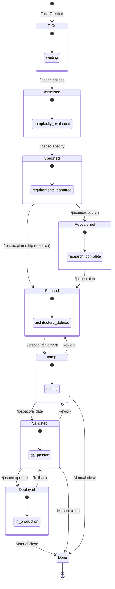
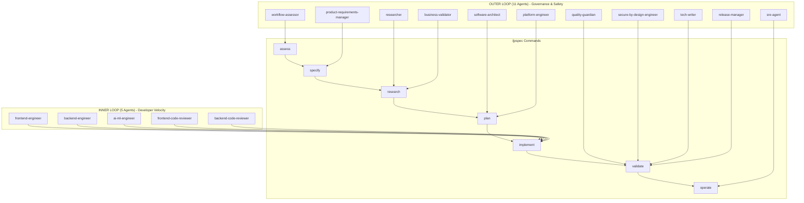
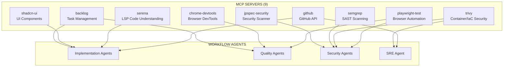
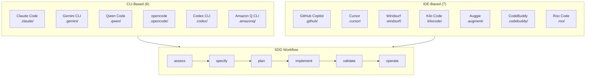
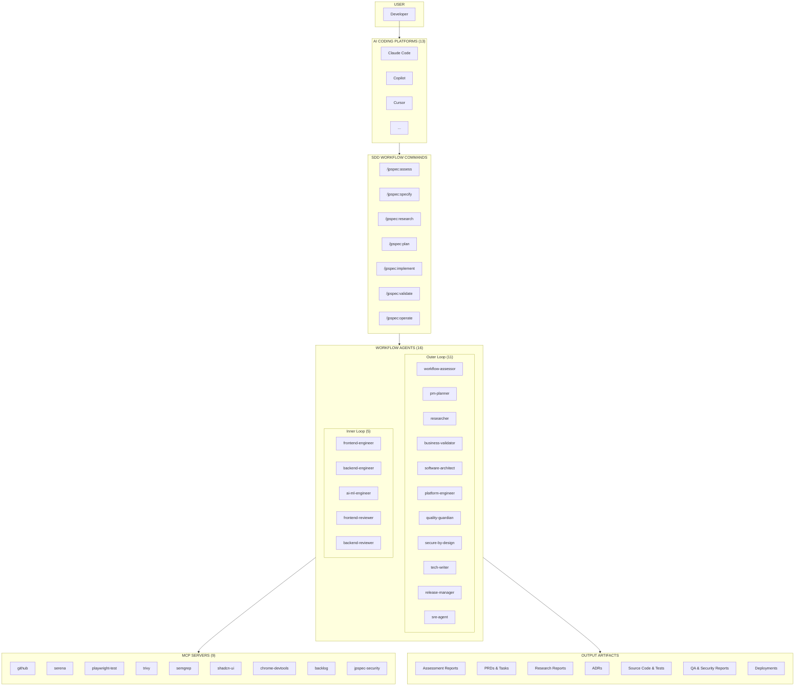

# Agent Architecture Diagrams

This document provides visual representations of the JP Spec Kit agent ecosystem, showing all 16 workflow agents, 13 AI coding platforms, 9 MCP servers, and how they interconnect across the SDD workflow.

## Quick Reference

| Category | Count | Description |
|----------|-------|-------------|
| Workflow Agents | 16 | SDD workflow specialists (5 inner loop, 11 outer loop) |
| AI Coding Platforms | 13 | Supported IDE/CLI integrations |
| MCP Servers | 9 | Tool integrations via Model Context Protocol |
| Workflow States | 9 | Task progression states |
| Slash Commands | 7 | `/jpspec:*` workflow commands |

---

## 1. Complete Workflow State Machine

### Mermaid Diagram



### ASCII Diagram

```
┌─────────────────────────────────────────────────────────────────────────────────┐
│                           SDD WORKFLOW STATE MACHINE                            │
└─────────────────────────────────────────────────────────────────────────────────┘

                              ┌─────────────┐
                              │   TO DO     │ ◄── Task Created
                              └──────┬──────┘
                                     │ /jpspec:assess
                                     ▼
                              ┌─────────────┐
                              │  ASSESSED   │ ◄── Complexity evaluated
                              └──────┬──────┘
                                     │ /jpspec:specify
                                     ▼
                              ┌─────────────┐
                              │  SPECIFIED  │ ◄── PRD + Tasks created
                              └──────┬──────┘
                                     │
                    ┌────────────────┼────────────────┐
                    │ /jpspec:plan   │ /jpspec:research
                    │ (skip research)│                │
                    ▼                ▼                │
              ┌─────────────┐ ┌─────────────┐        │
              │   PLANNED   │ │ RESEARCHED  │────────┘
              └──────┬──────┘ └──────┬──────┘
                     │               │ /jpspec:plan
                     │               ▼
                     │        ┌─────────────┐
                     └───────►│   PLANNED   │ ◄── ADRs created
                              └──────┬──────┘
                                     │ /jpspec:implement
                                     ▼
                              ┌──────────────────┐
        ┌──── Rework ◄────────│IN IMPLEMENTATION│ ◄── Code written
        │                     └──────┬──────────┘
        │                            │ /jpspec:validate
        │                            ▼
        │                     ┌─────────────┐
        │     ┌─ Rework ◄─────│  VALIDATED  │ ◄── QA + Security passed
        │     │               └──────┬──────┘
        │     │                      │ /jpspec:operate
        │     │                      ▼
        │     │               ┌─────────────┐
        │     │  Rollback ◄───│  DEPLOYED   │ ◄── In production
        │     │               └──────┬──────┘
        │     │                      │ Manual
        │     │                      ▼
        │     │               ┌─────────────┐
        └─────┴──────────────►│    DONE     │ ◄── Work complete
                              └─────────────┘
```

---

## 2. Agent-to-Workflow Mapping

### Mermaid Diagram



### ASCII Diagram

```
┌─────────────────────────────────────────────────────────────────────────────────┐
│                         AGENT-TO-WORKFLOW MAPPING                               │
└─────────────────────────────────────────────────────────────────────────────────┘

╔═══════════════════════════════════════════════════════════════════════════════╗
║  OUTER LOOP AGENTS (11) - Governance, Safety, Reliability                     ║
╠═══════════════════════════════════════════════════════════════════════════════╣
║                                                                               ║
║  ┌─────────────────┐   ┌─────────────────┐   ┌─────────────────┐             ║
║  │ workflow-       │   │ product-        │   │ researcher      │             ║
║  │ assessor        │   │ requirements-   │   │                 │             ║
║  │ @workflow-      │   │ manager         │   │ @researcher     │             ║
║  │ assessor        │   │ @pm-planner     │   │                 │             ║
║  └────────┬────────┘   └────────┬────────┘   └────────┬────────┘             ║
║           │                     │                     │                       ║
║           ▼                     ▼                     ▼                       ║
║      /jpspec:assess       /jpspec:specify      /jpspec:research              ║
║                                                       │                       ║
║  ┌─────────────────┐                          ┌──────┴────────┐              ║
║  │ business-       │                          │ software-     │              ║
║  │ validator       │                          │ architect     │              ║
║  │ @business-      │──────────────────────────│ @software-    │              ║
║  │ validator       │                          │ architect     │              ║
║  └─────────────────┘                          └───────┬───────┘              ║
║                                                       │                       ║
║  ┌─────────────────┐                          ┌───────┴───────┐              ║
║  │ platform-       │                          │               │              ║
║  │ engineer        │──────────────────────────┤ /jpspec:plan  │              ║
║  │ @platform-      │                          │               │              ║
║  │ engineer        │                          └───────────────┘              ║
║  └─────────────────┘                                                         ║
║                                                                               ║
║  ┌─────────────────┐   ┌─────────────────┐   ┌─────────────────┐             ║
║  │ quality-        │   │ secure-by-      │   │ tech-writer    │             ║
║  │ guardian        │   │ design-engineer │   │                │             ║
║  │ @quality-       │   │ @secure-by-     │   │ @tech-writer   │             ║
║  │ guardian        │   │ design-engineer │   │                │             ║
║  └────────┬────────┘   └────────┬────────┘   └───────┬────────┘             ║
║           │                     │                     │                       ║
║           └─────────────────────┼─────────────────────┘                       ║
║                                 ▼                                             ║
║  ┌─────────────────┐     /jpspec:validate    ┌─────────────────┐             ║
║  │ release-manager │            │            │ sre-agent       │             ║
║  │ @release-       │────────────┘            │ @sre-agent      │             ║
║  │ manager         │                         └────────┬────────┘             ║
║  └─────────────────┘                                  │                       ║
║                                                       ▼                       ║
║                                                /jpspec:operate               ║
╚═══════════════════════════════════════════════════════════════════════════════╝

╔═══════════════════════════════════════════════════════════════════════════════╗
║  INNER LOOP AGENTS (5) - Developer Velocity                                   ║
╠═══════════════════════════════════════════════════════════════════════════════╣
║                                                                               ║
║  ┌─────────────────┐   ┌─────────────────┐   ┌─────────────────┐             ║
║  │ frontend-       │   │ backend-        │   │ ai-ml-engineer  │             ║
║  │ engineer        │   │ engineer        │   │                 │             ║
║  │ @frontend-      │   │ @backend-       │   │ @ai-ml-engineer │             ║
║  │ engineer        │   │ engineer        │   │                 │             ║
║  └────────┬────────┘   └────────┬────────┘   └────────┬────────┘             ║
║           │                     │                     │                       ║
║           └─────────────────────┼─────────────────────┘                       ║
║                                 ▼                                             ║
║                          /jpspec:implement                                    ║
║                                 ▲                                             ║
║           ┌─────────────────────┼─────────────────────┐                       ║
║           │                     │                     │                       ║
║  ┌────────┴────────┐   ┌────────┴────────┐                                   ║
║  │ frontend-code-  │   │ backend-code-   │                                   ║
║  │ reviewer        │   │ reviewer        │                                   ║
║  │ @frontend-code- │   │ @backend-code-  │                                   ║
║  │ reviewer        │   │ reviewer        │                                   ║
║  └─────────────────┘   └─────────────────┘                                   ║
║                                                                               ║
╚═══════════════════════════════════════════════════════════════════════════════╝
```

---

## 3. MCP Server Integrations

### Mermaid Diagram



### ASCII Diagram

```
┌─────────────────────────────────────────────────────────────────────────────────┐
│                           MCP SERVER INTEGRATIONS                               │
└─────────────────────────────────────────────────────────────────────────────────┘

┌───────────────────────────────────────────────────────────────────────────────┐
│                              MCP SERVERS (9)                                  │
├───────────────────────────────────────────────────────────────────────────────┤
│                                                                               │
│  ┌─────────────────────────────────────────────────────────────────────────┐ │
│  │ DEVELOPMENT & CODE                                                      │ │
│  ├─────────────────────────────────────────────────────────────────────────┤ │
│  │                                                                         │ │
│  │  ┌─────────────────┐   ┌─────────────────┐   ┌─────────────────┐       │ │
│  │  │    github       │   │    serena       │   │   shadcn-ui     │       │ │
│  │  ├─────────────────┤   ├─────────────────┤   ├─────────────────┤       │ │
│  │  │ GitHub API:     │   │ LSP-grade code  │   │ UI component    │       │ │
│  │  │ repos, issues,  │   │ understanding & │   │ library access  │       │ │
│  │  │ PRs, search,    │   │ safe semantic   │   │ and install     │       │ │
│  │  │ workflows       │   │ edits           │   │                 │       │ │
│  │  └────────┬────────┘   └────────┬────────┘   └────────┬────────┘       │ │
│  │           │                     │                     │                 │ │
│  │           └─────────────────────┼─────────────────────┘                 │ │
│  │                                 ▼                                       │ │
│  │                    Implementation Agents                                │ │
│  │                    (frontend, backend, ai-ml)                           │ │
│  └─────────────────────────────────────────────────────────────────────────┘ │
│                                                                               │
│  ┌─────────────────────────────────────────────────────────────────────────┐ │
│  │ SECURITY & COMPLIANCE                                                   │ │
│  ├─────────────────────────────────────────────────────────────────────────┤ │
│  │                                                                         │ │
│  │  ┌─────────────────┐   ┌─────────────────┐   ┌─────────────────┐       │ │
│  │  │    semgrep      │   │     trivy       │   │ jpspec-security │       │ │
│  │  ├─────────────────┤   ├─────────────────┤   ├─────────────────┤       │ │
│  │  │ SAST code       │   │ Container/IaC   │   │ JP Spec Kit     │       │ │
│  │  │ scanning for    │   │ security scans  │   │ Security:       │       │ │
│  │  │ vulnerabilities │   │ and SBOM        │   │ scan, triage,   │       │ │
│  │  │                 │   │ generation      │   │ fix with AI     │       │ │
│  │  └────────┬────────┘   └────────┬────────┘   └────────┬────────┘       │ │
│  │           │                     │                     │                 │ │
│  │           └─────────────────────┼─────────────────────┘                 │ │
│  │                                 ▼                                       │ │
│  │                     Security Agents                                     │ │
│  │                     (secure-by-design-engineer)                         │ │
│  └─────────────────────────────────────────────────────────────────────────┘ │
│                                                                               │
│  ┌─────────────────────────────────────────────────────────────────────────┐ │
│  │ TESTING & QUALITY                                                       │ │
│  ├─────────────────────────────────────────────────────────────────────────┤ │
│  │                                                                         │ │
│  │  ┌─────────────────┐   ┌─────────────────┐   ┌─────────────────┐       │ │
│  │  │ playwright-test │   │ chrome-devtools │   │    backlog      │       │ │
│  │  ├─────────────────┤   ├─────────────────┤   ├─────────────────┤       │ │
│  │  │ Browser auto-   │   │ Chrome DevTools │   │ Task management │       │ │
│  │  │ mation for E2E  │   │ Protocol for    │   │ create, update, │       │ │
│  │  │ testing         │   │ inspection &    │   │ search tasks    │       │ │
│  │  │                 │   │ performance     │   │ with kanban     │       │ │
│  │  └────────┬────────┘   └────────┬────────┘   └────────┬────────┘       │ │
│  │           │                     │                     │                 │ │
│  │           └─────────────────────┼─────────────────────┘                 │ │
│  │                                 ▼                                       │ │
│  │                       Quality Agents                                    │ │
│  │                       (quality-guardian)                                │ │
│  └─────────────────────────────────────────────────────────────────────────┘ │
│                                                                               │
└───────────────────────────────────────────────────────────────────────────────┘
```

---

## 4. Supported AI Coding Platforms

### Mermaid Diagram



### ASCII Diagram

```
┌─────────────────────────────────────────────────────────────────────────────────┐
│                       SUPPORTED AI CODING PLATFORMS (13)                        │
└─────────────────────────────────────────────────────────────────────────────────┘

╔═══════════════════════════════════════════════════════════════════════════════╗
║  CLI-BASED PLATFORMS (6) - Requires CLI installation                          ║
╠═══════════════════════════════════════════════════════════════════════════════╣
║                                                                               ║
║  ┌─────────────────┐   ┌─────────────────┐   ┌─────────────────┐             ║
║  │  Claude Code    │   │   Gemini CLI    │   │   Qwen Code     │             ║
║  │  ─────────────  │   │  ─────────────  │   │  ─────────────  │             ║
║  │  Folder: .claude│   │  Folder: .gemini│   │  Folder: .qwen  │             ║
║  │  Config: CLAUDE │   │  Requires CLI   │   │  Requires CLI   │             ║
║  │         .md     │   │  install        │   │  install        │             ║
║  └─────────────────┘   └─────────────────┘   └─────────────────┘             ║
║                                                                               ║
║  ┌─────────────────┐   ┌─────────────────┐   ┌─────────────────┐             ║
║  │    opencode     │   │   Codex CLI     │   │  Amazon Q CLI   │             ║
║  │  ─────────────  │   │  ─────────────  │   │  ─────────────  │             ║
║  │  Folder:        │   │  Folder: .codex │   │  Folder:        │             ║
║  │  .opencode      │   │  Requires CLI   │   │  .amazonq       │             ║
║  │  Requires CLI   │   │  install        │   │  Requires CLI   │             ║
║  └─────────────────┘   └─────────────────┘   └─────────────────┘             ║
║                                                                               ║
╚═══════════════════════════════════════════════════════════════════════════════╝

╔═══════════════════════════════════════════════════════════════════════════════╗
║  IDE-BASED PLATFORMS (7) - Built into IDE, no CLI required                    ║
╠═══════════════════════════════════════════════════════════════════════════════╣
║                                                                               ║
║  ┌─────────────────┐   ┌─────────────────┐   ┌─────────────────┐             ║
║  │ GitHub Copilot  │   │     Cursor      │   │    Windsurf     │             ║
║  │  ─────────────  │   │  ─────────────  │   │  ─────────────  │             ║
║  │  Folder: .github│   │  Folder: .cursor│   │  Folder:        │             ║
║  │  VS Code/IDE    │   │  Cursor IDE     │   │  .windsurf      │             ║
║  │  extension      │   │  native         │   │  Codeium IDE    │             ║
║  └─────────────────┘   └─────────────────┘   └─────────────────┘             ║
║                                                                               ║
║  ┌─────────────────┐   ┌─────────────────┐   ┌─────────────────┐             ║
║  │   Kilo Code     │   │   Auggie CLI    │   │   CodeBuddy     │             ║
║  │  ─────────────  │   │  ─────────────  │   │  ─────────────  │             ║
║  │  Folder:        │   │  Folder:        │   │  Folder:        │             ║
║  │  .kilocode      │   │  .augment       │   │  .codebuddy     │             ║
║  │  IDE extension  │   │  CLI available  │   │  CLI available  │             ║
║  └─────────────────┘   └─────────────────┘   └─────────────────┘             ║
║                                                                               ║
║                        ┌─────────────────┐                                    ║
║                        │    Roo Code     │                                    ║
║                        │  ─────────────  │                                    ║
║                        │  Folder: .roo   │                                    ║
║                        │  IDE extension  │                                    ║
║                        └─────────────────┘                                    ║
║                                                                               ║
╚═══════════════════════════════════════════════════════════════════════════════╝
```

---

## 5. Complete System Overview

### Mermaid Diagram



### ASCII Diagram

```
┌─────────────────────────────────────────────────────────────────────────────────┐
│                        COMPLETE SYSTEM ARCHITECTURE                             │
└─────────────────────────────────────────────────────────────────────────────────┘

┌───────────────────────────────────────────────────────────────────────────────┐
│                                 DEVELOPER                                     │
└─────────────────────────────────────┬─────────────────────────────────────────┘
                                      │
                                      ▼
┌───────────────────────────────────────────────────────────────────────────────┐
│                         AI CODING PLATFORMS (13)                              │
│  ┌──────────┐ ┌──────────┐ ┌──────────┐ ┌──────────┐ ┌──────────┐ ┌────────┐ │
│  │ Claude   │ │ Copilot  │ │ Cursor   │ │ Gemini   │ │ Windsurf │ │  ...   │ │
│  │ Code     │ │          │ │          │ │ CLI      │ │          │ │        │ │
│  └──────────┘ └──────────┘ └──────────┘ └──────────┘ └──────────┘ └────────┘ │
└─────────────────────────────────────┬─────────────────────────────────────────┘
                                      │
                                      ▼
┌───────────────────────────────────────────────────────────────────────────────┐
│                      SDD WORKFLOW COMMANDS (/jpspec:*)                        │
│                                                                               │
│   assess ──► specify ──► research ──► plan ──► implement ──► validate ──► operate │
│      │          │           │          │           │            │           │
└──────┼──────────┼───────────┼──────────┼───────────┼────────────┼───────────┼───┘
       │          │           │          │           │            │           │
       ▼          ▼           ▼          ▼           ▼            ▼           ▼
┌───────────────────────────────────────────────────────────────────────────────┐
│                         WORKFLOW AGENTS (16)                                  │
│                                                                               │
│  ╔═══════════════════════════════════════════════════════════════════════╗   │
│  ║ OUTER LOOP (11) - Governance & Safety                                 ║   │
│  ║ ┌────────────┐ ┌────────────┐ ┌────────────┐ ┌────────────┐           ║   │
│  ║ │ workflow-  │ │ pm-planner │ │ researcher │ │ business-  │           ║   │
│  ║ │ assessor   │ │            │ │            │ │ validator  │           ║   │
│  ║ └────────────┘ └────────────┘ └────────────┘ └────────────┘           ║   │
│  ║ ┌────────────┐ ┌────────────┐ ┌────────────┐ ┌────────────┐           ║   │
│  ║ │ software-  │ │ platform-  │ │ quality-   │ │ secure-by- │           ║   │
│  ║ │ architect  │ │ engineer   │ │ guardian   │ │ design-eng │           ║   │
│  ║ └────────────┘ └────────────┘ └────────────┘ └────────────┘           ║   │
│  ║ ┌────────────┐ ┌────────────┐ ┌────────────┐                          ║   │
│  ║ │ tech-      │ │ release-   │ │ sre-agent  │                          ║   │
│  ║ │ writer     │ │ manager    │ │            │                          ║   │
│  ║ └────────────┘ └────────────┘ └────────────┘                          ║   │
│  ╚═══════════════════════════════════════════════════════════════════════╝   │
│                                                                               │
│  ╔═══════════════════════════════════════════════════════════════════════╗   │
│  ║ INNER LOOP (5) - Developer Velocity                                   ║   │
│  ║ ┌────────────┐ ┌────────────┐ ┌────────────┐                          ║   │
│  ║ │ frontend-  │ │ backend-   │ │ ai-ml-     │                          ║   │
│  ║ │ engineer   │ │ engineer   │ │ engineer   │                          ║   │
│  ║ └────────────┘ └────────────┘ └────────────┘                          ║   │
│  ║ ┌────────────┐ ┌────────────┐                                         ║   │
│  ║ │ frontend-  │ │ backend-   │                                         ║   │
│  ║ │ reviewer   │ │ reviewer   │                                         ║   │
│  ║ └────────────┘ └────────────┘                                         ║   │
│  ╚═══════════════════════════════════════════════════════════════════════╝   │
│                                                                               │
└─────────────────────────────────────┬─────────────────────────────────────────┘
                                      │
           ┌──────────────────────────┼──────────────────────────┐
           │                          │                          │
           ▼                          ▼                          ▼
┌─────────────────────┐   ┌─────────────────────┐   ┌─────────────────────┐
│    MCP SERVERS (9)  │   │  OUTPUT ARTIFACTS   │   │   TASK STATES (9)   │
│                     │   │                     │   │                     │
│  ┌───────────────┐  │   │  • Assessment.md    │   │  • To Do            │
│  │    github     │  │   │  • PRD.md           │   │  • Assessed         │
│  │    serena     │  │   │  • Research.md      │   │  • Specified        │
│  │ playwright    │  │   │  • ADR-*.md         │   │  • Researched       │
│  │    trivy      │  │   │  • src/ tests/      │   │  • Planned          │
│  │   semgrep     │  │   │  • QA-report.md     │   │  • In Implementation│
│  │  shadcn-ui    │  │   │  • Security.md      │   │  • Validated        │
│  │ chrome-devtools│  │   │  • deploy/          │   │  • Deployed         │
│  │   backlog     │  │   │                     │   │  • Done             │
│  │ jpspec-security│  │   │                     │   │                     │
│  └───────────────┘  │   │                     │   │                     │
└─────────────────────┘   └─────────────────────┘   └─────────────────────┘
```

---

## 6. Agent-MCP Integration Matrix

### Which MCP servers each agent type uses:

| Agent | github | serena | playwright | trivy | semgrep | shadcn | devtools | backlog | security |
|-------|:------:|:------:|:----------:|:-----:|:-------:|:------:|:--------:|:-------:|:--------:|
| **workflow-assessor** | | | | | | | | ✓ | |
| **pm-planner** | | | | | | | | ✓ | |
| **researcher** | ✓ | | | | | | | | |
| **business-validator** | ✓ | | | | | | | | |
| **software-architect** | ✓ | ✓ | | | | | | ✓ | |
| **platform-engineer** | ✓ | | | ✓ | | | | ✓ | |
| **frontend-engineer** | ✓ | ✓ | | | | ✓ | ✓ | ✓ | |
| **backend-engineer** | ✓ | ✓ | | | | | | ✓ | |
| **ai-ml-engineer** | ✓ | ✓ | | | | | | ✓ | |
| **frontend-reviewer** | ✓ | ✓ | | | | | ✓ | | |
| **backend-reviewer** | ✓ | ✓ | | | ✓ | | | | |
| **quality-guardian** | | | ✓ | | | | ✓ | ✓ | |
| **secure-by-design** | | | ✓ | ✓ | ✓ | | | | ✓ |
| **tech-writer** | ✓ | | | | | | | | |
| **release-manager** | ✓ | | | | | | | ✓ | |
| **sre-agent** | ✓ | | | ✓ | | | | ✓ | |

### ASCII Matrix

```
┌─────────────────────────────────────────────────────────────────────────────────┐
│                         AGENT-MCP INTEGRATION MATRIX                            │
└─────────────────────────────────────────────────────────────────────────────────┘

                         M C P   S E R V E R S
                    ┌───┬───┬───┬───┬───┬───┬───┬───┬───┐
                    │ g │ s │ p │ t │ s │ s │ c │ b │ j │
                    │ i │ e │ l │ r │ e │ h │ h │ a │ p │
                    │ t │ r │ a │ i │ m │ a │ r │ c │ s │
                    │ h │ e │ y │ v │ g │ d │ o │ k │ e │
                    │ u │ n │ w │ y │ r │ c │ m │ l │ c │
                    │ b │ a │ r │   │ e │ n │ e │ o │   │
                    │   │   │ i │   │ p │   │   │ g │   │
A                   │   │   │ g │   │   │   │   │   │   │
G ──────────────────┼───┼───┼───┼───┼───┼───┼───┼───┼───┤
E workflow-assessor │   │   │   │   │   │   │   │ ● │   │
N pm-planner        │   │   │   │   │   │   │   │ ● │   │
T researcher        │ ● │   │   │   │   │   │   │   │   │
S business-validator│ ● │   │   │   │   │   │   │   │   │
  software-architect│ ● │ ● │   │   │   │   │   │ ● │   │
  platform-engineer │ ● │   │   │ ● │   │   │   │ ● │   │
  frontend-engineer │ ● │ ● │   │   │   │ ● │ ● │ ● │   │
  backend-engineer  │ ● │ ● │   │   │   │   │   │ ● │   │
  ai-ml-engineer    │ ● │ ● │   │   │   │   │   │ ● │   │
  frontend-reviewer │ ● │ ● │   │   │   │   │ ● │   │   │
  backend-reviewer  │ ● │ ● │   │   │ ● │   │   │   │   │
  quality-guardian  │   │   │ ● │   │   │   │ ● │ ● │   │
  secure-by-design  │   │   │ ● │ ● │ ● │   │   │   │ ● │
  tech-writer       │ ● │   │   │   │   │   │   │   │   │
  release-manager   │ ● │   │   │   │   │   │   │ ● │   │
  sre-agent         │ ● │   │   │ ● │   │   │   │ ● │   │
                    └───┴───┴───┴───┴───┴───┴───┴───┴───┘

Legend: ● = Uses this MCP server
```

---

## 7. Workflow Command Detail

### Command-Agent-Artifact Summary

| Command | Agents | Input State(s) | Output State | Output Artifacts |
|---------|--------|----------------|--------------|------------------|
| `/jpspec:assess` | workflow-assessor | To Do | Assessed | `docs/assess/{feature}-assessment.md` |
| `/jpspec:specify` | pm-planner | Assessed | Specified | `docs/prd/{feature}.md`, backlog tasks |
| `/jpspec:research` | researcher, business-validator | Specified | Researched | `docs/research/{feature}-*.md` |
| `/jpspec:plan` | software-architect, platform-engineer | Specified, Researched | Planned | `docs/adr/ADR-*.md` |
| `/jpspec:implement` | frontend-eng, backend-eng, ai-ml-eng, reviewers | Planned | In Implementation | `src/`, `tests/` |
| `/jpspec:validate` | quality-guardian, secure-by-design, tech-writer, release-mgr | In Implementation | Validated | `docs/qa/`, `docs/security/` |
| `/jpspec:operate` | sre-agent | Validated | Deployed | `deploy/` |

---

## Quick Reference Card

```
┌─────────────────────────────────────────────────────────────────────────────────┐
│                         JP SPEC KIT - QUICK REFERENCE                           │
├─────────────────────────────────────────────────────────────────────────────────┤
│                                                                                 │
│  WORKFLOW AGENTS: 16 total                                                      │
│    • Inner Loop (5): frontend-eng, backend-eng, ai-ml-eng, 2 reviewers          │
│    • Outer Loop (11): assessor, pm, researcher, validator, architect,           │
│                       platform-eng, qa, security, tech-writer, release, sre     │
│                                                                                 │
│  AI PLATFORMS: 13 supported                                                     │
│    • CLI: Claude Code, Gemini, Qwen, opencode, Codex, Amazon Q                  │
│    • IDE: Copilot, Cursor, Windsurf, Kilo, Auggie, CodeBuddy, Roo               │
│                                                                                 │
│  MCP SERVERS: 9 integrations                                                    │
│    • Dev: github, serena, shadcn-ui                                             │
│    • Security: trivy, semgrep, jpspec-security                                  │
│    • Testing: playwright-test, chrome-devtools                                  │
│    • Workflow: backlog                                                          │
│                                                                                 │
│  STATES: To Do → Assessed → Specified → Researched → Planned →                  │
│          In Implementation → Validated → Deployed → Done                        │
│                                                                                 │
│  COMMANDS: /jpspec:assess, specify, research, plan, implement, validate, operate│
│                                                                                 │
└─────────────────────────────────────────────────────────────────────────────────┘
```

---

## Related Documentation

- [Agent Loop Classification](./agent-loop-classification.md)
- [Workflow Configuration](../../jpspec_workflow.yml)
- [MCP Configuration](../../.mcp.json)
- [Inner Loop Reference](./inner-loop.md)
- [Outer Loop Reference](./outer-loop.md)
