# Agent & MCP Server Integrations

This document provides a comprehensive overview of all agents in Flowspec and their configured MCP (Model Context Protocol) server integrations.

## Architecture Overview

```mermaid
flowchart TB
    subgraph Workflows["Workflows (flowspec commands)"]
        specify["/flow:specify"]
        plan["/flow:plan"]
        research["/flow:research"]
        implement["/flow:implement"]
        validate["/flow:validate"]
        operate["/flow:operate"]
    end

    subgraph Agents["Agents"]
        PRM["product-requirements-manager"]
        SA["software-architect"]
        PE["platform-engineer"]
        RES["researcher"]
        BV["business-validator"]
        FE["frontend-engineer"]
        BE["backend-engineer"]
        AI["ai-ml-engineer"]
        FCR["frontend-code-reviewer"]
        BCR["backend-code-reviewer"]
        QG["quality-guardian"]
        SDE["secure-by-design-engineer"]
        TW["tech-writer"]
        RM["release-manager"]
        SRE["sre-agent"]
    end

    subgraph MCP["MCP Servers"]
        github["github<br/>GitHub API"]
        serena["serena<br/>LSP Code Intel"]
        trivy["trivy<br/>Security Scan"]
        semgrep["semgrep<br/>SAST"]
        shadcn["shadcn-ui<br/>UI Components"]
        playwright["playwright-test<br/>E2E Testing"]
        chrome["chrome-devtools<br/>Browser Debug"]
    end

    %% Workflow to Agent mappings
    specify --> PRM
    plan --> SA & PE
    research --> RES & BV
    implement --> FE & BE & AI & FCR & BCR
    validate --> QG & SDE & TW & RM
    operate --> SRE

    %% Core MCPs (all agents)
    PRM & SA & PE & RES & BV & FE & BE & AI & FCR & BCR & QG & SDE & TW & RM & SRE -.-> github
    PRM & SA & PE & RES & BV & FE & BE & AI & FCR & BCR & QG & SDE & TW & RM & SRE -.-> serena

    %% Security MCPs
    FCR & BCR & SDE & RM -.-> trivy
    FCR & BCR & SDE -.-> semgrep

    %% Frontend MCPs
    FE & FCR -.-> shadcn
    FE & FCR -.-> playwright
    FE & FCR & QG & SRE -.-> chrome
```



## Agents by Workflow

### `/flow:specify` - Requirements

| Agent | Description | MCP Servers |
|-------|-------------|-------------|
| **product-requirements-manager** | Product management using SVPG principles, outcomes over outputs | github, serena |

### `/flow:plan` - Architecture (Parallel Execution)

| Agent | Description | MCP Servers |
|-------|-------------|-------------|
| **software-architect** | Enterprise architect using Hohpe's principles, Enterprise Integration Patterns | github, serena |
| **platform-engineer** | DevOps/CI/CD expert, DORA metrics, NIST/SSDF compliance | github, serena |

### `/flow:research` - Research & Validation (Parallel Execution)

| Agent | Description | MCP Servers |
|-------|-------------|-------------|
| **researcher** | Market research, competitive intelligence, technical feasibility | github, serena |
| **business-validator** | Business viability, financial feasibility, TAM/SAM/SOM analysis | github, serena |

### `/flow:implement` - Development

| Agent | Description | MCP Servers |
|-------|-------------|-------------|
| **frontend-engineer** | React, React Native, TypeScript, performance, accessibility | github, serena, shadcn-ui, playwright-test, chrome-devtools |
| **backend-engineer** | Go, TypeScript, Python, CLI tools, APIs, middleware | github, serena |
| **ai-ml-engineer** | MLOps, model development, deployment, monitoring | github, serena |
| **frontend-code-reviewer** | Frontend code review: quality, performance, accessibility, security | github, serena, trivy, semgrep, shadcn-ui, playwright-test, chrome-devtools |
| **backend-code-reviewer** | Backend code review: security, performance, scalability | github, serena, trivy, semgrep |

### `/flow:validate` - Quality Assurance

| Agent | Description | MCP Servers |
|-------|-------------|-------------|
| **quality-guardian** | Risk analysis, quality assessment, critical evaluation | github, serena, chrome-devtools |
| **secure-by-design-engineer** | Security analysis, threat modeling, compliance | github, serena, trivy, semgrep |
| **tech-writer** | Documentation, API references, user guides, tutorials | github, serena |
| **release-manager** | Release coordination, quality validation, deployment management | github, serena, trivy |

### `/flow:operate` - Operations

| Agent | Description | MCP Servers |
|-------|-------------|-------------|
| **sre-agent** | CI/CD (GitHub Actions), Kubernetes, DevSecOps, observability | github, serena, chrome-devtools |

## MCP Server Reference

### Core Servers (All Agents)

These MCP servers are available to every agent:

| Server | Description | Use Cases |
|--------|-------------|-----------|
| **github** | GitHub API integration | Repos, issues, PRs, code search, workflows |
| **serena** | LSP-grade code understanding | Semantic code analysis, safe refactoring |

### Security Servers

| Server | Description | Available To |
|--------|-------------|--------------|
| **trivy** | Container/IaC security scans, SBOM generation | frontend-code-reviewer, backend-code-reviewer, secure-by-design-engineer, release-manager |
| **semgrep** | SAST code scanning for vulnerabilities | frontend-code-reviewer, backend-code-reviewer, secure-by-design-engineer |

### Frontend Servers

| Server | Description | Available To |
|--------|-------------|--------------|
| **shadcn-ui** | shadcn/ui component library access | frontend-engineer, frontend-code-reviewer |
| **playwright-test** | Browser automation for E2E testing | frontend-engineer, frontend-code-reviewer |
| **chrome-devtools** | Chrome DevTools Protocol for debugging | frontend-engineer, frontend-code-reviewer, quality-guardian, sre-agent |

## Agent Loop Classification

Agents are classified into two loops based on their role in the development lifecycle:

### Inner Loop (Local Development)

These agents focus on fast, local iteration:

- product-requirements-manager
- software-architect
- platform-engineer
- researcher
- business-validator
- frontend-engineer
- backend-engineer
- ai-ml-engineer
- frontend-code-reviewer
- backend-code-reviewer
- quality-guardian
- secure-by-design-engineer
- tech-writer

### Outer Loop (CI/CD & Operations)

These agents handle post-commit automation:

- **release-manager** - Deployment and release coordination
- **sre-agent** - CI/CD, Kubernetes, observability

## Workflow Execution Patterns

### Sequential Workflows

```
/flow:specify  →  product-requirements-manager
/flow:operate  →  sre-agent
```

### Parallel Workflows

```
/flow:plan     →  software-architect ║ platform-engineer
/flow:research →  researcher ║ business-validator
```

### Sequential with Review Gates

```
/flow:implement →  frontend-engineer  →  frontend-code-reviewer
                     backend-engineer   →  backend-code-reviewer
                     ai-ml-engineer     (parallel)
```

### Multi-Stage Validation

```
/flow:validate →  quality-guardian
                    secure-by-design-engineer
                    tech-writer
                    release-manager
```

## Configuration

MCP servers are configured in `.mcp.json` at the project root. Each agent's available tools are defined in their respective agent file under `.agents/`.

### Example Agent Configuration

```yaml
---
name: frontend-engineer
description: Expert frontend engineer specializing in React and mobile development
tools: Glob, Grep, Read, Write, Edit, mcp__github__*, mcp__serena__*, mcp__shadcn-ui__*, mcp__playwright-test__*, mcp__chrome-devtools__*
model: sonnet
color: blue
---
```

### MCP Server Configuration

```json
{
  "mcpServers": {
    "github": {
      "command": "npx",
      "args": ["-y", "@modelcontextprotocol/server-github"]
    },
    "serena": {
      "command": "uvx",
      "args": ["--from", "git+https://github.com/oraios/serena", "serena-mcp-server"]
    }
  }
}
```

## Quick Reference Matrix

| Agent | github | serena | trivy | semgrep | shadcn | playwright | chrome |
|-------|:------:|:------:|:-----:|:-------:|:------:|:----------:|:------:|
| product-requirements-manager | ✓ | ✓ | | | | | |
| software-architect | ✓ | ✓ | | | | | |
| platform-engineer | ✓ | ✓ | | | | | |
| researcher | ✓ | ✓ | | | | | |
| business-validator | ✓ | ✓ | | | | | |
| frontend-engineer | ✓ | ✓ | | | ✓ | ✓ | ✓ |
| backend-engineer | ✓ | ✓ | | | | | |
| ai-ml-engineer | ✓ | ✓ | | | | | |
| frontend-code-reviewer | ✓ | ✓ | ✓ | ✓ | ✓ | ✓ | ✓ |
| backend-code-reviewer | ✓ | ✓ | ✓ | ✓ | | | |
| quality-guardian | ✓ | ✓ | | | | | ✓ |
| secure-by-design-engineer | ✓ | ✓ | ✓ | ✓ | | | |
| tech-writer | ✓ | ✓ | | | | | |
| release-manager | ✓ | ✓ | ✓ | | | | |
| sre-agent | ✓ | ✓ | | | | | ✓ |

## See Also

- [Agent Loop Classification](./agent-loop-classification.md)
- [MCP Configuration Guide](../MCP-CONFIGURATION.md)
- [Workflow Commands](../../templates/commands/flowspec/)
