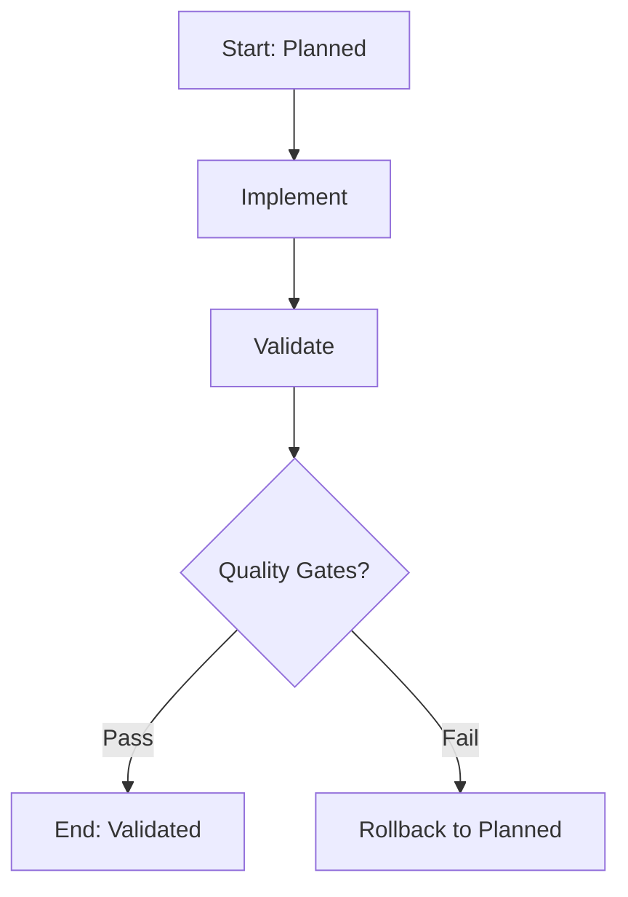

# /flow:meta-build - Build Meta-Workflow

**Version**: 1.0.0
**Command**: `/flow:meta-build`
**Summary**: Create It - Implementation and validation (implement + validate)

## Purpose

The **Build** meta-workflow consolidates implementation and validation into a single atomic command. It ensures that code and quality checks always go together, preventing incomplete features from progressing.

This meta-workflow treats implementation and validation as **inseparable** - you cannot have one without the other.

## What It Does

Executes in sequence:
1. **Implement** (`/flow:implement`) - Write code, tests, and documentation
2. **Validate** (`/flow:validate`) - Run QA checks, security scans, and documentation review

## Input/Output

**Input State**: `Planned`
**Output State**: `Validated`

**Artifacts Created**:
- `src/` - Source code
- `tests/` - Test suite
- `tests/ac-coverage.json` - Acceptance criteria coverage report
- `docs/qa/{feature}-qa-report.md` - QA validation report
- `docs/security/{feature}-security.md` - Security scan report

## Usage

### Basic Usage

```bash
/flow:meta-build
```

This will:
- Auto-detect current feature from branch name
- Execute all backlog tasks for the feature
- Run implementation agents (frontend/backend/AI-ML)
- Run validation agents (QA/security/docs/release)
- Validate quality gates before completion
- Update task state to "Validated"

### With Options

```bash
/flow:meta-build --task-id task-123
/flow:meta-build --skip-tests
/flow:meta-build --skip-security
/flow:meta-build --coverage-threshold 90
```

**Options**:
- `--task-id <ID>`: Specify task ID (default: auto-detect from branch)
- `--skip-tests`: Skip test execution (not recommended)
- `--skip-security`: Skip security scans (not recommended)
- `--coverage-threshold <N>`: Override test coverage threshold (default: 80%)

## Sub-Workflow Execution

### 1. Implement (Required)
- **Command**: `/flow:implement`
- **Agents**:
  - @frontend-engineer
  - @backend-engineer
  - @ai-ml-engineer
  - @frontend-code-reviewer
  - @backend-code-reviewer
- **Output**: Code + tests + AC coverage
- **Skippable**: No

### 2. Validate (Required)
- **Command**: `/flow:validate`
- **Agents**:
  - @quality-guardian
  - @secure-by-design-engineer
  - @tech-writer
  - @release-manager
- **Output**: QA report + security report
- **Skippable**: No

## Quality Gates

The Build meta-workflow enforces these quality gates **before** transitioning to Validated state:

### 1. Test Coverage Gate
- **Type**: `test_coverage`
- **Threshold**: 80% (configurable)
- **Required**: Yes
- **Failure**: Blocks state transition

### 2. Security Scan Gate
- **Type**: `security_scan`
- **Severity**: HIGH+
- **Required**: Yes
- **Failure**: Blocks state transition if HIGH or CRITICAL findings exist

### 3. Acceptance Criteria Gate
- **Type**: `acceptance_criteria`
- **Coverage**: 100%
- **Required**: Yes
- **Failure**: Blocks state transition

**Gate Validation Example**:
```
✓ Test Coverage: 85% (threshold: 80%)
✗ Security Scan: 2 HIGH findings (threshold: 0 HIGH+)
✓ Acceptance Criteria: 100% (12/12 criteria met)

❌ Build failed: Security gate not met
```

## Atomic Execution

The Build meta-workflow is **atomic** - both implement and validate must complete successfully:

```yaml
orchestration:
  atomic: true  # Implementation + validation together or neither
```

**Why Atomic?**
- Prevents "half-done" features
- Ensures quality is always checked
- Enforces "definition of done"
- Reduces technical debt

**Implications**:
- If validation fails, state remains "Planned" (not "In Implementation")
- Must fix issues and re-run entire build
- Cannot skip validation phase

## Execution Flow



## Error Handling

### Implementation Failure
If implementation fails (e.g., code review fails, tests don't pass):
- State remains "Planned"
- Fix issues and re-run `/flow:meta-build`
- Previous attempt's artifacts are preserved for debugging

### Validation Failure
If validation fails (e.g., security issues found):
- State rolls back to "Planned" (atomic guarantee)
- Fix security issues
- Re-run `/flow:meta-build` (will re-implement + re-validate)

### Quality Gate Failure
If quality gates fail:
- State remains "Planned"
- Review gate failure details
- Improve tests/security/AC coverage
- Re-run `/flow:meta-build`

## When to Use This vs. Granular Commands

**Use Meta-Workflow (`/flow:meta-build`) when**:
- ✅ Starting implementation of a planned feature
- ✅ You want atomic implementation + validation
- ✅ You want automatic quality gate enforcement
- ✅ You prefer simplicity

**Use Granular Commands when**:
- 🔧 Re-running only implementation after code changes
- 🔧 Re-running only validation after fixing issues
- 🔧 Debugging specific validation failures
- 🔧 You need to pause between implementation and validation

## Cross-Tool Compatibility

### Claude Code
```bash
/flow:meta-build
```

### GitHub Copilot
```
@flowspec /flow:meta-build
```

### Cursor
```
@flowspec /flow:meta-build
```

### Gemini Code
```
flowspec meta-build
```

## Configuration

Meta-workflow behavior is controlled by `flowspec_workflow.yml`:

```yaml
meta_workflows:
  build:
    command: "/flow:meta-build"
    sub_workflows:
      - workflow: "implement"
        required: true
      - workflow: "validate"
        required: true
    input_state: "Planned"
    output_state: "Validated"
    quality_gates:
      - type: "test_coverage"
        threshold: 80
        required: true
      - type: "security_scan"
        severity: "HIGH"
        required: true
      - type: "acceptance_criteria"
        coverage: 100
        required: true
    orchestration:
      atomic: true
```

## Events Emitted

```jsonl
{"event": "meta_workflow.started", "meta_workflow": "build", "timestamp": "..."}
{"event": "sub_workflow.started", "workflow": "implement", "timestamp": "..."}
{"event": "sub_workflow.completed", "workflow": "implement", "success": true, "timestamp": "..."}
{"event": "sub_workflow.started", "workflow": "validate", "timestamp": "..."}
{"event": "sub_workflow.completed", "workflow": "validate", "success": true, "timestamp": "..."}
{"event": "quality_gate.validated", "gate": "test_coverage", "result": "pass", "actual": 85, "threshold": 80, "timestamp": "..."}
{"event": "quality_gate.validated", "gate": "security_scan", "result": "pass", "findings": 0, "timestamp": "..."}
{"event": "quality_gate.validated", "gate": "acceptance_criteria", "result": "pass", "coverage": 100, "timestamp": "..."}
{"event": "meta_workflow.completed", "meta_workflow": "build", "success": true, "final_state": "Validated", "timestamp": "..."}
```

## See Also

- `/flow:meta-research` - Planning and design meta-workflow
- `/flow:meta-run` - Deployment and operations meta-workflow
- `docs/adr/003-meta-workflow-simplification.md` - Design rationale
- `flowspec_workflow.yml` - Configuration reference
