# /flow:meta-research - Research Meta-Workflow

**Version**: 1.0.0
**Command**: `/flow:meta-research`
**Summary**: Plan It - Complete upfront analysis and design (assess + specify + research + plan)

## Purpose

The **Research** meta-workflow consolidates all upfront planning and design activities into a single command. It executes the full sequence from initial assessment through technical planning, producing a comprehensive set of design artifacts ready for implementation.

This meta-workflow is **recommended for most users** as it simplifies the planning phase from 4 separate commands into 1.

## What It Does

Executes in sequence:
1. **Assess** (`/flow:assess`) - Evaluate SDD workflow suitability and complexity
2. **Specify** (`/flow:specify`) - Create PRD and implementation tasks
3. **Research** (`/flow:research`) - Optional deep research (if complexity ≥ 7 or requested)
4. **Plan** (`/flow:plan`) - Create ADRs and technical design

## Input/Output

**Input State**: `To Do`
**Output State**: `Planned`

**Artifacts Created**:
- `docs/assess/{feature}-assessment.md` - Complexity and risk assessment
- `docs/prd/{feature}.md` - Product Requirements Document
- `docs/research/{feature}-research.md` - Research report (optional)
- `docs/adr/ADR-*.md` - Architecture Decision Records
- `backlog/tasks/*.md` - Implementation tasks

## Usage

### Basic Usage

```bash
/flow:meta-research
```

This will:
- Auto-detect current feature from branch name
- Run all sub-workflows (skipping research if complexity < 7)
- Create all design artifacts
- Update task state to "Planned"

### With Options

```bash
/flow:meta-research --task-id task-123
/flow:meta-research --force-research
/flow:meta-research --light-mode
/flow:meta-research --skip-research
```

**Options**:
- `--task-id <ID>`: Specify task ID (default: auto-detect from branch)
- `--force-research`: Force research phase even if complexity < 7
- `--skip-research`: Skip research phase even if complexity ≥ 7
- `--light-mode`: Use lightweight templates (spec-light, plan-light)

## Sub-Workflow Execution

The meta-workflow executes sub-workflows in this order:

### 1. Assess (Required)
- **Command**: `/flow:assess`
- **Agent**: @workflow-assessor
- **Output**: Assessment report with complexity score
- **Skippable**: No

### 2. Specify (Required)
- **Command**: `/flow:specify`
- **Agent**: @pm-planner
- **Output**: PRD + backlog tasks
- **Skippable**: No

### 3. Research (Conditional)
- **Command**: `/flow:research`
- **Agents**: @researcher, @business-validator
- **Output**: Research report + business validation
- **Skippable**: Yes (if complexity < 7 and not forced)
- **Condition**: `complexity_score >= 7 OR light_mode == false`

### 4. Plan (Required)
- **Command**: `/flow:plan`
- **Agents**: @software-architect, @platform-engineer
- **Output**: ADRs + technical spec
- **Skippable**: No

## Execution Flow

```mermaid
graph TD
    A[Start: To Do] --> B[Assess]
    B --> C[Specify]
    C --> D{Complexity ≥ 7?}
    D -->|Yes| E[Research]
    D -->|No| F[Plan]
    E --> F
    F --> G[End: Planned]
```



## Error Handling

The meta-workflow uses **stop-on-error** mode:
- If any required sub-workflow fails, execution stops immediately
- Partial progress is preserved (artifacts created before failure remain)
- You can resume by fixing the issue and re-running the meta-workflow
- Optional workflows (research) failing will log a warning but continue

## When to Use This vs. Granular Commands

**Use Meta-Workflow (`/flow:meta-research`) when**:
- ✅ Starting a new feature from scratch
- ✅ You want the full planning sequence
- ✅ You prefer simplicity over fine-grained control
- ✅ You're new to flowspec

**Use Granular Commands (`/flow:assess`, `/flow:specify`, etc.) when**:
- 🔧 Re-running a single phase after updates
- 🔧 You want to review artifacts between phases
- 🔧 You're debugging or iterating on specific parts
- 🔧 You need custom orchestration logic

## Cross-Tool Compatibility

This meta-workflow is designed to work across all supported AI tools:

### Claude Code
```bash
/flow:meta-research
```

### GitHub Copilot
```
@flowspec /flow:meta-research for feature X
```

### Cursor
```
@flowspec /flow:meta-research
```

### Gemini Code
```
flowspec meta-research
```

## Implementation

The meta-workflow is executed by the `MetaWorkflowOrchestrator` class in `src/flowspec_cli/workflow/meta_orchestrator.py`. It reads the configuration from `flowspec_workflow.yml` and orchestrates sub-workflows accordingly.

## Configuration

Meta-workflow behavior is controlled by `flowspec_workflow.yml`:

```yaml
meta_workflows:
  research:
    command: "/flow:meta-research"
    sub_workflows:
      - workflow: "assess"
        required: true
      - workflow: "specify"
        required: true
      - workflow: "research"
        required: false
        condition: "complexity_score >= 7 OR light_mode == false"
      - workflow: "plan"
        required: true
    input_state: "To Do"
    output_state: "Planned"
```

You can customize this configuration to:
- Change the research condition
- Add/remove sub-workflows
- Modify orchestration mode
- Adjust artifacts

## Events Emitted

The meta-workflow emits these events to `.logs/events/`:

```jsonl
{"event": "meta_workflow.started", "meta_workflow": "research", "timestamp": "..."}
{"event": "sub_workflow.started", "workflow": "assess", "timestamp": "..."}
{"event": "sub_workflow.completed", "workflow": "assess", "success": true, "timestamp": "..."}
{"event": "sub_workflow.started", "workflow": "specify", "timestamp": "..."}
{"event": "sub_workflow.completed", "workflow": "specify", "success": true, "timestamp": "..."}
{"event": "sub_workflow.skipped", "workflow": "research", "reason": "complexity < 7", "timestamp": "..."}
{"event": "sub_workflow.started", "workflow": "plan", "timestamp": "..."}
{"event": "sub_workflow.completed", "workflow": "plan", "success": true, "timestamp": "..."}
{"event": "meta_workflow.completed", "meta_workflow": "research", "success": true, "final_state": "Planned", "timestamp": "..."}
```

## See Also

- `/flow:meta-build` - Implementation and validation meta-workflow
- `/flow:meta-run` - Deployment and operations meta-workflow
- `docs/adr/003-meta-workflow-simplification.md` - Design rationale
- `flowspec_workflow.yml` - Configuration reference
