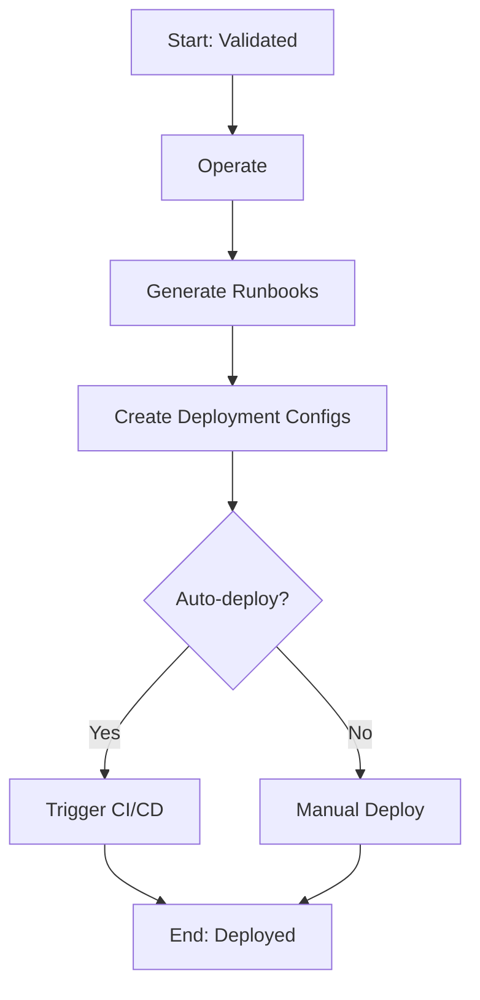

# /flow:meta-run - Run Meta-Workflow

**Version**: 1.0.0
**Command**: `/flow:meta-run`
**Summary**: Deploy It - Production deployment and operational readiness

## Purpose

The **Run** meta-workflow handles deployment and operational readiness of validated features. It ensures features are not just built and tested, but also deployed and maintainable in production environments.

Currently maps 1:1 to the `operate` workflow, but provides a foundation for future enhancements like auto-deployment and monitoring setup.

## What It Does

Executes in sequence:
1. **Operate** (`/flow:operate`) - Deploy to production and create operational artifacts

## Input/Output

**Input State**: `Validated`
**Output State**: `Deployed`

**Artifacts Created**:
- `docs/runbooks/{feature}-runbook.md` - Operational runbook
- `deploy/` - Deployment manifests (Kubernetes YAML, Terraform, etc.)
- `.logs/deployment/{feature}-deploy.log` - Deployment execution log

## Usage

### Basic Usage

```bash
/flow:meta-run
```

This will:
- Auto-detect current feature from branch name
- Generate deployment configurations
- Create operational runbooks
- (Future) Trigger CI/CD pipeline
- (Future) Set up monitoring/alerts
- Update task state to "Deployed"

### With Options

```bash
/flow:meta-run --task-id task-123
/flow:meta-run --environment production
/flow:meta-run --dry-run
/flow:meta-run --auto-deploy
```

**Options**:
- `--task-id <ID>`: Specify task ID (default: auto-detect from branch)
- `--environment <ENV>`: Target environment (default: production)
- `--dry-run`: Generate artifacts without deploying
- `--auto-deploy`: Automatically trigger deployment (future)

## Sub-Workflow Execution

### 1. Operate (Required)
- **Command**: `/flow:operate`
- **Agent**: @sre-agent
- **Output**: Runbooks + deployment configs
- **Skippable**: No

## Execution Flow



## Operational Artifacts

### Runbook Template
The runbook includes:
- **Service Overview**: What the feature does
- **Architecture**: Components and dependencies
- **Deployment Steps**: How to deploy manually
- **Rollback Procedure**: How to revert if needed
- **Monitoring**: What to monitor and alert on
- **Troubleshooting**: Common issues and resolutions
- **On-call Procedures**: Who to contact and when

### Deployment Manifests
Generated based on project type:
- **Kubernetes**: `deploy/k8s/{feature}-deployment.yaml`
- **Docker Compose**: `deploy/docker-compose.{feature}.yml`
- **Terraform**: `deploy/terraform/{feature}.tf`
- **AWS CDK**: `deploy/cdk/{feature}-stack.ts`

## Future Enhancements

The Run meta-workflow is designed for future expansion:

### Planned Features
1. **Auto-Deployment**
   - Trigger CI/CD pipeline automatically
   - Monitor deployment progress
   - Auto-rollback on failure

2. **Monitoring Setup**
   - Create Prometheus alerts
   - Set up Grafana dashboards
   - Configure PagerDuty/Opsgenie

3. **Canary Deployments**
   - Progressive rollout
   - Traffic splitting
   - Health check monitoring

4. **Infrastructure Provisioning**
   - Auto-create cloud resources
   - Set up databases, queues, etc.
   - Configure networking/security groups

## Error Handling

### Deployment Failure
If deployment fails:
- State remains "Validated"
- Review deployment logs
- Fix issues (config errors, resource limits, etc.)
- Re-run `/flow:meta-run`

### Rollback
If deployed feature has issues:
- Use `--rollback` flag to revert
- State transitions: Deployed → Validated
- Previous version is restored
- Incident postmortem triggered

## When to Use This vs. Granular Commands

**Use Meta-Workflow (`/flow:meta-run`) when**:
- ✅ Deploying a validated feature to production
- ✅ You want operational artifacts generated automatically
- ✅ You prefer streamlined deployment process
- ✅ You're following the full SDD workflow

**Use Granular Command (`/flow:operate`) when**:
- 🔧 Re-generating runbooks after updates
- 🔧 Updating deployment configs only
- 🔧 You have custom deployment orchestration
- 🔧 You need fine-grained control

## Cross-Tool Compatibility

### Claude Code
```bash
/flow:meta-run
```

### GitHub Copilot
```
@flowspec /flow:meta-run --environment production
```

### Cursor
```
@flowspec /flow:meta-run
```

### Gemini Code
```
flowspec meta-run --dry-run
```

## Configuration

Meta-workflow behavior is controlled by `flowspec_workflow.yml`:

```yaml
meta_workflows:
  run:
    command: "/flow:meta-run"
    sub_workflows:
      - workflow: "operate"
        required: true
    input_state: "Validated"
    output_state: "Deployed"
    orchestration:
      mode: "sequential"
      stop_on_error: true
```

## Events Emitted

```jsonl
{"event": "meta_workflow.started", "meta_workflow": "run", "timestamp": "..."}
{"event": "sub_workflow.started", "workflow": "operate", "timestamp": "..."}
{"event": "deployment.started", "environment": "production", "timestamp": "..."}
{"event": "deployment.completed", "success": true, "timestamp": "..."}
{"event": "sub_workflow.completed", "workflow": "operate", "success": true, "timestamp": "..."}
{"event": "meta_workflow.completed", "meta_workflow": "run", "success": true, "final_state": "Deployed", "timestamp": "..."}
```

## Best Practices

1. **Always validate before deploying**
   - Never skip the Build meta-workflow
   - Ensure quality gates pass

2. **Use dry-run first**
   - Review generated configs before actual deployment
   - Catch configuration errors early

3. **Monitor deployments**
   - Watch logs and metrics during deployment
   - Have rollback plan ready

4. **Document operational procedures**
   - Keep runbooks up to date
   - Include troubleshooting guides

5. **Automate where possible**
   - Use CI/CD for deployments
   - Set up automated monitoring

## See Also

- `/flow:meta-research` - Planning and design meta-workflow
- `/flow:meta-build` - Implementation and validation meta-workflow
- `docs/adr/003-meta-workflow-simplification.md` - Design rationale
- `flowspec_workflow.yml` - Configuration reference
