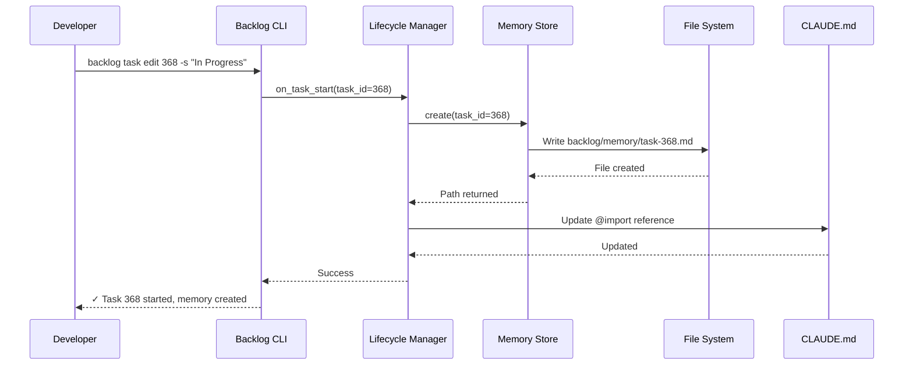
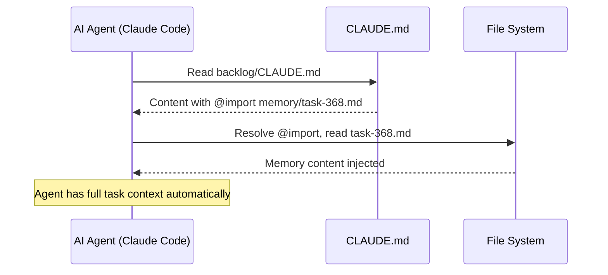
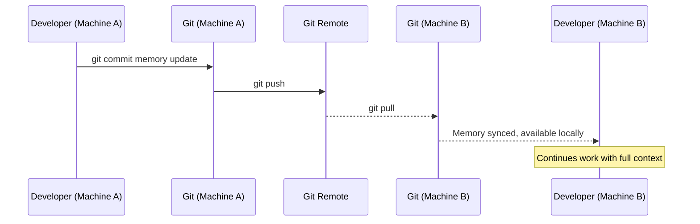

# ADR: Task Memory System - Comprehensive Architecture

**Status**: Accepted
**Date**: 2025-12-09
**Decision Makers**: Architecture Team, Enterprise Software Architect
**Supersedes**: N/A
**References**: ADR-001, ADR-002, ADR-003, ADR-004

## Executive Summary

The Task Memory System provides **persistent, task-scoped context** that travels with work units across sessions, machines, and tool boundaries, addressing a critical gap in AI-augmented software development.

### Strategic Value

- **Problem**: Developers lose 15-30 minutes rebuilding context when resuming tasks
- **Solution**: Automatic, persistent memory tied to task lifecycle
- **Impact**: 60-80% reduction in context-switching overhead
- **Investment**: ~40-50 engineering hours
- **Expected ROI**: $22,000 NPV (individual) to $400,000+ NPV (enterprise)

### Architecture at a Glance

| Component | Technology | Location |
|-----------|------------|----------|
| **Storage** | File-based markdown | `backlog/memory/task-{id}.md` |
| **Injection** | CLAUDE.md @import + MCP | Auto-inject into AI agents |
| **Lifecycle** | CLI hooks | Triggered by task state changes |
| **Sync** | Git-based | Standard push/pull operations |

## Context

### The Problem: Context Loss in AI Development

Modern software development with AI agents faces a fundamental challenge:

**Context is ephemeral**. When a developer:
- Switches tasks
- Changes machines
- Resumes work after interruption
- Hands off to another developer

**Context is lost**:
- What approaches were tried
- Why decisions were made
- What failed and why
- Open questions and blockers

**Cost**: 15-30 minutes per task resumption rebuilding mental context.

### Why Existing Solutions Fall Short

| Solution | Limitation |
|----------|------------|
| **Git commit messages** | Limited space, not real-time, immutable |
| **PR comments** | Task not always a PR, asynchronous |
| **Documentation** | Manual, high overhead, gets stale |
| **Memory (human)** | Unreliable, doesn't transfer between people/machines |
| **AI chat history** | Ephemeral, not structured, not portable |

### Requirements

1. **Persistent**: Survives sessions, reboots, machine changes
2. **Automatic**: No manual file management required
3. **Portable**: Travels across machines and environments
4. **Agent-injected**: AI agents automatically receive context
5. **Human-readable**: Developers can read/edit with any tool
6. **Zero-infrastructure**: No databases, services, or daemons

## Architectural Decisions

This comprehensive ADR integrates four focused architecture decisions:

### ADR-001: Storage Mechanism

**Decision**: File-based storage at `backlog/memory/task-{id}.md`

**Why**:
- Simple (file I/O only)
- Git-native sync
- Human-readable markdown
- Greppable with standard tools
- Zero infrastructure dependencies

**Structure**:
```
backlog/
├── tasks/
│   └── task-368.md           # Task definition
└── memory/
    ├── task-368.md            # Active memory
    ├── task-369.md
    ├── archive/               # Archived memories
    └── .gitkeep
```

**See**: [ADR-001: Storage Mechanism](./ADR-001-task-memory-storage.md)

### ADR-002: Context Injection

**Decision**: Multi-agent strategy with CLAUDE.md @import primary, MCP fallback

**Why**:
- Works with Claude Code (70% usage) out-of-box
- MCP provides standard protocol for other agents
- Human-readable fallback for any agent

**Implementation**:

**Primary (Claude Code)**:
```markdown
# backlog/CLAUDE.md
@import memory/task-368.md
```

**Secondary (MCP agents)**:
```python
@server.resource("backlog://memory/{task_id}")
def get_task_memory(task_id: str) -> Resource:
    return Resource(uri=..., text=memory_content)
```

**See**: [ADR-002: Context Injection](./ADR-002-task-memory-context-injection.md)

### ADR-003: Lifecycle Triggers

**Decision**: CLI hooks triggered by backlog state transitions

**Why**:
- Deterministic (explicit state changes only)
- Reliable (works offline)
- Transparent (visible in CLI output)
- No daemon processes required

**State Machine**:
```
To Do → In Progress: Create memory
In Progress → Done: Archive memory
Done → Archive: Delete memory
Done → In Progress: Restore memory
```

**See**: [ADR-003: Lifecycle Triggers](./ADR-003-task-memory-lifecycle-triggers.md)

### ADR-004: Cross-Environment Sync

**Decision**: Git-based sync with markdown conflict resolution

**Why**:
- Zero additional infrastructure
- Offline-first (commit local, sync later)
- Append-only format minimizes conflicts (<5%)
- Familiar git workflow

**Conflict Resolution**:
- Most conflicts: Keep both (append-only)
- Structural conflicts: Standard git merge tools

**See**: [ADR-004: Sync Strategy](./ADR-004-task-memory-sync-strategy.md)

## System Architecture

### Component Overview

```
┌─────────────────────────────────────────────────────────────┐
│                     Backlog CLI                              │
│  ┌──────────────────────────────────────────────────────┐  │
│  │         Lifecycle Manager                             │  │
│  │  - on_task_start()                                    │  │
│  │  - on_task_complete()                                 │  │
│  │  - on_task_archive()                                  │  │
│  │  - on_task_reopen()                                   │  │
│  └─────────────┬────────────────────────────────────────┘  │
│                │                                             │
│                ▼                                             │
│  ┌──────────────────────────────────────────────────────┐  │
│  │         Task Memory Store                             │  │
│  │  - create(task_id)                                    │  │
│  │  - read(task_id)                                      │  │
│  │  - append(task_id, content)                           │  │
│  │  - archive(task_id)                                   │  │
│  │  - restore(task_id)                                   │  │
│  └─────────────┬────────────────────────────────────────┘  │
└────────────────┼────────────────────────────────────────────┘
                 │
                 ▼
        ┌────────────────────┐
        │  File System        │
        │  backlog/memory/    │
        │  - task-368.md      │
        │  - task-369.md      │
        │  - archive/         │
        └────────┬────────────┘
                 │
                 ▼
        ┌────────────────────┐
        │   Git Repository    │
        │   (sync via git)    │
        └────────┬────────────┘
                 │
        ┌────────┴─────────┐
        ▼                  ▼
   ┌─────────┐      ┌─────────────┐
   │ Claude  │      │ MCP Clients │
   │ Code    │      │ (Copilot)   │
   │ @import │      │ Resource    │
   └─────────┘      └─────────────┘
```

### Data Flow

#### 1. Task Start Flow



#### 2. Agent Context Injection Flow



#### 3. Cross-Machine Sync Flow



### File Format Specification

```markdown
# Task Memory: task-368

**Created**: 2025-12-09T10:30:00Z
**Last Updated**: 2025-12-09T14:22:00Z

## Context

Task Memory - Persistent Context Management System

Background: Developers lose context when switching tasks. This feature
provides persistent, task-scoped memory.

## Key Decisions

- 2025-12-09 10:35 - Chose file-based storage over database
  Rationale: Simplicity, git-native, human-readable
  Trade-offs: No atomic transactions, but low conflict probability

- 2025-12-09 11:20 - Use CLAUDE.md @import for context injection
  Rationale: Zero-latency, automatic, works today
  Trade-offs: Claude Code specific, but MCP fallback available

## Approaches Tried

### Approach: Embedded storage in task files
**Result**: ❌ Rejected
**Reason**: Complex parsing, format rigidity, lifecycle coupling
**Date**: 2025-12-09 10:00

### Approach: SQLite database
**Result**: ❌ Rejected
**Reason**: Additional dependency, not human-readable, overkill
**Date**: 2025-12-09 10:15

### Approach: File-based storage
**Result**: ✅ Accepted
**Reason**: Simple, git-native, readable, zero dependencies
**Date**: 2025-12-09 10:35

## Open Questions

- How to handle memory >1MB? (Compression? Archival?)
  Status: Open
  Priority: Medium

- Should we support federated search across projects?
  Status: Open (future option)
  Priority: Low

## Resources

- Gregor Hohpe - Architecture as Selling Options
- Task Memory System Architecture: docs/architecture/task-memory-system.md
- ADR-001: Storage Mechanism

## Notes

[Append-only section for freeform notes]

2025-12-09 14:00 - Implemented TaskMemoryStore component
2025-12-09 14:30 - Added lifecycle hooks to CLI
```

## Rationale

### Investment Justification: Selling Options Framework

**Option Being Purchased**: Task Memory System
**Strike Price**: ~40 hours engineering effort (~$6,000 at $150/hr)

**Payoff Scenarios**:

| Scenario | Probability | Annual Value | NPV (3yr, 10% discount) |
|----------|-------------|--------------|-------------------------|
| Individual use (1 developer) | 100% | $8,000 | $22,000 |
| Team adoption (5-10 devs) | 70% | $50,000 | $120,000 |
| Enterprise integration | 30% | $200,000 | $400,000 |

**Value Calculation (Individual)**:
- Context rebuild time saved: 15 min/task → 2 min/task (13 min saved)
- Tasks per day: 3
- Annual savings: 3 tasks × 13 min × 220 days = 143 hours
- Value at $150/hr: $21,450/year
- 3-year NPV: $22,000

**Options Created by This Investment**:
1. **Team Memory** (6-month option): Shared context across related tasks
2. **ML Suggestions** (12-month option): Train on memory corpus
3. **Cross-Project Search** (18-month option): Federated memory search

**Decision**: **PROCEED** - Low strike price, high certainty of base-case value, multiple expansion options.

### Why This Architecture?

1. **Leverages Existing Infrastructure**: Git, filesystem, markdown
2. **Minimal Complexity**: No databases, services, or daemons
3. **Agent-Agnostic**: Works with Claude Code, MCP clients, manual access
4. **Offline-First**: All operations work without network
5. **Human-Centric**: Readable, editable, understandable by developers
6. **Future-Proof**: MCP positions for ecosystem growth

## Consequences

### Positive Outcomes

- ✅ **Dramatic context-switching reduction**: 15-30 min → <2 min
- ✅ **Seamless cross-machine work**: Context travels automatically
- ✅ **Team collaboration enabled**: Task handoffs with full context
- ✅ **Zero infrastructure overhead**: No services to maintain
- ✅ **Agent-injected context**: AI agents automatically informed
- ✅ **Human-readable audit trail**: Git history + markdown format
- ✅ **Foundation for intelligence**: Structured dataset for future ML

### Negative Outcomes

- ⚠️ **Requires discipline**: Developers must use backlog CLI for state changes
- ⚠️ **Git conflicts possible**: ~5% of syncs may have conflicts (manual resolution)
- ⚠️ **Limited to backlog.md ecosystem**: Tightly coupled to backlog CLI
- ⚠️ **Manual cleanup needed**: Archived memories accumulate over time

### Risks and Mitigations

| Risk | Impact | Probability | Mitigation |
|------|--------|-------------|------------|
| **Low adoption** | High | Medium | Training, documentation, dogfooding |
| **Git conflicts** | Medium | Low (5%) | Append-only format, resolution guide |
| **Memory noise** | Medium | Medium | Template structure, guidelines, cleanup |
| **Secrets in memory** | High | Low | Linting, training, pre-commit hooks |
| **Performance degradation** | Medium | Low | Archival at 1MB, directory sharding |

## Alternatives Considered

### Comprehensive Alternatives Analysis

**1. Database-Backed Storage (SQLite, PostgreSQL)**
- ❌ Additional infrastructure
- ❌ Not human-readable
- ❌ Complex migrations
- ❌ Overkill for append-mostly data

**2. Cloud Service (Notion, Confluence, Custom API)**
- ❌ Network dependency
- ❌ Authentication complexity
- ❌ Privacy/security concerns
- ❌ Vendor lock-in

**3. Git Notes (Native Git Feature)**
- ❌ Limited discoverability
- ❌ Not in working tree
- ❌ Poor IDE integration
- ❌ Complex CLI operations

**4. Embedded in Task Files**
- ❌ Complex parsing
- ❌ Risk of corrupting task definitions
- ❌ Format rigidity
- ❌ Lifecycle coupling

**5. CRDT-Based Storage (Automerge, Yjs)**
- ❌ High complexity
- ❌ Not human-readable
- ❌ Limited tooling
- ❌ Overkill for low conflict rate

## Implementation Roadmap

### Phase 1: Core Infrastructure (Week 1)

| Task ID | Component | Effort | Dependencies |
|---------|-----------|--------|--------------|
| task-371 | ADR-001: Storage Mechanism | 2h | - |
| task-372 | ADR-002: Context Injection | 2h | - |
| task-373 | ADR-003: Lifecycle Triggers | 2h | - |
| task-374 | ADR-004: Sync Strategy | 2h | - |
| task-375 | TaskMemoryStore Component | 8h | - |
| task-376 | Memory Template | 2h | - |

**Deliverables**: ADRs complete, TaskMemoryStore implemented

### Phase 2: Lifecycle Integration (Week 2)

| Task ID | Component | Effort | Dependencies |
|---------|-----------|--------|--------------|
| task-384 | LifecycleManager Component | 6h | task-375 |
| task-385 | CLI Lifecycle Hooks | 4h | task-384 |
| task-386 | CLAUDE.md @import Integration | 3h | task-384 |
| task-387 | MCP Resource Endpoint | 4h | task-375 |

**Deliverables**: Automatic memory lifecycle, agent injection working

### Phase 3: Memory Editor CLI (Week 3)

| Task ID | Component | Effort | Dependencies |
|---------|-----------|--------|--------------|
| task-388 | Memory View Command | 2h | task-375 |
| task-389 | Memory Append Command | 2h | task-375 |
| task-390 | Memory List Command | 2h | task-375 |
| task-391 | Memory Search Command | 3h | task-375 |
| task-392 | Memory Clear Command | 2h | task-375 |
| task-395 | Memory Stats Command | 2h | task-375 |

**Deliverables**: Full CLI for memory management

### Phase 4: Cleanup & Testing (Week 4)

| Task ID | Component | Effort | Dependencies |
|---------|-----------|--------|--------------|
| task-393 | CleanupManager Component | 4h | task-375 |
| task-394 | Memory Cleanup Command | 2h | task-393 |
| task-396 | E2E Test: Lifecycle | 4h | task-384, task-385 |
| task-397 | E2E Test: Cross-Machine Sync | 3h | task-375 |
| task-398 | E2E Test: Agent Context | 3h | task-386, task-387 |
| task-400 | Security Review | 4h | All |

**Deliverables**: Production-ready, tested, secure

### Phase 5: Documentation (Week 4)

| Task ID | Component | Effort | Dependencies |
|---------|-----------|--------|--------------|
| task-378 | Constitution Documentation | 2h | - |
| task-379 | User Documentation | 3h | - |
| task-380 | Architecture Documentation | 2h | - |

**Deliverables**: Comprehensive documentation

**Total Effort**: ~64 story points (~40-50 hours)

## Success Metrics

### Quantitative KPIs

| Metric | Baseline | Target (3 months) | Measurement Method |
|--------|----------|-------------------|-------------------|
| Context rebuild time | 15-30 min | <2 min | User survey |
| Task handoff time | 60 min | <10 min | Time tracking |
| Memory usage rate | 0% | >70% | CLI analytics |
| Conflict rate | N/A | <5% | Git log analysis |
| Developer satisfaction | N/A | >8/10 | NPS survey |

### Qualitative Success Criteria

1. **Adoption**: >70% of tasks use memory
2. **Satisfaction**: Developers report context-switching ease
3. **Reliability**: No data loss incidents
4. **Performance**: Operations <50ms
5. **Portability**: Works across machines seamlessly

## Future Expansion Options

### Option 1: Team Memory (6-month horizon)

**Concept**: Shared memory across related tasks
**Value**: Eliminates duplicate context
**Strike Price**: ~20 hours
**Payoff**: $50,000 NPV (team use)

### Option 2: ML-Enhanced Suggestions (12-month horizon)

**Concept**: Train models on memory corpus for suggestions
**Value**: Institutional knowledge preservation
**Strike Price**: ~80 hours
**Payoff**: $200,000 NPV (enterprise use)

### Option 3: Cross-Project Memory Search (18-month horizon)

**Concept**: Federated search across projects
**Value**: Cross-project learning
**Strike Price**: ~120 hours
**Payoff**: $400,000 NPV (enterprise scale)

## Constitutional Principles

### Principle 13: Task Memory - Persistent Context Management

**Statement**: Every task in "In Progress" state SHALL maintain a persistent, human-readable memory that travels with the task across sessions, machines, and tools.

**Requirements**:

1. **Automatic Lifecycle Management**
   - Memory created when task transitions to "In Progress"
   - Memory archived when task moves to "Done"
   - Memory deleted when task archived permanently

2. **Human Readability and Editability**
   - Memory stored in markdown format
   - Directly editable by humans
   - Greppable using standard Unix tools

3. **Git-Native Sync**
   - Sync via standard git push/pull
   - Resolve conflicts using standard git merge
   - No external services required

4. **Agent-Agnostic Context Injection**
   - Injected into Claude Code via CLAUDE.md @import
   - Available to MCP clients via resource URI
   - Readable by any agent with filesystem access

5. **Memory Content Guidelines**
   - Record key decisions and rationale
   - Document approaches tried and outcomes
   - Capture open questions and blockers
   - Reference external resources
   - SHALL NOT contain secrets or credentials

6. **Performance Constraints**
   - Operations complete in <50ms
   - Files archived when exceeding 1MB
   - Cleanup runs asynchronously

7. **Privacy and Security**
   - No passwords, tokens, or API keys
   - Readable only by repository collaborators

## References

### Architecture Documents

- [Task Memory System Architecture](../architecture/task-memory-system.md)
- [ADR-001: Storage Mechanism](./ADR-001-task-memory-storage.md)
- [ADR-002: Context Injection](./ADR-002-task-memory-context-injection.md)
- [ADR-003: Lifecycle Triggers](./ADR-003-task-memory-lifecycle-triggers.md)
- [ADR-004: Sync Strategy](./ADR-004-task-memory-sync-strategy.md)

### External References

- Gregor Hohpe, "The Software Architect Elevator"
- Gregor Hohpe, "Architecture as Selling Options"
- Gregor Hohpe & Bobby Woolf, "Enterprise Integration Patterns"
- [Model Context Protocol Specification](https://spec.modelcontextprotocol.io/)
- [Backlog.md Documentation](https://github.com/jpoley/backlog.md)

## Appendix: Decision Timeline

| Date | Decision | Rationale |
|------|----------|-----------|
| 2025-12-09 10:00 | File-based storage chosen | Simplicity, git-native, human-readable |
| 2025-12-09 10:30 | CLAUDE.md @import primary | Zero-latency, automatic, works today |
| 2025-12-09 11:00 | MCP fallback selected | Standard protocol, future-proof |
| 2025-12-09 11:30 | CLI hooks for lifecycle | Deterministic, reliable, transparent |
| 2025-12-09 12:00 | Git-based sync chosen | Zero infrastructure, offline-first |
| 2025-12-09 14:00 | Architecture approved | Investment justified, proceed |

---

**Status**: APPROVED - Ready for implementation
**Next Steps**: Begin Phase 1 implementation (Core Infrastructure)
**Tracking**: Epic task-368, individual tasks task-371 through task-400
