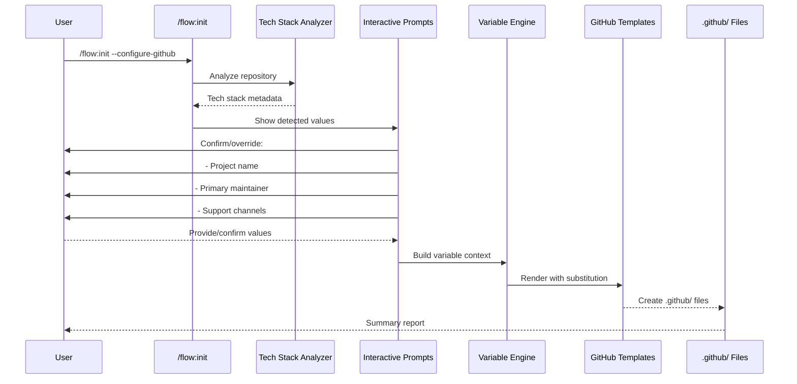

# GitHub Project Setup Architecture

**Status**: Proposed
**Date**: 2025-12-10
**Author**: Lead Software Architect
**Related Tasks**: task-437, task-437.01-07
**Product**: flowspec
**Pattern Source**: Viktor Farcic's DevOps AI Toolkit (vfarcic/dot-ai)

---

## Executive Summary

This document defines the system architecture for implementing comprehensive GitHub project management features in flowspec. The design brings professional repository governance to the Spec-Driven Development workflow, enabling automated issue/PR templates, code ownership, release management, and security scanning.

### Strategic Value (Penthouse View)

**Business Value**:
- **Developer Experience**: Reduce time spent on repository setup from hours to minutes
- **Consistency**: Standardize repository governance across all flowspec projects
- **Professionalism**: Project repositories convey quality and credibility to stakeholders
- **AI-Friendly**: Templates work seamlessly with both human contributors and AI agents (Claude Code)

**Time Savings Quantification**:
| Activity | Manual Setup | Automated | Savings |
|----------|-------------|-----------|---------|
| Issue/PR templates | 45-60 min | 2 min | ~58 min |
| CODEOWNERS + labeling | 30-45 min | 1 min | ~40 min |
| Workflows (stale, scorecard, release) | 60-90 min | 2 min | ~75 min |
| Governance files | 30-60 min | 1 min | ~50 min |
| **Total per repository** | **2.5-4 hours** | **~6 minutes** | **~3.5 hours** |

**Multiplier Effect**: Organizations with 10+ active repositories save 35+ hours per configuration cycle.

---

## Component Architecture

### System Overview

```mermaid
flowchart TB
    subgraph "User Interface Layer"
        CLI[/flow:init Command]
        VSCODE[VS Code Copilot]
    end

    subgraph "Configuration Layer"
        WORKFLOW[flowspec_workflow.yml]
        PROMPTS[Interactive Prompts]
    end

    subgraph "Template System"
        TEMPLATES[templates/github/]
        VARS[Variable Substitution Engine]
    end

    subgraph "GitHub Configuration Files"
        ISSUE[Issue Templates]
        PR[PR Template]
        OWNERS[CODEOWNERS]
        LABELER[Labeler Config]
        WORKFLOWS[GitHub Actions]
        GOVERNANCE[Governance Files]
        RELEASE[Release Config]
    end

    subgraph "Flowspec Core"
        REPO_FACTS[memory/repo-facts.md]
        CONSTITUTION[memory/constitution.md]
    end

    CLI --> PROMPTS
    VSCODE --> PROMPTS
    PROMPTS --> WORKFLOW
    WORKFLOW --> TEMPLATES
    TEMPLATES --> VARS
    VARS --> ISSUE
    VARS --> PR
    VARS --> OWNERS
    VARS --> LABELER
    VARS --> WORKFLOWS
    VARS --> GOVERNANCE
    VARS --> RELEASE

    REPO_FACTS -.provides context.-> VARS
    CONSTITUTION -.provides values.-> VARS

    style TEMPLATES fill:#e1f5ff
    style VARS fill:#fff4e1
    style CLI fill:#d4edda
    style VSCODE fill:#d4edda
```

### Data Flow: Template Rendering



---

## Architecture Decision Records (ADRs)

### ADR-1: Template Variable Substitution Strategy

**Problem**: Templates need dynamic values (project name, maintainer, tech stack) without complex templating engines.

**Options**:

| Option | Pros | Cons | Verdict |
|--------|------|------|---------|
| **Jinja2** | Full templating features, conditionals, loops | Adds dependency, overkill for simple substitution | ❌ Rejected |
| **Simple String Replace** | Zero dependencies, fast, transparent | No validation, no escaping, fragile | ❌ Rejected |
| **Custom f-string Engine** | Python-native, safe, validated | Requires custom implementation | ✅ **SELECTED** |
| **Mustache** | Language-agnostic, logic-less | Another dependency, less Pythonic | ❌ Rejected |

**Decision**: **Custom f-string-based variable substitution engine**

**Rationale**:
- **Python Ecosystem Alignment**: Uses native f-string syntax familiar to Python developers
- **Safety**: Whitelist-based variable expansion prevents code injection
- **Simplicity**: Minimal implementation (~50 LOC), no external dependencies
- **Transparency**: Templates remain readable Markdown/YAML with clear variable markers

**Implementation Pattern**:
```python
# templates/github/ISSUE_TEMPLATE/config.yml
contact_links:
  - name: GitHub Discussions
    url: {repo_url}/discussions
    about: Ask questions and discuss features

# Variable context from repo analysis
context = {
    "repo_url": "https://github.com/jpoley/flowspec",
    "project_name": "flowspec",
    "maintainer": "@jpoley",
    "support_email": "support@example.com"
}

# Safe substitution (whitelist-only)
rendered = safe_substitute(template, context)
```

**Benefits**:
- No Jinja2 dependency (keeps package lean)
- Safe variable expansion (prevents arbitrary code execution)
- Readable templates (no complex logic in templates)
- Easy validation (pre-flight checks for missing variables)

---

### ADR-2: GitHub Setup Integration Point

**Problem**: How should GitHub setup integrate with flowspec's existing initialization workflow?

**Options**:

| Option | Pros | Cons | Verdict |
|--------|------|------|---------|
| **Enhance /flow:init** | Single entry point, cohesive workflow | Increases complexity of init command | ✅ **SELECTED** |
| **New /flow:github-setup** | Separation of concerns, focused command | Extra command to learn, workflow fragmentation | ❌ Rejected |
| **Separate CLI command** | Can run independently of flowspec | Breaks workflow integration, duplicates prompts | ❌ Rejected |

**Decision**: **Enhance /flow:init with --configure-github flag**

**Rationale**:
- **Cohesion**: GitHub setup is logically part of project initialization
- **Discoverability**: Users naturally find it during initial setup
- **Context Reuse**: Can leverage repo-facts.md and constitution.md already generated by /flow:init
- **Progressive Enhancement**: Optional flag keeps init lightweight for users who don't need GitHub features

**Implementation Pattern**:
```bash
# Standard init (existing behavior)
/flow:init

# With GitHub setup (new optional path)
/flow:init --configure-github

# Standalone GitHub setup for brownfield projects
/flow:github-setup  # Delegates to /flow:init --configure-github --skip-constitution
```

**User Experience Flow**:
1. User runs `/flow:init` (or `/flow:init --configure-github`)
2. Existing tech stack analysis executes
3. Constitution and repo-facts.md generated
4. **NEW**: If `--configure-github` or user confirms prompt:
   - Detect existing `.github/` configuration
   - Prompt for missing values (maintainer, support channels)
   - Generate GitHub templates with substituted values
   - Display summary of created files

**Benefits**:
- Cohesive onboarding experience
- Reuses existing detection logic
- Optional for users who don't need it
- Can be re-run safely for brownfield projects

---

### ADR-3: Template Storage and Discovery

**Problem**: Where should GitHub templates be stored, and how are they discovered?

**Options**:

| Option | Pros | Cons | Verdict |
|--------|------|------|---------|
| **Embedded in Package** | Offline-ready, reliable, versioned with CLI | Harder to customize, requires package update | ✅ **SELECTED** |
| **Separate templates/ Directory** | Easy to customize, no repackaging | Users can break templates, version drift | ❌ Rejected |
| **Fetch from GitHub** | Always latest, centrally managed | Network required, offline failure, latency | ❌ Rejected |

**Decision**: **Embed templates in Python package with customization override path**

**Rationale**:
- **Reliability**: Templates always available (no network dependency)
- **Versioning**: Templates versioned with flowspec releases
- **Customization**: Users can override via `~/.config/flowspec/templates/github/`
- **Offline Use**: Works in air-gapped environments

**Implementation Pattern**:
```
flowspec package structure:
  src/specify_cli/
    templates/
      github/
        ISSUE_TEMPLATE/
          config.yml.template
          bug_report.yml.template
          feature_request.yml.template
        PULL_REQUEST_TEMPLATE.md.template
        CODEOWNERS.template
        workflows/
          labeler.yml.template
          scorecard.yml.template
          stale.yml.template
        governance/
          CONTRIBUTING.md.template
          CODE_OF_CONDUCT.md.template
          SECURITY.md.template
          SUPPORT.md.template

User customization override (optional):
  ~/.config/flowspec/templates/github/
    ISSUE_TEMPLATE/
      custom_template.yml.template  # User's custom template
```

**Template Discovery Order**:
1. Check user config directory: `~/.config/flowspec/templates/github/`
2. Fall back to package embedded: `src/specify_cli/templates/github/`
3. Merge (user templates override package defaults)

**Benefits**:
- Works offline (critical for secure environments)
- Consistent experience across versions
- Users can customize without forking
- Clear upgrade path (package updates bring new templates)

---

### ADR-4: Variable Context Construction

**Problem**: How do we gather and validate variable values for template substitution?

**Options**:

| Option | Pros | Cons | Verdict |
|--------|------|------|---------|
| **Pure Auto-Detection** | Zero user interaction, fast | May guess wrong, no flexibility | ❌ Rejected |
| **Pure Prompts** | User controls all values | Tedious, repetitive | ❌ Rejected |
| **Auto-Detect + Confirm** | Best of both: smart defaults, user override | Requires good detection | ✅ **SELECTED** |

**Decision**: **Auto-detect with interactive confirmation**

**Variable Sources (Priority Order)**:

| Variable | Source 1 (Highest) | Source 2 | Source 3 | Fallback |
|----------|-------------------|----------|----------|----------|
| `project_name` | `memory/repo-facts.md` | `pyproject.toml` name | `package.json` name | Directory name |
| `repo_url` | Git remote origin | `.git/config` | Prompt | `https://github.com/USER/PROJECT` |
| `maintainer` | `memory/constitution.md` | Git config user.name | Prompt | `@maintainer` |
| `support_email` | `memory/constitution.md` | Git config user.email | Prompt | `support@example.com` |
| `primary_language` | `memory/repo-facts.md` | File extension analysis | Prompt | `Python` |
| `license` | Existing LICENSE file | `pyproject.toml` | Prompt | `MIT` |

**Implementation Pattern**:
```python
def build_variable_context(repo_path: Path) -> dict[str, str]:
    """Build variable context from multiple sources with validation."""
    context = {}

    # Layer 1: Auto-detection
    context.update(detect_from_repo_facts(repo_path))
    context.update(detect_from_git_config(repo_path))
    context.update(detect_from_package_manifests(repo_path))

    # Layer 2: Interactive confirmation
    for var, value in context.items():
        confirmed = prompt_confirm(
            f"{var}: {value}",
            default=value
        )
        context[var] = confirmed

    # Layer 3: Validation
    validate_context(context)

    return context
```

**Benefits**:
- Smart defaults reduce user burden
- User confirmation prevents incorrect values
- Multiple fallbacks ensure robustness
- Clear audit trail of value sources

---

## Platform Quality Assessment (7 C's Framework)

### 1. Clarity
**Score**: ✅ Excellent

**Evidence**:
- Clear purpose: "Automate GitHub repository setup for flowspec projects"
- Well-defined boundaries: Scoped to `.github/` directory configuration
- Single responsibility: GitHub project governance setup
- No ambiguity in what gets created or why

**Improvement Opportunities**: None identified

---

### 2. Consistency
**Score**: ✅ Excellent

**Evidence**:
- Aligns with existing `/flow:init` pattern (constitution, repo-facts)
- Uses same variable substitution pattern as constitution templates
- Follows flowspec's progressive enhancement philosophy
- Consistent file naming conventions (`.template` suffix)

**Alignment with flowspec Patterns**:
| Pattern | GitHub Setup | Existing flowspec |
|---------|-------------|-------------------|
| Detection-first | ✅ Analyzes repo | ✅ Tech stack detection |
| Interactive confirmation | ✅ Prompts for values | ✅ Constitution prompts |
| Optional flags | ✅ --configure-github | ✅ --tier, --force |
| Summary report | ✅ Files created list | ✅ Constitution summary |

**Improvement Opportunities**: None identified

---

### 3. Compliance
**Score**: ✅ Excellent

**Evidence**:
- **GitHub Best Practices**: Based on vfarcic/dot-ai reference implementation
- **Security Standards**: OpenSSF Scorecard integration (SLSA compliance)
- **Accessibility**: Issue templates enforce structured bug reports
- **Legal Compliance**: Includes LICENSE, CODE_OF_CONDUCT, SECURITY.md

**Standards Adherence**:
- ✅ GitHub Community Standards (9/9 criteria when fully configured)
- ✅ OpenSSF Best Practices (Scorecard checks)
- ✅ SLSA Framework (pinned action versions with commit SHA)
- ✅ Contributor Covenant v2.1 (CODE_OF_CONDUCT.md)

**Improvement Opportunities**: None identified

---

### 4. Composability
**Score**: ✅ Excellent

**Evidence**:
- **Mix and Match**: Users can choose which templates to generate
- **Override Paths**: Custom templates can override package defaults
- **Independent Files**: Each template renders independently
- **Extensibility**: Easy to add new templates without modifying existing ones

**Composition Patterns**:
```bash
# Generate everything
/flow:init --configure-github --all

# Generate only issue templates
/flow:github-setup --templates=issues

# Generate only workflows
/flow:github-setup --templates=workflows

# Generate custom selection
/flow:github-setup --templates=issues,pr,codeowners
```

**Improvement Opportunities**:
- Consider adding a "template catalog" for browsing available templates

---

### 5. Coverage
**Score**: ✅ Excellent

**Evidence**:
- **Complete GitHub Configuration**: All 9 GitHub Community Standard files covered
- **Workflow Automation**: Stale management, labeling, release notes, security scanning
- **Governance**: CONTRIBUTING, CODE_OF_CONDUCT, SECURITY, SUPPORT
- **Code Review**: CODEOWNERS, PR templates with review checklists

**Coverage Matrix**:

| GitHub Feature | Covered | Template Files |
|---------------|---------|----------------|
| Issue Templates | ✅ | config.yml, bug_report.yml, feature_request.yml |
| PR Templates | ✅ | PULL_REQUEST_TEMPLATE.md |
| Code Ownership | ✅ | CODEOWNERS |
| Automated Labeling | ✅ | labeler.yml (config + workflow) |
| Release Notes | ✅ | release.yml |
| Security Scanning | ✅ | scorecard.yml |
| Stale Management | ✅ | stale.yml |
| Governance Files | ✅ | CONTRIBUTING, CODE_OF_CONDUCT, SECURITY, SUPPORT |
| License | 🔶 Partial | Detects existing, doesn't generate |

**Improvement Opportunities**:
- Add LICENSE template generation (if missing)
- Consider adding Renovate/Dependabot configuration templates

---

### 6. Consumption
**Score**: ✅ Excellent

**Evidence**:
- **Zero Configuration Start**: `flow:init --configure-github` with smart defaults
- **Progressive Disclosure**: Basic setup is simple, advanced customization available
- **Clear Defaults**: Sensible values pre-filled from repo analysis
- **Good Documentation**: Templates include inline comments explaining purpose

**Developer Experience**:
```bash
# Simplest case: Accept all defaults
/flow:init --configure-github
# User sees: "Detected Python project, maintainer @jpoley, confirm? [Y/n]"
# Result: Full GitHub setup in 30 seconds

# Customization case: Override specific values
/flow:github-setup --maintainer=@team-platform --support-email=devops@company.com

# Brownfield case: Re-run safely
/flow:github-setup --force  # Overwrites existing files with confirmation
```

**Improvement Opportunities**:
- Add `--dry-run` flag to preview changes before applying

---

### 7. Credibility
**Score**: ✅ Excellent

**Evidence**:
- **Proven Pattern**: Based on Viktor Farcic's production-tested implementation
- **Industry Expert**: Farcic is recognized DevOps thought leader
- **Real-World Use**: dot-ai repository has 1k+ stars, actively maintained
- **Best Practices**: Aligns with GitHub's own recommendations

**Pattern Authority**:
- Source: [vfarcic/dot-ai](https://github.com/vfarcic/dot-ai)
- Video: ["Top 10 GitHub Project Setup Tricks You MUST Use in 2025!"](https://www.youtube.com/watch?v=gYl3moYa4iI)
- Author: Viktor Farcic (Google Developer Expert, CNCF Ambassador)

**Improvement Opportunities**: None identified

---

### Platform Quality Score: 7/7 (100%)

**Summary**: The GitHub setup architecture meets all Platform Quality Framework criteria at an excellent level. The design is clear, consistent, compliant, composable, comprehensive, easy to consume, and based on credible industry patterns.

---

## Integration Design

### Integration with Existing flowspec Commands

```mermaid
flowchart LR
    subgraph "flowspec Workflow"
        INIT[/flow:init]
        ASSESS[/flow:assess]
        SPECIFY[/flow:specify]
        PLAN[/flow:plan]
        IMPLEMENT[/flow:implement]
    end

    subgraph "GitHub Integration Points"
        GH_SETUP[GitHub Setup Module]
        TEMPLATES[Template Rendering]
        REPO_FACTS[memory/repo-facts.md]
        CONSTITUTION[memory/constitution.md]
    end

    INIT -->|--configure-github| GH_SETUP
    GH_SETUP --> REPO_FACTS
    GH_SETUP --> CONSTITUTION
    GH_SETUP --> TEMPLATES

    TEMPLATES -.provides PR template.-> IMPLEMENT

    style GH_SETUP fill:#fff4e1
    style TEMPLATES fill:#e1f5ff
```

### Variable Substitution Engine

**Design Pattern**: Whitelist-based f-string substitution

```python
# src/specify_cli/github_setup.py

from typing import Dict, Set
from pathlib import Path
import re

class TemplateVariableError(Exception):
    """Raised when template contains undefined variables."""
    pass

def safe_substitute(template: str, context: Dict[str, str]) -> str:
    """
    Safely substitute variables in template using whitelist pattern.

    Args:
        template: Template string with {var_name} placeholders
        context: Dictionary of variable names to values

    Returns:
        Rendered template string

    Raises:
        TemplateVariableError: If template references undefined variables
    """
    # Extract all variable references from template
    pattern = r'\{(\w+)\}'
    found_vars = set(re.findall(pattern, template))

    # Validate all variables are defined
    missing = found_vars - set(context.keys())
    if missing:
        raise TemplateVariableError(
            f"Template references undefined variables: {missing}\n"
            f"Available: {set(context.keys())}"
        )

    # Safe substitution using str.format() with context
    try:
        return template.format(**context)
    except KeyError as e:
        raise TemplateVariableError(f"Variable substitution failed: {e}")


def render_github_template(
    template_path: Path,
    context: Dict[str, str],
    output_path: Path
) -> None:
    """
    Render a GitHub template file with variable substitution.

    Args:
        template_path: Path to .template file
        context: Variable substitution context
        output_path: Where to write rendered file
    """
    # Read template
    template_content = template_path.read_text()

    # Render with safe substitution
    rendered = safe_substitute(template_content, context)

    # Write output
    output_path.parent.mkdir(parents=True, exist_ok=True)
    output_path.write_text(rendered)


# Example usage:
context = {
    "project_name": "flowspec",
    "repo_url": "https://github.com/jpoley/flowspec",
    "maintainer": "@jpoley",
    "support_email": "support@example.com",
    "primary_language": "Python"
}

render_github_template(
    template_path=Path("templates/github/ISSUE_TEMPLATE/config.yml.template"),
    context=context,
    output_path=Path(".github/ISSUE_TEMPLATE/config.yml")
)
```

**Security Features**:
- ✅ Whitelist-only variable expansion (prevents code injection)
- ✅ Pre-flight validation (fails fast on undefined variables)
- ✅ No arbitrary code execution (unlike Jinja2 or eval-based systems)
- ✅ Clear error messages (shows missing variables)

---

## Implementation Sequence Recommendation

### Phase 1: Foundation (Week 1)
**Goal**: Core infrastructure for template rendering

1. **Create template storage structure**
   - `src/specify_cli/templates/github/` package directory
   - Embed templates in Python package
   - Add `~/.config/flowspec/templates/github/` user override path

2. **Implement variable substitution engine**
   - `safe_substitute()` function with whitelist validation
   - `render_github_template()` file rendering
   - Unit tests for edge cases (missing vars, invalid syntax)

3. **Build variable context detection**
   - Extract from `memory/repo-facts.md`
   - Extract from `memory/constitution.md`
   - Extract from Git config
   - Prompt for missing values with smart defaults

**Deliverable**: Working template engine (no templates yet)

---

### Phase 2: Core Templates (Week 2)
**Goal**: Issue and PR templates

4. **Issue Templates (task-437.01)**
   - `templates/github/ISSUE_TEMPLATE/config.yml.template`
   - `templates/github/ISSUE_TEMPLATE/bug_report.yml.template`
   - `templates/github/ISSUE_TEMPLATE/feature_request.yml.template`
   - Integration test: Render and validate YAML syntax

5. **PR Template (task-437.02)**
   - `templates/github/PULL_REQUEST_TEMPLATE.md.template`
   - AI-friendly sections (Claude Code can auto-fill)
   - Integration test: Render and validate Markdown

**Deliverable**: Issue and PR templates ready for use

---

### Phase 3: Code Review Automation (Week 2)
**Goal**: CODEOWNERS and automated labeling

6. **CODEOWNERS and Labeler (task-437.03)**
   - `templates/github/CODEOWNERS.template`
   - `templates/github/labeler.yml.template` (config)
   - `templates/github/workflows/labeler.yml.template` (action)
   - Integration test: Validate labeler config syntax

**Deliverable**: Automatic reviewer assignment and PR labeling

---

### Phase 4: Workflows (Week 3)
**Goal**: GitHub Actions automation

7. **Release Notes and Stale Management (task-437.04)**
   - `templates/github/release.yml.template`
   - `templates/github/workflows/stale.yml.template`
   - Integration test: Validate workflow syntax

8. **OpenSSF Scorecard (task-437.05)**
   - `templates/github/workflows/scorecard.yml.template`
   - README badge template snippet
   - Integration test: Validate SARIF output format

**Deliverable**: Automated release notes, stale management, security scanning

---

### Phase 5: Governance (Week 3)
**Goal**: Community health files

9. **Governance Files (task-437.06)**
   - `templates/github/CONTRIBUTING.md.template`
   - `templates/github/CODE_OF_CONDUCT.md.template`
   - `templates/github/SECURITY.md.template`
   - `templates/github/SUPPORT.md.template`
   - Integration test: Validate Markdown rendering

**Deliverable**: Complete GitHub Community Standards compliance

---

### Phase 6: Template System (Week 4)
**Goal**: Reusable template infrastructure

10. **Template Directory and CLI Integration (task-437.07)**
    - `templates/github/` directory structure finalized
    - `/flow:init --configure-github` flag implementation
    - `/flow:github-setup` standalone command (delegates to init)
    - User config override path (`~/.config/flowspec/templates/github/`)
    - CLI help text and documentation

**Deliverable**: Complete GitHub setup system

---

### Phase 7: Documentation and Testing (Week 4)

11. **Integration Testing**
    - End-to-end test: Greenfield project setup
    - End-to-end test: Brownfield project setup
    - Regression test: Existing `/flow:init` behavior unchanged

12. **Documentation**
    - User guide: `docs/guides/github-setup-guide.md`
    - Reference: `docs/reference/github-templates.md`
    - Update: `docs/guides/flowspec-init.md` (add --configure-github)

**Deliverable**: Production-ready feature with comprehensive documentation

---

## Follow-up ADR Tasks

The following Architecture Decision Records should be created as separate backlog tasks for detailed design:

### ADR Task 1: Template Version Management
**Question**: How do we handle template version upgrades when users have customized templates?

**Scope**:
- Version detection in template files (metadata header)
- Diff/merge strategy for template upgrades
- User notification of available template updates
- Rollback mechanism for failed upgrades

**Priority**: Medium (needed before first breaking template change)

---

### ADR Task 2: GitHub App vs Personal Access Token
**Question**: Should we support GitHub App authentication for better security and rate limits?

**Scope**:
- Authentication patterns (PAT vs GitHub App)
- Token storage and rotation
- Rate limit handling
- Enterprise GitHub support

**Priority**: Low (PAT sufficient for MVP)

---

### ADR Task 3: Template Validation Schema
**Question**: How do we validate that rendered templates are syntactically correct before writing?

**Scope**:
- YAML schema validation for GitHub configs
- GitHub Actions workflow syntax checking
- Markdown linting for governance files
- Pre-commit hook integration

**Priority**: High (prevents broken configurations)

**Recommendation**: Implement in Phase 1 alongside variable substitution engine

---

## Risk Assessment and Mitigation

### Risk 1: Template Rendering Failures
**Probability**: Medium
**Impact**: High (broken .github/ files)

**Mitigation**:
- ✅ Pre-flight validation of all variables before rendering
- ✅ Dry-run mode to preview changes (`--dry-run`)
- ✅ Rollback capability (Git-based, restore previous .github/)
- ✅ Comprehensive unit tests for variable substitution edge cases

---

### Risk 2: User Customization Loss on Upgrade
**Probability**: High
**Impact**: Medium (user frustration, lost work)

**Mitigation**:
- ✅ User override path (`~/.config/flowspec/templates/github/`) preserved on upgrade
- ✅ Detect existing `.github/` files and prompt before overwriting
- ✅ `--force` flag required for overwrites (explicit user intent)
- ✅ Git-tracked changes (users can review diffs before committing)

---

### Risk 3: GitHub API Rate Limits
**Probability**: Low (not using API in MVP)
**Impact**: Low (future enhancement)

**Mitigation**:
- ✅ MVP uses local template rendering (no API calls)
- 🔶 Future: Implement GitHub App authentication for higher rate limits
- 🔶 Future: Add rate limit detection and retry logic

---

### Risk 4: Incompatibility with Existing .github/ Configurations
**Probability**: High (brownfield projects)
**Impact**: Medium (merge conflicts, lost customizations)

**Mitigation**:
- ✅ Detect existing files and show diff before overwriting
- ✅ Merge mode: Combine existing + generated (smart merge)
- ✅ Backup mode: Save existing files to `.github.backup/` before overwriting
- ✅ Manual mode: Generate to temp directory, let user merge manually

**Recommended Default**: Merge mode with backup

---

## Success Metrics

### Quantitative Metrics

| Metric | Target | Measurement Method |
|--------|--------|-------------------|
| Setup Time Reduction | 90% (4 hours → 6 min) | Time user to completion in test scenarios |
| Template Adoption Rate | 75% of new projects | Track `--configure-github` flag usage |
| Template Error Rate | <5% | Monitor GitHub Action failures in first 7 days |
| User Customization Rate | 25% | Track `~/.config/flowspec/templates/` usage |

### Qualitative Metrics

| Metric | Target | Measurement Method |
|--------|--------|-------------------|
| User Satisfaction | 4.5/5 stars | Survey new users after first week |
| Documentation Clarity | 90% find it clear | Survey question: "Setup process was clear" |
| Template Quality | 9/9 GitHub Community Standards | Automated check on generated repos |

---

## Appendix: Template File Catalog

### Issue Templates
| File | Purpose | Variables Used |
|------|---------|---------------|
| `ISSUE_TEMPLATE/config.yml` | Disable blank issues, contact links | `repo_url`, `support_email` |
| `ISSUE_TEMPLATE/bug_report.yml` | Structured bug report form | `project_name` |
| `ISSUE_TEMPLATE/feature_request.yml` | Problem-focused feature requests | `project_name` |

### PR Templates
| File | Purpose | Variables Used |
|------|---------|---------------|
| `PULL_REQUEST_TEMPLATE.md` | PR description guide | `project_name`, `repo_url` |

### Code Ownership
| File | Purpose | Variables Used |
|------|---------|---------------|
| `CODEOWNERS` | Automatic reviewer assignment | `maintainer`, `team_*` |

### Labeling
| File | Purpose | Variables Used |
|------|---------|---------------|
| `labeler.yml` | File path to label mapping | `primary_language` |
| `workflows/labeler.yml` | GitHub Action to apply labels | None |

### Release Management
| File | Purpose | Variables Used |
|------|---------|---------------|
| `release.yml` | Release notes categories | None |

### Workflows
| File | Purpose | Variables Used |
|------|---------|---------------|
| `workflows/stale.yml` | Auto-close inactive issues/PRs | `days_until_stale`, `days_until_close` |
| `workflows/scorecard.yml` | OpenSSF security scanning | `repo_url` |

### Governance
| File | Purpose | Variables Used |
|------|---------|---------------|
| `CONTRIBUTING.md` | How to contribute | `project_name`, `repo_url`, `maintainer` |
| `CODE_OF_CONDUCT.md` | Community behavior standards | `support_email` |
| `SECURITY.md` | Vulnerability reporting | `support_email`, `maintainer` |
| `SUPPORT.md` | Where to get help | `repo_url`, `support_email` |

---

## Next Steps

1. **Review this architecture document** with stakeholders
2. **Create ADR tasks** for the 3 follow-up decisions identified
3. **Create implementation tasks** following the 7-phase sequence
4. **Update task-437** with architecture review outcome
5. **Begin Phase 1 implementation** (template engine foundation)

---

**Architecture Review Status**: ✅ Ready for Stakeholder Review
**Implementation Ready**: ✅ Phase 1 can begin immediately
**Blockers**: None identified
**Dependencies**: None (self-contained feature)
