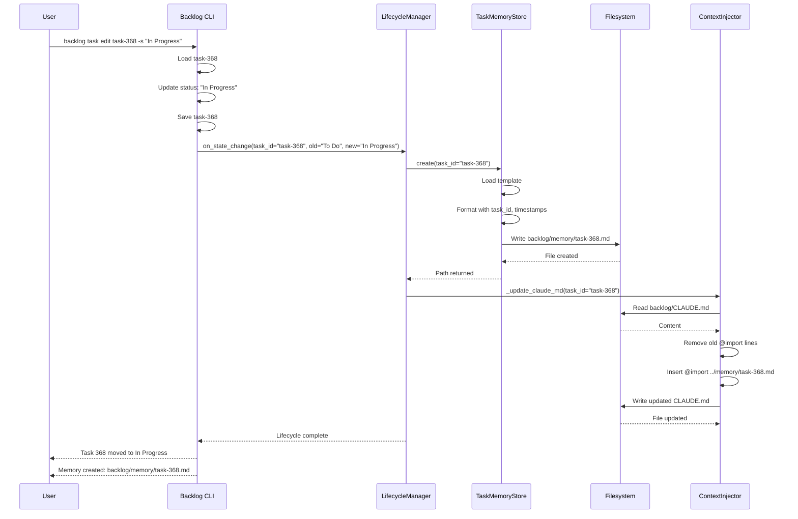
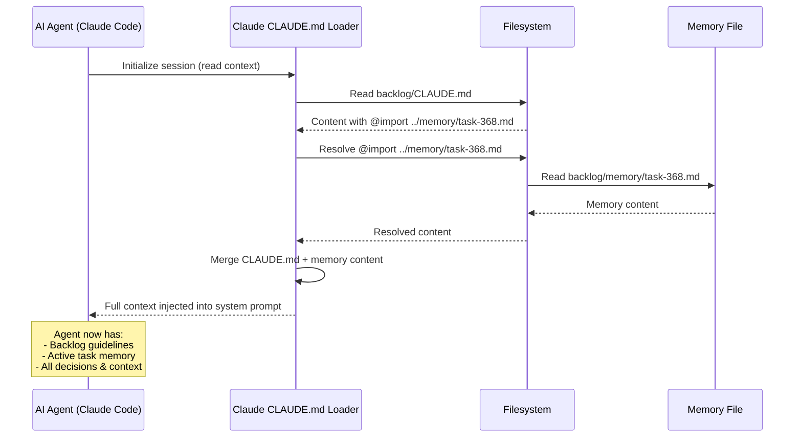
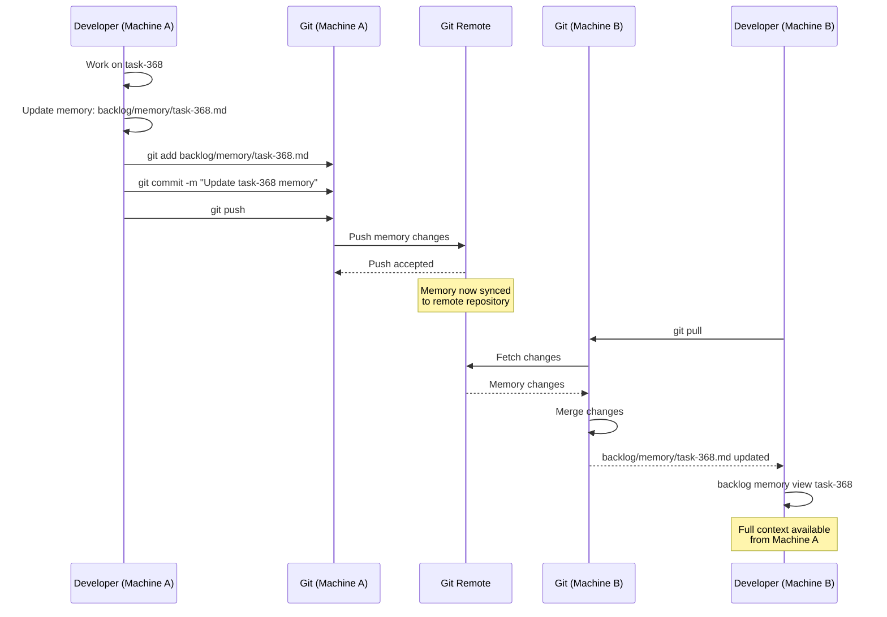

# Task Memory Architecture - Technical Reference

**Version**: 1.0
**Last Updated**: 2025-12-09
**Status**: Approved for Implementation

## Executive Summary

Task Memory provides persistent, task-scoped context management through a lightweight, git-native architecture. This document details the technical implementation including component design, data flows, integration patterns, and extension points.

**Key Architecture Decisions**:
- File-based storage in `backlog/memory/` (ADR-001)
- Multi-agent context injection via CLAUDE.md @import and MCP (ADR-002)
- CLI lifecycle hooks for automatic management (ADR-003)
- Git-native sync with manual conflict resolution (ADR-004)

## System Architecture

### High-Level Overview

```
┌─────────────────────────────────────────────────────────────────────────┐
│                        TASK MEMORY ARCHITECTURE                          │
├─────────────────────────────────────────────────────────────────────────┤
│                                                                          │
│   ┌─────────────────────────────────────────────────────────────────┐   │
│   │                      USER INTERFACE                             │   │
│   │                                                                 │   │
│   │   ┌──────────────┐  ┌──────────────┐  ┌──────────────┐        │   │
│   │   │ Backlog CLI  │  │ Text Editor  │  │ AI Agent     │        │   │
│   │   │              │  │              │  │              │        │   │
│   │   │ task edit    │  │ vim/vscode   │  │ Claude Code  │        │   │
│   │   │ memory view  │  │              │  │ VS Code      │        │   │
│   │   └──────┬───────┘  └──────┬───────┘  └──────┬───────┘        │   │
│   └──────────┼──────────────────┼──────────────────┼───────────────┘   │
│              │                  │                  │                    │
│   ┌──────────┼──────────────────┼──────────────────┼───────────────┐   │
│   │          │    CORE LAYER    │                  │               │   │
│   │          ▼                  ▼                  ▼               │   │
│   │  ┌───────────────┐  ┌───────────────┐  ┌───────────────┐     │   │
│   │  │   Lifecycle   │  │    Memory     │  │   Context     │     │   │
│   │  │   Manager     │  │    Editor     │  │   Injector    │     │   │
│   │  │               │  │               │  │               │     │   │
│   │  │ • Create      │  │ • View        │  │ • @import     │     │   │
│   │  │ • Archive     │  │ • Append      │  │ • MCP         │     │   │
│   │  │ • Restore     │  │ • Search      │  │ • Direct      │     │   │
│   │  │ • Delete      │  │ • Clear       │  │               │     │   │
│   │  └───────┬───────┘  └───────┬───────┘  └───────┬───────┘     │   │
│   │          │                  │                  │               │   │
│   │          └──────────────────┼──────────────────┘               │   │
│   │                             ▼                                  │   │
│   │                    ┌───────────────┐                           │   │
│   │                    │   Memory      │                           │   │
│   │                    │   Store       │                           │   │
│   │                    │               │                           │   │
│   │                    │ • Read        │                           │   │
│   │                    │ • Write       │                           │   │
│   │                    │ • List        │                           │   │
│   │                    └───────┬───────┘                           │   │
│   └────────────────────────────┼───────────────────────────────────┘   │
│                                │                                        │
│   ┌────────────────────────────┼───────────────────────────────────┐   │
│   │         STORAGE LAYER      ▼                                   │   │
│   │                                                                 │   │
│   │  ┌────────────────────────────────────────────────────────┐   │   │
│   │  │              Git Repository                             │   │   │
│   │  │                                                          │   │   │
│   │  │  backlog/                                                │   │   │
│   │  │  ├── memory/                                             │   │   │
│   │  │  │   ├── task-368.md          # Active memories          │   │   │
│   │  │  │   ├── task-369.md                                     │   │   │
│   │  │  │   └── archive/                                        │   │   │
│   │  │  │       ├── task-245.md      # Archived memories        │   │   │
│   │  │  │       └── task-310.md                                 │   │   │
│   │  │  └── CLAUDE.md                # Context injection        │   │   │
│   │  │                                                          │   │   │
│   │  └────────────────────────────────────────────────────────┘   │   │
│   └─────────────────────────────────────────────────────────────────┘   │
│                                                                          │
└─────────────────────────────────────────────────────────────────────────┘
```

## Core Components

### 1. TaskMemoryStore

**Responsibility**: Physical storage and retrieval of task memory files

**Location**: `backlog/memory.py`

**Implementation**:

```python
from pathlib import Path
from typing import List, Optional
from datetime import datetime


class TaskMemoryStore:
    """Handles physical storage and retrieval of task memory files."""

    def __init__(self, backlog_dir: Path):
        self.memory_dir = backlog_dir / "memory"
        self.archive_dir = self.memory_dir / "archive"
        self._ensure_directories()

    def _ensure_directories(self) -> None:
        """Create memory directories if they don't exist."""
        self.memory_dir.mkdir(parents=True, exist_ok=True)
        self.archive_dir.mkdir(parents=True, exist_ok=True)

    def create(self, task_id: str, template: str = "default") -> Path:
        """
        Create a new task memory file from template.

        Args:
            task_id: Task identifier (e.g., "task-368")
            template: Template name to use (default: "default")

        Returns:
            Path to created memory file

        Raises:
            FileExistsError: If memory file already exists
        """
        memory_path = self.memory_dir / f"{task_id}.md"
        if memory_path.exists():
            raise FileExistsError(f"Memory already exists: {memory_path}")

        template_content = self._load_template(template)
        content = template_content.format(
            task_id=task_id,
            created=datetime.utcnow().isoformat() + "Z",
            updated=datetime.utcnow().isoformat() + "Z",
        )

        memory_path.write_text(content, encoding="utf-8")
        return memory_path

    def read(self, task_id: str) -> str:
        """
        Read task memory content.

        Args:
            task_id: Task identifier

        Returns:
            Memory file content

        Raises:
            FileNotFoundError: If memory file doesn't exist
        """
        memory_path = self.memory_dir / f"{task_id}.md"
        if not memory_path.exists():
            raise FileNotFoundError(f"Memory not found: {memory_path}")

        return memory_path.read_text(encoding="utf-8")

    def append(self, task_id: str, content: str) -> None:
        """
        Append content to task memory.

        Args:
            task_id: Task identifier
            content: Content to append

        Raises:
            FileNotFoundError: If memory file doesn't exist
        """
        memory_path = self.memory_dir / f"{task_id}.md"
        if not memory_path.exists():
            raise FileNotFoundError(f"Memory not found: {memory_path}")

        current = memory_path.read_text(encoding="utf-8")
        updated = self._update_timestamp(current)
        memory_path.write_text(f"{updated}\n{content}\n", encoding="utf-8")

    def archive(self, task_id: str) -> None:
        """
        Move task memory to archive.

        Args:
            task_id: Task identifier

        Raises:
            FileNotFoundError: If memory file doesn't exist
        """
        source = self.memory_dir / f"{task_id}.md"
        dest = self.archive_dir / f"{task_id}.md"

        if not source.exists():
            raise FileNotFoundError(f"Memory not found: {source}")

        source.rename(dest)

    def restore(self, task_id: str) -> None:
        """
        Restore task memory from archive.

        Args:
            task_id: Task identifier

        Raises:
            FileNotFoundError: If archived memory doesn't exist
        """
        source = self.archive_dir / f"{task_id}.md"
        dest = self.memory_dir / f"{task_id}.md"

        if not source.exists():
            raise FileNotFoundError(f"Archived memory not found: {source}")

        source.rename(dest)

    def delete(self, task_id: str, archived: bool = False) -> None:
        """
        Delete task memory permanently.

        Args:
            task_id: Task identifier
            archived: Whether to delete from archive (default: False)

        Raises:
            FileNotFoundError: If memory file doesn't exist
        """
        directory = self.archive_dir if archived else self.memory_dir
        memory_path = directory / f"{task_id}.md"

        if not memory_path.exists():
            raise FileNotFoundError(f"Memory not found: {memory_path}")

        memory_path.unlink()

    def list_active(self) -> List[str]:
        """List all active task memory IDs."""
        return [
            p.stem for p in self.memory_dir.glob("task-*.md")
        ]

    def list_archived(self) -> List[str]:
        """List all archived task memory IDs."""
        return [
            p.stem for p in self.archive_dir.glob("task-*.md")
        ]

    def _load_template(self, template: str) -> str:
        """Load memory template content."""
        # Implementation loads from templates/memory-template.md
        pass

    def _update_timestamp(self, content: str) -> str:
        """Update 'Last Updated' timestamp in content."""
        # Implementation updates timestamp in markdown
        pass
```

**Performance Characteristics**:
- Read: O(1) - Direct file read
- Write: O(1) - Direct file write
- List: O(n) - Glob directory (typically <100 files)
- Archive: O(1) - File rename
- Expected latency: <50ms (p95)

---

### 2. LifecycleManager

**Responsibility**: Orchestrate memory lifecycle based on task state transitions

**Location**: `backlog/lifecycle.py`

**Implementation**:

```python
from pathlib import Path
from typing import Optional

from .memory import TaskMemoryStore


class LifecycleManager:
    """Manages task memory lifecycle based on state transitions."""

    def __init__(self, backlog_dir: Path):
        self.store = TaskMemoryStore(backlog_dir)
        self.backlog_dir = backlog_dir

    def on_state_change(
        self, task_id: str, old_state: str, new_state: str
    ) -> None:
        """
        Handle task state transitions.

        Args:
            task_id: Task identifier
            old_state: Previous task state
            new_state: New task state
        """
        # To Do → In Progress: Create memory
        if old_state in ("To Do", "Backlog") and new_state == "In Progress":
            self._on_task_start(task_id)

        # In Progress → Done: Archive memory
        elif old_state == "In Progress" and new_state == "Done":
            self._on_task_complete(task_id)

        # Done → Archive: Delete memory
        elif old_state == "Done" and new_state == "Archived":
            self._on_task_archive(task_id)

        # Done → In Progress: Restore memory
        elif old_state == "Done" and new_state == "In Progress":
            self._on_task_reopen(task_id)

    def _on_task_start(self, task_id: str) -> None:
        """Create memory when task starts."""
        try:
            memory_path = self.store.create(task_id)
            self._update_claude_md(task_id)
            print(f"Created task memory: {memory_path}")
        except FileExistsError:
            # Memory already exists, skip
            pass

    def _on_task_complete(self, task_id: str) -> None:
        """Archive memory when task completes."""
        try:
            self.store.archive(task_id)
            self._update_claude_md(None)
            print(f"Archived task memory: {task_id}")
        except FileNotFoundError:
            # Memory doesn't exist, skip
            pass

    def _on_task_archive(self, task_id: str) -> None:
        """Delete memory when task is archived."""
        try:
            self.store.delete(task_id, archived=True)
            print(f"Deleted task memory: {task_id}")
        except FileNotFoundError:
            # Memory doesn't exist, skip
            pass

    def _on_task_reopen(self, task_id: str) -> None:
        """Restore memory when task is reopened."""
        try:
            self.store.restore(task_id)
            self._update_claude_md(task_id)
            print(f"Restored task memory: {task_id}")
        except FileNotFoundError:
            # No archived memory, create new
            self._on_task_start(task_id)

    def _update_claude_md(self, task_id: Optional[str]) -> None:
        """
        Update backlog/CLAUDE.md @import directive.

        Args:
            task_id: Active task ID (None = clear import)
        """
        claude_md_path = self.backlog_dir / "CLAUDE.md"
        if not claude_md_path.exists():
            return

        content = claude_md_path.read_text(encoding="utf-8")

        # Remove existing @import lines
        lines = [
            line for line in content.split("\n")
            if not line.startswith("@import ../memory/")
        ]

        # Add new @import if task is active
        if task_id:
            # Find "Active Task Context" section and add @import
            import_line = f"@import ../memory/{task_id}.md"
            # Insert after "## Active Task Context" header
            for i, line in enumerate(lines):
                if "## Active Task Context" in line:
                    lines.insert(i + 2, import_line)
                    break

        claude_md_path.write_text("\n".join(lines), encoding="utf-8")
```

**Integration Point**: Hook into `src/specify_cli/commands/task_edit.py`:

```python
def edit_task(task_id: str, new_state: str = None, ...):
    """Edit task properties."""
    task = load_task(task_id)
    old_state = task.status

    # Update task properties
    if new_state:
        task.status = new_state
    # ... other updates

    save_task(task)

    # Trigger lifecycle hooks
    if old_state != task.status:
        lifecycle = LifecycleManager(Path("backlog"))
        lifecycle.on_state_change(task_id, old_state, task.status)
```

---

### 3. ContextInjector

**Responsibility**: Inject task memory into AI agent context

**Multi-Agent Strategy**:

#### Primary: CLAUDE.md @import (Claude Code)

```markdown
# backlog/CLAUDE.md

## Backlog Task Management

[...existing content...]

## Active Task Context

@import ../memory/task-368.md
```

When `LifecycleManager._update_claude_md()` is called:
1. Read `backlog/CLAUDE.md`
2. Remove any existing `@import ../memory/*.md` lines
3. Insert `@import ../memory/{active_task_id}.md` after "Active Task Context" header
4. Write updated content back

**Zero-latency injection**: Claude Code's @import mechanism loads this content into the system prompt automatically.

#### Secondary: MCP Resource (Copilot, others)

```python
from mcp.server import Server
from mcp.server.models import Resource

server = Server("backlog-memory-server")


@server.list_resources()
async def list_resources() -> list[Resource]:
    """List available task memories."""
    store = TaskMemoryStore(Path("backlog"))
    active = store.list_active()
    archived = store.list_archived()

    return [
        Resource(
            uri=f"backlog://memory/{task_id}",
            name=f"Task Memory: {task_id}",
            description=f"Persistent context for {task_id}",
            mimeType="text/markdown",
        )
        for task_id in active + archived
    ]


@server.read_resource()
async def read_resource(uri: str) -> str:
    """Read task memory content via MCP."""
    # Parse URI: backlog://memory/task-368
    task_id = uri.split("/")[-1]

    store = TaskMemoryStore(Path("backlog"))
    return store.read(task_id)
```

**Agent queries**: Agent requests `backlog://memory/task-368` via MCP protocol and receives full memory content.

#### Fallback: Direct File Access

Generic agents can read directly:

```bash
# Agent instruction in prompt
"Before implementing, read task context from backlog/memory/task-368.md"

# Agent executes
cat backlog/memory/task-368.md
```

---

### 4. MemoryEditor

**Responsibility**: CLI interface for viewing, editing, and managing task memories

**Location**: `src/specify_cli/commands/memory.py`

**Commands**:

```python
import click
from pathlib import Path
from .memory import TaskMemoryStore


@click.group()
def memory():
    """Manage task memories."""
    pass


@memory.command()
@click.argument("task_id")
@click.option("--format", type=click.Choice(["text", "json"]), default="text")
def view(task_id: str, format: str):
    """View task memory content."""
    store = TaskMemoryStore(Path("backlog"))
    content = store.read(task_id)

    if format == "json":
        # Parse and output as JSON
        import json
        data = parse_memory_markdown(content)
        click.echo(json.dumps(data, indent=2))
    else:
        click.echo(content)


@memory.command()
@click.argument("task_id")
@click.argument("content")
def append(task_id: str, content: str):
    """Append content to task memory."""
    store = TaskMemoryStore(Path("backlog"))
    store.append(task_id, content)
    click.echo(f"Appended to {task_id} memory")


@memory.command()
@click.option("--archived", is_flag=True)
def list(archived: bool):
    """List task memories."""
    store = TaskMemoryStore(Path("backlog"))
    memories = store.list_archived() if archived else store.list_active()

    for task_id in memories:
        click.echo(task_id)


@memory.command()
@click.argument("query")
@click.option("--archived", is_flag=True)
def search(query: str, archived: bool):
    """Search across task memories."""
    store = TaskMemoryStore(Path("backlog"))
    memories = store.list_archived() if archived else store.list_active()

    for task_id in memories:
        content = store.read(task_id)
        if query.lower() in content.lower():
            click.echo(f"{task_id}: {_extract_match_context(content, query)}")


@memory.command()
@click.argument("task_id")
@click.option("--confirm", is_flag=True, required=True)
def clear(task_id: str, confirm: bool):
    """Clear task memory content."""
    if not confirm:
        click.echo("Error: --confirm flag required")
        return

    store = TaskMemoryStore(Path("backlog"))
    store.create(task_id, template="default")  # Recreate from template
    click.echo(f"Cleared memory for {task_id}")


@memory.command()
def stats():
    """Show memory statistics."""
    store = TaskMemoryStore(Path("backlog"))
    active = store.list_active()
    archived = store.list_archived()

    # Calculate statistics
    total_size = sum(
        (store.memory_dir / f"{tid}.md").stat().st_size
        for tid in active
    )
    avg_size = total_size // len(active) if active else 0

    click.echo("Task Memory Analytics")
    click.echo("=" * 40)
    click.echo(f"Active memories: {len(active)}")
    click.echo(f"Archived memories: {len(archived)}")
    click.echo(f"Average memory size: {avg_size // 1024} KB")
```

---

### 5. CleanupManager

**Responsibility**: Archive and delete old task memories

**Location**: `backlog/cleanup.py`

**Implementation**:

```python
from pathlib import Path
from datetime import datetime, timedelta
from typing import List

from .memory import TaskMemoryStore


class CleanupManager:
    """Manages cleanup and archival of old task memories."""

    def __init__(self, backlog_dir: Path):
        self.store = TaskMemoryStore(backlog_dir)

    def cleanup(
        self,
        archive_older_than_days: int = None,
        delete_archived_older_than_days: int = None,
        dry_run: bool = False,
    ) -> dict:
        """
        Clean up old task memories.

        Args:
            archive_older_than_days: Archive active memories older than N days
            delete_archived_older_than_days: Delete archived memories older than N days
            dry_run: Preview actions without executing

        Returns:
            Dictionary with cleanup statistics
        """
        stats = {
            "archived": [],
            "deleted": [],
            "dry_run": dry_run,
        }

        # Archive old active memories
        if archive_older_than_days:
            cutoff = datetime.now() - timedelta(days=archive_older_than_days)
            for task_id in self.store.list_active():
                memory_path = self.store.memory_dir / f"{task_id}.md"
                if memory_path.stat().st_mtime < cutoff.timestamp():
                    if not dry_run:
                        self.store.archive(task_id)
                    stats["archived"].append(task_id)

        # Delete old archived memories
        if delete_archived_older_than_days:
            cutoff = datetime.now() - timedelta(days=delete_archived_older_than_days)
            for task_id in self.store.list_archived():
                memory_path = self.store.archive_dir / f"{task_id}.md"
                if memory_path.stat().st_mtime < cutoff.timestamp():
                    if not dry_run:
                        self.store.delete(task_id, archived=True)
                    stats["deleted"].append(task_id)

        return stats
```

**CLI Integration**:

```python
@memory.command()
@click.option("--archive-older-than", type=int, help="Archive memories older than N days")
@click.option("--delete-archived-older-than", type=int, help="Delete archived memories older than N days")
@click.option("--dry-run", is_flag=True, help="Preview without executing")
def cleanup(archive_older_than: int, delete_archived_older_than: int, dry_run: bool):
    """Clean up old task memories."""
    manager = CleanupManager(Path("backlog"))
    stats = manager.cleanup(
        archive_older_than_days=archive_older_than,
        delete_archived_older_than_days=delete_archived_older_than,
        dry_run=dry_run,
    )

    if dry_run:
        click.echo("DRY RUN - No changes made")

    click.echo(f"Archived: {len(stats['archived'])} memories")
    click.echo(f"Deleted: {len(stats['deleted'])} memories")
```

---

## Data Flow

### Task Start Flow



### Agent Context Injection Flow



### Memory Sync Flow (Cross-Machine)



---

## File Format Specification

### Memory File Template

```markdown
# Task Memory: {task_id}

**Created**: {created_timestamp}
**Last Updated**: {updated_timestamp}

## Context

[Brief description of the task and its purpose]

## Key Decisions

- YYYY-MM-DD HH:MM - [Decision description and rationale]
- YYYY-MM-DD HH:MM - [Another decision with trade-offs]

## Approaches Tried

### Approach: [Name]
**Result**: ✓ Success / ❌ Rejected
**Reason**: [Detailed explanation of outcome]

### Approach: [Another name]
**Result**: ❌ Rejected
**Reason**: [Why this didn't work]

## Open Questions

- [Question or blocker #1]
- [Question or blocker #2]

## Resources

- [Link to documentation]
- [Link to ADR]
- [Link to spec or research]

## Notes

[Freeform notes section for anything that doesn't fit above]
```

### Metadata Fields

| Field | Type | Description | Example |
|-------|------|-------------|---------|
| `task_id` | string | Task identifier | `task-368` |
| `created` | ISO 8601 timestamp | Creation time (UTC) | `2025-12-09T10:30:00Z` |
| `updated` | ISO 8601 timestamp | Last modification time (UTC) | `2025-12-09T14:22:00Z` |

### Content Sections

| Section | Required | Purpose | Format |
|---------|----------|---------|--------|
| Context | Yes | Brief task description | Paragraph |
| Key Decisions | Yes | Important choices made | Bulleted list with timestamps |
| Approaches Tried | Yes | What was attempted | Subsections with Result/Reason |
| Open Questions | Yes | Blockers and unknowns | Bulleted list |
| Resources | Yes | External references | Bulleted list of links |
| Notes | Yes | Freeform additional info | Paragraph or list |

---

## Integration Patterns

### Integration with Backlog CLI

**Hook Point**: `src/specify_cli/commands/task_edit.py`

```python
from pathlib import Path
from backlog.lifecycle import LifecycleManager


def edit_task(task_id: str, new_status: str = None, **kwargs):
    """Edit task properties with lifecycle hooks."""
    backlog_path = Path("backlog")
    task_path = backlog_path / "tasks" / f"{task_id}.md"

    # Load current task
    task = parse_task_file(task_path)
    old_status = task["status"]

    # Update task properties
    if new_status:
        task["status"] = new_status
    # ... other updates

    # Save task
    write_task_file(task_path, task)

    # Trigger lifecycle hooks
    if old_status != task["status"]:
        lifecycle = LifecycleManager(backlog_path)
        lifecycle.on_state_change(task_id, old_status, task["status"])
```

### Integration with MCP Server

**Server Setup**: `src/mcp_servers/backlog_server.py`

```python
from mcp.server import Server
from mcp.server.models import Resource, Tool
from pathlib import Path
from backlog.memory import TaskMemoryStore

server = Server("backlog-memory-server")
store = TaskMemoryStore(Path("backlog"))


@server.list_resources()
async def list_resources() -> list[Resource]:
    """List all task memories as MCP resources."""
    active = store.list_active()
    return [
        Resource(
            uri=f"backlog://memory/{task_id}",
            name=f"Task Memory: {task_id}",
            description=f"Persistent context for {task_id}",
            mimeType="text/markdown",
        )
        for task_id in active
    ]


@server.read_resource()
async def read_resource(uri: str) -> str:
    """Read task memory content."""
    task_id = uri.split("/")[-1]
    return store.read(task_id)


@server.list_tools()
async def list_tools() -> list[Tool]:
    """Provide task memory tools to agents."""
    return [
        Tool(
            name="append_task_memory",
            description="Append content to active task memory",
            inputSchema={
                "type": "object",
                "properties": {
                    "task_id": {"type": "string"},
                    "content": {"type": "string"},
                },
                "required": ["task_id", "content"],
            },
        ),
    ]


@server.call_tool()
async def call_tool(name: str, arguments: dict) -> str:
    """Execute task memory tools."""
    if name == "append_task_memory":
        store.append(arguments["task_id"], arguments["content"])
        return f"Appended to {arguments['task_id']}"
```

**MCP Configuration**: `.mcp/settings.json`

```json
{
  "servers": {
    "backlog-memory": {
      "command": "uv",
      "args": ["run", "python", "-m", "mcp_servers.backlog_server"]
    }
  }
}
```

---

## Extension Points

### Custom Templates

Create custom memory templates in `templates/memory/`:

```markdown
# templates/memory/research-task-template.md

# Task Memory: {task_id}

**Created**: {created_timestamp}
**Last Updated**: {updated_timestamp}

## Research Question

[What are we trying to learn?]

## Hypotheses

- H1: [Hypothesis 1]
- H2: [Hypothesis 2]

## Experiments

### Experiment 1: [Name]
**Result**: [Outcome]
**Data**: [Link to data]

## Conclusions

[What did we learn?]
```

Usage:

```python
store.create(task_id="task-500", template="research-task")
```

### Custom Sections

Add domain-specific sections via templates:

```markdown
## Performance Metrics
- Baseline: [metric]
- Target: [metric]
- Achieved: [metric]

## Dependencies
- Service A: [status]
- Service B: [status]
```

### Search Indexing

Index memories for advanced search:

```python
from whoosh.index import create_in
from whoosh.fields import Schema, TEXT, ID


def build_search_index():
    """Build Whoosh full-text search index."""
    schema = Schema(
        task_id=ID(stored=True),
        content=TEXT(stored=True),
    )

    ix = create_in("backlog/.index", schema)
    writer = ix.writer()

    store = TaskMemoryStore(Path("backlog"))
    for task_id in store.list_active():
        content = store.read(task_id)
        writer.add_document(task_id=task_id, content=content)

    writer.commit()
```

### Analytics Pipeline

Export memories for ML analysis:

```python
def export_memories_for_ml():
    """Export memories as JSONL for ML training."""
    store = TaskMemoryStore(Path("backlog"))

    with open("memories-export.jsonl", "w") as f:
        for task_id in store.list_active() + store.list_archived():
            content = store.read(task_id)
            data = parse_memory_markdown(content)
            json.dump({"task_id": task_id, "memory": data}, f)
            f.write("\n")
```

---

## Security Considerations

### Secret Detection

Pre-commit hook to prevent secrets in memories:

```bash
#!/bin/bash
# .git/hooks/pre-commit

# Check for secrets in memory files
if rg -i "password|secret|api_key|token|credential" backlog/memory/*.md; then
  echo "ERROR: Secrets detected in task memory files"
  echo "Remove secrets and reference secret manager instead"
  exit 1
fi
```

### Access Control

Memories inherit repository permissions:
- Public repos: Memories are public
- Private repos: Memories restricted to collaborators
- Enterprise: SAML/SSO controls apply

### PII Protection

Automated PII detection:

```python
import re

PII_PATTERNS = [
    r'\b[A-Za-z0-9._%+-]+@[A-Za-z0-9.-]+\.[A-Z|a-z]{2,}\b',  # Email
    r'\b\d{3}-\d{2}-\d{4}\b',  # SSN
    r'\b\d{3}-\d{3}-\d{4}\b',  # Phone
]


def scan_for_pii(content: str) -> list:
    """Scan memory content for PII patterns."""
    findings = []
    for pattern in PII_PATTERNS:
        matches = re.findall(pattern, content)
        if matches:
            findings.extend(matches)
    return findings
```

---

## Performance Optimization

### Caching Strategy

```python
from functools import lru_cache


class TaskMemoryStore:
    @lru_cache(maxsize=128)
    def read(self, task_id: str) -> str:
        """Read with LRU cache for frequently accessed memories."""
        memory_path = self.memory_dir / f"{task_id}.md"
        return memory_path.read_text(encoding="utf-8")

    def append(self, task_id: str, content: str) -> None:
        """Append and invalidate cache."""
        # ... append logic ...
        self.read.cache_clear()  # Invalidate cache
```

### Directory Sharding

For >10,000 memories:

```
backlog/memory/
├── 00/
│   ├── task-1.md
│   └── task-100.md
├── 01/
│   ├── task-101.md
│   └── task-200.md
└── archive/
    ├── 00/
    └── 01/
```

Implementation:

```python
def _shard_path(self, task_id: str) -> Path:
    """Shard memories into subdirectories."""
    # Extract numeric ID from task-368
    num = int(task_id.split("-")[1])
    shard = f"{(num // 100):02d}"
    return self.memory_dir / shard / f"{task_id}.md"
```

---

## Monitoring and Observability

### Metrics

```python
from prometheus_client import Counter, Histogram

memory_operations = Counter(
    "task_memory_operations_total",
    "Total task memory operations",
    ["operation"],
)

memory_read_duration = Histogram(
    "task_memory_read_duration_seconds",
    "Task memory read operation duration",
)


def read(self, task_id: str) -> str:
    """Read with metrics."""
    with memory_read_duration.time():
        memory_operations.labels(operation="read").inc()
        # ... read logic ...
```

### Health Checks

```python
def health_check() -> dict:
    """Check task memory system health."""
    store = TaskMemoryStore(Path("backlog"))

    return {
        "status": "healthy",
        "active_memories": len(store.list_active()),
        "archived_memories": len(store.list_archived()),
        "memory_dir_exists": store.memory_dir.exists(),
        "archive_dir_exists": store.archive_dir.exists(),
    }
```

---

## Testing Strategy

### Unit Tests

```python
import pytest
from pathlib import Path
from backlog.memory import TaskMemoryStore


def test_create_memory(tmp_path):
    """Test memory creation."""
    store = TaskMemoryStore(tmp_path)
    memory_path = store.create("task-1")

    assert memory_path.exists()
    content = memory_path.read_text()
    assert "# Task Memory: task-1" in content
    assert "Created:" in content


def test_append_memory(tmp_path):
    """Test appending to memory."""
    store = TaskMemoryStore(tmp_path)
    store.create("task-1")
    store.append("task-1", "Test note")

    content = store.read("task-1")
    assert "Test note" in content


def test_archive_memory(tmp_path):
    """Test memory archival."""
    store = TaskMemoryStore(tmp_path)
    store.create("task-1")
    store.archive("task-1")

    assert not (store.memory_dir / "task-1.md").exists()
    assert (store.archive_dir / "task-1.md").exists()
```

### Integration Tests

```python
def test_lifecycle_integration(tmp_path):
    """Test full lifecycle with backlog CLI."""
    # Create task
    run(["backlog", "task", "create", "Test task", "--id", "task-1"])

    # Start task (creates memory)
    run(["backlog", "task", "edit", "task-1", "-s", "In Progress"])
    assert (tmp_path / "backlog/memory/task-1.md").exists()

    # Complete task (archives memory)
    run(["backlog", "task", "edit", "task-1", "-s", "Done"])
    assert (tmp_path / "backlog/memory/archive/task-1.md").exists()
```

---

## Related Documentation

- [Task Memory User Guide](../guides/task-memory-user-guide.md) - User-facing documentation
- [Constitution: Principle 13](../../memory/constitution.md#principle-13) - Requirements and compliance
- [ADR-001: Storage Mechanism](task-memory-system.md#adr-001-storage-mechanism) - Architecture decision record
- [ADR-002: Context Injection](task-memory-system.md#adr-002-context-injection-method) - Multi-agent strategy
- [ADR-003: Lifecycle Triggers](task-memory-system.md#adr-003-lifecycle-trigger-mechanism) - Automation design
- [ADR-004: Cross-Environment Sync](task-memory-system.md#adr-004-cross-environment-sync-strategy) - Git sync strategy

---

**Version**: 1.0 | **Last Updated**: 2025-12-09 | **Status**: Approved for Implementation
