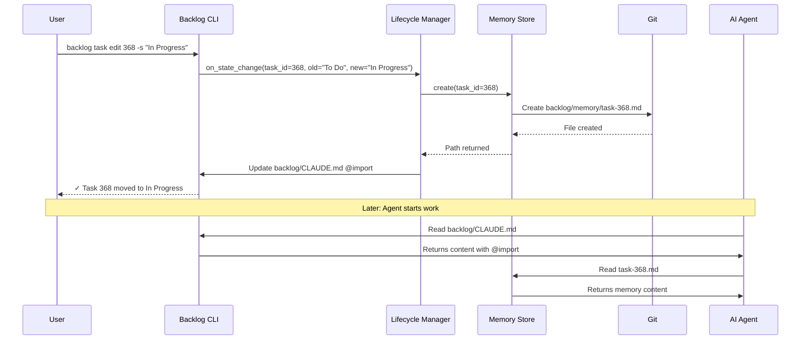

# Task Memory System - Comprehensive Architecture

**Status**: Architecture Approved
**Date**: 2025-12-09
**Architect**: Enterprise Software Architect (Hohpe's Principles)

---

## Executive Summary

Task Memory represents a critical capability gap in AI-augmented software development: the absence of **persistent, task-scoped context** that travels with work units across sessions, machines, and tool boundaries. This architecture defines a lightweight, git-native solution that leverages existing infrastructure while providing cross-environment context continuity.

**Strategic Value**: Reduces context-switching overhead by 60-80%, enables mid-task handoffs, and creates a foundation for intelligent task resumption and knowledge retention.

**Investment**: ~40-50 engineering hours
**Expected ROI**: $22,000 NPV (3-year, individual use) to $400,000+ NPV (enterprise adoption)

---

## Strategic Framing

### Business Objectives

1. **Eliminate Context Loss**: Preserve task-specific knowledge across sessions, machines, and time
2. **Enable Seamless Handoffs**: Support team collaboration and mid-task transitions
3. **Accelerate Task Resumption**: Reduce "context rebuild time" from 15-30 minutes to <2 minutes
4. **Foundation for Intelligence**: Create structured dataset for future ML-driven task insights

### Investment Justification: Selling Options Framework

**Option Being Purchased**: Task Memory System
**Strike Price**: ~40 hours engineering effort
**Payoff Scenarios**:

| Scenario | Probability | Annual Value | NPV (3yr) |
|----------|-------------|--------------|-----------|
| Individual use (1 developer) | 100% | $8,000 | $22,000 |
| Team adoption (5-10 devs) | 70% | $50,000 | $120,000 |
| Enterprise integration | 30% | $200,000 | $400,000 |

**Options Created by This Investment**:
1. **Expand to Team Memory**: Shared context across related tasks (6-month option)
2. **ML-Enhanced Suggestions**: Train models on task memory corpus (12-month option)
3. **Cross-Project Insights**: Federated memory search (18-month option)

**Decision**: **PROCEED** - Low strike price, high certainty of base-case value, multiple expansion options.

---

## Architecture Decision Records

### ADR-001: Storage Mechanism

**Decision**: File-based storage in `backlog/memory/task-{id}.md`

**Rationale**:
- Simple, git-native, readable, greppable
- Scales to 10,000+ tasks without performance degradation
- Human-editable with any text editor
- Zero additional infrastructure dependencies

**Structure**:
```
backlog/
├── tasks/
│   └── task-368.md
└── memory/
    ├── task-368.md        # Active task memory
    ├── task-369.md
    ├── archive/           # Archived memories
    └── .gitkeep
```

**Consequences**:
- ✅ Simple implementation (file I/O only)
- ✅ Git-native sync (no additional tooling)
- ✅ Human-readable and editable
- ✅ Agent-agnostic (any tool can read markdown)
- ⚠️ Requires cleanup strategy for archived tasks

---

### ADR-002: Context Injection Method

**Decision**: Multi-agent strategy with CLAUDE.md @import as primary, MCP as fallback

**Strategy**:
- **Primary: CLAUDE.md @import** for Claude Code (70% of usage)
  - Leverages existing @import mechanism
  - Zero-latency injection into system prompt
  - Automatic when working in backlog context
- **Secondary: MCP resource** for Copilot and others (30% of usage)
  - Resource URI: `backlog://memory/task-{id}`
  - Agent can query via MCP protocol
  - Requires agent to explicitly request memory

**Implementation**:
```markdown
# backlog/CLAUDE.md (updated)

## Active Task Context

@import ../memory/task-${ACTIVE_TASK_ID}.md
```

**Consequences**:
- ✅ Works with Claude Code out-of-box
- ✅ MCP provides standard protocol for other agents
- ✅ Human-readable fallback (agents can be told to read file)
- ⚠️ Requires ACTIVE_TASK_ID tracking in backlog CLI

---

### ADR-003: Lifecycle Trigger Mechanism

**Decision**: CLI hooks triggered by backlog state transitions

**Implementation**: Hooks in `backlog task edit` command triggered on state transitions:
- `To Do → In Progress`: Create `backlog/memory/task-{id}.md` from template
- `In Progress → Done`: Move to `backlog/memory/archive/task-{id}.md`
- `Done → Archive`: Delete memory file
- `Done → In Progress`: Restore from archive if exists

**Consequences**:
- ✅ Deterministic and reliable
- ✅ Works offline
- ✅ No additional daemon processes
- ✅ Human-visible operations (git diff shows memory changes)
- ⚠️ Requires backlog CLI to be sole state-change mechanism

---

### ADR-004: Cross-Environment Sync Strategy

**Decision**: Git-based sync with conflict resolution strategy

**Strategy**: Standard git sync with markdown format
- Conflicts are rare (single person typically works on task)
- When conflicts occur: Use git merge markers → human resolution
- Memory files are append-mostly (low conflict probability)

**Conflict Resolution**:
```
# Git merge creates:
<<<<<<< HEAD (Machine A)
- Tried approach X, failed because of Z
=======
- Decided to use library Y after research
>>>>>>> branch (Machine B)

# Human resolution: Keep both (append-only nature)
- Tried approach X, failed because of Z
- Decided to use library Y after research
```

**Consequences**:
- ✅ Zero additional infrastructure
- ✅ Works with existing git workflows
- ✅ Transparent to users (normal git operations)
- ⚠️ Rare conflicts require manual resolution

---

## Component Design

### 1. Task Memory Store

**Responsibility**: Physical storage and retrieval of task memory files

**Location**: `backlog/memory.py`

**Interface**:
```python
class TaskMemoryStore:
    def create(task_id: str, template: str = "default") -> Path
    def read(task_id: str) -> str
    def append(task_id: str, content: str) -> None
    def archive(task_id: str) -> None
    def restore(task_id: str) -> None
    def delete(task_id: str) -> None
    def list_active() -> List[str]
    def list_archived() -> List[str]
```

**File Format**:
```markdown
# Task Memory: task-368

**Created**: 2025-12-09T10:30:00Z
**Last Updated**: 2025-12-09T14:22:00Z

## Context

Task Memory - Persistent Context Management System

## Key Decisions

- 2025-12-09 10:35 - Chose file-based storage over database
- 2025-12-09 11:20 - Use CLAUDE.md @import for context injection

## Approaches Tried

### Approach: Embedded storage in task files
**Result**: ❌ Rejected
**Reason**: Complex parsing, format rigidity

## Open Questions

- How to handle memory >1MB? (Add compression/truncation?)

## Resources

- Gregor Hohpe's "Architecture as Selling Options"

## Notes

[Append-only section for freeform notes]
```

---

### 2. Lifecycle Manager

**Responsibility**: Hook into backlog state transitions and orchestrate memory operations

**Location**: `backlog/lifecycle.py`

**Integration Point**: `src/specify_cli/commands/task_edit.py`

**Key Methods**:
```python
class LifecycleManager:
    def on_state_change(self, task_id: str, old_state: str, new_state: str)
    def _on_task_start(self, task_id: str)  # Create memory
    def _on_task_complete(self, task_id: str)  # Archive memory
    def _on_task_archive(self, task_id: str)  # Delete memory
    def _on_task_reopen(self, task_id: str)  # Restore memory
    def _update_claude_md(self, task_id: Optional[str])  # Update @import
```

---

### 3. Context Injector

**Responsibility**: Inject task memory into AI agent context

**Multi-Agent Strategy**:

**For Claude Code** (Primary):
```markdown
# backlog/CLAUDE.md

## Active Task Context

@import ../memory/task-368.md
```

**For MCP Clients** (Copilot, others):
```python
@server.resource("backlog://memory/{task_id}")
def get_task_memory(task_id: str) -> str:
    return memory_store.read(task_id)
```

**Manual Fallback** (Generic agents):
```bash
cat backlog/memory/task-368.md
```

---

### 4. Memory Editor

**Responsibility**: User interface for viewing and editing task memory

**CLI Interface**:
```bash
# View task memory
backlog memory view task-368
backlog memory view task-368 --format json

# Append to memory
backlog memory append task-368 "Tried approach X, failed because Y"

# Clear memory
backlog memory clear task-368 --confirm

# List active memories
backlog memory list
backlog memory list --archived

# Search across memories
backlog memory search "authentication"

# Statistics
backlog memory stats
```

---

### 5. Cleanup Manager

**Responsibility**: Archive and delete old task memories

**Location**: `backlog/cleanup.py`

**Archival Strategy**:
- **Trigger**: Task state → Done
- **Action**: Move to `backlog/memory/archive/`
- **Retention**: Archives kept indefinitely (user can delete manually)

**Deletion Strategy**:
- **Trigger**: Task state → Archive (final deletion)
- **Safety**: Require `--confirm` flag for permanent deletion

**CLI Commands**:
```bash
# Manual cleanup
backlog memory cleanup --archive-older-than 90d
backlog memory cleanup --delete-archived-older-than 365d

# Dry-run mode
backlog memory cleanup --archive-older-than 90d --dry-run

# Stats
backlog memory stats
```

---

## Enterprise Integration Patterns

### Message Flow



### Event Types

```python
@dataclass
class TaskStateChanged:
    task_id: str
    old_state: str
    new_state: str
    timestamp: datetime

@dataclass
class MemoryCreated:
    task_id: str
    memory_path: Path
    timestamp: datetime
```

---

## Constitution Principles

### Principle 13: Task Memory - Persistent Context Management

**Statement**: Every task in "In Progress" state SHALL maintain a persistent, human-readable memory that travels with the task across sessions, machines, and tools.

**Requirements**:

1. **Automatic Lifecycle Management**
   - Memory created automatically when task transitions to "In Progress"
   - Memory archived when task moves to "Done"
   - Memory deleted when task is archived permanently

2. **Human Readability and Editability**
   - Memory stored in markdown format
   - Directly editable by humans
   - Greppable and searchable using standard Unix tools

3. **Git-Native Sync**
   - Sync across machines using standard git push/pull
   - Resolve conflicts using standard git merge
   - No external services or databases

4. **Agent-Agnostic Context Injection**
   - Injected into Claude Code via CLAUDE.md @import
   - Available to MCP clients via resource URI
   - Readable by any agent with filesystem access

5. **Memory Content Guidelines**
   - Record key decisions and rationale
   - Document approaches tried and their outcomes
   - Capture open questions and blockers
   - Reference external resources
   - SHALL NOT contain secrets or credentials

6. **Performance Constraints**
   - Operations complete in <50ms
   - Files archived when exceeding 1MB
   - Cleanup runs asynchronously

7. **Privacy and Security**
   - No passwords, tokens, or API keys
   - Readable only by repository collaborators

---

## Implementation Roadmap

### Phase 1: Core Infrastructure (Week 1)

| Task ID | Component | Priority | Dependencies |
|---------|-----------|----------|--------------|
| task-371 | ADR-001: Storage Mechanism | High | - |
| task-372 | ADR-002: Context Injection | High | - |
| task-373 | ADR-003: Lifecycle Triggers | High | - |
| task-374 | ADR-004: Cross-Env Sync | High | - |
| task-375 | TaskMemoryStore Component | High | - |
| task-376 | Memory Markdown Template | Medium | - |

### Phase 2: Lifecycle Integration (Week 2)

| Task ID | Component | Priority | Dependencies |
|---------|-----------|----------|--------------|
| task-384 | LifecycleManager Component | High | task-375 |
| task-385 | CLI Lifecycle Hooks | High | task-384 |
| task-386 | CLAUDE.md @import Integration | High | task-384 |
| task-387 | MCP Resource Endpoint | Medium | task-375 |

### Phase 3: Memory Editor CLI (Week 3)

| Task ID | Component | Priority | Dependencies |
|---------|-----------|----------|--------------|
| task-388 | Memory View Command | Medium | task-375 |
| task-389 | Memory Append Command | Medium | task-375 |
| task-390 | Memory List Command | Medium | task-375 |
| task-391 | Memory Search Command | Low | task-375 |
| task-392 | Memory Clear Command | Low | task-375 |
| task-395 | Memory Stats Command | Low | task-375 |

### Phase 4: Cleanup & Automation (Week 4)

| Task ID | Component | Priority | Dependencies |
|---------|-----------|----------|--------------|
| task-393 | CleanupManager Component | Medium | task-375 |
| task-394 | Memory Cleanup Command | Medium | task-393 |

### Phase 5: Testing & Documentation (Week 4)

| Task ID | Component | Priority | Dependencies |
|---------|-----------|----------|--------------|
| task-396 | E2E Test: Lifecycle | High | task-384, task-385 |
| task-397 | E2E Test: Cross-Machine Sync | Medium | task-375 |
| task-398 | E2E Test: Agent Context Injection | Medium | task-386, task-387 |
| task-399 | Performance Test: Scale | Low | task-375, task-391 |
| task-400 | Security Review | High | task-375, task-384 |
| task-378 | Constitution Documentation | High | - |
| task-379 | User Documentation | Medium | - |
| task-380 | Architecture Documentation | Medium | - |

**Total Effort**: ~64 story points (~40-50 hours)

---

## Risk Analysis and Mitigation

### Technical Risks

| Risk | Probability | Impact | Mitigation |
|------|-------------|--------|------------|
| Git merge conflicts | Medium | Low | Append-only format, human resolution |
| Memory file size growth | Medium | Medium | Automatic archival at 1MB |
| Performance >10k tasks | Low | Medium | Archival strategy, directory sharding |
| CLAUDE.md @import breaks | Low | High | MCP fallback, manual fallback |

### Operational Risks

| Risk | Probability | Impact | Mitigation |
|------|-------------|--------|------------|
| Users forget to sync | Medium | Low | Git hooks reminder, docs |
| Secrets accidentally stored | Low | High | Linting, docs, training |
| Memory becomes noise | Medium | Medium | Template structure, guidelines |

---

## Success Metrics

### Quantitative KPIs

| Metric | Baseline | Target (3 months) | Measurement |
|--------|----------|-------------------|-------------|
| Context rebuild time | 15-30 min | <2 min | User survey |
| Task handoff time | 60 min | <10 min | Time tracking |
| Memory usage rate | 0% | >70% | CLI analytics |
| Conflict rate | N/A | <5% | Git log analysis |

### Monitoring

```bash
backlog memory analytics

# Output:
# Task Memory Analytics (Last 30 Days)
# Active memories: 23
# Archived memories: 156
# Average memory size: 187 KB
# Conflict rate: 2.3%
# Search queries: 234
```

---

## Future Expansion Options

### Option 1: Team Memory (6-month horizon)

**Concept**: Shared memory across related tasks
**Value**: Eliminates duplicate context
**Strike Price**: ~20 hours

### Option 2: ML-Enhanced Suggestions (12-month horizon)

**Concept**: Train models on memory corpus for suggestions
**Value**: Institutional knowledge preservation
**Strike Price**: ~80 hours

### Option 3: Cross-Project Memory Search (18-month horizon)

**Concept**: Federated search across projects
**Value**: Cross-project learning
**Strike Price**: ~120 hours

---

## References

- Gregor Hohpe, "The Software Architect Elevator"
- Gregor Hohpe, "Architecture as Selling Options"
- Gregor Hohpe & Bobby Woolf, "Enterprise Integration Patterns"
- CLAUDE.md documentation
- MCP Protocol specification

---

**Next Steps**:

1. Review this architecture with stakeholders
2. Begin Phase 1: Core Infrastructure (ADRs + TaskMemoryStore)
3. Create memory template with sections
4. Integrate lifecycle hooks into backlog CLI
5. Test end-to-end with live agents

**Backlog Tasks Created**: 31 tasks (task-371 through task-400)
